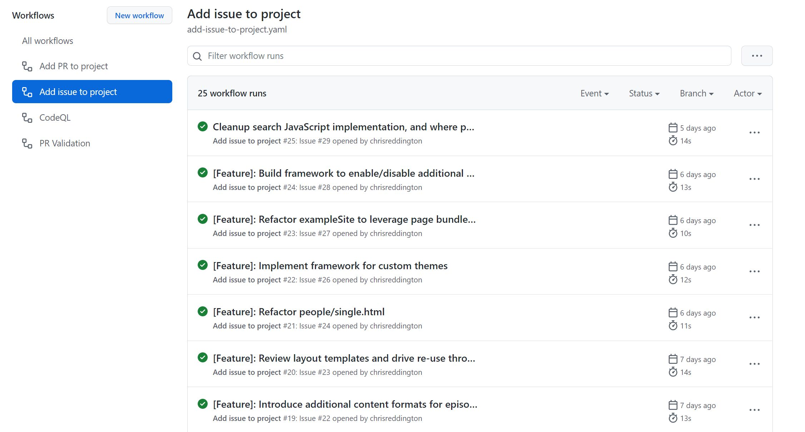
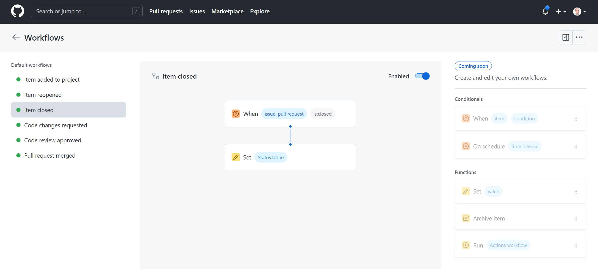

---
# Default hugo properties
title: "Automate adding GitHub Issues to GitHub Projects (Beta)"                   # Name of the blog
description: "I've been following the GitHub Projects beta for a while now, and have been fortunate to be accepted as an early adopter. I'm a big fan of the direction, and the flexibility. One of the limitations I've noticed is that there's currently no built-in way to automatically add an issue to  a project board. It's on the backlog, but not yet available. Fortunately, GitHub Actions has us sorted. I'll walk you through a sample I put together to do exactly that."             # Used for SEO optimisation
publishDate: "2022-02-05T20:00:00Z"             # TODO: Differentiate between date
date: "2022-02-05T20:00:00Z"                            # TODO: Differentiate between PublishDate

# Site-wide [required properties]
image: "img/cloudwithchrislogo.png"                   # Displayed when referenced in listing pages
images:                     # An array of images used in Social Sharing
- "img/cloudwithchrislogo.png"
tags:                       # Used for SEO optimisation and browsing across the site.
- "GitHub"
- "DevOps"
- "Agile"
- "Project Management"
- "Automation"
- "GitHub Actions"
- "GitHub Projects"
- "GitHub Issues"

# Site-wide [optional properties]
externalLink: ""            # Full URL to override listing links to an external page

# Content-specific properties
authors:
-  "chrisreddington"                       # An array of authors of the post (filenames in person).
---
I've been following the [GitHub Projects beta](https://github.com/features/issues) for a while now, and have been fortunate to be accepted as an early adopter. I'm a big fan of the direction, and the flexibility that it provides. One of the limitations I've noticed is that there's currently no built-in way to automatically add an issue to  a project board (and [I'm not the only one!](https://github.com/github/feedback/discussions/5378)). It's [on the backlog](https://github.com/github/roadmap/issues/286) but not yet available. Fortunately, GitHub Actions has us sorted. I'll walk you through a sample that I put together to do exactly that.

There's a [GitHub Doc](https://docs.github.com/en/issues/trying-out-the-new-projects-experience/automating-projects) that talks through automating GitHub Projects (beta). However, it mainly focuses on pull requests. I used the example in the GitHub doc as a basis to automate issues. I'll walk you through the logic that I went through to arrive at the yaml file further down in this post.

The sample from the GitHub docs comes down to a few steps:

* Use the GitHub CLI's GraphQL capability to query the GitHub API for the details of the project
* Use the GitHub CLI's GraphQL capability to add the Pull Request to the project
* Set several custom fields on the item, so that manual configuration can be minimised

The steps for adding a GitHub issue to the GitHub Project are incredibly similar. But first, let's take a step back and think about GitHub Actions.

## GitHub Action Workflow Triggers

A GitHub Action workflow is a set of steps that are executed upon a GitHub event. For example, a GitHub Action could be executed when a pull request is opened, or when a comment is added to a pull request. It can also be used in a CI/CD pipeline to trigger a build when a commit is pushed to a repository.

A GitHub Action starts on a trigger event, and runs a series of steps. The steps are defined in a yaml file. The steps are executed in the order that they are defined in the yaml file, though jobs may have certain dependencies on each other.

For this scenario, I'll be using a GitHub Action workflow that is triggered when a GitHub issue is opened.

## GitHub Action Workflow Jobs

A GitHub Action Job is a set of steps that are executed in a GitHub Action workflow. A GitHub Action workflow can have multiple jobs. Each step is either a GitHub Action or a shell command. Each job is effectively ran on a different machine, so you need to be careful about how you set up your jobs.

GitHub provides a number of hosted runners to run your GitHub Actions in a managed environment. These runners are available for free on Open Source repositories, and there is a number of minutes provided to you to run your GitHub Actions in a private repository. These hosted runners are available on Windows, Linux, and MacOS.

A job contains a step property, which is an array of steps. Each step is either a GitHub Action or a shell command.

## Getting the project data

To get the project data, we'll need to use the GitHub CLI's GraphQL capability. This is the same command-line tool that you may have installed on your own machine. Instead, we'll be executing the CLI in a GitHub Action workflow. But this requires some setup.

In a local environment, you could use the ``gh auth login`` command to launch a browser window and log in to GitHub. The GitHub CLI then uses the context of the logged in user. However, we're running in a GitHub Action workflow. We don't have an interactive session, so we need to set the context of the CLI another way.

As per the [GitHub CLI Doc](https://cli.github.com/manual/gh_help_environment), an authentication token (set as the ``GH_TOKEN`` or ``GITHUB_TOKEN`` environment variable) avoids an interactive login.

You may be aware that at the start of a workflow, GitHub Actions automatically creates a unique token for you. This token is set as the ``GITHUB_TOKEN`` environment variable. Of course, this GitHub token has a limited lifetime and a [default set of permissions](https://docs.github.com/en/actions/security-guides/automatic-token-authentication#permissions-for-the-github_token). If you want to use a different token, you can set the ``GITHUB_TOKEN`` environment variable yourself and assign the scope of the token you want to use.

> Note: I found that using the default ``GITHUB_TOKEN`` environment variable did not have sufficient permissions to get the required permissions (My repository's GitHub Actions' Workflow permissions were set to **Read and write permissions**). I had to [create a Personal Access Token](https://docs.github.com/en/authentication/keeping-your-account-and-data-secure/creating-a-personal-access-token) and provide it with the **repo**, **write:org** and **read:org** scopes.

You can set an environment variable at the workflow level, job level, or step level.

At this stage, we've laid the foundation to run the GitHub CLI. We'll bbe using the ``gh api graphql`` command to query the GitHub API.

```bash
gh api graphql -f query='
  query($org: String!, $number: Int!) {
    organization(login: $org){
      projectNext(number: $number) {
        id
        fields(first:20) {
          nodes {
            id
            name
            settings
          }
        }
      }
    }
  }' -f org=$ORGANIZATION -F number=$PROJECT_NUMBER > project_data.json
```

It may be worth familiarising yourself with GraphQL if you've not seen it before. It's a query language that allows you to query an API. The above query is a simple example of a query that gets the details of a project. We pass in the organization name and project number as variables (using the ``-f`` parameter towards the end of the script).

We take the output of the query and save it to a file called ``project_data.json``. I'll then use the ``jq`` command to parse the JSON file, so that we can find the unique ID of the project.

```bash
echo 'PROJECT_ID='$(jq '.data.organization.projectNext.id' project_data.json) >> $GITHUB_ENV
```

## Adding the issue to the project

You may recall that we triggered the GitHub Action workflow when an issue was opened. Because of this, we're able to obtain the issue ID from the GitHub event. We can do this using the ``github.event.issue.node_id`` property. Full details on the [GitHub event types](https://docs.github.com/en/developers/webhooks-and-events/events/github-event-types) are available.

We once again use the ``gh api graphql`` command to query the GitHub API. Rather than using a query, we're using a mutation. The mutation is used to add an issue to a project.

> **Note:** Queries and mutations are different. A query is used to get data from the API. A mutation is used to add data to the API. These are both concepts in GraphQL. Further details are available on the [GraphQL Docs](https://graphql.org/learn/queries-mutations/).

The syntax of the command is very similar to the query syntax. The main difference is that the mutation is prefixed with ``mutation``. We still pass in parameters. This time, we're passing in the project ID and the issue ID.

```bash
item_id="$( gh api graphql -f query='
  mutation($project:ID!, $issue:ID!) {
    addProjectNextItem(input: {projectId: $project, contentId: $issue}) {
      projectNextItem {
        id
      }
    }
  }' -f project=$PROJECT_ID -f issue=$ISSUE_ID --jq '.data.addProjectNextItem.projectNextItem.id')"
```

Great, so what does that look like all together?

```yaml
name: Add issue to project
on:
  issues:
    types:
      - opened
jobs:
  track_issue:
    runs-on: ubuntu-latest
    steps:
      - name: Get project data
        env:
          GITHUB_TOKEN: ${{ secrets.GH_TOKEN_PROJECT_ACCESS }}
          ORGANIZATION: CloudWithChris
          PROJECT_NUMBER: 2
        run: |
          gh api graphql -f query='
            query($org: String!, $number: Int!) {
              organization(login: $org){
                projectNext(number: $number) {
                  id
                  fields(first:20) {
                    nodes {
                      id
                      name
                      settings
                    }
                  }
                }
              }
            }' -f org=$ORGANIZATION -F number=$PROJECT_NUMBER > project_data.json

          echo 'PROJECT_ID='$(jq '.data.organization.projectNext.id' project_data.json) >> $GITHUB_ENV
          
      - name: Add issue to project
        env:
          GITHUB_TOKEN: ${{ secrets.GH_TOKEN_PROJECT_ACCESS }}
          ISSUE_ID: ${{ github.event.issue.node_id }}
        run: |
          item_id="$( gh api graphql -f query='
            mutation($project:ID!, $issue:ID!) {
              addProjectNextItem(input: {projectId: $project, contentId: $issue}) {
                projectNextItem {
                  id
                }
              }
            }' -f project=$PROJECT_ID -f issue=$ISSUE_ID --jq '.data.addProjectNextItem.projectNextItem.id')"
```

And what happens when you create a new issue? Well, magic!



An example of one of those runs can be found below.


## What about those extra steps for custom fields?

In my project, there are no requirements for custom fields. However, if you have custom fields, you can add them to the project. You could follow the steps from the original GitHub Doc, and adapt that to suit your project.

Having said that, I am using the concept of workflows in GitHub Projects to set the status of the issue. Workflows have been available in GitHub projects for a while, and allow you to set the status of an issue or pull request based upon an event.



## And the end result?

Now take a step back and think about the steps you've taken to get to this point. You've been creating a GitHub Action that automatically adds a GitHub Issue to a GitHub Project. The GitHub Project workflows can then be used to set the status of the issue. This means you're now on track to get some great visibility into your project.

. The Pull Request was automatically added, due to another very similar workflow that I have provisioned on the repository.")

So there you have it. GitHub Actions are awesome! It's not just about CI/CD, but can also be used to react to GitHub events. From a Project Management standpoint, it's a great tool to have in your toolbox! I'm already using it in my projects, and I'm excited to see how it can be used in the future. I'd love to hear your thoughts on this! Are you using GitHub Actions to help with project management? Let me know in the comments below!
