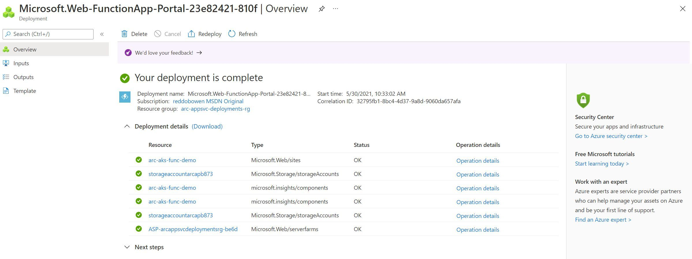
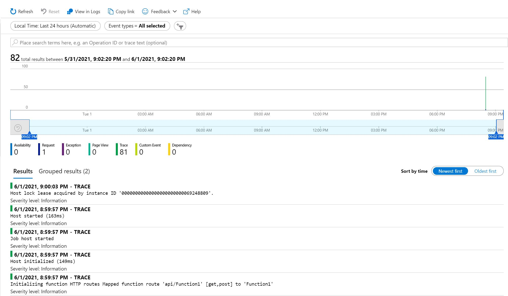
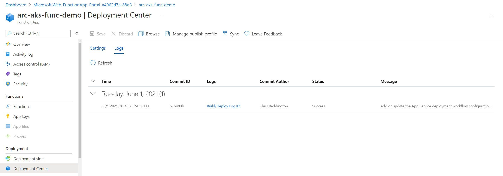
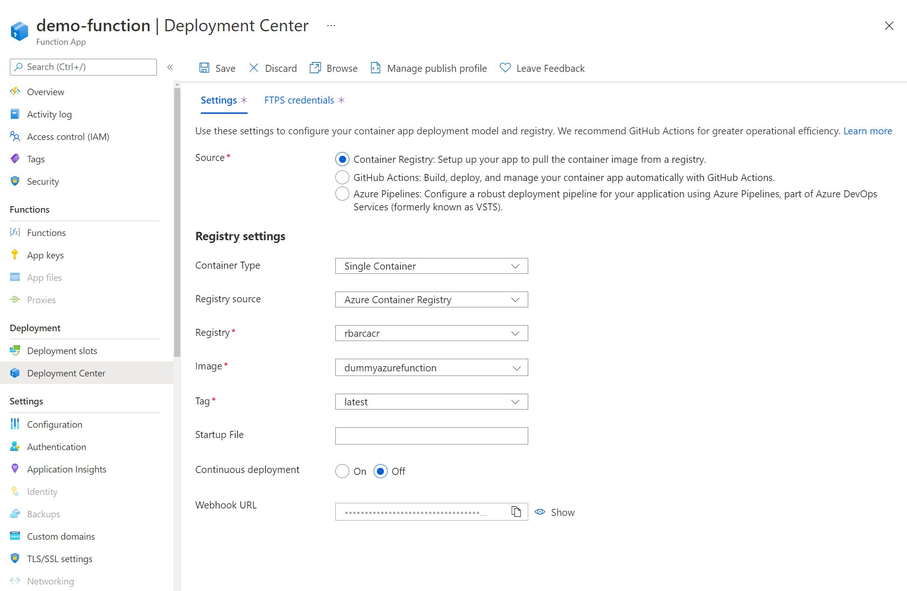
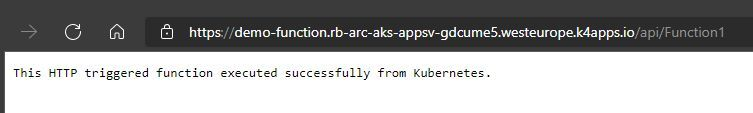
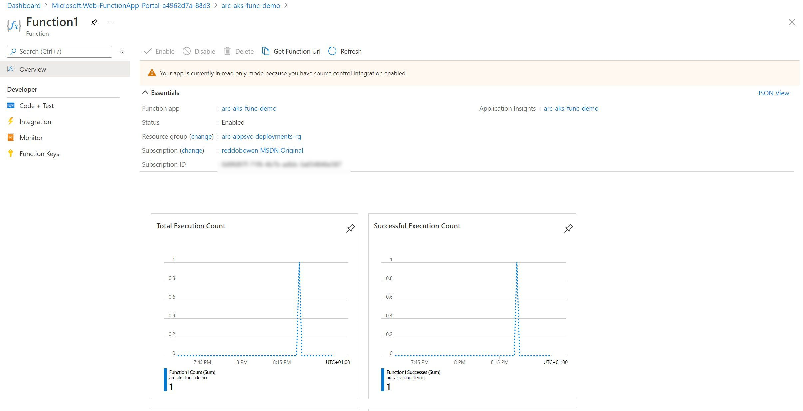
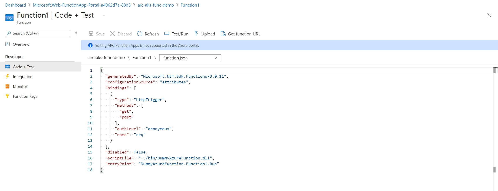

## App Service Kubernetes Environment

In [part 1](/blog/azure-arc-for-apps-part-1) of this *Using Azure Arc for Apps* series, we explored Azure Arc and Azure Arc enabled Kubernetes clusters. In [part 2](/blog/azure-arc-for-apps-part-2), we deployed an App Service Kubernetes Environment into our Azure Arc enabled Kubernetes cluster. As you'll likely be aware, both Azure Functions (this blog post) and Azure Logic Apps (the next blog post) can run on Azure App Service. The same is true for an App Service Kubernetes Environment, we can run App Services, Logic Apps and Azure Functions.

> **Tip:** [Part 1](/blog/azure-arc-for-apps-part-1) and [Part 2](/blog/azure-arc-for-apps-part-2) (up until the Create an App Service resource in our App Service Kubernetes Environment section) are pre-requisites to working through this blog post, if you plan to get hands on. As noted above, an Azure Arc enabled Kubernetes cluster is a pre-requisite to deploy App Services, Azure Functions or Logic Apps to a Kubernetes cluster.

To be clear, we won't go through the process of setting up an App Service Kubernetes Environment again in this blog post. I'm going to make an assumption that you already have this in place. If not, please go back to [part 2](/blog/azure-arc-for-apps-part-2) to complete this. That should keep this blog post a little shorter in length! You **do not** need to create any App Services in your App Services Kubernetes Environment as a pre-requisite for this post.

## Create an Azure Function resource in our App Service Kubernetes Environment

The creation experience of an Azure Function in an App Service Kubernetes Environment is very similar to that for an App Service.

* The instance name has a suffix of the custom domain that you will have seen in the **App Service Kubernetes Environment** resource earlier.
* You can publish an Azure Function using either a [Code project](https://docs.microsoft.com/en-us/azure/azure-functions/create-first-function-arc-cli?tabs=csharp%2Cbrowser) or a [Docker Container](https://docs.microsoft.com/en-us/azure/azure-functions/create-first-function-arc-custom-container?tabs=csharp%2Cbrowser). It seemed like there are fewer supported Code deployment options than with App Services.
* If the publish option you have selected is supported, then the Custom Location item will be an option in the region dropdown. Otherwise, you can only select from the Azure Regions that support it.

Notice in the screenshot below that we can deploy an Azure Function as a Docker Container to the App Service Kubernetes Environment (as our Custom Location is selected).


Notice in the screenshot below that we can deploy a Code-based Python 3.9 application to the App Service Kubernetes Environment (as our Custom Location is selected).


Notice in the screenshot below that when trying to deploy a PowerShell Core 7.0 application as a Code based publishing model, we are unable to select a Custom Location for our Azure Region. Instead, we see the message ``Your available regions list does not include custom locations or App Service environments due to your selection of publish type, runtime stack and operating system. The operating system can be changed on the hosting tab.``


On the **Hosting** tab, you'll be able to configure the Azure Storage Account used by the Azure Function.

> Azure Storage is a pre-requisite for the Azure Functions tooling, so this still needs to be deployed.
>
> At this point, my mind jumps to the fact that our Azure Function may be in another cloud provider or on-premises, and there may be some latency to access the Azure Storage account. I may investigate this further in a separate blog post to understand the impact.

You can also configure the Operating System as Windows or Linux. However, much like App Services - I suspect that you'll find when you select a Windows based option, the Azure Region will be adjusted on the Basics tab that you had configured earlier. Leave this option as Linux for now.


As usual, you can configure Application Insights through the experience as well. We'll leave this as the default (enabled), and progress towards the Review and Create stage.



Before I hit create on the Function App, I ran the command ``kubectl get po -n appservice --watch`` in my terminal (You should change the -n property to the namespace where you configured your app service deployments). You should see that a new pod will get scheduled in the Kubernetes cluster. Yes, that is the Azure Function App that you created through the Azure Portal using your custom location.

```bash
kubectl get po -n appservice --watch
NAME                                                            READY   STATUS    RESTARTS   AGE
christest-55d5-5f775bbdd-sdnpd                                  1/1     Running   0          16h
christest-79944ffd49-5tzxt                                      2/2     Running   0          59m
christest-79944ffd49-7n5bs                                      2/2     Running   0          59m
christest-79944ffd49-ksb96                                      2/2     Running   0          59m
logic-app-k8s-7cc75474-xmxdd                                    2/2     Running   0          15h
rb-arc-aks-appsvc-k8se-activator-56f59bbb9f-h57q7               1/1     Running   0          16h
rb-arc-aks-appsvc-k8se-app-controller-86656c54cf-f8fmm          1/1     Running   0          16h
rb-arc-aks-appsvc-k8se-build-service-568b9d8d7-5pldl            1/1     Running   0          16h
rb-arc-aks-appsvc-k8se-envoy-586565cdbd-4qzvn                   1/1     Running   0          16h
rb-arc-aks-appsvc-k8se-envoy-586565cdbd-9hb5g                   1/1     Running   0          16h
rb-arc-aks-appsvc-k8se-envoy-586565cdbd-xpp7h                   1/1     Running   0          16h
rb-arc-aks-appsvc-k8se-http-scaler-569b995bb-2csvc              1/1     Running   0          16h
rb-arc-aks-appsvc-k8se-img-cacher-xc47s                         1/1     Running   0          16h
rb-arc-aks-appsvc-k8se-keda-metrics-apiserver-678946464-hvf67   1/1     Running   0          16h
rb-arc-aks-appsvc-k8se-keda-operator-b7488958-5h4t8             1/1     Running   0          16h
rb-arc-aks-appsvc-k8se-log-processor-jpt2m                      1/1     Running   193        16h
arc-aks-func-demo-6cd899c4bf-7sz22                              0/2     Pending   0          0s
arc-aks-func-demo-6cd899c4bf-7sz22                              0/2     Pending   0          0s
arc-aks-func-demo-6cd899c4bf-7sz22                              0/2     ContainerCreating   0          0s
rb-arc-aks-appsvc-k8se-log-processor-jpt2m                      0/1     Error               193        16h
rb-arc-aks-appsvc-k8se-log-processor-jpt2m                      0/1     CrashLoopBackOff    193        16h
arc-aks-func-demo-6cd899c4bf-7sz22                              1/2     Running             0          42s
arc-aks-func-demo-6cd899c4bf-7sz22                              2/2     Running             0          44s
```

## Function Plans

Before we jump into Azure Functions in depth and the configuration experience, I want to call out a point from the Azure Docs.

> **Note:** Function apps run in an App Service Kubernetes environment on a Dedicated (App Service) plan. When you create your function app without an existing plan, the correct plan is created for you.

You may have noticed that you didn't need to link the Azure Function to a consumption plan, a premium function plan or similar. That is why - The plan is automatically created for you when you create the Azure Function App (and appears to be a dedicated plan per function).


```bash
kubectl get deployment -n appservice
NAME                                            READY   UP-TO-DATE   AVAILABLE   AGE
arc-aks-func-demo                               1/1     1            1           17m
christest                                       3/3     3            3           16h
christest-55d5                                  1/1     1            1           16h
logic-app-k8s                                   1/1     1            1           16h
rb-arc-aks-appsvc-k8se-activator                1/1     1            1           17h
rb-arc-aks-appsvc-k8se-app-controller           1/1     1            1           17h
rb-arc-aks-appsvc-k8se-build-service            1/1     1            1           17h
rb-arc-aks-appsvc-k8se-envoy                    3/3     3            3           17h
rb-arc-aks-appsvc-k8se-http-scaler              1/1     1            1           17h
rb-arc-aks-appsvc-k8se-keda-metrics-apiserver   1/1     1            1           17h
rb-arc-aks-appsvc-k8se-keda-operator            1/1     1            1           17h
```
## Configuring Easy Auth for our Azure Function App

The experience to configure Authentication for our App Service deployment is no different to that when using the Platform as a Service (PaaS) hosted platform that we are used to. I'm going to make an assumption that you are familiar with this experience already, so it won't be the focus of this blog post (as it's already becoming quite a long one!). For completeness, you can find an example screenshot below of the Easy Auth experience. Before progressing, go ahead and configure an identity provider. I configured Azure Active Directory.


Before moving on, there is one interesting point to note. Before fully configuring Easy Auth on the App Service, run the command ``kubectl get po -n appservice --watch`` (or replace the -n value with the appropriate value for your namespace). You should see that a new pod (arc-aks-func-demo-65774c56bb-l7wc7 in the snippet below) will get scheduled in the Kubernetes cluster and contains **three** containers You'll also notice that the previous instance of the function app (arc-aks-func-demo-6458895445-7x4vv) which contained **two** containers is then terminated. This appears to work the same way as App Service in an App Service Kubernetes Environment. This is not surprising - The Easy Auth functionality is deployed as a side car container to the main function.

```bash
NAME                                                            READY   STATUS    RESTARTS   AGE
arc-aks-func-demo-6458895445-7x4vv                              2/2     Running   0          60s
christest-55d5-5f775bbdd-sdnpd                                  1/1     Running   0          2d22h
christest-79944ffd49-5tzxt                                      2/2     Running   0          2d7h
christest-79944ffd49-7n5bs                                      2/2     Running   0          2d7h
christest-79944ffd49-ksb96                                      2/2     Running   0          2d7h
docker-function-5dd888f997-xhljc                                2/2     Running   0          28m
func-test-5b96d797c8-nmh9l                                      2/2     Running   0          50m
logic-app-k8s-7cc75474-xmxdd                                    2/2     Running   0          2d22h
rb-arc-aks-appsvc-k8se-activator-56f59bbb9f-h57q7               1/1     Running   0          2d23h
rb-arc-aks-appsvc-k8se-app-controller-86656c54cf-f8fmm          1/1     Running   0          2d23h
rb-arc-aks-appsvc-k8se-build-service-568b9d8d7-5pldl            1/1     Running   0          2d23h
rb-arc-aks-appsvc-k8se-envoy-586565cdbd-4qzvn                   1/1     Running   0          2d23h
rb-arc-aks-appsvc-k8se-envoy-586565cdbd-9hb5g                   1/1     Running   0          2d23h
rb-arc-aks-appsvc-k8se-envoy-586565cdbd-xpp7h                   1/1     Running   0          2d23h
rb-arc-aks-appsvc-k8se-http-scaler-569b995bb-2csvc              1/1     Running   0          2d23h
rb-arc-aks-appsvc-k8se-img-cacher-s7rrj                         1/1     Running   0          7m4s
rb-arc-aks-appsvc-k8se-img-cacher-xc47s                         1/1     Running   0          2d23h
rb-arc-aks-appsvc-k8se-keda-metrics-apiserver-678946464-hvf67   1/1     Running   0          2d23h
rb-arc-aks-appsvc-k8se-keda-operator-b7488958-5h4t8             1/1     Running   0          2d23h
rb-arc-aks-appsvc-k8se-log-processor-fbhpl                      1/1     Running   1          7m14s
rb-arc-aks-appsvc-k8se-log-processor-jpt2m                      1/1     Running   796        2d23h
arc-aks-func-demo-5978b45c5b-s6t77                              0/2     Pending   0          0s
arc-aks-func-demo-5978b45c5b-s6t77                              0/2     Pending   0          0s
arc-aks-func-demo-5978b45c5b-s6t77                              0/2     Init:0/1   0          0s
arc-aks-func-demo-5978b45c5b-s6t77                              0/2     Init:0/1   0          1s
arc-aks-func-demo-5978b45c5b-s6t77                              0/2     PodInitializing   0          6s
arc-aks-func-demo-5978b45c5b-s6t77                              1/2     Running           0          7s
arc-aks-func-demo-5978b45c5b-s6t77                              1/2     Terminating       0          8s
arc-aks-func-demo-65774c56bb-l7wc7                              0/3     Pending           0          0s
arc-aks-func-demo-65774c56bb-l7wc7                              0/3     Pending           0          0s
arc-aks-func-demo-65774c56bb-l7wc7                              0/3     Init:0/1          0          0s
arc-aks-func-demo-65774c56bb-l7wc7                              0/3     Init:0/1          0          1s
arc-aks-func-demo-65774c56bb-l7wc7                              0/3     PodInitializing   0          6s
arc-aks-func-demo-65774c56bb-l7wc7                              2/3     Running           0          7s
arc-aks-func-demo-65774c56bb-l7wc7                              3/3     Running           0          10s
arc-aks-func-demo-6458895445-7x4vv                              2/2     Terminating       0          119s
```

> **Tip:** When you deploy an Azure Function app, there are two containers images. One is the http container, your Azure Function Application. The second is a functions-http-leader container. I suspect that this is behind some of the magic of coordinating which function app pod instances will take any work to be processed. After configuring Easy Auth, there are three containers. Easy Auth is deployed into a sidecar container called http-auth.

## Configuring Application Insights for our Azure Function App

It is possible to use Application Insights to collect data from a Function App in an App Service Kubernetes Environment, unlike an App Services app. I suspect this is due to the underlying implementation of how Azure Functions connects with Application Insights as part of the Azure Functions runtime.

You will have likely set this to **enabled** when you created your Azure Function App (I did, at least). Once again, the experience is no different to what we would expect of a Function App in the multi-tenanted hosting model.


As part of my investigations for this post, I went ahead and disabled Application Insights within the Function App blade as shown above. I immediately received a pop up, asking as below -

> **You are about to turn off Application Insights. This will update app settings and restart your site. Do you want to continue?**
>
> To turn Application Insights entirely off, check that Application Insights SDK and the instrumentation key are removed from your application.

I was prepared. I had executed the command ``kubectl get po -n appservice --watch`` once again. But this time, I was intrigued. I was expecting to see a pod redeployment, or some kind of change. Nothing happened.

I'd be interested to understand what actually happens when enabling / disabling App Insights. My hypothesis is that once again this is due to the underlying implementation of how Azure Functions connects with Application Insights as part of the Azure Functions runtime. However, I don't have a fully conclusive answer.

Either way, I have tested Application Insights on Function Apps deployed as a Function project (Code), as well as a Docker container. Both provide telemetry to Application Insights as expected.



## Configuring Custom Domains

Custom domains is an available option in the left hand menu, though I encountered some issues here as you can see from the screenshot below, similarly to App Service.

The outcome is exactly the same as App Services. This is one that I plan to investigate further, and determine whether this is a user interface challenge (e.g. should custom domains actually be grayed out as it's unsupported, or is the validation experience not available through the user interface).


## Scaling out your App Service instance

As is the case with many Platform as a Service (PaaS) services, scaling is as easy as adjusting a slider. This is no different when using an App Service Kubernetes environment. We can go ahead and adjust the slider to represent the maximum number of instances that we would like to scale to. Then, App Service for Kubernetes deals with creating the additional instances (kubernetes pods) of our function app behind the scenes as needed.


If you have your Kubernetes-thinking hat on, then you'll probably see where this is going. Before saving the new scale out configuration, I once again ran the command ``kubectl get po -n appservice --watch``. You'll see that Kubernetes maintains the replicaset (i.e. arc-aks-func-demo-65774c56bb-l7wc7), but adds creates additional pods (ending lql9n and cfj4j). Again, this is unsurprising and in-line with how we'd expect Kubernetes to handle a scale out event for any Kubernetes workload.

```bash
kubectl get po -n appservice --watch
NAME                                                            READY   STATUS    RESTARTS   AGE
arc-aks-func-demo-65774c56bb-l7wc7                              3/3     Running   0          9m46s
christest-55d5-5f775bbdd-sdnpd                                  1/1     Running   0          2d23h
christest-79944ffd49-5tzxt                                      2/2     Running   0          2d7h
christest-79944ffd49-7n5bs                                      2/2     Running   0          2d7h
christest-79944ffd49-ksb96                                      2/2     Running   0          2d7h
docker-function-5dd888f997-xhljc                                2/2     Running   0          39m
func-test-5b96d797c8-nmh9l                                      2/2     Running   0          61m
logic-app-k8s-7cc75474-xmxdd                                    2/2     Running   0          2d22h
rb-arc-aks-appsvc-k8se-activator-56f59bbb9f-h57q7               1/1     Running   0          2d23h
rb-arc-aks-appsvc-k8se-app-controller-86656c54cf-f8fmm          1/1     Running   0          2d23h
rb-arc-aks-appsvc-k8se-build-service-568b9d8d7-5pldl            1/1     Running   0          2d23h
rb-arc-aks-appsvc-k8se-envoy-586565cdbd-4qzvn                   1/1     Running   0          2d23h
rb-arc-aks-appsvc-k8se-envoy-586565cdbd-9hb5g                   1/1     Running   0          2d23h
rb-arc-aks-appsvc-k8se-envoy-586565cdbd-xpp7h                   1/1     Running   0          2d23h
rb-arc-aks-appsvc-k8se-http-scaler-569b995bb-2csvc              1/1     Running   0          2d23h
rb-arc-aks-appsvc-k8se-img-cacher-s7rrj                         1/1     Running   0          17m
rb-arc-aks-appsvc-k8se-img-cacher-xc47s                         1/1     Running   0          2d23h
rb-arc-aks-appsvc-k8se-keda-metrics-apiserver-678946464-hvf67   1/1     Running   0          2d23h
rb-arc-aks-appsvc-k8se-keda-operator-b7488958-5h4t8             1/1     Running   0          2d23h
rb-arc-aks-appsvc-k8se-log-processor-fbhpl                      1/1     Running   1          17m
rb-arc-aks-appsvc-k8se-log-processor-jpt2m                      1/1     Running   796        2d23h
arc-aks-func-demo-65774c56bb-lql9n                              0/3     Pending   0          0s
arc-aks-func-demo-65774c56bb-lql9n                              0/3     Pending   0          0s
arc-aks-func-demo-65774c56bb-cfj4j                              0/3     Pending   0          0s
arc-aks-func-demo-65774c56bb-cfj4j                              0/3     Pending   0          0s
arc-aks-func-demo-65774c56bb-lql9n                              0/3     Init:0/1   0          0s
arc-aks-func-demo-65774c56bb-lql9n                              0/3     Init:0/1   0          1s
arc-aks-func-demo-65774c56bb-cfj4j                              0/3     Init:0/1   0          1s
arc-aks-func-demo-65774c56bb-cfj4j                              0/3     Init:0/1   0          1s
arc-aks-func-demo-65774c56bb-lql9n                              0/3     PodInitializing   0          6s
arc-aks-func-demo-65774c56bb-lql9n                              2/3     Running           0          7s
arc-aks-func-demo-65774c56bb-lql9n                              3/3     Running           0          9s
arc-aks-func-demo-65774c56bb-cfj4j                              3/3     Running           0          10s
```

## Configuring deployment slots

Deployment slots are a feature of App Service (which also apply to Azure Functions). They make it incredibly easy for us to test out a separate instance of our functions (i.e. new functionality, for example). We can consider deploying a staging version of our Azure Function, so that our function is warm before we 'swap' it into the production slot. We do need to be careful with certain triggers (e.g. queue based triggers), that we don't have multiple function types reading from the same messaging queue at the same time. Once again, the configuration approach in the multi-tenanted platform is no different within an App Service Kubernetes environment.


### Configuring Deployment Slots for Code-based Function app deployments

I first attempted to create a deployment slot, using a Function App which received code from a Function project (i.e. code-based). I was able to create a Staging Slot in the portal, and everything appeared as though it was successful. However, using the ``kubectl get po -n appservice --watch``, I was unable to see any infrastructure created to support it. After navigating to the staging slot URL, I received a 404 error for the new staging slot endpoint that was created.

### Configuring Deployment Slots for container based Function app deployments

I later tried this again with a Function App that ran based on a Docker Image that I had built and packaged from the same codebase. The Deployment Slot appeared to be created successfully (similarly to the Code-based deployment). When I navigated to the staging endpoint at ``https://demo-function-staging.rb-arc-aks-appsv-gdcume5.westeurope.k4apps.io``, I was pleasantly surprised to find that the staging slot worked, and displayed the default Azure Function landing page.

After running ``kubectl get po -n appservice --watch``, we can see that there is an additional pod created as we would expect. One representing our production application, one representing the staging slot.

```bash
kubectl get po -n appservice --watch
NAME                                                            READY   STATUS    RESTARTS   AGE
arc-aks-func-demo-5d8b4948c8-xktbs                              2/2     Running   0          47m
demo-function-4254-6859684bdd-dpb8t                             1/1     Running   0          6m22s
demo-function-54bbb8f7bf-nvztk                                  2/2     Running   0          10m
rb-arc-aks-appsvc-k8se-activator-56f59bbb9f-h57q7               1/1     Running   0          3d3h
rb-arc-aks-appsvc-k8se-app-controller-86656c54cf-f8fmm          1/1     Running   0          3d3h
rb-arc-aks-appsvc-k8se-build-service-568b9d8d7-5pldl            1/1     Running   0          3d3h
rb-arc-aks-appsvc-k8se-envoy-586565cdbd-4qzvn                   1/1     Running   0          3d3h
rb-arc-aks-appsvc-k8se-envoy-586565cdbd-9hb5g                   1/1     Running   0          3d3h
rb-arc-aks-appsvc-k8se-envoy-586565cdbd-xpp7h                   1/1     Running   0          3d3h
rb-arc-aks-appsvc-k8se-http-scaler-569b995bb-2csvc              1/1     Running   0          3d3h
rb-arc-aks-appsvc-k8se-img-cacher-s7rrj                         1/1     Running   0          3h54m
rb-arc-aks-appsvc-k8se-img-cacher-xc47s                         1/1     Running   0          3d3h
rb-arc-aks-appsvc-k8se-keda-metrics-apiserver-678946464-hvf67   1/1     Running   0          3d3h
rb-arc-aks-appsvc-k8se-keda-operator-b7488958-5h4t8             1/1     Running   0          3d3h
rb-arc-aks-appsvc-k8se-log-processor-fbhpl                      1/1     Running   14         3h54m
rb-arc-aks-appsvc-k8se-log-processor-jpt2m                      1/1     Running   815        3d3h
```

To confirm - let's describe the pod using ``kubectl`` and inspect the staging slot name. For me, Ill use ``kubectl describe po demo-function-4254-6859684bdd-dpb8t -n appservice``, but change the pod name and namespace value as appropriate for your deployment.

```bash
kubectl describe po demo-function-4254-6859684bdd-dpb8t -n appservice
Name:         demo-function-4254-6859684bdd-dpb8t
Namespace:    appservice
Priority:     0
Node:         aks-agentpool-85955326-vmss000001/10.240.0.115
Start Time:   Tue, 01 Jun 2021 20:59:54 +0100
Labels:       app=demo-function-4254
              k8se.microsoft.com/environmentName=production
              k8se.microsoft.com/owner=app
              pod-template-hash=6859684bdd
Annotations:  appsettings-resourceVersion: 1504233
              fluentbit.io/exclude: false
              img-resourceversion: 1504234
              kind: apps
Status:       Running
IP:           10.240.0.195
IPs:
  IP:           10.240.0.195
Controlled By:  ReplicaSet/demo-function-4254-6859684bdd
Containers:
  http:
    Container ID:   containerd://fb667a1ed477f4b2ef256a75b1ffc3efb91fd09c7dc2142141913d864e60de07
    Image:          rbarcacr.azurecr.io/dummyazurefunction:latest
    Image ID:       rbarcacr.azurecr.io/dummyazurefunction@sha256:c8810ddd2e0c193c3272f41cdbd2b44b5525851d2269a662f1ddf9a1cfdf7fd4
    Port:           80/TCP
    Host Port:      0/TCP
    State:          Running
      Started:      Tue, 01 Jun 2021 20:59:55 +0100
    Ready:          True
    Restart Count:  0
    Liveness:       tcp-socket :80 delay=0s timeout=240s period=10s #success=1 #failure=3
    Readiness:      tcp-socket :80 delay=0s timeout=5s period=1s #success=1 #failure=240
    Environment Variables from:
      demo-function-4254-secrets  Secret  Optional: false
    Environment:
      NODE_NAME:              (v1:spec.nodeName)
      POD_NAME:              demo-function-4254-6859684bdd-dpb8t (v1:metadata.name)
      WEBSITE_SSH_PASSWORD:  demo-function-4254-6859684bdd-dpb8t (v1:metadata.name)
      POD_IP:                 (v1:status.podIP)
      POD_NAMESPACE:         appservice (v1:metadata.namespace)
      ASPNETCORE_URLS:       http://+:80
      PORT:                  80
      WEBSITE_SITE_NAME:     demo-function-4254
      APP_NAME:              demo-function-4254
      WEBSITE_SLOT_NAME:     staging
      WEBSITE_HOSTNAME:      demo-function-4254.rb-arc-aks-appsv-gdcume5.westeurope.k4apps.io
    Mounts:
      /var/run/secrets/kubernetes.io/serviceaccount from demo-function-4254-token-jj9m2 (ro)
Conditions:
  Type              Status
  Initialized       True
  Ready             True
  ContainersReady   True
  PodScheduled      True
Volumes:
  demo-function-4254-token-jj9m2:
    Type:        Secret (a volume populated by a Secret)
    SecretName:  demo-function-4254-token-jj9m2
    Optional:    false
QoS Class:       BestEffort
Node-Selectors:  <none>
Tolerations:     node.kubernetes.io/not-ready:NoExecute op=Exists for 300s
                 node.kubernetes.io/unreachable:NoExecute op=Exists for 300s
Events:
  Type     Reason     Age   From               Message
  ----     ------     ----  ----               -------
  Normal   Scheduled  11m   default-scheduler  Successfully assigned appservice/demo-function-4254-6859684bdd-dpb8t to aks-agentpool-85955326-vmss000001
  Normal   Pulling    11m   kubelet            Pulling image "rbarcacr.azurecr.io/dummyazurefunction:latest"
  Normal   Pulled     11m   kubelet            Successfully pulled image "rbarcacr.azurecr.io/dummyazurefunction:latest" in 415.309062ms
  Normal   Created    11m   kubelet            Created container http
  Normal   Started    11m   kubelet            Started container http
  Warning  Unhealthy  11m   kubelet            Readiness probe failed: dial tcp 10.240.0.195:80: connect: connection refused
```

Take note of the fact that there is an environment variable called WEBSITE_SLOT_NAME with the value of staging. This proves that this pod is indeed the staging instance of our demo-function Function App.

I plan to revisit this section once again in a fresh environment, as I wasn't aware of any [limitations](https://docs.microsoft.com/en-us/azure/azure-functions/functions-deployment-slots#limitations) for deployment slots in Azure Functions. This may be a nuance of Azure Functions running on an App Service Kubernetes Environment, or it may be something that I've misconfigured in my deployment. I'll update this section as soon as I know any further details. If you read this and are aware of anything related, please let me know - I'd love to update this!

## Configuring deployment center

Now, it's time for us to deploy something to our Function App! You may recall that we have a couple of options for deploying an Azure Function. Either deploying a function project (a code-based approach) or deploying a Docker container image.

We'll walkthrough both options below.

### Deploying a function project to a Function App in an App Service Kubernetes Environment

After you've successfully created your function app in Azure, you're now ready to deploy your local functions project.

One approach that you can use is by using the ``func azure functionapp publish`` command.

```bash
func azure functionapp publish <APP_NAME>
```

I opted for a more traditional DevOps approach. Firstly, I generated a File > New Azure Function and pushed the code to a GitHub repository.


I then navigated over to the Deployment Center tab of my Azure Function and set the source as GitHub. I went ahead and configured the settings so that they matched the GitHub repository that I showed in the screenshot above.


After hitting save, I navigated over to the GitHub repository. Below is a screenshot of a commit made on my behalf. It committed a GitHub Actions workflow file to my repository with the required steps to deploy the Azure Function to the Function App (to be clear - The Function App that is running on my App Service for Kubernetes environment).


The docs note that a full deployment can take some time to complete on an Azure Arc enabled Kubernetes cluster. To determine if the Function project is fully deployed, you can use the command ``func azure functionapp list-functions``

> **Note:** I really want to stress the line above. I wrote that section, and took a break as I had dinner (forgetting what I had written). After I returned to continue writing, I progressed with a deployment. I was worried that the deployment hadn't worked correctly as it took some time, However, after some patience - it deployed.

Below is an example of the output for my own Function App deployed in an App Service Kubernetes Environment.

```bash
func azure functionapp list-functions arc-aks-func-demo
Functions in arc-aks-func-demo:
    Function1 - [httpTrigger]
        Invoke url: https://arc-aks-func-demo.rb-arc-aks-appsv-gdcume5.westeurope.k4apps.io/api/function1
```

Finally - navigating back to the deployment center section of the Function App in the Azure Portal, I can see the logs of the runs (including the time, associated Git Commit ID, Commit Author, Git Commit Message and Status).



Navigating to ``https://arc-aks-func-demo.rb-arc-aks-appsv-gdcume5.westeurope.k4apps.io/api/function1`` in the web browser, I received the expected result from the Azure Function. The deployment of the basic function is complete!

### Deploying a Docker Container to a Function App in an App Service Kubernetes Environment

If you have created an Azure Function before, you'll be aware that you can create an Azure Function that executes based upon a Docker container, rather than an Azure Function project. To keep this section short, I've pushed a a Docker container image ahead of time to an Azure Container Registry. The container image contains the same build output as the code in the Function Project sample above (i.e. the code from the GitHub repository in the previous section).

If you prefer to use the Azure CLI to create your resources, you can specify the Docker Image to be used at creation time. The Azure Portal did not give us this option during the creation experience though.

```bash
az functionapp create --resource-group MyResourceGroup --name <APP_NAME> --custom-location <CUSTOM_LOCATION_ID> --storage-account <STORAGE_NAME> --functions-version 3 --runtime dotnet --deployment-container-image-name <DOCKER_ID>/azurefunctionsimage:v1.0.0
```

Otherwise, let's assume that you created a Function App to be deployed using containers through the Azure Portal. Let's continue the configuration in the Azure Portal. We'll navigate to the Deployment Center section of the Function App. I've configured the settings to pull from the Azure Container Registry where my docker image resides.



After a short amount of time (It felt shorter than the code-based deployment), the Function App should once again be live. Navigate to the Function App endpoint, adding the /api/Function1 path. You should see that the function has been successfully deployed to your Function App running in your App Service Kubernetes Environment.




## Reviewing the deployed Functions in the Azure Portal

You are able to see the functions deployed in your Function App from inside the Azure Portal.


When we click into the Azure Function, we can see the expected insights around this specific function. You'll notice there is a popup showing that the app is in read-only mode as source control integration is enabled.



If we navigate to Code + Test - We can see some of the files, but as expected, we cannot make any changes as the app is in a read only mode.



## Custom Resource Definitions in Kubernetes

You can absolutely feel free to skip over this next section. However, as I'm comfortable with Kubernetes - I wanted to dig into some more detail about what's going on behind the scenes with Function Apps. Specifically, what custom resource definitions got created when we set up the Application Services extension for our Azure Arc enabled Kubernetes cluster earlier? You can see there are several custom resource definitions on my Kubernetes cluster -

* Those ending k8se.microsoft.com relate to the Application Services Extension / App Services Kubernetes environment
* Those ending in clusterconfig.azure.com relate to the Azure Arc enabled Kubernetes cluster functionality
* Those ending in projectcalico.org and tigera.io relate to the Calico networking policy model that I have configured on my AKS cluster.
* Those ending in dapr.io relate to the DAPR project that I Have configured on my cluster
* Those ending in keda.sh relate to the KEDA project that was configured as part of the Application Services Extension / App Services Kubernetes environment

```bash
kubectl get crd
NAME                                                   CREATED AT
approutes.k8se.microsoft.com                           2021-05-29T16:40:12Z
apps.k8se.microsoft.com                                2021-05-29T16:40:13Z
azureclusteridentityrequests.clusterconfig.azure.com   2021-05-29T16:21:47Z
azureextensionidentities.clusterconfig.azure.com       2021-05-29T16:21:47Z
bgpconfigurations.crd.projectcalico.org                2021-05-29T16:18:49Z
bgppeers.crd.projectcalico.org                         2021-05-29T16:18:49Z
blockaffinities.crd.projectcalico.org                  2021-05-29T16:18:49Z
clusterinformations.crd.projectcalico.org              2021-05-29T16:18:49Z
clustertriggerauthentications.keda.sh                  2021-05-29T16:40:13Z
components.dapr.io                                     2021-05-29T16:40:12Z
configurations.dapr.io                                 2021-05-29T16:40:12Z
connectedclusters.arc.azure.com                        2021-05-29T16:21:47Z
customlocationsettings.clusterconfig.azure.com         2021-05-29T16:21:47Z
extensionconfigs.clusterconfig.azure.com               2021-05-29T16:21:47Z
felixconfigurations.crd.projectcalico.org              2021-05-29T16:18:49Z
gitconfigs.clusterconfig.azure.com                     2021-05-29T16:21:47Z
globalnetworkpolicies.crd.projectcalico.org            2021-05-29T16:18:49Z
globalnetworksets.crd.projectcalico.org                2021-05-29T16:18:49Z
hostendpoints.crd.projectcalico.org                    2021-05-29T16:18:49Z
imagesets.operator.tigera.io                           2021-05-29T16:18:49Z
installations.operator.tigera.io                       2021-05-29T16:18:49Z
ipamblocks.crd.projectcalico.org                       2021-05-29T16:18:49Z
ipamconfigs.crd.projectcalico.org                      2021-05-29T16:18:49Z
ipamhandles.crd.projectcalico.org                      2021-05-29T16:18:49Z
ippools.crd.projectcalico.org                          2021-05-29T16:18:49Z
kubecontrollersconfigurations.crd.projectcalico.org    2021-05-29T16:18:49Z
networkpolicies.crd.projectcalico.org                  2021-05-29T16:18:49Z
networksets.crd.projectcalico.org                      2021-05-29T16:18:49Z
placeholdertemplates.k8se.microsoft.com                2021-05-29T16:40:13Z
scaledjobs.keda.sh                                     2021-05-29T16:40:13Z
scaledobjects.keda.sh                                  2021-05-29T16:40:13Z
subscriptions.dapr.io                                  2021-05-29T16:40:12Z
tigerastatuses.operator.tigera.io                      2021-05-29T16:18:49Z
triggerauthentications.keda.sh                         2021-05-29T16:40:13Z
virtualapps.k8se.microsoft.com                         2021-05-29T16:40:13Z
workerapps.k8se.microsoft.com                          2021-05-29T16:40:13Z
```

While writing this blog post, I've been deploying App Services, Azure Functions and Logic Apps. You'll notice that after executing ``kubectl get apps.k8se.microsoft.com --all-namespaces``, we can see several Kubernetes resources. These include a function app called arc-aks-func-demo, App Service called christest (with a Production Slot and Staging Slot) and a Logic App called logic-app-k8s.

```bash
kubectl get apps.k8se.microsoft.com --all-namespaces
NAMESPACE    NAME                AGE
appservice   arc-aks-func-demo   17m
appservice   christest           17h
appservice   christest-55d5      16h
appservice   logic-app-k8s       16h
```

Let's take a peek at the function app Kubernetes resources that exists in our Kubernetes Cluster.

```bash
kubectl describe apps.k8se.microsoft.com arc-aks-func-demo --namespace appservice
Name:         arc-aks-func-demo
Namespace:    appservice
Labels:       k8se.microsoft.com/environmentName=production
Annotations:  <none>
API Version:  k8se.microsoft.com/v1alpha1
Kind:         App
Metadata:
  Creation Timestamp:  2021-05-30T09:33:30Z
  Finalizers:
    app.finalizer.k8se.io
  Generation:  2
  Managed Fields:
    API Version:  k8se.microsoft.com/v1alpha1
    Fields Type:  FieldsV1
    fieldsV1:
      f:metadata:
        f:labels:
          .:
          f:k8se.microsoft.com/environmentName:
      f:spec:
        .:
        f:appType:
        f:code:
        f:config:
          .:
          f:appSettings:
            .:
            f:name:
          f:appStartupCmd:
          f:slotName:
        f:httpOptions:
          .:
          f:hostnames:
          f:port:
          f:scmIpSecurityRestrictionsUseMain:
        f:scaleOptions:
          .:
          f:maxReplicaCount:
          f:minReplicaCount:
          f:sku:
          f:stopped:
        f:triggerOptions:
    Manager:      unknown
    Operation:    Update
    Time:         2021-05-30T09:33:30Z
    API Version:  k8se.microsoft.com/v1alpha1
    Fields Type:  FieldsV1
    fieldsV1:
      f:metadata:
        f:finalizers:
      f:spec:
        f:code:
          f:containers:
      f:status:
        .:
        f:appHealthStatus:
        f:appProvisioningState:
        f:observedGeneration:
    Manager:         appcontroller
    Operation:       Update
    Time:            2021-05-30T09:34:15Z
  Resource Version:  334551
  UID:               7bd55973-3bad-4309-9cf7-b9efc494a797
Spec:
  App Type:  functionapp,kubernetes,linux,container
  Code:
    Containers:
      Image:  mcr.microsoft.com/azure-functions/dotnet:3.0-appservice-quickstart
      Name:   http
      Ports:
        Container Port:  80
        Name:            http
        Protocol:        TCP
      Resources:
  Config:
    App Settings:
      Name:           arc-aks-func-demo-secrets
    App Startup Cmd:
    Slot Name:        production
  Http Options:
    Hostnames:
      Domain:                               arc-aks-func-demo.rb-arc-aks-appsv-gdcume5.westeurope.k4apps.io
    Port:                                   80
    Scm Ip Security Restrictions Use Main:  false
  Scale Options:
    Max Replica Count:  2
    Min Replica Count:  1
    Sku:                Kubernetes
    Stopped:            false
  Trigger Options:
Status:
  App Health Status:       Healthy
  App Provisioning State:  Provisioned
  Observed Generation:     2
Events:                    <none>
```

We can identify information on the scale options that have been set within the Azure Function in the Azure Portal, the hostnames that are configured and information around the staging slots. There is nothing particularly exciting that we didn't already know at this point, though I personally find it useful to see how this comes together in a Custom Resource Definition.

## Resources available in the Azure Resource Group

Okay, we've had a whistle-stop tour through the many Azure Function features in the context of an App Service Kubernetes Environment. Not only showcasing that these are the same features that we're used to in the multi-tenanted App Service model, but also taking a look at how these map to some of the Kubernetes concepts that we may be aware of.

As I've been writing up this series of blog posts, I've been jumping around between creating App Services, Logic Apps and Azure Functions. But, to give you a flavour of what the resources look like within a resource group - you can check out the screenshot below. Spoiler: They don't look any different to any other App Service, Logic App or Azure Function that you would deploy in Azure.


## Summary

As you will have noticed, this post is similar in nature to [part 2](/blog/azure-arc-for-apps-part-2) - which focused on deploying App Services to our App Service Kubernetes Environment. This isn't surprising. I'm sure you won't be surprised that part 4 is equally similar. This is because all of these services can run in an App Services Environment. Regardless of whether you're coming from an Azure Functions background, a Kubernetes background, or both - I hope that this post has provided some value as much as I've enjoyed writing it. I think there's some huge potential for App Service Kubernetes Environments in an Azure Arc enabled Kubernetes cluster.

With that, any comments and feedback are always appreciated over on [Twitter, @reddobowen](https://twitter.com/reddobowen). Don't forget, there are several posts in this series that continue the story of Azure Arc for Apps.

* [Part 1 - Setting up an Azure Arc enabled Kubernetes cluster](/blog/azure-arc-for-apps-part-1)
* [Part 2 - Deploying App Services to Kubernetes](/blog/azure-arc-for-apps-part-2)
* [Part 4 - Deploying Logic Apps into your App Services Kubernetes Environment](/blog/azure-arc-for-apps-part-4)
* [Part 5 - Deploying an Azure API Management gateway to an Azure Arc enabled Kubernetes Cluster](/blog/azure-arc-for-apps-part-5)
* [Part 6 - Setting up Event Grid on Kubernetes with Azure Arc](/blog/azure-arc-for-apps-part-6)

 I hope that you'll continue on with the series, in which case - read on! Otherwise, until the next blog post - Thanks for reading, and bye for now!