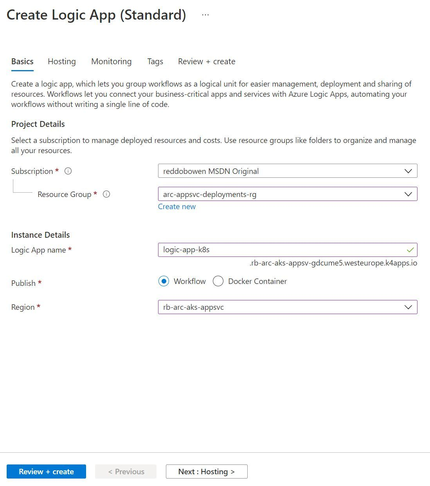
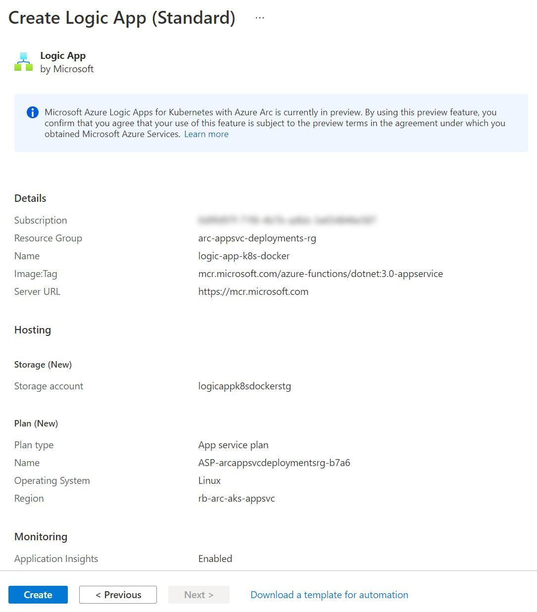
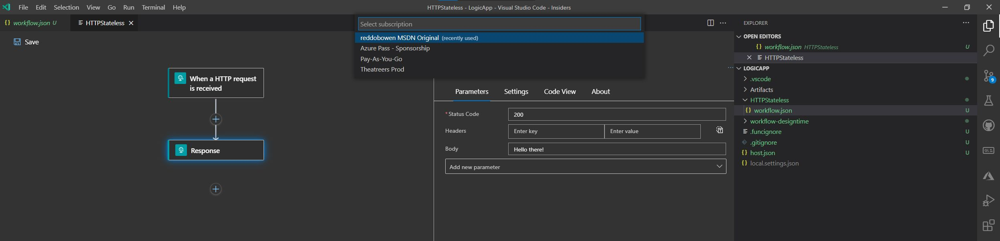
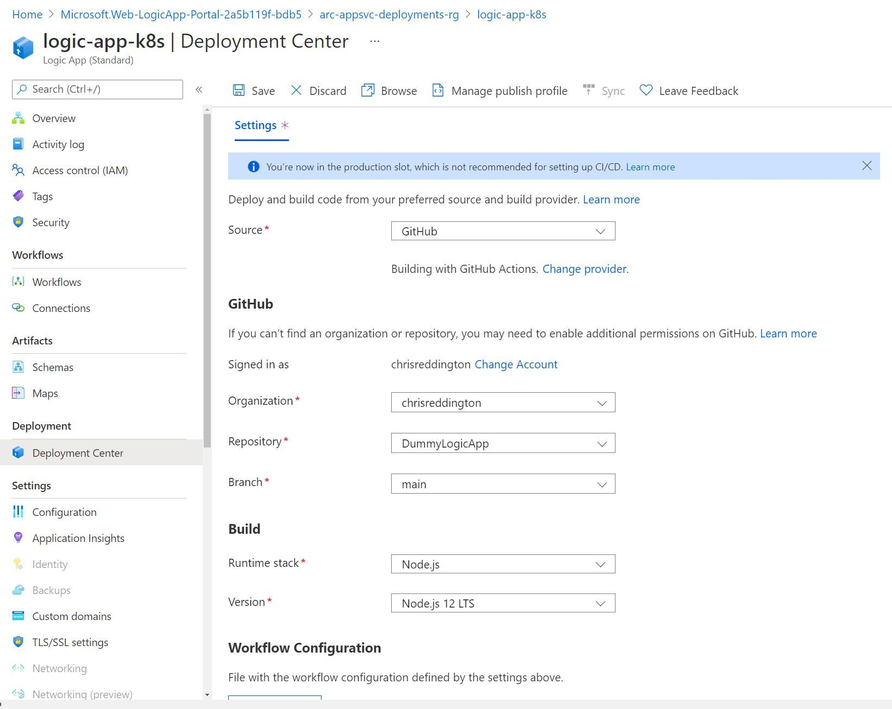
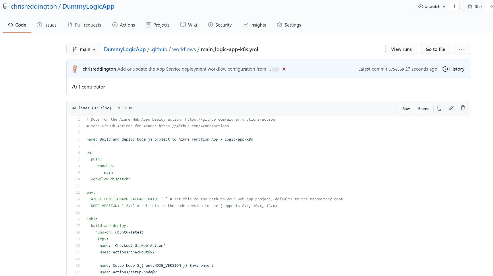
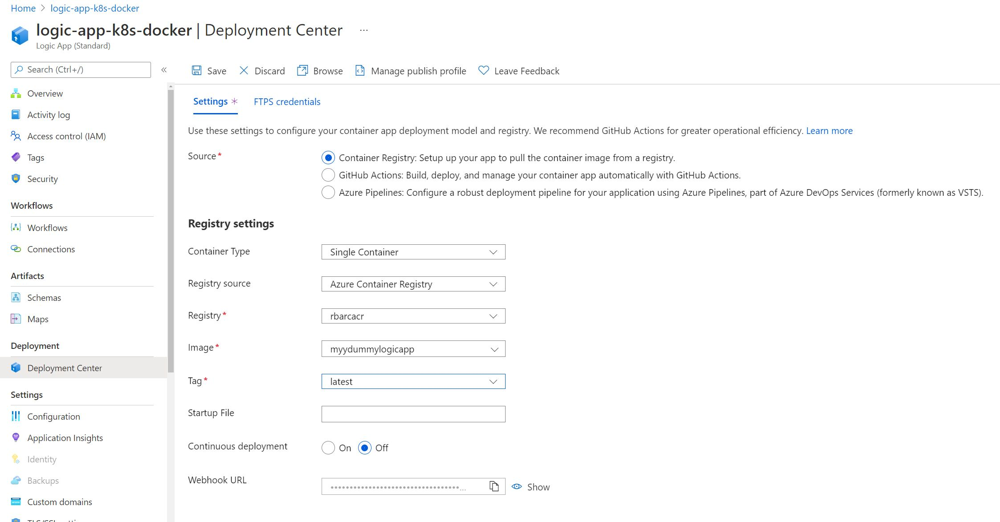

## App Service Kubernetes Environment

In [part 1](/blog/azure-arc-for-apps-part-1) of this *Using Azure Arc for Apps* series, we explored Azure Arc and Azure Arc enabled Kubernetes clusters. In [part 2](/blog/azure-arc-for-apps-part-2), we deployed an App Service Kubernetes Environment into our Azure Arc enabled Kubernetes cluster. In [part 3](/blog/azure-arc-for-apps-part-3), we deployed a Function App into our Azure Arc enabled Kubernetes cluster. Azure Logic Apps will be the focus of this blog post. Just like App Services and Function Apps, Logic Apps can run in an App Service Environment, which means they can also run in an App Service Kubernetes Environment.

> **Tip:** [Part 1](/blog/azure-arc-for-apps-part-1) and [Part 2](/blog/azure-arc-for-apps-part-2) (up until the Create an App Service resource in our App Service Kubernetes Environment section) are pre-requisites to working through this blog post, if you plan to get hands on. As noted above, an Azure Arc enabled Kubernetes cluster is a pre-requisite to deploy App Services, Azure Functions or Logic Apps to a Kubernetes cluster.
>
> [Part 3](/blog/azure-arc-for-apps-part-3) is not a pre-requisite to working through this post.

To be clear, we won't go through the process of setting up an App Service Kubernetes Environment again in this blog post. I'm going to make an assumption that you already have this in place. If not, please go back to [part 2](/blog/azure-arc-for-apps-part-2) to complete this. That should keep this blog post a little shorter in length!

## Create a Logic App in our App Service Kubernetes Environment

The creation experience of a Logic App in an App Service Kubernetes Environment is very similar to that for a Logic App as we are used to.

> **Note:** Be aware that to deploy a Logic App to your App Service Kubernetes Environment, you will have to create a Logic App (Standard) resource and not a Logic App (Consumption) resource. The Logic App (Consumption) tier refers to the multi-tenanted Platform as a Service (PaaS) option.

* The instance name has a suffix of the custom domain that you will have seen in the **App Service Kubernetes Environment** that you created previously.
* You can publish a Logic App as a workflow or a Docker Container.
* The Custom Location item will be an option in the region dropdown. We'll be deploying into that, so that the Logic App is created in our App Service Kubernetes Environment.
On the **Hosting** tab, you'll be able to configure the Azure Storage Account used by the Azure Logic App.



> Azure Storage is a pre-requisite for the Azure Functions tooling. As Azure Logic Apps standard builds upon the Azure Functions Runtime, I suspect that this is why the storage account is required.
>
> Just like in Azure Functions, my mind jumps to the fact that our Logic App may be deployed in another cloud provider or on-premises and there may be some latency to access the Azure Storage account. I may investigate this further in a separate blog post to understand the impact.

As with Azure Functions, you can configure Application Insights through the creation experience as well. We'll leave this as the default (enabled), and progress towards the Review and Create stage.


And in Parallel, I've also been creating a Logic App based upon a docker deployment method as well.



## Logic App Workflows

In the Azure Portal, you will see that there is a **workflows** item on the left hand menu of your Logic App (Standard) resource. Click on that. You'll likely notice that there is a banner on this page. ``Your app is currently in read only mode because you are running on a kubernetes environment. To make any changes use the VS Code designer and deploy your workflows either as a zip or a container.``

This message will appear regardless of your chosen deployment model (i.e. Code or Docker).


We could use the Logic Apps Visual Studio Code tooling to build our Logic Apps workflow and then deploy to the code-based Logic App deployment.



If you prefer, go ahead and do that. However, I'm going to move straight on to the Deployment Center approach.

## Configuring deployment center

Let's go ahead and deploy something to our Logic App! You may recall that we have a couple of options for deploying to a Logic App. Either deploying a code-based approach or deploying a Docker container image.

We'll walkthrough both options below.

### Deploying code representing a Logic App Workflow to a Logic App in an App Service Kubernetes Environment

Before we start, I've gone ahead and created a Logic App through the Visual Studio Code tooling. I then committed the code to a Git repository and pushed to GitHub. If you're interested in how you can use the VSCode tooling to create a Logic App workflow file, I'd encourage you to [review the documentation](https://docs.microsoft.com/en-us/azure/logic-apps/create-single-tenant-workflows-visual-studio-code), which is an excellent resource for this.


I navigated to the Deployment Center tab of my Logic and configured the source to be GitHub. I went ahead and configured the settings so that they matched up to the GitHub repository that I showed in the screenshot above.



Once saved, navigate over to your GitHub repository. You'll notice that there is a GitHub Action workflow file created for you. It performs a checkout of your GitHub repository, sets up a Node.js environment, resolves the needed dependencies through npm and then runs the Azure Function GitHub Action.



This didn't work as expected. The GitHub Action workflow file failed with an error relating to package.json. This makes sense, as there's no package.json (which is a requirement when trying to restore packages for Node.js projects) in the repository.

> **Tip:** After some digging, I found the [Azure/LogicApps repository which has a github-sample](https://github.com/Azure/logicapps/tree/master/github-sample) which contains an example of a Logic App workflow and deploying that using GitHub Actions. The GitHub Action workflow file used looks significantly different (i.e. no restoring node dependencies, and instead - just copies the files from the Repository to a subfolder and publishes that artifact for release as a zip).
>
> While I had hoped this would deploy successfully, I had some issues. I made it up until the "Run Azure Functions Action" step, but then the action hung. It seemed as if it was unable to connect to the Logic App.

For now, we'll pause on this approach and focus on the Docker based approach moving forwards.

### Deploying a Docker Container to a Logic App in an App Service Kubernetes Environment

Just like Azure Functions, you can deploy a Logic App using a Docker Container Image. Ahead of time, I've gone ahead and built a Docker Container Image using the same code which was pushed up to the GitHub repository referenced in the previous section.

> **Tip:** I make this step sound incredibly easy. From what I can see, the Logic Apps Visual Studio Code tooling doesn't have an option to generate a Dockerfile for you. There were several Dockerfiles in the wild that used a very specific base image name, and didn't feel quite right. After some digging, I found the [Azure/LogicApps repository which has a github-sample](https://github.com/Azure/logicapps/tree/master/github-sample), including a Dockerfile. I used that Dockerfile to build a docker image from my local machine and push that to the container registry. In a real world scenario, I would have a CI/CD workflow setup for that, but this is not the point of this blog post.
>
> While the VSCode tooling doesn't have an option to generate the Dockerfile, the Azure Functions runtime does. You can use the command ``func init --docker-only`` to initialise the required Dockerfile for the project.

We'll configure the Registry settings in Deployment Center to match with the Azure Container Registry, as well as the image that we have pushed up.



Before hitting save, I had my ``kubectl get po -n appservice --watch`` command ready to go. The result is exactly as you would expect. A new pod gets deployed, while the previous instance (logic-app-k8s-docker-75cb6b5486-t9dtf) is terminated.

```bash
kubectl get po -n appservice --watch
logic-app-k8s-5fb47788b5-6vp9w                                  2/2     Running   0          10h
logic-app-k8s-5fb47788b5-7k5qs                                  2/2     Running   0          9h
logic-app-k8s-5fb47788b5-9pblr                                  2/2     Running   0          9h
logic-app-k8s-docker-75cb6b5486-t9dtf                           2/2     Running   0          22s
rb-arc-aks-appsvc-k8se-activator-6ff8f77d68-j5qd5               1/1     Running   0          10h
rb-arc-aks-appsvc-k8se-app-controller-766777cf79-flsdl          1/1     Running   0          10h
rb-arc-aks-appsvc-k8se-build-service-568b9d8d7-v7vw7            1/1     Running   0          10h
rb-arc-aks-appsvc-k8se-envoy-7bdd5bbdb7-695gn                   1/1     Running   0          10h
rb-arc-aks-appsvc-k8se-envoy-7bdd5bbdb7-7bqx8                   1/1     Running   0          10h
rb-arc-aks-appsvc-k8se-envoy-7bdd5bbdb7-89px9                   1/1     Running   0          10h
rb-arc-aks-appsvc-k8se-http-scaler-5c9676ffc9-s7w44             1/1     Running   0          10h
rb-arc-aks-appsvc-k8se-img-cacher-v5ppw                         1/1     Running   0          10h
rb-arc-aks-appsvc-k8se-img-cacher-wqhvc                         1/1     Running   0          10h
rb-arc-aks-appsvc-k8se-keda-metrics-apiserver-678946464-zzg5t   1/1     Running   0          10h
rb-arc-aks-appsvc-k8se-keda-operator-b7488958-27nmq             1/1     Running   0          10h
rb-arc-aks-appsvc-k8se-log-processor-5ns8d                      1/1     Running   101        10h
rb-arc-aks-appsvc-k8se-log-processor-npnqk                      0/1     Error     113        10h
logic-app-k8s-docker-58578bc9c-jrb4v                            0/2     Pending   0          0s
logic-app-k8s-docker-58578bc9c-jrb4v                            0/2     Pending   0          0s
logic-app-k8s-docker-58578bc9c-jrb4v                            0/2     ContainerCreating   0          0s
logic-app-k8s-docker-58578bc9c-jrb4v                            1/2     Running             0          3s
logic-app-k8s-docker-58578bc9c-jrb4v                            2/2     Running             0          8s
logic-app-k8s-docker-75cb6b5486-t9dtf                           2/2     Terminating         0          34s
```

The Logic App deployed, and I can see relatable logs in Application Insights (i.e. it's detected the ``HTTPStateless/triggers/manual/invoke`` endpoint). I had setup a basic Logic Apps to act as a request/response, and couldn't call the URL directly with the ``/api/HTTPStateless/triggers/manual/invoke`` endpoint that my Logic App was expecting. Instead my browser displayed a 'took too long to respond' error. The Logic App works fine when running on the Azure Functions runtime locally on my machine, so I suspect is down to an application deployment issue when I push to the App Service Kubernetes Environment. This is something I'll be digging into as a follow-up.

## Configuring Application Insights for our Logic App

It is possible to use Application Insights to collect data from a Logic App in an App Service Kubernetes Environment, the exact same way that we would do so for a Function App. This appears to be part of the Function runtime, and is not currently available for App Services.

You will have likely configured this as **enabled** when you created your Logic App (I did, at least). Once again, the experience is no different to what we would expect of a Function App in the multi-tenanted hosting model.


Just to investigate, I went ahead and disabled Application Insights within the Logic App blade as shown above. I immediately received a pop up, asking as below -

> **You are about to turn off Application Insights. This will update app settings and restart your site. Do you want to continue?**
>
> To turn Application Insights entirely off, check that Application Insights SDK and the instrumentation key are removed from your application.

As you may have expected, if you've read my other posts in the series - I ran the command ``kubectl get po -n appservice --watch`` ahead of time. I found the exact same behaviour as with the Function Apps. We did not see any pod redeployments - Nothing happened from a Kubernetes perspective.

I'd be interested to understand what actually happens when enabling / disabling App Insights. I suspect that this is related to the Azure Function Runtime in the container image, rather than the pods that are deployed in Kubernetes. However, I don't have a fully conclusive answer.

I navigated to the Application Insights resource for my Logic App deployed using a Docker container method. I can see that the logs are appearing within Application Insights as expected.


## Configuring Custom Domains

Custom domains is an available option in the left hand menu, though as with Azure Functions and App Services, I encountered issues as shown in the screenshot below.


This is one that I plan to investigate further, and determine whether this is a user interface challenge (e.g. should custom domains actually be grayed out as it's unsupported, or is the validation experience not available through the user interface).

## Scaling out your Logic App instances

As is the case with many Platform as a Service (PaaS) services, scaling is as easy as adjusting a slider. This is no different when using an App Service Kubernetes environment. We can go ahead and adjust the slider to represent the maximum number of instances that we would like to scale to. Then, App Service for Kubernetes deals with creating the additional instances (Kubernetes pods) of our function app behind the scenes as needed.


If you have your Kubernetes-thinking hat on, then you'll probably be able to determine where this is going. Before saving the new scale out configuration, I once again ran the command ``kubectl get po -n appservice --watch``. You'll notice that Kubernetes maintains the replicaset (i.e. logic-app-k8s-5fb47788b5-6vp9w), but adds two additional pods to the replicaset. Again, this is unsurprising and in-line with how we'd expect Kubernetes to handle a scale out event for any Kubernetes workload.

```bash
kubectl get po -n appservice --watch
NAME                                                            READY   STATUS             RESTARTS   AGE
logic-app-k8s-5fb47788b5-6vp9w                                  2/2     Running            0          66m
logic-app-k8s-docker-5575695b6b-78xkw                           2/2     Running            0          65m
rb-arc-aks-appsvc-k8se-activator-6ff8f77d68-j5qd5               1/1     Running            0          74m
rb-arc-aks-appsvc-k8se-app-controller-766777cf79-flsdl          1/1     Running            0          74m
rb-arc-aks-appsvc-k8se-build-service-568b9d8d7-v7vw7            1/1     Running            0          74m
rb-arc-aks-appsvc-k8se-envoy-7bdd5bbdb7-695gn                   1/1     Running            0          74m
rb-arc-aks-appsvc-k8se-envoy-7bdd5bbdb7-7bqx8                   1/1     Running            0          74m
rb-arc-aks-appsvc-k8se-envoy-7bdd5bbdb7-89px9                   1/1     Running            0          74m
rb-arc-aks-appsvc-k8se-http-scaler-5c9676ffc9-s7w44             1/1     Running            0          74m
rb-arc-aks-appsvc-k8se-img-cacher-v5ppw                         1/1     Running            0          74m
rb-arc-aks-appsvc-k8se-img-cacher-wqhvc                         1/1     Running            0          74m
rb-arc-aks-appsvc-k8se-keda-metrics-apiserver-678946464-zzg5t   1/1     Running            0          74m
rb-arc-aks-appsvc-k8se-keda-operator-b7488958-27nmq             1/1     Running            0          74m
rb-arc-aks-appsvc-k8se-log-processor-5ns8d                      1/1     Running            0          74m
rb-arc-aks-appsvc-k8se-log-processor-npnqk                      0/1     CrashLoopBackOff   17         74m
logic-app-k8s-5fb47788b5-9pblr                                  0/2     Pending            0          0s
logic-app-k8s-5fb47788b5-9pblr                                  0/2     Pending            0          0s
logic-app-k8s-5fb47788b5-7k5qs                                  0/2     Pending            0          0s
logic-app-k8s-5fb47788b5-7k5qs                                  0/2     Pending            0          0s
logic-app-k8s-5fb47788b5-9pblr                                  0/2     Init:0/1           0          0s
logic-app-k8s-5fb47788b5-7k5qs                                  0/2     Init:0/1           0          0s
logic-app-k8s-5fb47788b5-7k5qs                                  0/2     Init:0/1           0          1s
logic-app-k8s-5fb47788b5-9pblr                                  0/2     Init:0/1           0          3s
logic-app-k8s-5fb47788b5-7k5qs                                  0/2     PodInitializing    0          7s
logic-app-k8s-5fb47788b5-7k5qs                                  1/2     Running            0          8s
logic-app-k8s-5fb47788b5-9pblr                                  0/2     PodInitializing    0          9s
logic-app-k8s-5fb47788b5-7k5qs                                  2/2     Running            0          12s
logic-app-k8s-5fb47788b5-9pblr                                  1/2     Running            0          50s
logic-app-k8s-5fb47788b5-9pblr                                  2/2     Running            0          53s
```

## Custom Resource Definitions in Kubernetes

You can absolutely feel free to skip over this next section. However, as I'm comfortable with Kubernetes - I wanted to dig into some more detail about what's going on behind the scenes with App Service. Specifically, what custom resource definitions got created when we set up the Application Services extension for our Azure Arc enabled Kubernetes cluster earlier? You can see there are several custom resource definitions on my Kubernetes cluster -

* Those ending k8se.microsoft.com relate to the Application Services Extension / App Services Kubernetes environment
* Those ending in clusterconfig.azure.com relate to the Azure Arc enabled Kubernetes cluster functionality
* Those ending in projectcalico.org and tigera.io relate to the Calico networking policy model that I have configured on my AKS cluster.
* Those ending in dapr.io relate to the DAPR project that I Have configured on my cluster
* Those ending in keda.sh relate to the KEDA project that was configured as part of the Application Services Extension / App Services Kubernetes environment

```bash
kubectl get crd
NAME                                                   CREATED AT
approutes.k8se.microsoft.com                           2021-05-29T16:40:12Z
apps.k8se.microsoft.com                                2021-05-29T16:40:13Z
azureclusteridentityrequests.clusterconfig.azure.com   2021-05-29T16:21:47Z
azureextensionidentities.clusterconfig.azure.com       2021-05-29T16:21:47Z
bgpconfigurations.crd.projectcalico.org                2021-05-29T16:18:49Z
bgppeers.crd.projectcalico.org                         2021-05-29T16:18:49Z
blockaffinities.crd.projectcalico.org                  2021-05-29T16:18:49Z
clusterinformations.crd.projectcalico.org              2021-05-29T16:18:49Z
clustertriggerauthentications.keda.sh                  2021-05-29T16:40:13Z
components.dapr.io                                     2021-05-29T16:40:12Z
configurations.dapr.io                                 2021-05-29T16:40:12Z
connectedclusters.arc.azure.com                        2021-05-29T16:21:47Z
customlocationsettings.clusterconfig.azure.com         2021-05-29T16:21:47Z
extensionconfigs.clusterconfig.azure.com               2021-05-29T16:21:47Z
felixconfigurations.crd.projectcalico.org              2021-05-29T16:18:49Z
gitconfigs.clusterconfig.azure.com                     2021-05-29T16:21:47Z
globalnetworkpolicies.crd.projectcalico.org            2021-05-29T16:18:49Z
globalnetworksets.crd.projectcalico.org                2021-05-29T16:18:49Z
hostendpoints.crd.projectcalico.org                    2021-05-29T16:18:49Z
imagesets.operator.tigera.io                           2021-05-29T16:18:49Z
installations.operator.tigera.io                       2021-05-29T16:18:49Z
ipamblocks.crd.projectcalico.org                       2021-05-29T16:18:49Z
ipamconfigs.crd.projectcalico.org                      2021-05-29T16:18:49Z
ipamhandles.crd.projectcalico.org                      2021-05-29T16:18:49Z
ippools.crd.projectcalico.org                          2021-05-29T16:18:49Z
kubecontrollersconfigurations.crd.projectcalico.org    2021-05-29T16:18:49Z
networkpolicies.crd.projectcalico.org                  2021-05-29T16:18:49Z
networksets.crd.projectcalico.org                      2021-05-29T16:18:49Z
placeholdertemplates.k8se.microsoft.com                2021-05-29T16:40:13Z
scaledjobs.keda.sh                                     2021-05-29T16:40:13Z
scaledobjects.keda.sh                                  2021-05-29T16:40:13Z
subscriptions.dapr.io                                  2021-05-29T16:40:12Z
tigerastatuses.operator.tigera.io                      2021-05-29T16:18:49Z
triggerauthentications.keda.sh                         2021-05-29T16:40:13Z
virtualapps.k8se.microsoft.com                         2021-05-29T16:40:13Z
workerapps.k8se.microsoft.com                          2021-05-29T16:40:13Z
```

You'll notice when running ``kubectl get apps.k8se.microsoft.com --all-namespaces``, we can see several Kubernetes resources. The list includes the two Logic Apps that I have created throughout this post. If you have been deploying additional resources (E.g. Function Apps or Web Apps), then you may see those here as well.

```bash
kubectl get apps.k8se.microsoft.com --all-namespaces
NAMESPACE    NAME                   AGE
appservice   logic-app-k8s          68m
appservice   logic-app-k8s-docker   67m
```

Let's take a peek at the Logic App resource that is in our Kubernetes Cluster.

```bash
kubectl describe apps.k8se.microsoft.com logic-app-k8s -n appservice
Name:         logic-app-k8s
Namespace:    appservice
Labels:       k8se.microsoft.com/environmentName=production
Annotations:  <none>
API Version:  k8se.microsoft.com/v1alpha1
Kind:         App
Metadata:
  Creation Timestamp:  2021-06-02T20:04:15Z
  Finalizers:
    app.finalizer.k8se.io
  Generation:  3
  Managed Fields:
    API Version:  k8se.microsoft.com/v1alpha1
    Fields Type:  FieldsV1
    fieldsV1:
      f:metadata:
        f:finalizers:
      f:status:
        .:
        f:appHealthStatus:
        f:appProvisioningState:
        f:observedGeneration:
    Manager:      appcontroller
    Operation:    Update
    Time:         2021-06-02T20:04:30Z
    API Version:  k8se.microsoft.com/v1alpha1
    Fields Type:  FieldsV1
    fieldsV1:
      f:metadata:
        f:labels:
          .:
          f:k8se.microsoft.com/environmentName:
      f:spec:
        .:
        f:appType:
        f:code:
          .:
          f:packageRef:
            .:
            f:framework:
            f:hostingFramework:
        f:config:
          .:
          f:appSettings:
            .:
            f:name:
          f:slotName:
        f:httpOptions:
          .:
          f:hostnames:
          f:ipSecurityRestrictions:
          f:port:
          f:scmIpSecurityRestrictions:
          f:scmIpSecurityRestrictionsUseMain:
        f:scaleOptions:
          .:
          f:maxReplicaCount:
          f:minReplicaCount:
          f:sku:
          f:stopped:
        f:triggerOptions:
    Manager:         unknown
    Operation:       Update
    Time:            2021-06-02T21:10:39Z
  Resource Version:  2034394
  UID:               2351137b-5575-419c-a281-cc4b85331741
Spec:
  App Type:  functionapp,kubernetes,linux
  Code:
    Package Ref:
      Framework:          Node|12
      Hosting Framework:  azure-functions|3
  Config:
    App Settings:
      Name:     logic-app-k8s-secrets
    Slot Name:  production
  Http Options:
    Hostnames:
      Domain:  logic-app-k8s.rb-arc-aks-appsv-gdcume5.westeurope.k4apps.io
    Ip Security Restrictions:
    Port:  80
    Scm Ip Security Restrictions:
    Scm Ip Security Restrictions Use Main:  false
  Scale Options:
    Max Replica Count:  4
    Min Replica Count:  3
    Sku:                Kubernetes
    Stopped:            false
  Trigger Options:
Status:
  App Health Status:       Healthy
  App Provisioning State:  Provisioned
  Observed Generation:     3
Events:                    <none>
```

We can identify some information about the scale options that have been set within the Azure Function in the Azure Portal, the hostnames that are configured, information around the staging slots. There is nothing particularly exciting that we didn't already know at this point, though it's always useful to see how this comes together in a Custom Resource Definition.

## Resources available in the Azure Resource Group

That's another whistle stop tour of a service deployed in Kubernetes. Unsurprisingly (if you've followed the other posts), the resources deployed in the Azure Resource Group don't look particularly different to what we would deploy into the multi-tenanted environment.


## Summary

This post is similar in nature to [part 2](/blog/azure-arc-for-apps-part-2), and **very** similar to [part 3](/blog/azure-arc-for-apps-part-3). Neither of these similarities are surprising as all of these services can run on App Services. Regardless of whether you're coming from a Logic Apps background, a Kubernetes background, or both - I hope that this post has been useful to you. I'm thoroughly enjoying writing this series, and think there's some huge potential of App Service for Kubernetes environment in an Azure Arc enabled Kubernetes cluster.

With that, any comments and feedback are always appreciated over on [Twitter, @reddobowen](https://twitter.com/reddobowen). Don't forget, there are several posts in this series that continue the story of Azure Arc for Apps.

* [Part 1 - Setting up an Azure Arc enabled Kubernetes cluster](/blog/azure-arc-for-apps-part-1)
* [Part 2 - Deploying App Services to Kubernetes](/blog/azure-arc-for-apps-part-2)
* [Part 3 - Deploying Azure Functions into an App Service Kubernetes Environment](/blog/azure-arc-for-apps-part-3)
* [Part 5 - Deploying an Azure API Management gateway to an Azure Arc enabled Kubernetes Cluster](/blog/azure-arc-for-apps-part-5)
* [Part 6 - Setting up Event Grid on Kubernetes with Azure Arc](/blog/azure-arc-for-apps-part-6)

 I hope that you'll continue on with the series, in which case - read on! Otherwise, until the next blog post - Thanks for reading, and bye for now!