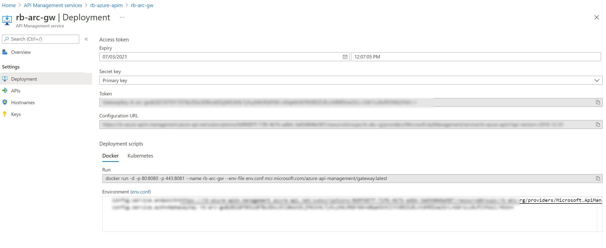
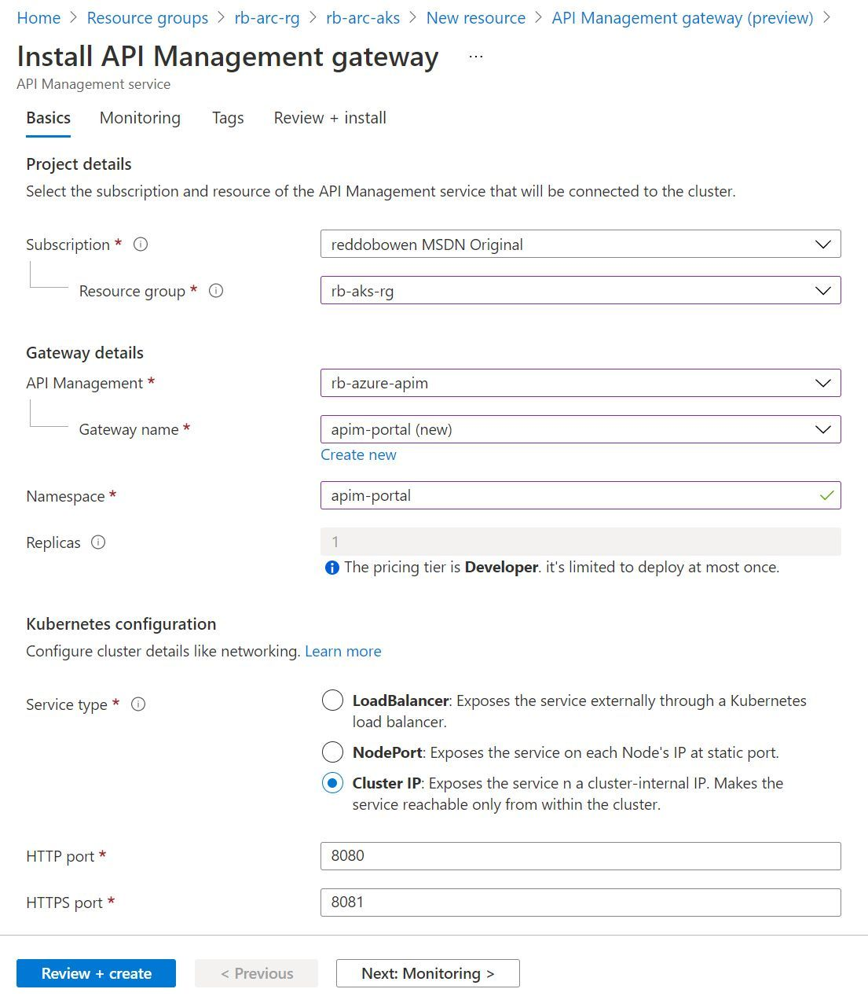
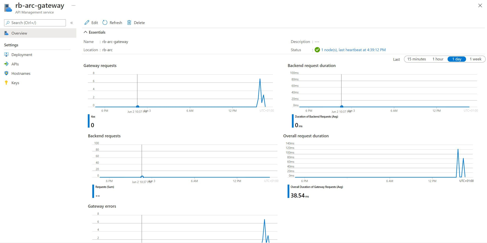

## Setting up an Azure API Management Gateway on Azure Arc

In [part 1](/blog/azure-arc-for-apps-part-1) of this *Using Azure Arc for Apps* series, we explored Azure Arc and Azure Arc enabled Kubernetes clusters. In this post, we'll be exploring API Management on Azure Arc. At time of writing, this approach is in public preview, so we may see certain limitations / features that are not yet available.

> **Tip:** [Part 1](/blog/azure-arc-for-apps-part-1) is a pre-requisite to working through this blog post, if you plan to get hands on. As noted above, an Azure Arc enabled Kubernetes cluster is a pre-requisite in the scenario we're walking through. It is possible to deploy an API Management Gateway [directly to Kubernetes](https://docs.microsoft.com/en-us/azure/api-management/how-to-deploy-self-hosted-gateway-kubernetes), [directly to Azure Kubernetes Service](https://docs.microsoft.com/en-us/azure/api-management/how-to-deploy-self-hosted-gateway-azure-kubernetes-service) or [directly to docker](https://docs.microsoft.com/en-us/azure/api-management/how-to-deploy-self-hosted-gateway-docker) as an alternative approach. We will be focusing on deploying the Azure API Management Gateway to an Azure Arc enabled Kubernetes cluster.
>
> **Note:** Parts 2, 3 and 4 are not pre-requisites to completing this blog post if you are following along and completing these.

## What is a self-hosted gateway?

Consider the scenario where you want to use a single control plane to manage your API Gateways. You have an API Gateway associated with an API Management instance, but perhaps you are planning for a hybrid or multi-cloud strategy.

This is exactly the scenario that self API Management self-hosted gateways looks to address. You can deploy a containerized version of the API Management Gateway to additional environments where your APIs are hosted, but still manage all of the gateways through the API Management instance in Azure.

Azure Arc allows us to easily deploy the self-hosted gateway as an extension to an Azure Arc enabled Kubernetes Cluster. However, as mentioned in the introduction above - you can also deploy [directly to Kubernetes](https://docs.microsoft.com/en-us/azure/api-management/how-to-deploy-self-hosted-gateway-kubernetes), [directly to Azure Kubernetes Service](https://docs.microsoft.com/en-us/azure/api-management/how-to-deploy-self-hosted-gateway-azure-kubernetes-service) or [directly to docker](https://docs.microsoft.com/en-us/azure/api-management/how-to-deploy-self-hosted-gateway-docker).

By placing a self-hosted gateway close to your APIs, you can optimize for traffic flows (i.e. lower latency). This may also help address any security or compliance concerns if they exist.

Throughout this blog post, I'm assuming that you are somewhat familiar with Azure API Management Gateways. If not, I encourage you to read the [Self-hosted gateway overview](https://docs.microsoft.com/en-us/azure/api-management/self-hosted-gateway-overview) in the Azure Docs.

## Pre-Requisite: Creating an API Management Resource

Before you can deploy the Azure API Management Gateway into your Azure Arc enabled Kubernetes cluster, you'll need to have an existing Azure API Management resource in place.

> **Tip:** Be aware of the [pricing model for Azure API Management](https://azure.microsoft.com/en-us/pricing/details/api-management/). To create an API Management Gateway on your Azure Arc enabled Kubernetes cluster, you will need to select a SKU that has the Self-hosted gateway capability. I'll be using the Development SKU. Be aware that there is a separate charge for each Self-hosted gateway that you deploy, which is also displayed in the pricing page.

I've included a screenshot below of the **Basics** tap of my API Management Resource Creation Experience.


For the purposes of the blog post, I'm keeping the deployment of the Azure API Management resource simple. I'm enabling Application Insights, assigning a System Assigned Identity, not associating the resource with a virtual network and keeping the protocol settings as default.

You may want to have a coffee break at this point, or continue on reading on to familiarise yourself with the post. The creation can take a while.

## Setting up the API Management gateway extension

We have a couple of options to create our  API Management Gateway in our Azure Arc enabled Kubernetes Cluster -

* Using the Azure CLI
  * We will need to use the ``k8s-extension`` if we want to use the Azure CLI. You may have used this already in one of the other blog posts. If you have, make sure you're on the latest version by using ``az extension update --name k8s-extension``. If you don't have it installed, then use ``az extension add --name k8s-extension``.
* Through the Extensions menu item of our Azure Arc enabled Kubernetes Cluster in the Azure Portal.

### Setting up the API Management gateway extension using the Azure CLI

Next up, go ahead to your API Management Resource and select the **Gateways** item. You'll need to create a Gateway object to map the API Management Gateway extension of Azure Arc to the API Management instance.

> **Tip:** As a reminder, you'll begin seeing an additional charge once you create the Gateway object in the Azure Portal, as documented on the pricing page.

Click on your newly created Gateway Object, and you should see a screen similar to the below.


Navigate to the **Deployments** item, and take note of the Gateway Endpoint and Gateway Auth Key. You'll need it for the next step.



Navigate to your command prompt, and use the following command (replacing your information within the command).

```bash
arcClusterName="rb-arc-aks"
arcResourceGroupName="rb-arc-rg"
extensionName="$arcClusterName-apimgw"
namespace="apim"

az k8s-extension create --cluster-type connectedClusters --cluster-name rb-arc-aks \
  --resource-group $arcResourceGroupName --name $extensionName --extension-type Microsoft.ApiManagement.Gateway \
  --scope namespace --target-namespace $namespace \
  --configuration-settings gateway.endpoint='EnterYourGatewayEndpoint' \
  --configuration-protected-settings gateway.authKey='EnterYourGatewayAuthKey' --release-train preview
```
After you've executed the command, navigate over to your Azure Arc resource in the Azure Portal. Click on the **Extensions** menu item. You should see that a microsoft.apimanagement.gateway extension is installing.


### Setting up the API Management gateway extension using the Azure Portal

If you prefer the Azure Portal, then there is an option to install the API Management gateway extension through the Azure Portal.



There is a separate page to configure the Log Analytics workspace. This is optional.


> **Tip:** As a reminder, you'll begin seeing an additional charge once you create the API Management Gateway extension in the Azure Portal. This is because a Gateway object has been created under your API Management service instance. This is expected, and is the self-hosted gateway charge which is documented on the pricing page.

After you've executed the command, navigate over to your Azure Arc resource in the Azure Portal. Click on the **Extensions** menu item. You should see that a microsoft.apimanagement.gateway extension is installing.


## Watching the Kubernetes Cluster when the extension is created

I had the ``kubectl get po --watch -n apim`` command ready to go in the command-line to understand what is being deployed into the namespace that we specified.

```bash
kubectl get po --watch -n apim
NAME                                 READY   STATUS              RESTARTS   AGE
rb-arc-aks-apimgw-6cb68c4ccf-88bxg   0/1     Pending             0          0s
rb-arc-aks-apimgw-6cb68c4ccf-88bxg   0/1     Pending             0          0s
rb-arc-aks-apimgw-6cb68c4ccf-88bxg   0/1     ContainerCreating   0          0s
rb-arc-aks-apimgw-6cb68c4ccf-88bxg   1/1     Running             0          2s
```

We can also see that a Kubernetes Service has been added to our cluster to access the API Management Gateway easily. By default, a ClusterIP service is created as you can see from the snippet below.

```bash
kubectl get svc -n apim
NAME                                             TYPE        CLUSTER-IP   EXTERNAL-IP   PORT(S)    AGE
rb-arc-aks-apimgw-azure-api-management-gateway   ClusterIP   10.0.77.78   <none>        5000/TCP   6m52s
```

It's worth calling out that the default behaviour of the Azure CLI extension is to set the ``--configuration-settings service.Type`` property to ClusterIP. We could however use a LoadBalancer option if preferred.

## Making an API Accessible from the Gateway

The API Management instance deployed already has an API available, the Echo API. Navigate back to the API Management Instance > Gateways > ``name of your gateway`` > APIs. Click add to ensure the API is available on the API Gateway deployed in your Azure Arc enabled Kubernetes cluster.

You'll see that the Self Hosted Gateway should now be associated with the API that you selected. See an example in the screenshot below.


At this point, we'll want to go ahead and call the API! However, you'll remember that I created a service with a ClusterIP, so is only internally accessible within the Kubernetes cluster and is not exposed.

I have a couple of strategies, which I've split out into two sections.

### Calling the API on the self-hosted gateway using a Busybox container in the Kubernetes cluster

We can create a **busybox** container in the Kubernetes cluster and use that to call the local service. The [Busybox container image](https://hub.docker.com/_/busybox) is referred to as *The Swiss Army Knife of Embedded Linux*. It has several utilities built-in, including fileutils, shellutils, etc. One of the utilities that I commonly use in these scenarios is wget.

```bash
kubectl run busybox --image=busybox --restart=Never -it --rm -- /bin/sh

wget http://rb-arc-aks-apimgw-azure-api-management-gateway.apim:5000/echo/resource?param1=sample
```

> **Tip:** You may be looking at the URL that we're calling and wondering where that has come from. It's typically not a good practice to make a request directly to a Kubernetes pod, as they are considered ephemeral resources. This means they may disappear at any given moment. If that happens and the container is deployed using a Kubernetes deployment resource, then Kubernetes will create a new pod. However, it's unlikely that the pod will have the same IP address. That is where Kubernetes services come in. A service could be considered as a virtual load balancer, which keeps a mapping of all of the pods that it's associated with by using labels.
>
> Let's break down the URL -
> * rb-arc-aks-apimgw-azure-api-management-gateway is the name of the Kubernetes service that was created
> * apim is the namespace, which is therefore our extension to the name
> * port 5000 is the port that the self-hosted gateway is listening on
> * /echo/resource?param1=sample is the path which maps back to an API operation in API Management

### Calling the API on the self-hosted gateway using a curlimage/curl container in the Kubernetes cluster

We can create a **curl** container in the Kubernetes cluster and use that to make a request to the local service. You can likely guess what tool the [curl container image](https://hub.docker.com/r/curlimages/curl) contains!

```bash
kubectl run curl --image=curlimages/curl --restart=Never -it --rm -- /bin/sh

curl http://rb-arc-aks-apimgw-azure-api-management-gateway.apim:5000/echo/resource?param1=sample
```

> **Tip:** You may be looking at the URL that we're calling and wondering where that has come from. It's typically not a good practice to make a request directly to a Kubernetes pod, as they are considered ephemeral resources. This means they may disappear at any given moment. If that happens and the container is deployed using a Kubernetes deployment resource, then Kubernetes will create a new pod. However, it's unlikely that the pod will have the same IP address. That is where Kubernetes services come in. A service could be considered as a virtual load balancer, which keeps a mapping of all of the pods that it's associated with by using labels.
>
> Let's break down the URL -
> * rb-arc-aks-apimgw-azure-api-management-gateway is the name of the Kubernetes service that was created
> * apim is the namespace, which is therefore our extension to the name
> * port 5000 is the port that the self-hosted gateway is listening on
> * /echo/resource?param1=sample is the path which maps back to an API operation in API Management

### What do the self-hosted gateway container logs say?

Unfortunately, both of my executions returned with a 404 error. This implies that the message has successfully reached the self-hosted API Management Gateway, as we received an HTTP response, rather than a timeout.

We can inspect the logs of the container by using the ``kubectl logs rb-arc-aks-apimgw-6cb68c4ccf-gkl8w -n apim`` (though please update the command with your pod name, and your namespace).

```bash
kubectl logs rb-arc-aks-apimgw-6cb68c4ccf-gkl8w -n apim
WARNING: ca-certificates.crt does not contain exactly one certificate or CRL: skipping

(c) Microsoft Corporation. All rights reserved.

This software is licensed to you as part of your or your company's subscription license for Microsoft Azure Services.
You may only use the software with Microsoft Azure Services and subject to the terms and conditions of the agreement under which you obtained Microsoft Azure Services.
If you do not have an active subscription license for Microsoft Azure Services, you may not use the software.
See Microsoft Azure Legal Information: https://azure.microsoft.com/en-us/support/legal/

     __       __   ___          __                             __   ___        ___      ___
 /\   / |  | |__) |__      /\  |__) |     |\/|  /\  |\ |  /\  / _` |__   |\/| |__  |\ |  |
/~~\ /_ \__/ |  \ |___    /~~\ |    |     |  | /~~\ | \| /~~\ \__> |___  |  | |___ | \|  |

   ____           _    __           _   _                 _                _      ____           _
 / ___|    ___  | |  / _|         | | | |   ___    ___  | |_    ___    __| |    / ___|   __ _  | |_    ___  __      __   __ _   _   _
 \___ \   / _ \ | | | |_   _____  | |_| |  / _ \  / __| | __|  / _ \  / _` |   | |  _   / _` | | __|  / _ \ \ \ /\ / /  / _` | | | | |
  ___) | |  __/ | | |  _| |_____| |  _  | | (_) | \__ \ | |_  |  __/ | (_| |   | |_| | | (_| | | |_  |  __/  \ V  V /  | (_| | | |_| |
 |____/   \___| |_| |_|           |_| |_|  \___/  |___/  \__|  \___|  \__,_|    \____|  \__,_|  \__|  \___|   \_/\_/    \__,_|  \__, |
                                                                                                                                |___/

               .%*
                         /##(
                                   #####.
                                            ,%%%#%%/
                                                      #%%%%%%%%
                                                     (((#####((((#/
                                                   ((((##(((//////((
                                                  ((((##(///*******//.
                                                 /(((%#(//**,,..,,,*//
   %%%%%%%%############(/############%%%%%%%%%%%%%%%%%((/**,..  ..,,**
                                         .**(/%/%%%%%%((/**,... ..,***
                                                  (((%#((/**,,,,,,**/.
                                                   (((%#((//****,,//
                                                     ((%##((((///(*
                                                        ,%%####
                                                  %%%%%,
                                          *%%#%
                                   (###
                            ##(
                    ,#/
             (,

  _                                     _
 | |__     ___    ___   _ __           | |__     ___    ___   _ __
 | '_ \   / _ \  / _ \ | '_ \   _____  | '_ \   / _ \  / _ \ | '_ \
 | |_) | |  __/ |  __/ | |_) | |_____| | |_) | |  __/ |  __/ | |_) |
 |_.__/   \___|  \___| | .__/          |_.__/   \___|  \___| | .__/
                       |_|                                   |_|


version: 1.3.0.0
commit: a1434b5a6f41a3b878cbb27ec4d7b69b5c45b5af
[Warn] 2021-06-3T03:25:12.570 [LoadBackupLocationNotFound], message: /apim/config, source: BackupMetadataProvider
[Info] 2021-06-3T03:25:12.586 [HostBootstrapperStarting]
[Info] 2021-06-3T03:25:12.587 [ComponentStarting], message: LogSinkEventListenerHost
[Info] 2021-06-3T03:25:12.587 [ComponentStarted], message: LogSinkEventListenerHost
[Info] 2021-06-3T03:25:12.613 [LoadingConfiguration], message: https://rb-azure-apim.management.azure-api.net/subscriptions/0d9fd97f-71f6-4b7b-adbb-3a654846e587/resourceGroups/rb-aks-rg/providers/Microsoft.ApiManagement/service/rb-azure-apim/gateways/getConfiguration?api-version=2018-06-01-preview, source: ServiceConfigurationSource
[Info] 2021-06-3T03:25:12.931 [ConfigurationUpdated], message: Updated settings: tenant.id, tenant.name, config.enc, config.enc.keys.primary, config.enc.keys.secondary, config.cert.privatekey.password, deployment.dataset.id, logs.applicationinsights.endpoint, policy.qouta.sync.table.connection, events.snapshot.initial.connection, events.snapshot.private.master.connection, events.table.connection, inspector.container.connection, deployment.instance.region, deployment.instance.gateway-id, deployment.id, deployment.name, config.mode, source: ServiceConfigurationSource
[Info] 2021-06-3T03:25:12.933 [ComponentStarting], message: ExternalConfigurationHeartbeat
[Info] 2021-06-3T03:25:12.933 [ComponentStarted], message: ExternalConfigurationHeartbeat
[Info] 2021-06-3T03:25:12.933 [ComponentStarting], message: ExternalConfigurationMonitor
[Info] 2021-06-3T03:25:12.933 [ComponentStarted], message: ExternalConfigurationMonitor
[Info] 2021-06-3T03:25:12.933 [ComponentStarting], message: P2PRateLimitSignalSenderService
[Info] 2021-06-3T03:25:12.934 [ComponentStarted], message: P2PRateLimitSignalSenderService
[Info] 2021-06-3T03:25:12.934 [ComponentStarting], message: P2PRateLimitSignalListenerService
[Info] 2021-06-3T03:25:12.934 [ComponentStarted], message: P2PRateLimitSignalListenerService
[Info] 2021-06-3T03:25:12.934 [ComponentStarting], message: StubHostableComponent
[Info] 2021-06-3T03:25:12.934 [ComponentStarted], message: StubHostableComponent
[Info] 2021-06-3T03:25:12.934 [ComponentStarting], message: StubHostableComponent
[Info] 2021-06-3T03:25:12.934 [ComponentStarted], message: StubHostableComponent
[Info] 2021-06-3T03:25:12.934 [ComponentStarting], message: NeighborDiscoveryService
[Info] 2021-06-3T03:25:12.936 [SelfAddressDiscovery], message: Rate limit is running in UDP broadcast mode. Discovering local node addresses to ignore loopback datagrams..., source: P2PRateLimitSignalListenerService
[Info] 2021-06-3T03:25:12.938 [NeighborhoodChangeDetected], message: [] --> [255.255.255.255: 255.255.255.255], source: UdpHeartbeatSender
[Info] 2021-06-3T03:25:12.939 [NeighborhoodChangeDetected], message: [] --> [255.255.255.255: 255.255.255.255], source: P2PRateLimitSignalSenderService
[Info] 2021-06-3T03:25:12.939 [ComponentStarted], message: NeighborDiscoveryService
[Info] 2021-06-3T03:25:12.939 [ComponentStarting], message: DotNettyBootstrapper
[Info] 2021-06-3T03:25:12.944 [ComponentStarted], message: DotNettyBootstrapper
[Info] 2021-06-3T03:25:12.944 [ComponentStarting], message: AspNetCoreBootstrapper
Hosting environment: Production
Content root path: /app
Now listening on: http://0.0.0.0:8080
Now listening on: https://0.0.0.0:8081
[Info] 2021-06-3T03:25:12.964 [MyAddresses], message: 127.0.0.1, ::1, 10.240.0.102, fe80::38d7:68ff:fe19:af25%74, source: P2PRateLimitSignalListenerService
[Info] 2021-06-3T03:25:12.965 [SignalListenerStarting], message: 0.0.0.0:4290, source: P2PRateLimitSignalListenerService
[Info] 2021-06-3T03:25:12.966 [SignalListenerStarted], message: 0.0.0.0:4290, source: P2PRateLimitSignalListenerService
[Info] 2021-06-3T03:25:13.041 [ComponentStarted], message: AspNetCoreBootstrapper
[Info] 2021-06-3T03:25:13.041 [HostBootstrapperStarted]
[Info] 2021-06-3T03:25:13.138 [TenantStarting], message: 60b8f459c9afe30001d77d04
[Info] 2021-06-3T03:25:13.345 [KubernetesIngressModeDisabled], source: KubernetesConfigurationRepositoryProvider
[Warn] 2021-06-3T03:25:13.376 [LoadBackupLocationNotFound], message: /apim/config, source: FileBackupProvider
[Info] 2021-06-3T03:25:13.480 [LegacyBackendUpdated], source: BackendService
[Info] 2021-06-3T03:25:13.628 [BootstrapperStarting], source: Bootstrapper
[Info] 2021-06-3T03:25:13.628 [ComponentStarting], message: PolicyMapBuilder, source: Bootstrapper
[Info] 2021-06-3T03:25:13.628 [ComponentStarted], message: PolicyMapBuilder, source: Bootstrapper
[Info] 2021-06-3T03:25:13.628 [ComponentStarting], message: RequestHandlerContainer, source: Bootstrapper
[Info] 2021-06-3T03:25:13.628 [ComponentStarted], message: RequestHandlerContainer, source: Bootstrapper
[Info] 2021-06-3T03:25:13.628 [ComponentStarting], message: RequestHandlerContainer, source: Bootstrapper
[Info] 2021-06-3T03:25:13.628 [ComponentStarted], message: RequestHandlerContainer, source: Bootstrapper
[Info] 2021-06-3T03:25:13.628 [ComponentStarting], message: RequestHandlerContainer, source: Bootstrapper
[Info] 2021-06-3T03:25:13.628 [ComponentStarted], message: RequestHandlerContainer, source: Bootstrapper
[Info] 2021-06-3T03:25:13.628 [ComponentStarting], message: RequestHandlerContainer, source: Bootstrapper
[Info] 2021-06-3T03:25:13.628 [ComponentStarted], message: RequestHandlerContainer, source: Bootstrapper
[Info] 2021-06-3T03:25:13.628 [ComponentStarting], message: JsonSchemaLicenseRegistrar, source: Bootstrapper
[Info] 2021-06-3T03:25:13.650 [ComponentStarted], message: JsonSchemaLicenseRegistrar, source: Bootstrapper
[Info] 2021-06-3T03:25:13.650 [ComponentStarting], message: MetricPublisher, source: Bootstrapper
[Info] 2021-06-3T03:25:13.676 [MetricPublicationStarted], source: MetricsPublisher
[Info] 2021-06-3T03:25:13.676 [ComponentStarted], message: MetricPublisher, source: Bootstrapper
[Info] 2021-06-3T03:25:13.676 [ComponentStarting], message: QuotaComponent, source: Bootstrapper
[Info] 2021-06-3T03:25:13.676 [ComponentStarted], message: QuotaComponent, source: Bootstrapper
[Info] 2021-06-3T03:25:13.676 [ComponentStarting], message: CloudMetricConnection, source: Bootstrapper
[Info] 2021-06-3T03:25:13.685 [ComponentStarted], message: CloudMetricConnection, source: Bootstrapper
[Info] 2021-06-3T03:25:13.686 [ConfigStarted], source: CompositeConfigurationRepositoryProvider
[Info] 2021-06-3T03:25:13.686 [ConfigStarted], message: Connected service is enabled. 'config.service.endpoint' is set., source: CompositeConfigurationRepositoryProvider
[Info] 2021-06-3T03:25:13.690 [ConfigInitialSyncStarted], source: ConfigurationRepositoryProvider
[Info] 2021-06-3T03:25:13.864 [CounterInitialSyncStarted], source: QuotaByKeyCounterService
[Info] 2021-06-3T03:25:13.874 [CounterInitialSyncCompleted], source: QuotaByKeyCounterService
[Info] 2021-06-3T03:25:14.043 [EventSnapshotElected], message: provider: storage, uri: https://apimstbeacnpvcizrrfm4ctb.blob.core.windows.net/gatewaysnapshots66q8h6gxqilk8i4/snapshot-2019-10-11.gwhost_0.json.gzip, rev: 18, source: events.snapshot
[Info] 2021-06-3T03:25:14.047 [ConfigurationRetrieving], message: https://apimstbeacnpvcizrrfm4ctb.blob.core.windows.net/gatewaysnapshots66q8h6gxqilk8i4/snapshot-2019-10-11.gwhost_0.json.gzip, source: events.snapshot.storage.private
[Info] 2021-06-3T03:25:14.099 [ConfigurationLoaded], message: https://apimstbeacnpvcizrrfm4ctb.blob.core.windows.net/gatewaysnapshots66q8h6gxqilk8i4/snapshot-2019-10-11.gwhost_0.json.gzip, source: events.snapshot.storage.private
[Info] 2021-06-3T03:25:14.250 [ConfigurationRetrieved], message: https://apimstbeacnpvcizrrfm4ctb.blob.core.windows.net/gatewaysnapshots66q8h6gxqilk8i4/snapshot-2019-10-11.gwhost_0.json.gzip, source: events.snapshot.storage.private
[Info] 2021-06-3T03:25:14.252 [LocalLoggerAddedToTenant], message: rb-azure-apim.azure-api.net, source: DefaultLocalLoggerConfigurationFilter
[Info] 2021-06-3T03:25:14.253 [LocalDiagnosticAddedToTenant], message: rb-azure-apim.azure-api.net, source: DefaultTenantDiagnosticConfigurationFilter
[Info] 2021-06-3T03:25:14.289 [ApplicationInsightsLogPublisherInitializing], message: Telemetry endpoint: https://dc.services.visualstudio.com/, source: ApplicationInsights
[Info] 2021-06-3T03:25:14.368 [OperationRouteTableRebuildStarted], message: echo-api;rev=1, source: ApiRouter
[Info] 2021-06-3T03:25:14.398 [OperationRouteTableRebuildCompleted], message: echo-api;rev=1, source: ApiRouter
[Info] 2021-06-3T03:25:14.401 [OperationRouteTableRebuildStarted], message: dummy;rev=1, source: ApiRouter
[Info] 2021-06-3T03:25:14.401 [OperationRouteTableRebuildCompleted], message: dummy;rev=1, source: ApiRouter
[Info] 2021-06-3T03:25:14.417 [ManagedIdentityAddedToMap], message: systemAssigned, source: ManagedIdentityResolver
[Info] 2021-06-3T03:25:14.420 [LegacyBackendUpdated], source: BackendService
[Info] 2021-06-3T03:25:14.420 [EventSnapshotRestored], message: revision: 00000012, datasetId: 66q8h6gxqilk8i4, source: ConfigurationRepositoryProvider
[Info] 2021-06-3T03:25:14.424 [WaitingForRemainingEvents], message: snapshot-rev: 00000012, source: ConfigurationRepositoryProvider
[Info] 2021-06-3T03:25:14.426 [EventLoopStopped], source: TableStorageEventLoopFactory
[Info] 2021-06-3T03:25:14.426 [EventLoopStarted], source: TableStorageEventLoopFactory
[Info] 2021-06-3T03:25:14.633 [EventsSuccessfullyRestored], source: ConfigurationRepositoryProvider
[Info] 2021-06-3T03:25:14.634 [ConfigInitialSyncCompleted], source: ConfigurationRepositoryProvider
[Info] 2021-06-3T03:25:14.635 [BootstrapperStarted], source: Bootstrapper
[Info] 2021-06-3T03:25:14.636 [TenantStarted], message: 60b8f459c9afe30001d77d04 00:00:01.5929626
[Info] 2021-06-3T03:25:37.896 [PolicyParsingScheduled], message: key: scope: System, id: system, revision: 1, source: PolicyMapBuilder
[Info] 2021-06-3T03:25:37.991 [PolicyParsingSucceeded], message: key: scope: System, id: system, revision: 1, source: PolicyMapBuilder
[Info] 2021-06-3T03:25:37.992 [PolicyParsingScheduled], message: key: scope: Tenant, id: tenant, revision: 1, source: PolicyMapBuilder
[Info] 2021-06-3T03:25:38.013 [PolicyParsingSucceeded], message: key: scope: Tenant, id: tenant, revision: 1, source: PolicyMapBuilder
[Info] 2021-06-3T03:25:37.815, isRequestSuccess: False, totalTime: 245, category: GatewayLogs, callerIpAddress: 10.240.0.25, timeGenerated: 06/03/2021 15:25:37, region: rb-arc, correlationId: 752afbf2-7a10-4655-b1b0-6b8221ea612d, method: GET, url: http://rb-arc-aks-apimgw-azure-api-management-gateway.apim:5000/echo/resource?param1=sample, responseCode: 404, responseSize: 198, cache: none, clientTime: 3, clientProtocol: HTTP/1.1, lastError: {
  "elapsed": 196,
  "source": "configuration",
  "reason": "OperationNotFound",
  "message": "Unable to match incoming request to an operation.",
  "section": "backend"
}
[Info] 2021-06-3T03:26:36.245, isRequestSuccess: False, totalTime: 3, category: GatewayLogs, callerIpAddress: 10.240.0.64, timeGenerated: 06/03/2021 15:26:36, region: rb-arc, correlationId: 1153a239-f5b3-456e-a684-1e6a6bd19e65, method: GET, url: http://rb-arc-aks-apimgw-azure-api-management-gateway.apim:5000/echo/resource?param1=sample, responseCode: 404, responseSize: 198, cache: none, clientProtocol: HTTP/1.1, lastError: {
  "source": "configuration",
  "reason": "OperationNotFound",
  "message": "Unable to match incoming request to an operation.",
  "section": "backend"
}
```

At the moment, I'm unsure why I'm receiving an HTTP 404 error. I can see from the above logs that the self-hosted Gateway has successfully built the route tables for the Echo API that we assigned earlier. During testing, I also associated a new API (Dummy) with the self-hosted gateway. We can see that the Dummy API is also associated according to the logs.

This is something that I plan to dig into further. I'm curious whether there is some information missing from the initial request, e.g. hostname or similar, which may be causing the Gateway to respond with the OperationNotFound response.

Though, I can confirm that the self-hosted gateway container is deployed and configured correctly. I am seeing heartbeat information for the gateway under my API Management Instance in the Azure Portal, and also see the failed requests.



## Custom Resource Definitions in Kubernetes

Unlike the App Service Kubernetes Environment and the Event Grid Extension for Kubernetes, the API Management Gateway extension does not appear to add any Custom Resource Definitions to your Kubernetes Cluster.

The deployment is fairly simple, focusing on a Kubernetes Pod (This could be plural if you are using a SKU which supports multiple instances of a self-hosted gateway. The Developer SKU does not.), Kubernetes Service, Kubernetes Deployment and Kubernetes namespace.

## Resources available in the Azure Resource Group

Similarly, the API Management self-hosted gateway is a concept that exists within an API Management Instance. As a result, the resource that you will see in your Azure Resource Group or Azure Subscription is the Azure API Management service itself.


To find the self-hosted gateway, you will need to look under the API Management instance for the **Gateways** menu item, as we saw in the blog post a little earlier.


## Summary

If you've used self-hosted API Management gateways natively in a Kubernetes cluster or in Docker, then the concept of a self-hosted gateway will be incredibly familiar with you. I hope this post has demonstrated how easy the process is to install a self-hosted to your Azure Arc enabled cluster through the extensions which are available. Likewise, if you were not familiar with self-hosted gateways - I hope that this has been valuable and allowed you to explore some additional concepts.

With that, any comments and feedback are always appreciated over on [Twitter, @reddobowen](https://twitter.com/reddobowen). Don't forget, there are several posts in this series that continue the story of Azure Arc for Apps.

* [Part 1 - Setting up an Azure Arc enabled Kubernetes cluster](/blog/azure-arc-for-apps-part-1)
* [Part 2 - Deploying App Services to Kubernetes](/blog/azure-arc-for-apps-part-2)
* [Part 3 - Deploying Azure Functions into an App Service Kubernetes Environment](/blog/azure-arc-for-apps-part-3)
* [Part 4 - Deploying Logic Apps into your App Services Kubernetes Environment](/blog/azure-arc-for-apps-part-4)
* [Part 6 - Setting up Event Grid on Kubernetes with Azure Arc](/blog/azure-arc-for-apps-part-6)

 I hope that you'll continue on with the series, in which case - read on! Otherwise, until the next blog post - Thanks for reading, and bye for now!