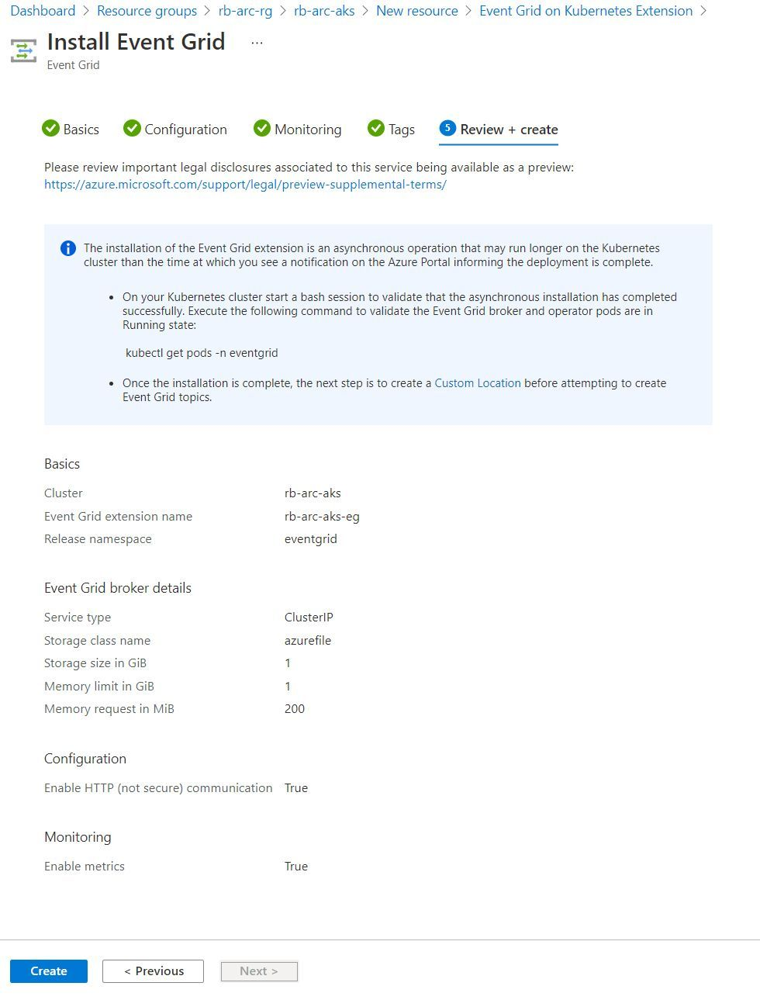
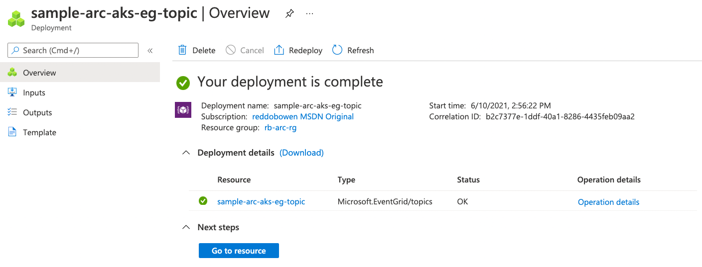
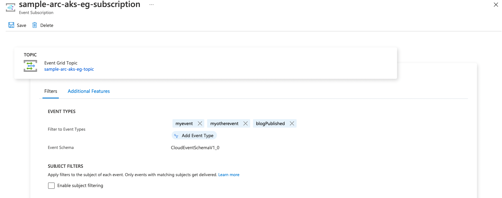
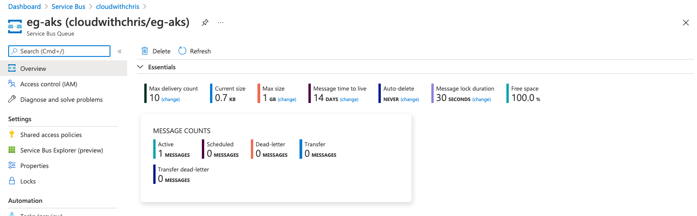

## Setting up Event Grid on Kubernetes with Azure Arc

In [part 1](/blog/azure-arc-for-apps-part-1) of this *Using Azure Arc for Apps* series, we explored Azure Arc and Azure Arc enabled Kubernetes clusters. In this post, we'll be exploring Event Grid for Kubernetes. At time of writing, this approach is in public preview, so we may see certain limitations / features that are not yet available.

> **Tip:** [Part 1](/blog/azure-arc-for-apps-part-1) is a pre-requisite to working through this blog post, if you plan to get hands on. As noted above, an Azure Arc enabled Kubernetes cluster is a pre-requisite in the scenario we're walking through.
>
> **Note:** Parts 2, 3, 4 and 5 are not pre-requisites to completing this blog post if you are following along and completing the series.

## What is Event Grid?

Before we talk about Event Grid on Kubernetes with Azure Arc, it's worth us understanding the idea behind Event Grid. Event Grid is an event broker and is commonly used to integrate different services in an event-driven architecture.

In the past, you may have had consumers of services in a loop, either polling or seeking for changes to take action. Event-driven architectures are different. Event-driven architectures (sometimes known as event-driven programming or reactive programming), allows us to react to the events as they occur. This approach can be very common in the popular microservices architecture pattern.

> **Tip:** It's important to understand the difference between a message and an event.
>
> An event is a notification of a state change. Imagine this like a broadcast saying, "Hey, I just published this new file!". You don't typically have any expectations on whether anyone is listening (or what they'll do with that information). The event will contain lightweight information about what happened.
>
> Conversely, messages contain the entire payload of information. When a message is sent, typically the publisher expects the consumer to do something with that information. For example, analysing the contents of the message and saving the analysis to an end-location.

The above definition of messages / events is important to understand. Event Grid operates using a publish / subscriber model and has no understanding of the upstream source that is generating / sending the events.

We'll be using a few terms consistently throughout this blog post -

* **Event publisher** - The entity that sends events to Event Grid
* **Event Topic** - An input channel used by an event publisher to send events to Event Grid.
* **Event subscription** - An Event Grid resource that contains settings on filtering and routing events to a destination (i.e. an event subscriber or event handler).
  * **Note:** Not all events need to be delivered to all subscribers.
* **Event subscriber** (Sometimes referred to as an **Event handler**) -  An entity that is listening to an Event Subscription for events and takes action by reacting to those events.

## Where can Events be routed (which event handlers are supported)?

The latest and greatest information will be in [The Azure Docs](https://docs.microsoft.com/en-us/azure/event-grid/kubernetes/event-handlers), so I thoroughly encourage you to go there and take a look.

At time of writing, the docs mention the following -

> Through Webhooks, Event Grid supports the following destinations hosted on a Kubernetes cluster:
>
> * Azure App Service on Kubernetes with Azure Arc.
> * Azure Functions on Kubernetes with Azure Arc.
> * Azure Logic Apps on Kubernetes with Azure Arc.
>
> In addition to Webhooks, Event Grid on Kubernetes can send events to the following destinations hosted on Azure:
>
> * Azure Event Grid using Webhooks
> * Azure Functions using Webhooks only
> * Azure Event Hubs using its Azure Resource Manager resource ID
> * Azure Service Bus topics or queues using its Azure Resource Manager resource ID
> * Azure Storage queue using its Azure Resource Manager resource ID

Once again, I encourage you to familiarise yourself with [the Azure Doc](https://docs.microsoft.com/en-us/azure/event-grid/kubernetes/event-handlers).

* If you've already used Azure Event Grid, you'll likely know that there are a couple of Event Schemas that can be used. In Event Grid for Kubernetes, only the Cloud Events 1.0 schema is supported (at time of writing).
* You may also be aware that Azure Functions has an Event Grid trigger. You cannot use this trigger an Azure Function to Event Grid for Kubernetes. Instead, you'll need to use the webhook trigger.

These are two examples where there are feature differences, though worth exploring the Azure Doc referenced above for completeness.

## Installing the Event Grid on Kubernetes extension to an Azure Arc enabled Kubernetes Cluster

If you've been following this series on Azure Arc for Apps, you'll have seen that the Azure Extensions can be installed in several ways. In this post, we'll work through the Azure Portal method. I've also included a section to the Azure Docs if you'd prefer the Azure CLI route.

### Installing the Event Grid on Kubernetes extension through the Azure Portal

Navigate to your Kubernetes - Azure Arc resource in the Azure Portal. On the left hand menu, select the Extensions (preview) item.

You should see a list of the extensions that are already installed on your cluster.

")

Click the Add button, and you'll see a list of the extensions which are available for installation.


Select the Event Grid on Kubernetes extension. You'll reach a page which looks similar to the below screenshot.


Note the following on the **Basics** tab:

* The **Project Details** section shows read-only subscription and resource group values because Azure Arc extensions are deployed under the same Azure subscription and resource group of the connected cluster on which they're installed.
* The **Event Grid extension Name** is the name of the extension as it will be installed in your Azure Arc Cluster Resource. This must be unique across all extensions in your Azure Arc enabled Kubernetes Cluster.
* The **Release namespace** is the namespace in your Azure Arc enabled Kubernetes Cluster in which you want to deploy your Event Grid resources.
* The **Service type** relates to the type of Kubernetes Service that you want to use to expose the Event Grid resources. Only ClusterIP is supported during the preview, which means we'll only be able to call that service from within the cluster, unless we expose it through an ingress point or some other means.
* The **Static IP** is used to map a custom domain for the event grid to an ingress point into the cluster. I used the Public IP address for my Azure Kubernetes Service (AKS) cluster.
* The **Storage class name** may be quite an involved explanation. But in a nutshell, this is the name of the storage class on your Kubernetes cluster that you wish to use. This will vary depending upon how you're running your cluster (e.g. Azure Kubernetes Service (AKS), Elastic Kubernetes Service (EKS), Google Kubernetes Engine (GKE) or some kind of bring your own solution). You may need to research which storage classes are available for your cluster, but this is [well-defined for AKS](https://docs.microsoft.com/en-us/azure/aks/concepts-storage#storage-classes). I'll be using ``azurefile``.
* The **Storage size in GiB** default is 1 GiB.
  * How you wish to configure this will depend. This will depend upon the number of events being ingested through Event Grid on Kubernetes, and the size of those events. This would be across all topics on the Event Grid broker. Events are transient, so once they're delivered, they do not consume any space. Also be sure to factor in any metadata associated with the events.
* The **Memory limit in GiB** default is 1 GiB.
  * This is the limit on the pod that will run. Remember that it is a recommended practice to setup Requests and Limits on your pod/deployment manifests. This limit is how much the pod will be allowed to scale up until if the space is available.
* The **Memory request** default is 200 MiB.
  * This field isn't editable. For this pod to run, Kubernetes **must** be able to allocate 200 MiB of memory.

Let's move on to the **Configuration** tab. In this section, we configure the certificates used to establish a TLS session between the Event Grid operator and an Event Grid broker. As this is a demonstration environment, I'll be ticking the box for ``Enable HTTP (not secure) communication``. However, this is something you'll want to review for a production environment.

")

Finally, the **Monitoring** tab allows you to enable collection of metrics from the dataplane. This includes items such as the number of events that have been received, delivery success count and more. I'll be keeping this flag set as enabled.

")

At this point, we've fully configured the extension. Let's review our settings and create the extension.



> **Tip:** The deployment completion notification came almost immediately for me. However, the docs and the portal note that this is an asynchronous operation, and you should check the status in kubernetes. For me, I executed ``kubectl get pods -n eventgrid --watch``


```bash
kubectl get po --watch -n eventgrid
NAME                                  READY   STATUS    RESTARTS   AGE
eventgrid-operator-7cff4cfd7f-hb9wm   0/1     Pending   0          0s
eventgrid-operator-7cff4cfd7f-hb9wm   0/1     Pending   0          0s
eventgrid-broker-f59b4d5-rmfxh        0/1     Pending   0          0s
eventgrid-broker-f59b4d5-rmfxh        0/1     Pending   0          0s
eventgrid-operator-7cff4cfd7f-hb9wm   0/1     ContainerCreating   0          0s
eventgrid-operator-7cff4cfd7f-hb9wm   1/1     Running             0          1s
eventgrid-broker-f59b4d5-rmfxh        0/1     Pending             0          2s
eventgrid-broker-f59b4d5-rmfxh        0/1     ContainerCreating   0          2s
eventgrid-broker-f59b4d5-rmfxh        1/1     Running             0          5s
```

I had also prepared the same from the deployment side, using `kubectl get deployment -n eventgrid --watch`

```bash
kubectl get deployment -n eventgrid --watch
NAME                 READY   UP-TO-DATE   AVAILABLE   AGE
eventgrid-operator   0/1     0            0           1s
eventgrid-operator   0/1     0            0           1s
eventgrid-broker     0/1     0            0           0s
eventgrid-broker     0/1     0            0           0s
eventgrid-operator   0/1     0            0           1s
eventgrid-operator   0/1     1            0           1s
eventgrid-broker     0/1     0            0           0s
eventgrid-broker     0/1     1            0           0s
eventgrid-operator   1/1     1            1           2s
eventgrid-broker     1/1     1            1           5s
```

Likewise, watching the service with `kubectl get svc -n eventgrid --watch` -

```bash
kubectl get svc -n eventgrid --watch
NAME        TYPE        CLUSTER-IP     EXTERNAL-IP   PORT(S)   AGE
eventgrid   ClusterIP   10.0.121.237   <none>        80/TCP    0s
```

Once complete, you should see the Extension Install status change from **Pending** to **Installed**.


### Installing the Event Grid on Kubernetes extension through the Azure CLI

If you prefer, there is an [alternative experience documented in the Azure Docs using the Azure CLI](https://docs.microsoft.com/en-us/azure/event-grid/kubernetes/install-k8s-extension#install-using-azure-cli).

I personally found the Portal Experience incredibly intuitive, so didn't revisit this through the Azure CLI. I'll leave this as an exercise to follow the Azure Doc above if you prefer.

## Creating a Custom Location

Whenever we create an Azure Resource, we need to specify a location. For an Event Grid on Kubernetes resource, our location will not be an Azure Region. Instead, when we create Event Grid topics/subscriptions, we'll want to create them on our Azure Arc enabled Kubernetes cluster instead of an Azure Region. We'll need to create a Custom Location (which is just another resource type) in Azure to provide Azure the ability to create resources on our cluster. This will effectively allow Azure to "route" the creation request to the appropriate location (i.e. a namespace on our cluster).

> **Tip:** Before I began writing the series, I wondered how we would approach this in a production situation, i.e. would we share the same Custom Location across different extensions.
>
> It appears as though namespace-scoped cluster extensions cannot be added to a custom location that is associated with a different namespace. The Azure portal notes that this restriction does not apply to cluster-scoped extensions. To me, this makes sense. This starts aligning us to the principal of least privilege and separation of concerns (i.e. logical separation within a Kubernetes cluster, and providing on a namespace basis. This is a concept we're familiar with in a multi-tenant Kubernetes environment). Therefore, we may want to consider separate namespaces for separate extensions.

Right then - Let's go ahead and create a custom location.

```bash
# First make sure the custom location resource provider is registered
az extension add --upgrade --yes --name customlocation
az provider register --namespace Microsoft.ExtendedLocation --wait

# In case you're following this guide separately to part 2, redefine our needed variables. Remember that we're using a different namespace.
arcClusterName="rb-arc-aks"
arcResourceGroupName="rb-arc-rg"
customLocationName="$arcClusterName-eg" # Name of the custom location
namespace="eventgrid"
extensionName="$arcClusterName-eg"

# Find the cluster ID
connectedClusterId=$(az connectedk8s show --resource-group $arcResourceGroupName --name $arcClusterName --query id --output tsv)

# Set the extension ID
extensionId=$(az k8s-extension show \
    --cluster-type connectedClusters \
    --cluster-name $arcClusterName \
    --resource-group $arcResourceGroupName \
    --name $extensionName \
    --query id \
    --output tsv)

# Now create a custom location based upon that information
az customlocation create \
    --resource-group $arcResourceGroupName \
    --name $customLocationName \
    --host-resource-id $connectedClusterId \
    --namespace $namespace \
    --cluster-extension-ids $extensionId

# You should be able to see that the resource is successfully created.
customLocationId=$(az customlocation show \
    --resource-group $arcResourceGroupName \
    --name $customLocationName \
    --query id \
    --output tsv)
```

Excellent. At this point, we have bound the Custom Location resource to the Azure Arc extension that we created through the portal. We've also bound it to a namespace in our Kubernetes Cluster, where we want the Event Grid resources to be deployed. With that in place, we can now go ahead and create an Event Grid Topic hosted on our Azure Arc enabled Kubernetes cluster!

## Creating an Event Grid Topic on Event Grid for Kubernetes in our Azure Arc Enabled Kubernetes Cluster

We have several options to create our Event Grid Topic. We'll review the Azure Portal and the Azure CLI.

### Creating an Event Grid Topic through the Azure Portal

We'll navigate to the Azure Portal and create a new Event Grid Topic. Give your Event Grid topic a name, and select a region. Notice that the Custom Location that you created in the previous step is now available as an option.


Click Next to move on to the **Advanced** tab. Notice that the **Events Schema** and **Enable system assigned identity** options are both disabled.

> **Tip:** As noted earlier, **Cloud Event Schema v1.0** is the only supported Event Schema in Event Grid for Kubernetes. Likewise, system assigned identities are not supported in Event Grid for Kubernetes at this time.


With that, feel free to go ahead and assign Azure Resource Tags to your Event Grid Topic, and proceed to the Review + create tab. After a few moments, you should find that your deployment has completed successfully.



> **Note:** You eagle-eyed readers may have noticed that the Resource Group that I'm using changed in the above screenshot. I had to tear down my cluster for some customer-facing demos, which meant that I needed to restart from scratch. I wanted to call this out to avoid any confusion!

### Creating an Event Grid Topic through the Azure CLI

Unsurprisingly, the Azure CLI route requires you to submit a similar set of information.

Pay particular attention to the fact that we still specify a location for the Azure Resource. We pass in a reference to the Custom Location through the extended-location-name property.

```bash
az eventgrid topic create --name rb-arc-aks-sample-topic \
    --resource-group $arcResourceGroupName \
    --location "westeurope" \
    --kind azurearc \
    --extended-location-name /subscriptions/0d9fd97f-71f6-4b7b-adbb-3a654846e587/resourceGroups/rb-arc-rg/providers/Microsoft.ExtendedLocation/customLocations/rb-arc-eg \
    --extended-location-type customLocation \
    --input-schema CloudEventSchemaV1_0

Finished ..
{
  "endpoint": "http://eventgrid.eventgrid-system:80/topics/rb-arc-aks-sample-topic/api/events?api-version=2018-01-01",
  "extendedLocation": {
    "name": "/subscriptions/0d9fd97f-71f6-4b7b-adbb-3a654846e587/resourceGroups/rb-arc-rg/providers/Microsoft.ExtendedLocation/customLocations/rb-arc-eg",
    "type": "customLocation"
  },
  "id": "/subscriptions/0d9fd97f-71f6-4b7b-adbb-3a654846e587/resourceGroups/rb-arc-rg/providers/Microsoft.EventGrid/topics/rb-arc-aks-sample-topic",
  "identity": null,
  "inboundIpRules": null,
  "inputSchema": "CloudEventSchemaV1_0",
  "inputSchemaMapping": null,
  "kind": "AzureArc",
  "location": "westeurope",
  "metricResourceId": null,
  "name": "rb-arc-aks-sample-topic",
  "privateEndpointConnections": null,
  "provisioningState": "Succeeded",
  "publicNetworkAccess": "Enabled",
  "resourceGroup": "rb-arc-rg",
  "sku": {
    "name": "Basic"
  },
  "systemData": null,
  "tags": {
    "environment": "dev"
  },
  "type": "Microsoft.EventGrid/topics"
}
```

## We created an Event Grid Topic. But what was created on the Kubernetes Cluster?

First, let's take a look at all of the Kubernetes objects that are located in our eventgrid-system namespace on the Azure Arc enabled Kubernetes cluster.

```bash
kubectl get all -n eventgrid-system
NAME                                      READY   STATUS    RESTARTS   AGE
pod/eventgrid-broker-6fff87f477-cdktx     1/1     Running   0          5h56m
pod/eventgrid-operator-6c4c6c675d-557lp   1/1     Running   0          5h56m

NAME                TYPE        CLUSTER-IP    EXTERNAL-IP   PORT(S)   AGE
service/eventgrid   ClusterIP   10.0.64.179   <none>        80/TCP    5h56m

NAME                                 READY   UP-TO-DATE   AVAILABLE   AGE
deployment.apps/eventgrid-broker     1/1     1            1           5h56m
deployment.apps/eventgrid-operator   1/1     1            1           5h56m

NAME                                            DESIRED   CURRENT   READY   AGE
replicaset.apps/eventgrid-broker-6fff87f477     1         1         1       5h56m
replicaset.apps/eventgrid-operator-6c4c6c675d   1         1         1       5h56m
```

These resources were all installed on the Kubernetes cluster when we installed the Azure Arc extension. So, what actually happened when we created the Event Grid Topic resource? Let's do a bit more digging.

Next up, let's explore the Custom Resource Definitions that are available in our Kubernetes cluster.

```bash
kubectl get crd
NAME                                                   CREATED AT
approutes.k8se.microsoft.com                           2021-06-10T13:13:06Z
apps.k8se.microsoft.com                                2021-06-10T13:13:06Z
azureclusteridentityrequests.clusterconfig.azure.com   2021-06-10T13:02:55Z
azureextensionidentities.clusterconfig.azure.com       2021-06-10T13:02:55Z
bgpconfigurations.crd.projectcalico.org                2021-06-10T12:41:00Z
bgppeers.crd.projectcalico.org                         2021-06-10T12:41:00Z
blockaffinities.crd.projectcalico.org                  2021-06-10T12:41:00Z
clusterinformations.crd.projectcalico.org              2021-06-10T12:41:00Z
clustertriggerauthentications.keda.sh                  2021-06-10T13:13:07Z
components.dapr.io                                     2021-06-10T13:13:06Z
configurations.dapr.io                                 2021-06-10T13:13:06Z
connectedclusters.arc.azure.com                        2021-06-10T13:02:55Z
customlocationsettings.clusterconfig.azure.com         2021-06-10T13:02:55Z
eventsubscriptions.eventgrid.microsoft.com             2021-06-10T13:51:11Z
extensionconfigs.clusterconfig.azure.com               2021-06-10T13:02:55Z
felixconfigurations.crd.projectcalico.org              2021-06-10T12:41:00Z
gitconfigs.clusterconfig.azure.com                     2021-06-10T13:02:55Z
globalnetworkpolicies.crd.projectcalico.org            2021-06-10T12:41:00Z
globalnetworksets.crd.projectcalico.org                2021-06-10T12:41:00Z
healthstates.azmon.container.insights                  2021-06-10T12:40:58Z
hostendpoints.crd.projectcalico.org                    2021-06-10T12:41:00Z
imagesets.operator.tigera.io                           2021-06-10T12:41:00Z
installations.operator.tigera.io                       2021-06-10T12:41:00Z
ipamblocks.crd.projectcalico.org                       2021-06-10T12:41:00Z
ipamconfigs.crd.projectcalico.org                      2021-06-10T12:41:00Z
ipamhandles.crd.projectcalico.org                      2021-06-10T12:41:00Z
ippools.crd.projectcalico.org                          2021-06-10T12:41:00Z
kubecontrollersconfigurations.crd.projectcalico.org    2021-06-10T12:41:00Z
networkpolicies.crd.projectcalico.org                  2021-06-10T12:41:00Z
networksets.crd.projectcalico.org                      2021-06-10T12:41:00Z
placeholdertemplates.k8se.microsoft.com                2021-06-10T13:13:07Z
scaledjobs.keda.sh                                     2021-06-10T13:13:07Z
scaledobjects.keda.sh                                  2021-06-10T13:13:07Z
subscriptions.dapr.io                                  2021-06-10T13:13:06Z
tigerastatuses.operator.tigera.io                      2021-06-10T12:41:00Z
topics.eventgrid.microsoft.com                         2021-06-10T13:51:11Z
triggerauthentications.keda.sh                         2021-06-10T13:13:07Z
virtualapps.k8se.microsoft.com                         2021-06-10T13:13:07Z
volumesnapshotclasses.snapshot.storage.k8s.io          2021-06-10T12:40:58Z
volumesnapshotcontents.snapshot.storage.k8s.io         2021-06-10T12:40:58Z
volumesnapshots.snapshot.storage.k8s.io                2021-06-10T12:40:58Z
workerapps.k8se.microsoft.com                          2021-06-10T13:13:07Z
```

Right, now we can see a few Custom Resource Definitions of interest:

* ``eventsubscriptions.eventgrid.microsoft.com``
* ``topics.eventgrid.microsoft.com``

We'll continue using ``kubectl`` to explore these objects. As we created an Event Grid Topic, let's take a look at what objects are available on the Kubernetes cluster. We can do this by running ``kubectl get topics.eventgrid.microsoft.com --all-namespaces``.

> **Tip:** I'm showcasing the steps that I used while I was exploring the cluster. I used the ``--all-namespaces`` flag, to determine whether resources may have been created elsewhere. Unsurprisingly, they were created in the eventgrid namespace.
>
> Why ``eventgrid``? That's the namespace that we mapped to in our Custom Location. The ``eventgrid-system`` namespace is what we mapped the Event Grid for Kubernetes Azure Arc extension to. I suspect we could install these all in the same namespace if we preferred. However, we may want to consider separation of roles (i.e. Cluster Operator who installs the Azure Arc extension and operates the underlying deployment), as opposed to application developers who leverage the Event Grid Topics / Subscriptions within their applications.

```bash
kubectl get topics.eventgrid.microsoft.com --all-namespaces

NAMESPACE   NAME                      TOPICENDPOINT                                                                                           PROVISIONINGSTATE   FAILUREREASON   OPERATIONID
eventgrid   sample-arc-aks-eg-topic   http://eventgrid.eventgrid-system:80/topics/sample-arc-aks-eg-topic/api/events?api-version=2018-01-01   Succeeded                           109A0C70-B159-4202-BF8E-2451025CC320
```

And for completeness, let's inspect that resource. We can use the command ``kubectl describe topics.eventgrid.microsoft.com sample-arc-aks-eg-topic -n eventgrid``. Of course, replace the name of the Event Grid Topic and your Kubernetes namespace as appropriate.

```bash
kubectl describe topics.eventgrid.microsoft.com sample-arc-aks-eg-topic -n eventgrid
Name:         sample-arc-aks-eg-topic
Namespace:    eventgrid
Labels:       <none>
Annotations:  eventgrid.microsoft.com/activityId: b1e10d5f-5358-4952-9ad5-cabd775c992e
              eventgrid.microsoft.com/operationId: 109A0C70-B159-4202-BF8E-2451025CC320
API Version:  eventgrid.microsoft.com/v1alpha1
Kind:         Topic
Metadata:
  Creation Timestamp:  2021-06-10T13:56:28Z
  Generation:          1
  Managed Fields:
    API Version:  eventgrid.microsoft.com/v1alpha1
    Fields Type:  FieldsV1
    fieldsV1:
      f:metadata:
        f:annotations:
          .:
          f:eventgrid.microsoft.com/activityId:
          f:eventgrid.microsoft.com/operationId:
      f:spec:
        .:
        f:properties:
          .:
          f:inputSchema:
          f:sasKeysSecretName:
    Manager:      unknown
    Operation:    Update
    Time:         2021-06-10T13:56:28Z
    API Version:  eventgrid.microsoft.com/v1alpha1
    Fields Type:  FieldsV1
    fieldsV1:
      f:status:
        .:
        f:endpoint:
        f:operationId:
        f:provisioningState:
    Manager:         manager
    Operation:       Update
    Time:            2021-06-10T13:56:29Z
  Resource Version:  26983
  UID:               3ece6103-c1fe-4844-86f4-2301e644bd1a
Spec:
  Properties:
    Input Schema:          CloudEventSchemaV1_0
    Sas Keys Secret Name:  sample-arc-aks-eg-topic
Status:
  Endpoint:            http://eventgrid.eventgrid-system:80/topics/sample-arc-aks-eg-topic/api/events?api-version=2018-01-01
  Operation Id:        109A0C70-B159-4202-BF8E-2451025CC320
  Provisioning State:  Succeeded
Events:                <none>
```

That all seems to make sense so far. We've created an Event Grid Topic, and have been able to find the URL that we'll need to call. Note that the endpoint is an internal DNS (``eventgrid.eventgrid-system:80...``). Let's remember that for later, as we'll need to make a call to the Topic Endpoint from inside the cluster.

## Create an Event Grid Subscription

We have an Event Grid Topic created. Now, to route those events to Event Handlers, we need to create an Event Grid Subscription.

> **Tip:** Remember that the Event Grid Subscription contains settings on filtering and routing events to a destination (i.e. an event subscriber or event handler).
>
> This is effectively how we can configure Event Grid to 'listen' for specific events and route them in a given direction.

Let's navigate to the Event Grid Topic that we created, and click subscriptions. From there, we can create a new Event Subscription.


You'll notice we have several configuration options including:

* **Name:** Name of the Event Subscription
* **Event Schema:** This option is disabled, and is pre-selected to the Cloud Event Schema v1.0.
* **Topic Details:** This information is pre-configured, as we have created the Event Subscription within an Event Grid Topic.
* **Event Types:** Remember that we need to specify which events this subscription is interested in. Effectively, a way for us to filter out events that we don't care about. Events that match our interests will be routed to our **Event Handler**.

Speaking of which, let's recap on the Event Handler:

> **Tip:** We sometimes refer to an Event Handler as an Event subscriber. This is an entity that is listening to an Event Subscription (the resource we're in the middle of configuring!) for events and takes action by reacting to those events.

Below, you can see that we can send our Events to a ``Web Hook``, ``Storage Queue``, ``Event Hub``, ``Service Bus Queue`` and ``Service Bus Topic``.

> **Note:** If you've used Azure Event Grid, you may be aware of additional Event Handlers including Azure Automation, Azure Functions, Relay Hybrid Connections, Logic Apps and Power Automate. These are unsupported.
>
> **However**, it is possible to route to Azure App Service, Azure Functions or Azure Logic Apps that are hosted on an Azure Arc Enabled Kubernetes cluster. This can be achieved by using the **Webhooks**.


As an aside, I have a Service Bus Namespace that I'm using as part of a broader Cloud with Chris integration platform. I decided to create a Service Bus Queue in that Service Bus Namespace to act as the Event Handler for this writeup.


After selecting Service Bus Queue from the Endpoint Details dropdown list, we'll be guided to select an endpoint. A blade will pop out and guide you to select the appropriate ``Subscription``, ``Resource Group``, ``Service Bus Namespace`` and ``Service Bus Queue`` that you plan to route to.

> **Tip:** You don't have to use a Service Bus Queue if you're following along. This just happens to be a resource I had to hand for the purposes of the write-up. Feel free to choose something else. The [Azure Docs showcase a Webhook example](https://docs.microsoft.com/en-us/azure/event-grid/kubernetes/create-topic-subscription) if you prefer.


After confirming the Event Handler of choice, we'll proceed to create the Event Subscription. That means we'll leave the **Filters** and **Additional Features** tabs as their default options.

So, what happens once we hit create? You've guessed it. It's time to get back to Kubernetes and inspect what's going on! Let's first use ``kubectl get eventsubscriptions.eventgrid.microsoft.com`` to list out the resources that exist. Don't forget to specify a namespace or use the ``--all-namespaces`` flag.

```bash
kubectl get eventsubscriptions.eventgrid.microsoft.com --all-namespaces
NAMESPACE   NAME                             PROVISIONINGSTATE   FAILUREREASON   OPERATIONID
eventgrid   sample-arc-aks-eg-subscription   Succeeded                           568FB02F-7BC5-4002-85BA-506378CB59AF
```

Now, let's go ahead and describe that resource.

```bash
kubectl describe eventsubscriptions.eventgrid.microsoft.com sample-arc-aks-eg-subscription -n eventgrid
Name:         sample-arc-aks-eg-subscription
Namespace:    eventgrid
Labels:       eventgrid.microsoft.com/Topic=sample-arc-aks-eg-topic
Annotations:  eventgrid.microsoft.com/activityId: 85e44ef7-e688-4545-9127-0e42fbcaeb29
              eventgrid.microsoft.com/operationId: FE5AB17C-AE80-412D-9E7D-E0AB9208106E
API Version:  eventgrid.microsoft.com/v1alpha1
Kind:         EventSubscription
Metadata:
  Creation Timestamp:  2021-06-10T14:15:07Z
  Finalizers:
    eventsubscription.finalizer
  Generation:  4
  Managed Fields:
    API Version:  eventgrid.microsoft.com/v1alpha1
    Fields Type:  FieldsV1
    fieldsV1:
      f:metadata:
        f:finalizers:
          .:
          v:"eventsubscription.finalizer":
        f:labels:
          .:
          f:eventgrid.microsoft.com/Topic:
        f:ownerReferences:
          .:
          k:{"uid":"3ece6103-c1fe-4844-86f4-2301e644bd1a"}:
            .:
            f:apiVersion:
            f:kind:
            f:name:
            f:uid:
      f:spec:
        f:properties:
          f:persistencePolicy:
      f:status:
        .:
        f:operationId:
        f:provisioningState:
    Manager:      manager
    Operation:    Update
    Time:         2021-06-10T14:30:49Z
    API Version:  eventgrid.microsoft.com/v1alpha1
    Fields Type:  FieldsV1
    fieldsV1:
      f:metadata:
        f:annotations:
          .:
          f:eventgrid.microsoft.com/activityId:
          f:eventgrid.microsoft.com/operationId:
      f:spec:
        .:
        f:properties:
          .:
          f:destination:
            .:
            f:endpointType:
            f:properties:
              .:
              f:connectionString:
          f:eventDeliverySchema:
          f:filter:
            .:
            f:includedEventTypes:
            f:isSubjectCaseSensitive:
          f:retryPolicy:
            .:
            f:eventExpiryInMinutes:
            f:maxDeliveryAttempts:
          f:topic:
    Manager:    unknown
    Operation:  Update
    Time:       2021-06-10T14:30:49Z
  Owner References:
    API Version:     eventgrid.microsoft.com/v1alpha1
    Kind:            Topic
    Name:            sample-arc-aks-eg-topic
    UID:             3ece6103-c1fe-4844-86f4-2301e644bd1a
  Resource Version:  37787
  UID:               ed3baa7c-2530-4b54-a7a0-f1e37e106f4d
Spec:
  Properties:
    Destination:
      Endpoint Type:  ServiceBusQueue
      Properties:
        Connection String:  **Obfuscated**
    Event Delivery Schema:  CloudEventSchemaV1_0
    Filter:
      Included Event Types:
        myevent
        myotherevent
      Is Subject Case Sensitive:  false
    Persistence Policy:
    Retry Policy:
      Event Expiry In Minutes:  1440
      Max Delivery Attempts:    30
    Topic:                      sample-arc-aks-eg-topic
Status:
  Operation Id:        FE5AB17C-AE80-412D-9E7D-E0AB9208106E
  Provisioning State:  Succeeded
Events:                <none>
```

Ok, that looks good! I've obfuscated the Connection String from the above output (for obvious reasons)! Notice that it also contains the Event Types that we're looking for - ``myevent`` and ``myotherevent``. That means, if an event doesn't match that, then the Event Handler (the Service Bus Queue) shouldn't receive it.


Let's take stock. We have an Event Grid Topic. We also have an Event Grid Subscription which is filtering on events with the event type ``myevent`` or ``myotherevent`` coming from that topic. The Event Handler configured against our subscription is a Service Bus Queue.

Sounds like there's only one thing to do now. We need to send some events.

## Sending events to Event Grid

In this next section, we'll be sending an event to the Event Grid on Kubernetes Topic Endpoint. Keep in mind that this endpoint is private, so we'll need to make a request to the endpoint within the cluster. More on that later!

First, there are a couple of items that we'll need to make the call. First, the Event Grid Topic Endpoint. You eagle eyed viewers may have spotted this in one of the Kubernetes outputs further up in this post. However, there's a useful command that we can use - ``az eventgrid topic show --name <name> -g <resourcegroup> --query "endpoint" --output tsv``.

```bash
az eventgrid topic show --name sample-arc-aks-eg-topic -g rb-arc-rg --query "endpoint" --output tsv
http://eventgrid.eventgrid-system:80/topics/sample-arc-aks-eg-topic/api/events?api-version=2018-01-01
```

We also need an access key to send to the Event Grid Topic. This is accessible through the ``az eventgrid topic key list`` Azure CLI command. You can find an example below.

```bash
az eventgrid topic key list --name sample-arc-aks-eg-topic -g rb-arc-rg --query "key1" --output tsv
**The output would be displayed here, but removed for obvious reasons :)**
```

At this point, we have the information needed to make a request to the Event Grid Topic. We can create a **curl** container in the Kubernetes cluster and use that to make a request to the local endpoint. You can likely guess what tool the [curl container image](https://hub.docker.com/r/curlimages/curl) contains!

```bash
kubectl run curl --image=curlimages/curl --restart=Never -it --rm -- /bin/sh

curl  -k -X POST -H "Content-Type: application/cloudevents-batch+json" -H "aeg-sas-key: <EnterYourKey>" -g <EnterYourURL> \
-d  '[{ 
      "specversion": "1.0",
      "type": "blogPublished",
      "source": "CloudWithChris/content",
      "id": "eventId-n",
      "time": "2020-12-25T20:54:07+00:00",
      "subject": "blog/azure-arc-for-apps-part-6",
      "dataSchema": "1.0",
      "data" : {
         "mediumUrl": "https://cloudwithchris.medium.com",
         "devtoUrl": "https://dev.to/cloudwithchris"
      }
}]'
```

You can of course adjust the JSON to suit your own example! But notice an interesting point about the event I'm emitting. It has the type ``blogPublished``. That is not one of the types that the Event Subscription was filtering on.

As expected, the Service Bus Queue remains at zero messages.


Let's fix that, we'll go ahead and update the Event Grid Subscription using the Azure Portal. We'll add the ``blogPublished`` type to the Filter to Event Types property and save the resource.



We'll once again use a container based upon the ``curlimages/curl`` container image to send a request to the local Event Grid Topic Endpoint.

```bash
kubectl run curl --image=curlimages/curl --restart=Never -it --rm -- /bin/sh

curl  -k -X POST -H "Content-Type: application/cloudevents-batch+json" -H "aeg-sas-key: <EnterYourKey>" -g <EnterYourURL> \
-d  '[{ 
      "specversion": "1.0",
      "type": "blogPublished",
      "source": "CloudWithChris/content",
      "id": "eventId-n",
      "time": "2020-12-25T20:54:07+00:00",
      "subject": "blog/azure-arc-for-apps-part-6",
      "dataSchema": "1.0",
      "data" : {
         "mediumUrl": "https://cloudwithchris.medium.com",
         "devtoUrl": "https://dev.to/cloudwithchris"
      }
}]'
```

Great, the event sent once again. Let's see if the subscription picked up the event this time. We'll go ahead and take a look at the Service Bus Queue.



Excellent! If you're following along, you should hopefully see that 1 message is now showing as Active on the queue - just like the screenshot above.

We can go ahead to the **Service Bus Explorer** menu item and peek the message on the queue.

```json
{ 
      "specversion": "1.0",
      "type": "blogPublished",
      "source": "CloudWithChris/content",
      "id": "eventId-n",
      "time": "2020-12-25T20:54:07+00:00",
      "subject": "blog/azure-arc-for-apps-part-6",
      "dataSchema": "1.0",
      "data" : {
         "mediumUrl": "https://cloudwithchris.medium.com",
         "devtoUrl": "https://dev.to/cloudwithchris"
      }
}
```

You'll notice that the message contents are exactly the same as the event that we had emitted. I haven't configured any consumers of the Service Bus Queue, so we'll expect the message to stay until it reaches it's Ttl (assuming that no consumers try to receive the message).


As a sanity check, let's once again use the ``kubectl describe`` command to describe the eventsubscription that we updated. Notice that the Included Event Types Filter is now updated to include the ``blogPublished`` event type that we added in the portal earlier.

```bash
kubectl describe eventsubscriptions.eventgrid.microsoft.com sample-arc-aks-eg-subscription -n eventgrid
Name:         sample-arc-aks-eg-subscription
Namespace:    eventgrid
Labels:       eventgrid.microsoft.com/Topic=sample-arc-aks-eg-topic
Annotations:  eventgrid.microsoft.com/activityId: 85e44ef7-e688-4545-9127-0e42fbcaeb29
              eventgrid.microsoft.com/operationId: FE5AB17C-AE80-412D-9E7D-E0AB9208106E
API Version:  eventgrid.microsoft.com/v1alpha1
Kind:         EventSubscription
Metadata:
  Creation Timestamp:  2021-06-10T14:15:07Z
  Finalizers:
    eventsubscription.finalizer
  Generation:  4
  Managed Fields:
    API Version:  eventgrid.microsoft.com/v1alpha1
    Fields Type:  FieldsV1
    fieldsV1:
      f:metadata:
        f:finalizers:
          .:
          v:"eventsubscription.finalizer":
        f:labels:
          .:
          f:eventgrid.microsoft.com/Topic:
        f:ownerReferences:
          .:
          k:{"uid":"3ece6103-c1fe-4844-86f4-2301e644bd1a"}:
            .:
            f:apiVersion:
            f:kind:
            f:name:
            f:uid:
      f:spec:
        f:properties:
          f:persistencePolicy:
      f:status:
        .:
        f:operationId:
        f:provisioningState:
    Manager:      manager
    Operation:    Update
    Time:         2021-06-10T14:30:49Z
    API Version:  eventgrid.microsoft.com/v1alpha1
    Fields Type:  FieldsV1
    fieldsV1:
      f:metadata:
        f:annotations:
          .:
          f:eventgrid.microsoft.com/activityId:
          f:eventgrid.microsoft.com/operationId:
      f:spec:
        .:
        f:properties:
          .:
          f:destination:
            .:
            f:endpointType:
            f:properties:
              .:
              f:connectionString:
          f:eventDeliverySchema:
          f:filter:
            .:
            f:includedEventTypes:
            f:isSubjectCaseSensitive:
          f:retryPolicy:
            .:
            f:eventExpiryInMinutes:
            f:maxDeliveryAttempts:
          f:topic:
    Manager:    unknown
    Operation:  Update
    Time:       2021-06-10T14:30:49Z
  Owner References:
    API Version:     eventgrid.microsoft.com/v1alpha1
    Kind:            Topic
    Name:            sample-arc-aks-eg-topic
    UID:             3ece6103-c1fe-4844-86f4-2301e644bd1a
  Resource Version:  37787
  UID:               ed3baa7c-2530-4b54-a7a0-f1e37e106f4d
Spec:
  Properties:
    Destination:
      Endpoint Type:  ServiceBusQueue
      Properties:
        Connection String:  **Obfuscated**
    Event Delivery Schema:  CloudEventSchemaV1_0
    Filter:
      Included Event Types:
        myevent
        myotherevent
        blogPublished
      Is Subject Case Sensitive:  false
    Persistence Policy:
    Retry Policy:
      Event Expiry In Minutes:  1440
      Max Delivery Attempts:    30
    Topic:                      sample-arc-aks-eg-topic
Status:
  Operation Id:        FE5AB17C-AE80-412D-9E7D-E0AB9208106E
  Provisioning State:  Succeeded
Events:                <none>
```

## What's going on behind the scenes?

For your readers that are familiar with Kubernetes, you may have noticed that there are no other resources in the ``eventgrid`` namespace. Only the ``topics.eventgrid.microsoft.com`` object representing an Event Grid Topic and the ``eventsubscriptions.eventgrid.microsoft.com`` object representing an Event Subscription.

At this point, I began snooping around the ``eventgrid-system`` namespace to understand what the Event Grid System resources may be doing in this scenario.

First, I used ``kubectl logs`` to attempt to gain insights into what's going on.

```bash
kubectl logs eventgrid-broker-6fff87f477-cdktx -n eventgrid-system
2021-06-10 13:51:53.087+00:00:[INF] - [EventGridCoreHost:.ctor@55] 
****************************************************************************************************************************
|  _______                                   __________                      _____       _________        _____ _________  |
|  ___    |__________  _______________       ___  ____/___   _______ _______ __  /_      __  ____/___________(_)______  /  |
|  __  /| |___  /_  / / /__  ___/_  _ \      __  __/   __ | / /_  _ \__  __ \_  __/      _  / __  __  ___/__  / _  __  /   |
|  _  ___ |__  /_/ /_/ / _  /    /  __/      _  /___   __ |/ / /  __/_  / / // /_        / /_/ /  _  /    _  /  / /_/ /    |
|  /_/  |_|_____/\__,_/  /_/     \___/       /_____/   _____/  \___/ /_/ /_/ \__/        \____/   /_/     /_/   \__,_/     |
|                                                                                                                          |
****************************************************************************************************************************
2021-06-10 13:51:53.430+00:00:[INF] - [BaseEnvironment:SetupInboundServerAuthAsync@109] Starting. inbound:serverAuth={
  "tlsPolicy": "Disabled",
  "serverCert": {
    "source": "File",
    "certFile": "",
    "keyFile": "",
    "caFile": ""
  }
}
2021-06-10 13:51:53.430+00:00:[INF] - [BaseEnvironment:SetupInboundServerAuthAsync@114] Completed. inbound:serverAuth:tlsPolicy=disabled, nothing more to do.
2021-06-10 13:51:53.435+00:00:[INF] - [BaseEnvironment:SetupInboundClientAuthAsync@186] Starting. inbound:clientAuth={
  "sasKeys": {
    "enabled": false,
    "key1": "<redacted>",
    "key2": "<redacted>"
  },
  "clientCert": {
    "enabled": false,
    "source": "File",
    "caFile": "",
    "allowUnknownCA": false
  }
}
2021-06-10 13:51:53.435+00:00:[INF] - [BaseEnvironment:SetupInboundClientAuthAsync@204] Completed. inbound:clientAuth:clientCert:enabled=false, nothing more to do.
2021-06-10 13:51:53.437+00:00:[INF] - [BaseEnvironment:SetupOutboundClientAuthAsync@246] Starting. outbound:clientAuth={
  "clientCert": {
    "enabled": false,
    "source": "File",
    "allowUnknownCA": false
  }
}
2021-06-10 13:51:53.437+00:00:[INF] - [BaseEnvironment:SetupOutboundClientAuthAsync@251] Completed. outbound:clientAuth:clientCert:enabled=false, nothing more to do.
2021-06-10 13:51:53.439+00:00:[INF] - [BaseEnvironment:SetupOutboundDestinationConfiguration@274] outbound:webhook={
  "httpsOnly": false,
  "skipServerCertValidation": false,
  "allowUnknownCA": false,
  "skipEventGridUrlValidation": true
}
2021-06-10 13:51:53.440+00:00:[INF] - [BaseEnvironment:SetupOutboundDestinationConfiguration@275] outbound:eventgrid={
  "httpsOnly": false,
  "allowInvalidHostnames": true
}
2021-06-10 13:51:53.451+00:00:[INF] - [Metric:Initialize@43] MetricOptions: {
  "reporterType": "Prometheus",
  "reportingIntervalInSeconds": 60,
  "context": "",
  "telegraf": {
    "telegrafUdpAddress": "",
    "telegrafUdpPort": 0,
    "failuresBeforeBackoff": 5,
    "timeoutInSeconds": 30,
    "backoffPeriodInSeconds": 5
  },
  "prometheus": {
    "environmentInfoEndpointEnabled": false,
    "metricsEndpointEnabled": true,
    "metricsTextEndpointEnabled": false
  },
  "azureMonitor": {
    "instrumentationKey": ""
  }
}
2021-06-10 13:51:55.224+00:00:[INF] - [RocksDbFactory:GetOrCreateRocksDbInstance@44] Opened rocksDB database at path 'metadataDb/' with columnFamilies 'default'.
2021-06-10 13:51:55.986+00:00:[INF] - [ApiBuilder:GetHostBuilder@47] ApiOptions: {
  "maxTopicNameLength": 128,
  "maxContentLengthInBytes": 1058576,
  "logLevel": "Information",
  "requestTimeoutInSeconds": 30,
  "httpPort": 5888,
  "httpsPort": 4438,
  "retryPolicyLimits": {
    "minExpirationTimeInMinutes": 1,
    "maxExpirationTimeInMinutes": 1440,
    "maxDeliveryAttempts": 30
  },
  "deliveryPolicyLimits": {
    "maxPreferredBatchSizeInKilobytes": 1033,
    "maxEventsPerBatch": 50
  },
  "health": {
    "httpProbe": {
      "enabled": true
    }
  }
}
2021-06-10 13:51:55.986+00:00:[INF] - [ApiBuilder:GetHostBuilder@50] KestrelUrls: http://*:5888
2021-06-10 13:51:56.005+00:00:[INF] - [EventGridBrokerBuilder:Build@81] BrokerOptions: {
  "startTimeoutInSeconds": 120,
  "stopTimeoutInSeconds": 120,
  "maxReadBatchSize": 200,
  "maxConcurrentDeliveries": 100,
  "logLevel": "Information",
  "logDeliverySuccess": false,
  "logDeliveryFailure": true,
  "logEventExpiry": true,
  "deliverTimeoutInSeconds": 60,
  "defaultMaxDeliveryAttempts": 30,
  "defaultEventTimeToLiveInSeconds": 7200,
  "defaultMaxBatchSizeInBytes": 1058576,
  "defaultMaxEventsPerBatch": 10,
  "maxSubscriptionCacheStalenessInSeconds": 3,
  "backoffIntervals": [
    "00:01:00",
    "00:10:00"
  ],
  "defaultIsPersisted": true,
  "backoffIsPersisted": true,
  "commitDelayInMs": 1,
  "stopDispatchers": false
}
2021-06-10 13:51:56.131+00:00:[INF] - [FasterEventLogFactory:.ctor@40] FasterOptions: {
  "eventLogBasePath": "eventsDb",
  "pageSizeBits": 22,
  "memorySizeBits": 25,
  "segmentSizeBits": 26,
  "enablePerEntryChecksums": true,
  "disposalDelayInSeconds": 60,
  "pendingCheckpointMaxCount": 131072,
  "maxInflightWrites": 0,
  "checkpointCoalesceWaitIntervalInMilliseconds": 100
}
2021-06-10 13:51:56.243+00:00:[INF] - [EventGridDesiredConfigProcessor:GetDesiredConfigAsync@32] GetDesiredConfigAsync check if there's any default configuration specified.
2021-06-10 13:51:56.244+00:00:[INF] - [EventGridDesiredConfigProcessor:ReadConfigFromEnvVar@64] ReadConfigFromEnvVar checking if configuration specified in environment variable desired_config.
2021-06-10 13:51:56.244+00:00:[INF] - [EventGridDesiredConfigProcessor:ReadConfigFromEnvVar@69] ReadConfigFromEnvVar no configuration specified in environment variable desired_config.
2021-06-10 13:51:56.245+00:00:[INF] - [EventGridDesiredConfigProcessor:ReadConfigFromFileAsync@87] ReadConfigFromFileAsync checking if configuration specified in environment variable desired_config_file.
2021-06-10 13:51:56.245+00:00:[INF] - [EventGridDesiredConfigProcessor:ReadConfigFromFileAsync@92] ReadConfigFromFileAsync no file specified in environment variable desired_config_file.
2021-06-10 13:51:56.249+00:00:[INF] - [EventGridBroker:Broker:OpenAsync:Starting] 
2021-06-10 13:51:56.260+00:00:[INF] - [ServiceObjectManager(EventGridBroker):Broker:OpenAsync:Starting] 
2021-06-10 13:51:56.264+00:00:[INF] - [MetadataCache:Broker:OpenAsync:Starting] 
2021-06-10 13:51:56.269+00:00:[INF] - [EventLogManager:Broker:OpenAsync:Starting] 
2021-06-10 13:51:56.269+00:00:[INF] - [SharedBackoffManager:Broker:OpenAsync:Starting] 
2021-06-10 13:51:56.339+00:00:[INF] - [FasterEventLogFactory:Faster:CreateAsync:Succeeded] Created event log with id=__BACKOFF_1_1MINS metadata={"EventLogBasePath":"eventsDb","PageSizeBits":22,"MemorySizeBits":25,"SegmentSizeBits":26,"EnablePerEntryChecksums":true,"DisposalDelayInSeconds":60,"PendingCheckpointMaxCount":131072,"MaxInflightWrites":0,"CheckpointCoalesceWaitIntervalInMilliseconds":100}.
2021-06-10 13:51:56.350+00:00:[INF] - [FasterEventLogFactory:Faster:CreateAsync:Succeeded] Created event log with id=__BACKOFF_2_10MINS metadata={"EventLogBasePath":"eventsDb","PageSizeBits":22,"MemorySizeBits":25,"SegmentSizeBits":26,"EnablePerEntryChecksums":true,"DisposalDelayInSeconds":60,"PendingCheckpointMaxCount":131072,"MaxInflightWrites":0,"CheckpointCoalesceWaitIntervalInMilliseconds":100}.
2021-06-10 13:51:56.350+00:00:[INF] - [ServiceObjectManager(SharedBackoffManager):Broker:OpenAsync:Starting] 
2021-06-10 13:51:56.350+00:00:[INF] - [FasterEventLog(__BACKOFF_1_1MINS):Faster:OpenAsync:Starting] 
2021-06-10 13:51:56.408+00:00:[INF] - [ServiceObjectManager(FasterEventLog(__BACKOFF_1_1MINS)):Faster:OpenAsync:Starting] 
2021-06-10 13:51:56.408+00:00:[INF] - [FasterEventLogCheckpointer(__BACKOFF_1_1MINS):Faster:OpenAsync:Starting] 
2021-06-10 13:51:56.408+00:00:[INF] - [FasterEventLogReader(__BACKOFF_1_1MINS):Faster:OpenAsync:Starting] 
2021-06-10 13:51:56.410+00:00:[INF] - [FasterEventLogWriter(__BACKOFF_1_1MINS):Faster:OpenAsync:Starting] 
2021-06-10 13:51:56.410+00:00:[INF] - [CheckpointWorker<OutputEvent>:Delivery:OpenAsync:Starting] 
2021-06-10 13:51:56.410+00:00:[INF] - [SharedBackoffDispatcher-00:01:00:Broker:OpenAsync:Starting] 
2021-06-10 13:51:56.411+00:00:[INF] - [FasterEventLog(__BACKOFF_2_10MINS):Faster:OpenAsync:Starting] 
2021-06-10 13:51:56.442+00:00:[INF] - [ServiceObjectManager(FasterEventLog(__BACKOFF_2_10MINS)):Faster:OpenAsync:Starting] 
2021-06-10 13:51:56.442+00:00:[INF] - [FasterEventLogCheckpointer(__BACKOFF_2_10MINS):Faster:OpenAsync:Starting] 
2021-06-10 13:51:56.442+00:00:[INF] - [FasterEventLogReader(__BACKOFF_2_10MINS):Faster:OpenAsync:Starting] 
2021-06-10 13:51:56.442+00:00:[INF] - [FasterEventLogWriter(__BACKOFF_2_10MINS):Faster:OpenAsync:Starting] 
2021-06-10 13:51:56.442+00:00:[INF] - [CheckpointWorker<OutputEvent>:Delivery:OpenAsync:Starting] 
2021-06-10 13:51:56.442+00:00:[INF] - [SharedBackoffDispatcher-00:10:00:Broker:OpenAsync:Starting] 
2021-06-10 13:51:56.443+00:00:[INF] - [SharedBackoffManager:Broker:OnOpenAsync:Succeeded] Started shared backoff queue(s) for intervals:00:01:00,00:10:00
2021-06-10 13:51:56.443+00:00:[INF] - [DedicatedQueueManager:Broker:OpenAsync:Starting] 
2021-06-10 13:51:56.448+00:00:[INF] - [SharedBackoffDispatcher-00:01:00:Broker:OnRunAsync:InProgress] Starting, now that dedicated queues have been setup.
2021-06-10 13:51:56.454+00:00:[INF] - [SharedBackoffDispatcher-00:10:00:Broker:OnRunAsync:InProgress] Starting, now that dedicated queues have been setup.
2021-06-10 13:51:56.454+00:00:[INF] - [MetadataChangeListener:Broker:OpenAsync:Starting] 
warn: Microsoft.AspNetCore.DataProtection.Repositories.FileSystemXmlRepository[60]
      Storing keys in a directory '/root/.aspnet/DataProtection-Keys' that may not be persisted outside of the container. Protected data will be unavailable when container is destroyed.
warn: Microsoft.AspNetCore.DataProtection.KeyManagement.XmlKeyManager[35]
      No XML encryptor configured. Key {5475ef00-481b-432b-bd83-f7954e5aa761} may be persisted to storage in unencrypted form.
2021-06-10 13:56:28.988+00:00:[INF] - [TopicsApiService:Management:PutAsync:Starting] Creating topic with TopicName: sample-arc-aks-eg-topic
2021-06-10 13:56:29.424+00:00:[INF] - [TopicsApiService:Management:PutAsync:Succeeded] Created topic with TopicName: sample-arc-aks-eg-topic
2021-06-10 14:15:07.900+00:00:[INF] - [EventSubscriptionsApiService:Management:PutAsync:Starting] Putting eventSubscription with Name: sample-arc-aks-eg-subscription
2021-06-10 14:15:07.986+00:00:[INF] - [FasterEventLogFactory:Faster:CreateAsync:Succeeded] Created event log with id=SAMPLE-ARC-AKS-EG-SUBSCRIPTION-C9B6020D030A43BFAC785A3ECDB46B62 metadata={"EventLogBasePath":"eventsDb","PageSizeBits":22,"MemorySizeBits":25,"SegmentSizeBits":26,"EnablePerEntryChecksums":true,"DisposalDelayInSeconds":60,"PendingCheckpointMaxCount":131072,"MaxInflightWrites":0,"CheckpointCoalesceWaitIntervalInMilliseconds":100}.
2021-06-10 14:15:08.014+00:00:[INF] - [ServiceObjectManager(DedicatedQueue SubId=SAMPLE-ARC-AKS-EG-SUBSCRIPTION-C9B6020D030A43BFAC785A3ECDB46B62):Broker:OpenAsync:Starting] 
2021-06-10 14:15:08.014+00:00:[INF] - [FasterEventLog(SAMPLE-ARC-AKS-EG-SUBSCRIPTION-C9B6020D030A43BFAC785A3ECDB46B62):Faster:OpenAsync:Starting] 
2021-06-10 14:15:08.048+00:00:[INF] - [ServiceObjectManager(FasterEventLog(SAMPLE-ARC-AKS-EG-SUBSCRIPTION-C9B6020D030A43BFAC785A3ECDB46B62)):Faster:OpenAsync:Starting] 
2021-06-10 14:15:08.048+00:00:[INF] - [FasterEventLogCheckpointer(SAMPLE-ARC-AKS-EG-SUBSCRIPTION-C9B6020D030A43BFAC785A3ECDB46B62):Faster:OpenAsync:Starting] 
2021-06-10 14:15:08.048+00:00:[INF] - [FasterEventLogReader(SAMPLE-ARC-AKS-EG-SUBSCRIPTION-C9B6020D030A43BFAC785A3ECDB46B62):Faster:OpenAsync:Starting] 
2021-06-10 14:15:08.048+00:00:[INF] - [FasterEventLogWriter(SAMPLE-ARC-AKS-EG-SUBSCRIPTION-C9B6020D030A43BFAC785A3ECDB46B62):Faster:OpenAsync:Starting] 
2021-06-10 14:15:08.048+00:00:[INF] - [CheckpointWorker<OutputEvent>:Delivery:OpenAsync:Starting] 
2021-06-10 14:15:08.048+00:00:[INF] - [SharedPostponeWorker:Delivery:OpenAsync:Starting] 
2021-06-10 14:15:08.048+00:00:[INF] - [DeliveryAgent:Delivery:OpenAsync:Starting] 
2021-06-10 14:15:08.048+00:00:[INF] - [DedicatedQueueDispatcher (SubscriptionId=SAMPLE-ARC-AKS-EG-SUBSCRIPTION-C9B6020D030A43BFAC785A3ECDB46B62):Delivery:OpenAsync:Starting] 
2021-06-10 14:15:08.049+00:00:[INF] - [DedicatedQueueManager:Broker:CreateIfNotExistsAsync:Succeeded] Started dedicated dispatcher for topicId=SAMPLE-ARC-AKS-EG-TOPIC-BEDA9774F38E45128E2B46C65453CF69 subscriptionId=SAMPLE-ARC-AKS-EG-SUBSCRIPTION-C9B6020D030A43BFAC785A3ECDB46B62 with persistenceMode=Disk.
2021-06-10 14:15:08.053+00:00:[INF] - [EventSubscriptionsApiService:Management:PutAsync:Succeeded] Created eventSubscription with Name: sample-arc-aks-eg-subscription
2021-06-10 14:15:08.103+00:00:[INF] - [EventSubscriptionsApiService:Management:PutAsync:Starting] Putting eventSubscription with Name: sample-arc-aks-eg-subscription
2021-06-10 14:15:08.154+00:00:[INF] - [EventSubscriptionsApiService:Management:PutAsync:Succeeded] Created eventSubscription with Name: sample-arc-aks-eg-subscription
```

Notice that after Event Grid seems to have initialised, that there are some logs about Event Grid Topics / Event Grid Subscriptions being created. We also see logs relating to the creation of an event for a given subscription.

There was an ``Event Grid Operator`` resource as well as the broker, so let's use ``kubectl logs`` to identify what's happening in there as well.

```bash
kubectl logs eventgrid-operator-6c4c6c675d-557lp -n eventgrid-system
I0610 13:51:25.947781       1 request.go:645] Throttling request took 1.045265588s, request: GET:https://10.0.0.1:443/apis/authorization.k8s.io/v1beta1?timeout=32s
2021-06-10T13:51:26.002Z        INFO    controller-runtime.metrics      metrics server is starting to listen    {"addr": ":8080"}
2021-06-10T13:51:26.002Z        INFO    setup   starting manager
2021-06-10T13:51:26.003Z        INFO    controller-runtime.manager      starting metrics server {"path": "/metrics"}
2021-06-10T13:51:26.003Z        INFO    controller-runtime.manager.controller.topic     Starting EventSource    {"reconciler group": "eventgrid.microsoft.com", "reconciler kind": "Topic", "source": "kind source: /, Kind="}
2021-06-10T13:51:26.003Z        INFO    controller-runtime.manager.controller.eventsubscription Starting EventSource    {"reconciler group": "eventgrid.microsoft.com", "reconciler kind": "EventSubscription", "source": "kind source: /, Kind="}
2021-06-10T13:51:26.103Z        INFO    controller-runtime.manager.controller.topic     Starting Controller     {"reconciler group": "eventgrid.microsoft.com", "reconciler kind": "Topic"}
2021-06-10T13:51:26.103Z        INFO    controller-runtime.manager.controller.topic     Starting workers        {"reconciler group": "eventgrid.microsoft.com", "reconciler kind": "Topic", "worker count": 1}
2021-06-10T13:51:26.103Z        INFO    controller-runtime.manager.controller.eventsubscription Starting Controller     {"reconciler group": "eventgrid.microsoft.com", "reconciler kind": "EventSubscription"}
2021-06-10T13:51:26.103Z        INFO    controller-runtime.manager.controller.eventsubscription Starting workers        {"reconciler group": "eventgrid.microsoft.com", "reconciler kind": "EventSubscription", "worker count": 1}
2021-06-10T13:56:28.666Z        INFO    controllers.Topic       Start reconciling topic {"topic": "eventgrid/sample-arc-aks-eg-topic"}
2021-06-10T13:56:28.666Z        INFO    controllers.Topic       Start getting topic's managment endpoint.       {"topic": "eventgrid/sample-arc-aks-eg-topic", "ActivityId": "b1e10d5f-5358-4952-9ad5-cabd775c992e", "OperationId": "109A0C70-B159-4202-BF8E-2451025CC320"}
2021-06-10T13:56:28.666Z        INFO    controllers.Topic       Start getting eventgrid k8s service's url.      {"topic": "eventgrid/sample-arc-aks-eg-topic", "ActivityId": "b1e10d5f-5358-4952-9ad5-cabd775c992e", "OperationId": "109A0C70-B159-4202-BF8E-2451025CC320"}
2021-06-10T13:56:28.766Z        INFO    controllers.Topic       End getting eventgrid k8s service's url.        {"topic": "eventgrid/sample-arc-aks-eg-topic", "ActivityId": "b1e10d5f-5358-4952-9ad5-cabd775c992e", "OperationId": "109A0C70-B159-4202-BF8E-2451025CC320"}
2021-06-10T13:56:28.766Z        INFO    controllers.Topic       End getting topic's managment endpoint. {"topic": "eventgrid/sample-arc-aks-eg-topic", "ActivityId": "b1e10d5f-5358-4952-9ad5-cabd775c992e", "OperationId": "109A0C70-B159-4202-BF8E-2451025CC320"}
2021-06-10T13:56:28.766Z        INFO    controllers.Topic       Found eventgrid service's mgmt endpoint.        {"topic": "eventgrid/sample-arc-aks-eg-topic", "ActivityId": "b1e10d5f-5358-4952-9ad5-cabd775c992e", "OperationId": "109A0C70-B159-4202-BF8E-2451025CC320", "endpoint": "http://eventgrid.eventgrid-system:80/topics/sample-arc-aks-eg-topic?api-version=2019-01-01-preview"}
2021-06-10T13:56:28.766Z        INFO    controllers.Topic       Start updating topic's status.  {"topic": "eventgrid/sample-arc-aks-eg-topic", "ActivityId": "b1e10d5f-5358-4952-9ad5-cabd775c992e", "OperationId": "109A0C70-B159-4202-BF8E-2451025CC320"}
2021-06-10T13:56:28.778Z        INFO    controllers.Topic       End updating topic's status.    {"topic": "eventgrid/sample-arc-aks-eg-topic", "ActivityId": "b1e10d5f-5358-4952-9ad5-cabd775c992e", "OperationId": "109A0C70-B159-4202-BF8E-2451025CC320"}
2021-06-10T13:56:28.778Z        INFO    controllers.Topic       Start processing topic's create/update request. {"topic": "eventgrid/sample-arc-aks-eg-topic", "ActivityId": "b1e10d5f-5358-4952-9ad5-cabd775c992e", "OperationId": "109A0C70-B159-4202-BF8E-2451025CC320"}
2021-06-10T13:56:28.778Z        INFO    controllers.Topic       Start preparing k8s topic to sync.      {"topic": "eventgrid/sample-arc-aks-eg-topic", "ActivityId": "b1e10d5f-5358-4952-9ad5-cabd775c992e", "OperationId": "109A0C70-B159-4202-BF8E-2451025CC320"}
2021-06-10T13:56:28.778Z        INFO    controllers.Topic       Start getting topic sas-keys secret from api server.    {"topic": "eventgrid/sample-arc-aks-eg-topic", "ActivityId": "b1e10d5f-5358-4952-9ad5-cabd775c992e", "OperationId": "109A0C70-B159-4202-BF8E-2451025CC320"}
2021-06-10T13:56:28.879Z        INFO    controllers.Topic       End getting topic sas-keys secret from api server.      {"topic": "eventgrid/sample-arc-aks-eg-topic", "ActivityId": "b1e10d5f-5358-4952-9ad5-cabd775c992e", "OperationId": "109A0C70-B159-4202-BF8E-2451025CC320"}
2021-06-10T13:56:28.879Z        INFO    controllers.Topic       End preparing k8s topic to sync.        {"topic": "eventgrid/sample-arc-aks-eg-topic", "ActivityId": "b1e10d5f-5358-4952-9ad5-cabd775c992e", "OperationId": "109A0C70-B159-4202-BF8E-2451025CC320"}
2021-06-10T13:56:28.879Z        INFO    controllers.Topic       Start creating/updating topic in broker.        {"topic": "eventgrid/sample-arc-aks-eg-topic", "ActivityId": "b1e10d5f-5358-4952-9ad5-cabd775c992e", "OperationId": "109A0C70-B159-4202-BF8E-2451025CC320"}
2021-06-10T13:56:28.879Z        INFO    controllers.Topic       Start sending PUT request       {"topic": "eventgrid/sample-arc-aks-eg-topic", "ActivityId": "b1e10d5f-5358-4952-9ad5-cabd775c992e", "OperationId": "109A0C70-B159-4202-BF8E-2451025CC320", " url: ": "http://eventgrid.eventgrid-system:80/topics/sample-arc-aks-eg-topic?api-version=2019-01-01-preview"}
2021-06-10T13:56:29.441Z        INFO    controllers.Topic       End sending PUT request {"topic": "eventgrid/sample-arc-aks-eg-topic", "ActivityId": "b1e10d5f-5358-4952-9ad5-cabd775c992e", "OperationId": "109A0C70-B159-4202-BF8E-2451025CC320", " url: ": "http://eventgrid.eventgrid-system:80/topics/sample-arc-aks-eg-topic?api-version=2019-01-01-preview"}
2021-06-10T13:56:29.441Z        INFO    controllers.Topic       End creating/updating topic in broker.  {"topic": "eventgrid/sample-arc-aks-eg-topic", "ActivityId": "b1e10d5f-5358-4952-9ad5-cabd775c992e", "OperationId": "109A0C70-B159-4202-BF8E-2451025CC320"}
2021-06-10T13:56:29.441Z        INFO    controllers.Topic       End processing topic's create/update request.   {"topic": "eventgrid/sample-arc-aks-eg-topic", "ActivityId": "b1e10d5f-5358-4952-9ad5-cabd775c992e", "OperationId": "109A0C70-B159-4202-BF8E-2451025CC320"}
2021-06-10T13:56:29.441Z        INFO    controllers.Topic       Successfully processed created/updated topic request.   {"topic": "eventgrid/sample-arc-aks-eg-topic", "ActivityId": "b1e10d5f-5358-4952-9ad5-cabd775c992e", "OperationId": "109A0C70-B159-4202-BF8E-2451025CC320", "endpoint": "http://eventgrid.eventgrid-system:80/topics/sample-arc-aks-eg-topic/api/events?api-version=2018-01-01"}
2021-06-10T13:56:29.441Z        INFO    controllers.Topic       Start updating topic's status.  {"topic": "eventgrid/sample-arc-aks-eg-topic", "ActivityId": "b1e10d5f-5358-4952-9ad5-cabd775c992e", "OperationId": "109A0C70-B159-4202-BF8E-2451025CC320"}
2021-06-10T13:56:29.456Z        INFO    controllers.Topic       End updating topic's status.    {"topic": "eventgrid/sample-arc-aks-eg-topic", "ActivityId": "b1e10d5f-5358-4952-9ad5-cabd775c992e", "OperationId": "109A0C70-B159-4202-BF8E-2451025CC320"}
2021-06-10T13:56:29.456Z        INFO    controllers.Topic       End reconciling topic.  {"topic": "eventgrid/sample-arc-aks-eg-topic", "ActivityId": "b1e10d5f-5358-4952-9ad5-cabd775c992e", "OperationId": "109A0C70-B159-4202-BF8E-2451025CC320"}
2021-06-10T14:15:07.815Z        INFO    controllers.EventSubscription   Start reconciling eventsubscription.    {"eventsubscription": "eventgrid/sample-arc-aks-eg-subscription"}
2021-06-10T14:15:07.815Z        INFO    controllers.EventSubscription   Start getting eventsubscription's managment endpoint.   {"eventsubscription": "eventgrid/sample-arc-aks-eg-subscription", "ActivityId": "d9488b3d-a5fd-40f7-bcf9-8c091918d44f", "OperationId": "568FB02F-7BC5-4002-85BA-506378CB59AF"}
2021-06-10T14:15:07.815Z        INFO    controllers.EventSubscription   Start getting eventgrid k8s service's url.      {"eventsubscription": "eventgrid/sample-arc-aks-eg-subscription", "ActivityId": "d9488b3d-a5fd-40f7-bcf9-8c091918d44f", "OperationId": "568FB02F-7BC5-4002-85BA-506378CB59AF"}
2021-06-10T14:15:07.815Z        INFO    controllers.EventSubscription   End getting eventgrid k8s service's url.        {"eventsubscription": "eventgrid/sample-arc-aks-eg-subscription", "ActivityId": "d9488b3d-a5fd-40f7-bcf9-8c091918d44f", "OperationId": "568FB02F-7BC5-4002-85BA-506378CB59AF"}
2021-06-10T14:15:07.815Z        INFO    controllers.EventSubscription   End getting eventsubscription's managment endpoint.     {"eventsubscription": "eventgrid/sample-arc-aks-eg-subscription", "ActivityId": "d9488b3d-a5fd-40f7-bcf9-8c091918d44f", "OperationId": "568FB02F-7BC5-4002-85BA-506378CB59AF"}
2021-06-10T14:15:07.815Z        INFO    controllers.EventSubscription   Found eventgrid service's mgmt endpoint.,       {"eventsubscription": "eventgrid/sample-arc-aks-eg-subscription", "ActivityId": "d9488b3d-a5fd-40f7-bcf9-8c091918d44f", "OperationId": "568FB02F-7BC5-4002-85BA-506378CB59AF", "endpoint": "http://eventgrid.eventgrid-system:80/topics/sample-arc-aks-eg-topic/eventSubscriptions/sample-arc-aks-eg-subscription?api-version=2019-01-01-preview"}
2021-06-10T14:15:07.830Z        INFO    controllers.EventSubscription   Start updating eventsubscription's status.      {"eventsubscription": "eventgrid/sample-arc-aks-eg-subscription", "ActivityId": "d9488b3d-a5fd-40f7-bcf9-8c091918d44f", "OperationId": "568FB02F-7BC5-4002-85BA-506378CB59AF"}
2021-06-10T14:15:07.841Z        INFO    controllers.EventSubscription   End updating eventsubscription's status.        {"eventsubscription": "eventgrid/sample-arc-aks-eg-subscription", "ActivityId": "d9488b3d-a5fd-40f7-bcf9-8c091918d44f", "OperationId": "568FB02F-7BC5-4002-85BA-506378CB59AF"}
2021-06-10T14:15:07.841Z        INFO    controllers.EventSubscription   Start creating/updating eventsubscription in broker.    {"eventsubscription": "eventgrid/sample-arc-aks-eg-subscription", "ActivityId": "d9488b3d-a5fd-40f7-bcf9-8c091918d44f", "OperationId": "568FB02F-7BC5-4002-85BA-506378CB59AF"}
2021-06-10T14:15:07.841Z        INFO    controllers.EventSubscription   Start sending PUT request       {"eventsubscription": "eventgrid/sample-arc-aks-eg-subscription", "ActivityId": "d9488b3d-a5fd-40f7-bcf9-8c091918d44f", "OperationId": "568FB02F-7BC5-4002-85BA-506378CB59AF", " url: ": "http://eventgrid.eventgrid-system:80/topics/sample-arc-aks-eg-topic/eventSubscriptions/sample-arc-aks-eg-subscription?api-version=2019-01-01-preview"}
2021-06-10T14:15:08.063Z        INFO    controllers.EventSubscription   End sending PUT request {"eventsubscription": "eventgrid/sample-arc-aks-eg-subscription", "ActivityId": "d9488b3d-a5fd-40f7-bcf9-8c091918d44f", "OperationId": "568FB02F-7BC5-4002-85BA-506378CB59AF", " url: ": "http://eventgrid.eventgrid-system:80/topics/sample-arc-aks-eg-topic/eventSubscriptions/sample-arc-aks-eg-subscription?api-version=2019-01-01-preview"}
2021-06-10T14:15:08.064Z        INFO    controllers.EventSubscription   End creating/updating eventsubscription in broker.      {"eventsubscription": "eventgrid/sample-arc-aks-eg-subscription", "ActivityId": "d9488b3d-a5fd-40f7-bcf9-8c091918d44f", "OperationId": "568FB02F-7BC5-4002-85BA-506378CB59AF"}
2021-06-10T14:15:08.064Z        INFO    controllers.EventSubscription   Successfully created/updated eventsubscription in the requested namespace {"eventsubscription": "eventgrid/sample-arc-aks-eg-subscription", "ActivityId": "d9488b3d-a5fd-40f7-bcf9-8c091918d44f", "OperationId": "568FB02F-7BC5-4002-85BA-506378CB59AF"}
2021-06-10T14:15:08.064Z        INFO    controllers.EventSubscription   Start updating eventsubscription's status.      {"eventsubscription": "eventgrid/sample-arc-aks-eg-subscription", "ActivityId": "d9488b3d-a5fd-40f7-bcf9-8c091918d44f", "OperationId": "568FB02F-7BC5-4002-85BA-506378CB59AF"}
2021-06-10T14:15:08.076Z        INFO    controllers.EventSubscription   End updating eventsubscription's status.        {"eventsubscription": "eventgrid/sample-arc-aks-eg-subscription", "ActivityId": "d9488b3d-a5fd-40f7-bcf9-8c091918d44f", "OperationId": "568FB02F-7BC5-4002-85BA-506378CB59AF"}
2021-06-10T14:15:08.076Z        INFO    controllers.EventSubscription   Successfully updated status to Succeeded.       {"eventsubscription": "eventgrid/sample-arc-aks-eg-subscription", "ActivityId": "d9488b3d-a5fd-40f7-bcf9-8c091918d44f", "OperationId": "568FB02F-7BC5-4002-85BA-506378CB59AF"}
2021-06-10T14:15:08.076Z        INFO    controllers.EventSubscription   Updating TopicLabel and OwnerReference. {"eventsubscription": "eventgrid/sample-arc-aks-eg-subscription", "ActivityId": "d9488b3d-a5fd-40f7-bcf9-8c091918d44f", "OperationId": "568FB02F-7BC5-4002-85BA-506378CB59AF"}
2021-06-10T14:15:08.086Z        INFO    controllers.EventSubscription   End reconciling eventsubscription.      {"eventsubscription": "eventgrid/sample-arc-aks-eg-subscription", "ActivityId": "d9488b3d-a5fd-40f7-bcf9-8c091918d44f", "OperationId": "568FB02F-7BC5-4002-85BA-506378CB59AF"}
2021-06-10T14:15:08.086Z        INFO    controllers.EventSubscription   Start reconciling eventsubscription.    {"eventsubscription": "eventgrid/sample-arc-aks-eg-subscription"}
2021-06-10T14:15:08.086Z        INFO    controllers.EventSubscription   Start getting eventsubscription's managment endpoint.   {"eventsubscription": "eventgrid/sample-arc-aks-eg-subscription", "ActivityId": "d9488b3d-a5fd-40f7-bcf9-8c091918d44f", "OperationId": "568FB02F-7BC5-4002-85BA-506378CB59AF"}
2021-06-10T14:15:08.086Z        INFO    controllers.EventSubscription   Start getting eventgrid k8s service's url.      {"eventsubscription": "eventgrid/sample-arc-aks-eg-subscription", "ActivityId": "d9488b3d-a5fd-40f7-bcf9-8c091918d44f", "OperationId": "568FB02F-7BC5-4002-85BA-506378CB59AF"}
2021-06-10T14:15:08.086Z        INFO    controllers.EventSubscription   End getting eventgrid k8s service's url.        {"eventsubscription": "eventgrid/sample-arc-aks-eg-subscription", "ActivityId": "d9488b3d-a5fd-40f7-bcf9-8c091918d44f", "OperationId": "568FB02F-7BC5-4002-85BA-506378CB59AF"}
2021-06-10T14:15:08.086Z        INFO    controllers.EventSubscription   End getting eventsubscription's managment endpoint.     {"eventsubscription": "eventgrid/sample-arc-aks-eg-subscription", "ActivityId": "d9488b3d-a5fd-40f7-bcf9-8c091918d44f", "OperationId": "568FB02F-7BC5-4002-85BA-506378CB59AF"}
2021-06-10T14:15:08.086Z        INFO    controllers.EventSubscription   Found eventgrid service's mgmt endpoint.,       {"eventsubscription": "eventgrid/sample-arc-aks-eg-subscription", "ActivityId": "d9488b3d-a5fd-40f7-bcf9-8c091918d44f", "OperationId": "568FB02F-7BC5-4002-85BA-506378CB59AF", "endpoint": "http://eventgrid.eventgrid-system:80/topics/sample-arc-aks-eg-topic/eventSubscriptions/sample-arc-aks-eg-subscription?api-version=2019-01-01-preview"}
2021-06-10T14:15:08.086Z        INFO    controllers.EventSubscription   Start updating eventsubscription's status.      {"eventsubscription": "eventgrid/sample-arc-aks-eg-subscription", "ActivityId": "d9488b3d-a5fd-40f7-bcf9-8c091918d44f", "OperationId": "568FB02F-7BC5-4002-85BA-506378CB59AF"}
2021-06-10T14:15:08.100Z        INFO    controllers.EventSubscription   End updating eventsubscription's status.        {"eventsubscription": "eventgrid/sample-arc-aks-eg-subscription", "ActivityId": "d9488b3d-a5fd-40f7-bcf9-8c091918d44f", "OperationId": "568FB02F-7BC5-4002-85BA-506378CB59AF"}
2021-06-10T14:15:08.100Z        INFO    controllers.EventSubscription   Start creating/updating eventsubscription in broker.    {"eventsubscription": "eventgrid/sample-arc-aks-eg-subscription", "ActivityId": "d9488b3d-a5fd-40f7-bcf9-8c091918d44f", "OperationId": "568FB02F-7BC5-4002-85BA-506378CB59AF"}
2021-06-10T14:15:08.100Z        INFO    controllers.EventSubscription   Start sending PUT request       {"eventsubscription": "eventgrid/sample-arc-aks-eg-subscription", "ActivityId": "d9488b3d-a5fd-40f7-bcf9-8c091918d44f", "OperationId": "568FB02F-7BC5-4002-85BA-506378CB59AF", " url: ": "http://eventgrid.eventgrid-system:80/topics/sample-arc-aks-eg-topic/eventSubscriptions/sample-arc-aks-eg-subscription?api-version=2019-01-01-preview"}
2021-06-10T14:15:08.155Z        INFO    controllers.EventSubscription   End sending PUT request {"eventsubscription": "eventgrid/sample-arc-aks-eg-subscription", "ActivityId": "d9488b3d-a5fd-40f7-bcf9-8c091918d44f", "OperationId": "568FB02F-7BC5-4002-85BA-506378CB59AF", " url: ": "http://eventgrid.eventgrid-system:80/topics/sample-arc-aks-eg-topic/eventSubscriptions/sample-arc-aks-eg-subscription?api-version=2019-01-01-preview"}
2021-06-10T14:15:08.155Z        INFO    controllers.EventSubscription   End creating/updating eventsubscription in broker.      {"eventsubscription": "eventgrid/sample-arc-aks-eg-subscription", "ActivityId": "d9488b3d-a5fd-40f7-bcf9-8c091918d44f", "OperationId": "568FB02F-7BC5-4002-85BA-506378CB59AF"}
2021-06-10T14:15:08.155Z        INFO    controllers.EventSubscription   Successfully created/updated eventsubscription in the requested namespace {"eventsubscription": "eventgrid/sample-arc-aks-eg-subscription", "ActivityId": "d9488b3d-a5fd-40f7-bcf9-8c091918d44f", "OperationId": "568FB02F-7BC5-4002-85BA-506378CB59AF"}
2021-06-10T14:15:08.155Z        INFO    controllers.EventSubscription   Start updating eventsubscription's status.      {"eventsubscription": "eventgrid/sample-arc-aks-eg-subscription", "ActivityId": "d9488b3d-a5fd-40f7-bcf9-8c091918d44f", "OperationId": "568FB02F-7BC5-4002-85BA-506378CB59AF"}
2021-06-10T14:15:08.167Z        INFO    controllers.EventSubscription   End updating eventsubscription's status.        {"eventsubscription": "eventgrid/sample-arc-aks-eg-subscription", "ActivityId": "d9488b3d-a5fd-40f7-bcf9-8c091918d44f", "OperationId": "568FB02F-7BC5-4002-85BA-506378CB59AF"}
2021-06-10T14:15:08.167Z        INFO    controllers.EventSubscription   Successfully updated status to Succeeded.       {"eventsubscription": "eventgrid/sample-arc-aks-eg-subscription", "ActivityId": "d9488b3d-a5fd-40f7-bcf9-8c091918d44f", "OperationId": "568FB02F-7BC5-4002-85BA-506378CB59AF"}
2021-06-10T14:15:08.167Z        INFO    controllers.EventSubscription   End reconciling eventsubscription.      {"eventsubscription": "eventgrid/sample-arc-aks-eg-subscription", "ActivityId": "d9488b3d-a5fd-40f7-bcf9-8c091918d44f", "OperationId": "568FB02F-7BC5-4002-85BA-506378CB59AF"}
2021-06-10T14:30:49.793Z        INFO    controllers.EventSubscription   Start reconciling eventsubscription.    {"eventsubscription": "eventgrid/sample-arc-aks-eg-subscription"}
2021-06-10T14:30:49.793Z        INFO    controllers.EventSubscription   Start getting eventsubscription's managment endpoint.   {"eventsubscription": "eventgrid/sample-arc-aks-eg-subscription", "ActivityId": "85e44ef7-e688-4545-9127-0e42fbcaeb29", "OperationId": "FE5AB17C-AE80-412D-9E7D-E0AB9208106E"}
2021-06-10T14:30:49.793Z        INFO    controllers.EventSubscription   Start getting eventgrid k8s service's url.      {"eventsubscription": "eventgrid/sample-arc-aks-eg-subscription", "ActivityId": "85e44ef7-e688-4545-9127-0e42fbcaeb29", "OperationId": "FE5AB17C-AE80-412D-9E7D-E0AB9208106E"}
2021-06-10T14:30:49.794Z        INFO    controllers.EventSubscription   End getting eventgrid k8s service's url.        {"eventsubscription": "eventgrid/sample-arc-aks-eg-subscription", "ActivityId": "85e44ef7-e688-4545-9127-0e42fbcaeb29", "OperationId": "FE5AB17C-AE80-412D-9E7D-E0AB9208106E"}
2021-06-10T14:30:49.794Z        INFO    controllers.EventSubscription   End getting eventsubscription's managment endpoint.     {"eventsubscription": "eventgrid/sample-arc-aks-eg-subscription", "ActivityId": "85e44ef7-e688-4545-9127-0e42fbcaeb29", "OperationId": "FE5AB17C-AE80-412D-9E7D-E0AB9208106E"}
2021-06-10T14:30:49.794Z        INFO    controllers.EventSubscription   Found eventgrid service's mgmt endpoint.,       {"eventsubscription": "eventgrid/sample-arc-aks-eg-subscription", "ActivityId": "85e44ef7-e688-4545-9127-0e42fbcaeb29", "OperationId": "FE5AB17C-AE80-412D-9E7D-E0AB9208106E", "endpoint": "http://eventgrid.eventgrid-system:80/topics/sample-arc-aks-eg-topic/eventSubscriptions/sample-arc-aks-eg-subscription?api-version=2019-01-01-preview"}
2021-06-10T14:30:49.804Z        INFO    controllers.EventSubscription   Start updating eventsubscription's status.      {"eventsubscription": "eventgrid/sample-arc-aks-eg-subscription", "ActivityId": "85e44ef7-e688-4545-9127-0e42fbcaeb29", "OperationId": "FE5AB17C-AE80-412D-9E7D-E0AB9208106E"}
2021-06-10T14:30:49.812Z        INFO    controllers.EventSubscription   End updating eventsubscription's status.        {"eventsubscription": "eventgrid/sample-arc-aks-eg-subscription", "ActivityId": "85e44ef7-e688-4545-9127-0e42fbcaeb29", "OperationId": "FE5AB17C-AE80-412D-9E7D-E0AB9208106E"}
2021-06-10T14:30:49.813Z        INFO    controllers.EventSubscription   Start creating/updating eventsubscription in broker.    {"eventsubscription": "eventgrid/sample-arc-aks-eg-subscription", "ActivityId": "85e44ef7-e688-4545-9127-0e42fbcaeb29", "OperationId": "FE5AB17C-AE80-412D-9E7D-E0AB9208106E"}
2021-06-10T14:30:49.813Z        INFO    controllers.EventSubscription   Start sending PUT request       {"eventsubscription": "eventgrid/sample-arc-aks-eg-subscription", "ActivityId": "85e44ef7-e688-4545-9127-0e42fbcaeb29", "OperationId": "FE5AB17C-AE80-412D-9E7D-E0AB9208106E", " url: ": "http://eventgrid.eventgrid-system:80/topics/sample-arc-aks-eg-topic/eventSubscriptions/sample-arc-aks-eg-subscription?api-version=2019-01-01-preview"}
2021-06-10T14:30:49.862Z        INFO    controllers.EventSubscription   End sending PUT request {"eventsubscription": "eventgrid/sample-arc-aks-eg-subscription", "ActivityId": "85e44ef7-e688-4545-9127-0e42fbcaeb29", "OperationId": "FE5AB17C-AE80-412D-9E7D-E0AB9208106E", " url: ": "http://eventgrid.eventgrid-system:80/topics/sample-arc-aks-eg-topic/eventSubscriptions/sample-arc-aks-eg-subscription?api-version=2019-01-01-preview"}
2021-06-10T14:30:49.862Z        INFO    controllers.EventSubscription   End creating/updating eventsubscription in broker.      {"eventsubscription": "eventgrid/sample-arc-aks-eg-subscription", "ActivityId": "85e44ef7-e688-4545-9127-0e42fbcaeb29", "OperationId": "FE5AB17C-AE80-412D-9E7D-E0AB9208106E"}
2021-06-10T14:30:49.862Z        INFO    controllers.EventSubscription   Successfully created/updated eventsubscription in the requested namespace {"eventsubscription": "eventgrid/sample-arc-aks-eg-subscription", "ActivityId": "85e44ef7-e688-4545-9127-0e42fbcaeb29", "OperationId": "FE5AB17C-AE80-412D-9E7D-E0AB9208106E"}
2021-06-10T14:30:49.862Z        INFO    controllers.EventSubscription   Start updating eventsubscription's status.      {"eventsubscription": "eventgrid/sample-arc-aks-eg-subscription", "ActivityId": "85e44ef7-e688-4545-9127-0e42fbcaeb29", "OperationId": "FE5AB17C-AE80-412D-9E7D-E0AB9208106E"}
2021-06-10T14:30:49.873Z        INFO    controllers.EventSubscription   End updating eventsubscription's status.        {"eventsubscription": "eventgrid/sample-arc-aks-eg-subscription", "ActivityId": "85e44ef7-e688-4545-9127-0e42fbcaeb29", "OperationId": "FE5AB17C-AE80-412D-9E7D-E0AB9208106E"}
2021-06-10T14:30:49.873Z        INFO    controllers.EventSubscription   Successfully updated status to Succeeded.       {"eventsubscription": "eventgrid/sample-arc-aks-eg-subscription", "ActivityId": "85e44ef7-e688-4545-9127-0e42fbcaeb29", "OperationId": "FE5AB17C-AE80-412D-9E7D-E0AB9208106E"}
2021-06-10T14:30:49.873Z        INFO    controllers.EventSubscription   Updating TopicLabel and OwnerReference. {"eventsubscription": "eventgrid/sample-arc-aks-eg-subscription", "ActivityId": "85e44ef7-e688-4545-9127-0e42fbcaeb29", "OperationId": "FE5AB17C-AE80-412D-9E7D-E0AB9208106E"}
2021-06-10T14:30:49.882Z        INFO    controllers.EventSubscription   End reconciling eventsubscription.      {"eventsubscription": "eventgrid/sample-arc-aks-eg-subscription", "ActivityId": "85e44ef7-e688-4545-9127-0e42fbcaeb29", "OperationId": "FE5AB17C-AE80-412D-9E7D-E0AB9208106E"}
2021-06-10T14:30:49.882Z        INFO    controllers.EventSubscription   Start reconciling eventsubscription.    {"eventsubscription": "eventgrid/sample-arc-aks-eg-subscription"}
2021-06-10T14:30:49.882Z        INFO    controllers.EventSubscription   Start getting eventsubscription's managment endpoint.   {"eventsubscription": "eventgrid/sample-arc-aks-eg-subscription", "ActivityId": "85e44ef7-e688-4545-9127-0e42fbcaeb29", "OperationId": "FE5AB17C-AE80-412D-9E7D-E0AB9208106E"}
2021-06-10T14:30:49.882Z        INFO    controllers.EventSubscription   Start getting eventgrid k8s service's url.      {"eventsubscription": "eventgrid/sample-arc-aks-eg-subscription", "ActivityId": "85e44ef7-e688-4545-9127-0e42fbcaeb29", "OperationId": "FE5AB17C-AE80-412D-9E7D-E0AB9208106E"}
2021-06-10T14:30:49.882Z        INFO    controllers.EventSubscription   End getting eventgrid k8s service's url.        {"eventsubscription": "eventgrid/sample-arc-aks-eg-subscription", "ActivityId": "85e44ef7-e688-4545-9127-0e42fbcaeb29", "OperationId": "FE5AB17C-AE80-412D-9E7D-E0AB9208106E"}
2021-06-10T14:30:49.882Z        INFO    controllers.EventSubscription   End getting eventsubscription's managment endpoint.     {"eventsubscription": "eventgrid/sample-arc-aks-eg-subscription", "ActivityId": "85e44ef7-e688-4545-9127-0e42fbcaeb29", "OperationId": "FE5AB17C-AE80-412D-9E7D-E0AB9208106E"}
2021-06-10T14:30:49.882Z        INFO    controllers.EventSubscription   Found eventgrid service's mgmt endpoint.,       {"eventsubscription": "eventgrid/sample-arc-aks-eg-subscription", "ActivityId": "85e44ef7-e688-4545-9127-0e42fbcaeb29", "OperationId": "FE5AB17C-AE80-412D-9E7D-E0AB9208106E", "endpoint": "http://eventgrid.eventgrid-system:80/topics/sample-arc-aks-eg-topic/eventSubscriptions/sample-arc-aks-eg-subscription?api-version=2019-01-01-preview"}
2021-06-10T14:30:49.882Z        INFO    controllers.EventSubscription   Start updating eventsubscription's status.      {"eventsubscription": "eventgrid/sample-arc-aks-eg-subscription", "ActivityId": "85e44ef7-e688-4545-9127-0e42fbcaeb29", "OperationId": "FE5AB17C-AE80-412D-9E7D-E0AB9208106E"}
2021-06-10T14:30:49.891Z        ERROR   controllers.EventSubscription   Failed update eventsubscription's status to 'Updating'. {"eventsubscription": "eventgrid/sample-arc-aks-eg-subscription", "ActivityId": "85e44ef7-e688-4545-9127-0e42fbcaeb29", "OperationId": "FE5AB17C-AE80-412D-9E7D-E0AB9208106E", "error": "Operation cannot be fulfilled on eventsubscriptions.eventgrid.microsoft.com \"sample-arc-aks-eg-subscription\": the object has been modified; please apply your changes to the latest version and try again"}
github.com/go-logr/zapr.(*zapLogger).Error
        /home/vsts/go/pkg/mod/github.com/go-logr/zapr@v0.2.0/zapr.go:132
msazure.visualstudio.com/One/_git/Azure-EventGrid-IoT-Edge/controllers.(*EventSubscriptionReconciler).Reconcile
        /home/vsts/work/1/s/src/K8sOperator/controllers/eventsubscription_controller.go:154
sigs.k8s.io/controller-runtime/pkg/internal/controller.(*Controller).reconcileHandler
        /home/vsts/go/pkg/mod/sigs.k8s.io/controller-runtime@v0.7.0/pkg/internal/controller/controller.go:263
sigs.k8s.io/controller-runtime/pkg/internal/controller.(*Controller).processNextWorkItem
        /home/vsts/go/pkg/mod/sigs.k8s.io/controller-runtime@v0.7.0/pkg/internal/controller/controller.go:235
sigs.k8s.io/controller-runtime/pkg/internal/controller.(*Controller).Start.func1.1
        /home/vsts/go/pkg/mod/sigs.k8s.io/controller-runtime@v0.7.0/pkg/internal/controller/controller.go:198
k8s.io/apimachinery/pkg/util/wait.JitterUntilWithContext.func1
        /home/vsts/go/pkg/mod/k8s.io/apimachinery@v0.19.2/pkg/util/wait/wait.go:185
k8s.io/apimachinery/pkg/util/wait.BackoffUntil.func1
        /home/vsts/go/pkg/mod/k8s.io/apimachinery@v0.19.2/pkg/util/wait/wait.go:155
k8s.io/apimachinery/pkg/util/wait.BackoffUntil
        /home/vsts/go/pkg/mod/k8s.io/apimachinery@v0.19.2/pkg/util/wait/wait.go:156
k8s.io/apimachinery/pkg/util/wait.JitterUntil
        /home/vsts/go/pkg/mod/k8s.io/apimachinery@v0.19.2/pkg/util/wait/wait.go:133
k8s.io/apimachinery/pkg/util/wait.JitterUntilWithContext
        /home/vsts/go/pkg/mod/k8s.io/apimachinery@v0.19.2/pkg/util/wait/wait.go:185
k8s.io/apimachinery/pkg/util/wait.UntilWithContext
        /home/vsts/go/pkg/mod/k8s.io/apimachinery@v0.19.2/pkg/util/wait/wait.go:99
2021-06-10T14:30:49.891Z        ERROR   controller-runtime.manager.controller.eventsubscription Reconciler error        {"reconciler group": "eventgrid.microsoft.com", "reconciler kind": "EventSubscription", "name": "sample-arc-aks-eg-subscription", "namespace": "eventgrid", "error": "Operation cannot be fulfilled on eventsubscriptions.eventgrid.microsoft.com \"sample-arc-aks-eg-subscription\": the object has been modified; please apply your changes to the latest version and try again"}
github.com/go-logr/zapr.(*zapLogger).Error
        /home/vsts/go/pkg/mod/github.com/go-logr/zapr@v0.2.0/zapr.go:132
sigs.k8s.io/controller-runtime/pkg/internal/controller.(*Controller).reconcileHandler
        /home/vsts/go/pkg/mod/sigs.k8s.io/controller-runtime@v0.7.0/pkg/internal/controller/controller.go:267
sigs.k8s.io/controller-runtime/pkg/internal/controller.(*Controller).processNextWorkItem
        /home/vsts/go/pkg/mod/sigs.k8s.io/controller-runtime@v0.7.0/pkg/internal/controller/controller.go:235
sigs.k8s.io/controller-runtime/pkg/internal/controller.(*Controller).Start.func1.1
        /home/vsts/go/pkg/mod/sigs.k8s.io/controller-runtime@v0.7.0/pkg/internal/controller/controller.go:198
k8s.io/apimachinery/pkg/util/wait.JitterUntilWithContext.func1
        /home/vsts/go/pkg/mod/k8s.io/apimachinery@v0.19.2/pkg/util/wait/wait.go:185
k8s.io/apimachinery/pkg/util/wait.BackoffUntil.func1
        /home/vsts/go/pkg/mod/k8s.io/apimachinery@v0.19.2/pkg/util/wait/wait.go:155
k8s.io/apimachinery/pkg/util/wait.BackoffUntil
        /home/vsts/go/pkg/mod/k8s.io/apimachinery@v0.19.2/pkg/util/wait/wait.go:156
k8s.io/apimachinery/pkg/util/wait.JitterUntil
        /home/vsts/go/pkg/mod/k8s.io/apimachinery@v0.19.2/pkg/util/wait/wait.go:133
k8s.io/apimachinery/pkg/util/wait.JitterUntilWithContext
        /home/vsts/go/pkg/mod/k8s.io/apimachinery@v0.19.2/pkg/util/wait/wait.go:185
k8s.io/apimachinery/pkg/util/wait.UntilWithContext
        /home/vsts/go/pkg/mod/k8s.io/apimachinery@v0.19.2/pkg/util/wait/wait.go:99
2021-06-10T14:30:49.896Z        INFO    controllers.EventSubscription   Start reconciling eventsubscription.    {"eventsubscription": "eventgrid/sample-arc-aks-eg-subscription"}
2021-06-10T14:30:49.896Z        INFO    controllers.EventSubscription   Start getting eventsubscription's managment endpoint.   {"eventsubscription": "eventgrid/sample-arc-aks-eg-subscription", "ActivityId": "85e44ef7-e688-4545-9127-0e42fbcaeb29", "OperationId": "FE5AB17C-AE80-412D-9E7D-E0AB9208106E"}
2021-06-10T14:30:49.896Z        INFO    controllers.EventSubscription   Start getting eventgrid k8s service's url.      {"eventsubscription": "eventgrid/sample-arc-aks-eg-subscription", "ActivityId": "85e44ef7-e688-4545-9127-0e42fbcaeb29", "OperationId": "FE5AB17C-AE80-412D-9E7D-E0AB9208106E"}
2021-06-10T14:30:49.896Z        INFO    controllers.EventSubscription   End getting eventgrid k8s service's url.        {"eventsubscription": "eventgrid/sample-arc-aks-eg-subscription", "ActivityId": "85e44ef7-e688-4545-9127-0e42fbcaeb29", "OperationId": "FE5AB17C-AE80-412D-9E7D-E0AB9208106E"}
2021-06-10T14:30:49.897Z        INFO    controllers.EventSubscription   End getting eventsubscription's managment endpoint.     {"eventsubscription": "eventgrid/sample-arc-aks-eg-subscription", "ActivityId": "85e44ef7-e688-4545-9127-0e42fbcaeb29", "OperationId": "FE5AB17C-AE80-412D-9E7D-E0AB9208106E"}
2021-06-10T14:30:49.897Z        INFO    controllers.EventSubscription   Found eventgrid service's mgmt endpoint.,       {"eventsubscription": "eventgrid/sample-arc-aks-eg-subscription", "ActivityId": "85e44ef7-e688-4545-9127-0e42fbcaeb29", "OperationId": "FE5AB17C-AE80-412D-9E7D-E0AB9208106E", "endpoint": "http://eventgrid.eventgrid-system:80/topics/sample-arc-aks-eg-topic/eventSubscriptions/sample-arc-aks-eg-subscription?api-version=2019-01-01-preview"}
2021-06-10T14:30:49.897Z        INFO    controllers.EventSubscription   Start updating eventsubscription's status.      {"eventsubscription": "eventgrid/sample-arc-aks-eg-subscription", "ActivityId": "85e44ef7-e688-4545-9127-0e42fbcaeb29", "OperationId": "FE5AB17C-AE80-412D-9E7D-E0AB9208106E"}
2021-06-10T14:30:49.907Z        INFO    controllers.EventSubscription   End updating eventsubscription's status.        {"eventsubscription": "eventgrid/sample-arc-aks-eg-subscription", "ActivityId": "85e44ef7-e688-4545-9127-0e42fbcaeb29", "OperationId": "FE5AB17C-AE80-412D-9E7D-E0AB9208106E"}
2021-06-10T14:30:49.907Z        INFO    controllers.EventSubscription   Start creating/updating eventsubscription in broker.    {"eventsubscription": "eventgrid/sample-arc-aks-eg-subscription", "ActivityId": "85e44ef7-e688-4545-9127-0e42fbcaeb29", "OperationId": "FE5AB17C-AE80-412D-9E7D-E0AB9208106E"}
2021-06-10T14:30:49.907Z        INFO    controllers.EventSubscription   Start sending PUT request       {"eventsubscription": "eventgrid/sample-arc-aks-eg-subscription", "ActivityId": "85e44ef7-e688-4545-9127-0e42fbcaeb29", "OperationId": "FE5AB17C-AE80-412D-9E7D-E0AB9208106E", " url: ": "http://eventgrid.eventgrid-system:80/topics/sample-arc-aks-eg-topic/eventSubscriptions/sample-arc-aks-eg-subscription?api-version=2019-01-01-preview"}
2021-06-10T14:30:49.923Z        INFO    controllers.EventSubscription   End sending PUT request {"eventsubscription": "eventgrid/sample-arc-aks-eg-subscription", "ActivityId": "85e44ef7-e688-4545-9127-0e42fbcaeb29", "OperationId": "FE5AB17C-AE80-412D-9E7D-E0AB9208106E", " url: ": "http://eventgrid.eventgrid-system:80/topics/sample-arc-aks-eg-topic/eventSubscriptions/sample-arc-aks-eg-subscription?api-version=2019-01-01-preview"}
2021-06-10T14:30:49.923Z        INFO    controllers.EventSubscription   End creating/updating eventsubscription in broker.      {"eventsubscription": "eventgrid/sample-arc-aks-eg-subscription", "ActivityId": "85e44ef7-e688-4545-9127-0e42fbcaeb29", "OperationId": "FE5AB17C-AE80-412D-9E7D-E0AB9208106E"}
2021-06-10T14:30:49.923Z        INFO    controllers.EventSubscription   Successfully created/updated eventsubscription in the requested namespace {"eventsubscription": "eventgrid/sample-arc-aks-eg-subscription", "ActivityId": "85e44ef7-e688-4545-9127-0e42fbcaeb29", "OperationId": "FE5AB17C-AE80-412D-9E7D-E0AB9208106E"}
2021-06-10T14:30:49.923Z        INFO    controllers.EventSubscription   Start updating eventsubscription's status.      {"eventsubscription": "eventgrid/sample-arc-aks-eg-subscription", "ActivityId": "85e44ef7-e688-4545-9127-0e42fbcaeb29", "OperationId": "FE5AB17C-AE80-412D-9E7D-E0AB9208106E"}
2021-06-10T14:30:49.949Z        INFO    controllers.EventSubscription   End updating eventsubscription's status.        {"eventsubscription": "eventgrid/sample-arc-aks-eg-subscription", "ActivityId": "85e44ef7-e688-4545-9127-0e42fbcaeb29", "OperationId": "FE5AB17C-AE80-412D-9E7D-E0AB9208106E"}
2021-06-10T14:30:49.949Z        INFO    controllers.EventSubscription   Successfully updated status to Succeeded.       {"eventsubscription": "eventgrid/sample-arc-aks-eg-subscription", "ActivityId": "85e44ef7-e688-4545-9127-0e42fbcaeb29", "OperationId": "FE5AB17C-AE80-412D-9E7D-E0AB9208106E"}
2021-06-10T14:30:49.949Z        INFO    controllers.EventSubscription   End reconciling eventsubscription.      {"eventsubscription": "eventgrid/sample-arc-aks-eg-subscription", "ActivityId": "85e44ef7-e688-4545-9127-0e42fbcaeb29", "OperationId": "FE5AB17C-AE80-412D-9E7D-E0AB9208106E"}
2021-06-10T14:32:43.189Z        INFO    controllers.EventSubscription   Start reconciling eventsubscription.    {"eventsubscription": "eventgrid/sample-arc-aks-eg-subscription"}
2021-06-10T14:32:43.189Z        INFO    controllers.EventSubscription   Start getting eventsubscription's managment endpoint.   {"eventsubscription": "eventgrid/sample-arc-aks-eg-subscription", "ActivityId": "1ca11967-178c-4d22-91a0-f5da8804f03e", "OperationId": "8E70BC51-1AC6-4654-998B-A9D26015FF01"}
2021-06-10T14:32:43.189Z        INFO    controllers.EventSubscription   Start getting eventgrid k8s service's url.      {"eventsubscription": "eventgrid/sample-arc-aks-eg-subscription", "ActivityId": "1ca11967-178c-4d22-91a0-f5da8804f03e", "OperationId": "8E70BC51-1AC6-4654-998B-A9D26015FF01"}
2021-06-10T14:32:43.189Z        INFO    controllers.EventSubscription   End getting eventgrid k8s service's url.        {"eventsubscription": "eventgrid/sample-arc-aks-eg-subscription", "ActivityId": "1ca11967-178c-4d22-91a0-f5da8804f03e", "OperationId": "8E70BC51-1AC6-4654-998B-A9D26015FF01"}
2021-06-10T14:32:43.189Z        INFO    controllers.EventSubscription   End getting eventsubscription's managment endpoint.     {"eventsubscription": "eventgrid/sample-arc-aks-eg-subscription", "ActivityId": "1ca11967-178c-4d22-91a0-f5da8804f03e", "OperationId": "8E70BC51-1AC6-4654-998B-A9D26015FF01"}
2021-06-10T14:32:43.189Z        INFO    controllers.EventSubscription   Found eventgrid service's mgmt endpoint.,       {"eventsubscription": "eventgrid/sample-arc-aks-eg-subscription", "ActivityId": "1ca11967-178c-4d22-91a0-f5da8804f03e", "OperationId": "8E70BC51-1AC6-4654-998B-A9D26015FF01", "endpoint": "http://eventgrid.eventgrid-system:80/topics/sample-arc-aks-eg-topic/eventSubscriptions/sample-arc-aks-eg-subscription?api-version=2019-01-01-preview"}
2021-06-10T14:32:43.199Z        INFO    controllers.EventSubscription   Start updating eventsubscription's status.      {"eventsubscription": "eventgrid/sample-arc-aks-eg-subscription", "ActivityId": "1ca11967-178c-4d22-91a0-f5da8804f03e", "OperationId": "8E70BC51-1AC6-4654-998B-A9D26015FF01"}
2021-06-10T14:32:43.207Z        INFO    controllers.EventSubscription   End updating eventsubscription's status.        {"eventsubscription": "eventgrid/sample-arc-aks-eg-subscription", "ActivityId": "1ca11967-178c-4d22-91a0-f5da8804f03e", "OperationId": "8E70BC51-1AC6-4654-998B-A9D26015FF01"}
2021-06-10T14:32:43.207Z        INFO    controllers.EventSubscription   Start creating/updating eventsubscription in broker.    {"eventsubscription": "eventgrid/sample-arc-aks-eg-subscription", "ActivityId": "1ca11967-178c-4d22-91a0-f5da8804f03e", "OperationId": "8E70BC51-1AC6-4654-998B-A9D26015FF01"}
2021-06-10T14:32:43.207Z        INFO    controllers.EventSubscription   Start sending PUT request       {"eventsubscription": "eventgrid/sample-arc-aks-eg-subscription", "ActivityId": "1ca11967-178c-4d22-91a0-f5da8804f03e", "OperationId": "8E70BC51-1AC6-4654-998B-A9D26015FF01", " url: ": "http://eventgrid.eventgrid-system:80/topics/sample-arc-aks-eg-topic/eventSubscriptions/sample-arc-aks-eg-subscription?api-version=2019-01-01-preview"}
2021-06-10T14:32:43.242Z        INFO    controllers.EventSubscription   End sending PUT request {"eventsubscription": "eventgrid/sample-arc-aks-eg-subscription", "ActivityId": "1ca11967-178c-4d22-91a0-f5da8804f03e", "OperationId": "8E70BC51-1AC6-4654-998B-A9D26015FF01", " url: ": "http://eventgrid.eventgrid-system:80/topics/sample-arc-aks-eg-topic/eventSubscriptions/sample-arc-aks-eg-subscription?api-version=2019-01-01-preview"}
2021-06-10T14:32:43.243Z        INFO    controllers.EventSubscription   End creating/updating eventsubscription in broker.      {"eventsubscription": "eventgrid/sample-arc-aks-eg-subscription", "ActivityId": "1ca11967-178c-4d22-91a0-f5da8804f03e", "OperationId": "8E70BC51-1AC6-4654-998B-A9D26015FF01"}
2021-06-10T14:32:43.243Z        INFO    controllers.EventSubscription   Successfully created/updated eventsubscription in the requested namespace {"eventsubscription": "eventgrid/sample-arc-aks-eg-subscription", "ActivityId": "1ca11967-178c-4d22-91a0-f5da8804f03e", "OperationId": "8E70BC51-1AC6-4654-998B-A9D26015FF01"}
2021-06-10T14:32:43.243Z        INFO    controllers.EventSubscription   Start updating eventsubscription's status.      {"eventsubscription": "eventgrid/sample-arc-aks-eg-subscription", "ActivityId": "1ca11967-178c-4d22-91a0-f5da8804f03e", "OperationId": "8E70BC51-1AC6-4654-998B-A9D26015FF01"}
2021-06-10T14:32:43.252Z        INFO    controllers.EventSubscription   End updating eventsubscription's status.        {"eventsubscription": "eventgrid/sample-arc-aks-eg-subscription", "ActivityId": "1ca11967-178c-4d22-91a0-f5da8804f03e", "OperationId": "8E70BC51-1AC6-4654-998B-A9D26015FF01"}
2021-06-10T14:32:43.252Z        INFO    controllers.EventSubscription   Successfully updated status to Succeeded.       {"eventsubscription": "eventgrid/sample-arc-aks-eg-subscription", "ActivityId": "1ca11967-178c-4d22-91a0-f5da8804f03e", "OperationId": "8E70BC51-1AC6-4654-998B-A9D26015FF01"}
2021-06-10T14:32:43.252Z        INFO    controllers.EventSubscription   Updating TopicLabel and OwnerReference. {"eventsubscription": "eventgrid/sample-arc-aks-eg-subscription", "ActivityId": "1ca11967-178c-4d22-91a0-f5da8804f03e", "OperationId": "8E70BC51-1AC6-4654-998B-A9D26015FF01"}
2021-06-10T14:32:43.261Z        INFO    controllers.EventSubscription   End reconciling eventsubscription.      {"eventsubscription": "eventgrid/sample-arc-aks-eg-subscription", "ActivityId": "1ca11967-178c-4d22-91a0-f5da8804f03e", "OperationId": "8E70BC51-1AC6-4654-998B-A9D26015FF01"}
2021-06-10T14:32:43.261Z        INFO    controllers.EventSubscription   Start reconciling eventsubscription.    {"eventsubscription": "eventgrid/sample-arc-aks-eg-subscription"}
2021-06-10T14:32:43.261Z        INFO    controllers.EventSubscription   Start getting eventsubscription's managment endpoint.   {"eventsubscription": "eventgrid/sample-arc-aks-eg-subscription", "ActivityId": "1ca11967-178c-4d22-91a0-f5da8804f03e", "OperationId": "8E70BC51-1AC6-4654-998B-A9D26015FF01"}
2021-06-10T14:32:43.262Z        INFO    controllers.EventSubscription   Start getting eventgrid k8s service's url.      {"eventsubscription": "eventgrid/sample-arc-aks-eg-subscription", "ActivityId": "1ca11967-178c-4d22-91a0-f5da8804f03e", "OperationId": "8E70BC51-1AC6-4654-998B-A9D26015FF01"}
2021-06-10T14:32:43.262Z        INFO    controllers.EventSubscription   End getting eventgrid k8s service's url.        {"eventsubscription": "eventgrid/sample-arc-aks-eg-subscription", "ActivityId": "1ca11967-178c-4d22-91a0-f5da8804f03e", "OperationId": "8E70BC51-1AC6-4654-998B-A9D26015FF01"}
2021-06-10T14:32:43.262Z        INFO    controllers.EventSubscription   End getting eventsubscription's managment endpoint.     {"eventsubscription": "eventgrid/sample-arc-aks-eg-subscription", "ActivityId": "1ca11967-178c-4d22-91a0-f5da8804f03e", "OperationId": "8E70BC51-1AC6-4654-998B-A9D26015FF01"}
2021-06-10T14:32:43.262Z        INFO    controllers.EventSubscription   Found eventgrid service's mgmt endpoint.,       {"eventsubscription": "eventgrid/sample-arc-aks-eg-subscription", "ActivityId": "1ca11967-178c-4d22-91a0-f5da8804f03e", "OperationId": "8E70BC51-1AC6-4654-998B-A9D26015FF01", "endpoint": "http://eventgrid.eventgrid-system:80/topics/sample-arc-aks-eg-topic/eventSubscriptions/sample-arc-aks-eg-subscription?api-version=2019-01-01-preview"}
2021-06-10T14:32:43.262Z        INFO    controllers.EventSubscription   Start updating eventsubscription's status.      {"eventsubscription": "eventgrid/sample-arc-aks-eg-subscription", "ActivityId": "1ca11967-178c-4d22-91a0-f5da8804f03e", "OperationId": "8E70BC51-1AC6-4654-998B-A9D26015FF01"}
2021-06-10T14:32:43.269Z        ERROR   controllers.EventSubscription   Failed update eventsubscription's status to 'Updating'. {"eventsubscription": "eventgrid/sample-arc-aks-eg-subscription", "ActivityId": "1ca11967-178c-4d22-91a0-f5da8804f03e", "OperationId": "8E70BC51-1AC6-4654-998B-A9D26015FF01", "error": "Operation cannot be fulfilled on eventsubscriptions.eventgrid.microsoft.com \"sample-arc-aks-eg-subscription\": the object has been modified; please apply your changes to the latest version and try again"}
github.com/go-logr/zapr.(*zapLogger).Error
        /home/vsts/go/pkg/mod/github.com/go-logr/zapr@v0.2.0/zapr.go:132
msazure.visualstudio.com/One/_git/Azure-EventGrid-IoT-Edge/controllers.(*EventSubscriptionReconciler).Reconcile
        /home/vsts/work/1/s/src/K8sOperator/controllers/eventsubscription_controller.go:154
sigs.k8s.io/controller-runtime/pkg/internal/controller.(*Controller).reconcileHandler
        /home/vsts/go/pkg/mod/sigs.k8s.io/controller-runtime@v0.7.0/pkg/internal/controller/controller.go:263
sigs.k8s.io/controller-runtime/pkg/internal/controller.(*Controller).processNextWorkItem
        /home/vsts/go/pkg/mod/sigs.k8s.io/controller-runtime@v0.7.0/pkg/internal/controller/controller.go:235
sigs.k8s.io/controller-runtime/pkg/internal/controller.(*Controller).Start.func1.1
        /home/vsts/go/pkg/mod/sigs.k8s.io/controller-runtime@v0.7.0/pkg/internal/controller/controller.go:198
k8s.io/apimachinery/pkg/util/wait.JitterUntilWithContext.func1
        /home/vsts/go/pkg/mod/k8s.io/apimachinery@v0.19.2/pkg/util/wait/wait.go:185
k8s.io/apimachinery/pkg/util/wait.BackoffUntil.func1
        /home/vsts/go/pkg/mod/k8s.io/apimachinery@v0.19.2/pkg/util/wait/wait.go:155
k8s.io/apimachinery/pkg/util/wait.BackoffUntil
        /home/vsts/go/pkg/mod/k8s.io/apimachinery@v0.19.2/pkg/util/wait/wait.go:156
k8s.io/apimachinery/pkg/util/wait.JitterUntil
        /home/vsts/go/pkg/mod/k8s.io/apimachinery@v0.19.2/pkg/util/wait/wait.go:133
k8s.io/apimachinery/pkg/util/wait.JitterUntilWithContext
        /home/vsts/go/pkg/mod/k8s.io/apimachinery@v0.19.2/pkg/util/wait/wait.go:185
k8s.io/apimachinery/pkg/util/wait.UntilWithContext
        /home/vsts/go/pkg/mod/k8s.io/apimachinery@v0.19.2/pkg/util/wait/wait.go:99
2021-06-10T14:32:43.269Z        ERROR   controller-runtime.manager.controller.eventsubscription Reconciler error        {"reconciler group": "eventgrid.microsoft.com", "reconciler kind": "EventSubscription", "name": "sample-arc-aks-eg-subscription", "namespace": "eventgrid", "error": "Operation cannot be fulfilled on eventsubscriptions.eventgrid.microsoft.com \"sample-arc-aks-eg-subscription\": the object has been modified; please apply your changes to the latest version and try again"}
github.com/go-logr/zapr.(*zapLogger).Error
        /home/vsts/go/pkg/mod/github.com/go-logr/zapr@v0.2.0/zapr.go:132
sigs.k8s.io/controller-runtime/pkg/internal/controller.(*Controller).reconcileHandler
        /home/vsts/go/pkg/mod/sigs.k8s.io/controller-runtime@v0.7.0/pkg/internal/controller/controller.go:267
sigs.k8s.io/controller-runtime/pkg/internal/controller.(*Controller).processNextWorkItem
        /home/vsts/go/pkg/mod/sigs.k8s.io/controller-runtime@v0.7.0/pkg/internal/controller/controller.go:235
sigs.k8s.io/controller-runtime/pkg/internal/controller.(*Controller).Start.func1.1
        /home/vsts/go/pkg/mod/sigs.k8s.io/controller-runtime@v0.7.0/pkg/internal/controller/controller.go:198
k8s.io/apimachinery/pkg/util/wait.JitterUntilWithContext.func1
        /home/vsts/go/pkg/mod/k8s.io/apimachinery@v0.19.2/pkg/util/wait/wait.go:185
k8s.io/apimachinery/pkg/util/wait.BackoffUntil.func1
        /home/vsts/go/pkg/mod/k8s.io/apimachinery@v0.19.2/pkg/util/wait/wait.go:155
k8s.io/apimachinery/pkg/util/wait.BackoffUntil
        /home/vsts/go/pkg/mod/k8s.io/apimachinery@v0.19.2/pkg/util/wait/wait.go:156
k8s.io/apimachinery/pkg/util/wait.JitterUntil
        /home/vsts/go/pkg/mod/k8s.io/apimachinery@v0.19.2/pkg/util/wait/wait.go:133
k8s.io/apimachinery/pkg/util/wait.JitterUntilWithContext
        /home/vsts/go/pkg/mod/k8s.io/apimachinery@v0.19.2/pkg/util/wait/wait.go:185
k8s.io/apimachinery/pkg/util/wait.UntilWithContext
        /home/vsts/go/pkg/mod/k8s.io/apimachinery@v0.19.2/pkg/util/wait/wait.go:99
2021-06-10T14:32:43.274Z        INFO    controllers.EventSubscription   Start reconciling eventsubscription.    {"eventsubscription": "eventgrid/sample-arc-aks-eg-subscription"}
2021-06-10T14:32:43.274Z        INFO    controllers.EventSubscription   Start getting eventsubscription's managment endpoint.   {"eventsubscription": "eventgrid/sample-arc-aks-eg-subscription", "ActivityId": "1ca11967-178c-4d22-91a0-f5da8804f03e", "OperationId": "8E70BC51-1AC6-4654-998B-A9D26015FF01"}
2021-06-10T14:32:43.274Z        INFO    controllers.EventSubscription   Start getting eventgrid k8s service's url.      {"eventsubscription": "eventgrid/sample-arc-aks-eg-subscription", "ActivityId": "1ca11967-178c-4d22-91a0-f5da8804f03e", "OperationId": "8E70BC51-1AC6-4654-998B-A9D26015FF01"}
2021-06-10T14:32:43.274Z        INFO    controllers.EventSubscription   End getting eventgrid k8s service's url.        {"eventsubscription": "eventgrid/sample-arc-aks-eg-subscription", "ActivityId": "1ca11967-178c-4d22-91a0-f5da8804f03e", "OperationId": "8E70BC51-1AC6-4654-998B-A9D26015FF01"}
2021-06-10T14:32:43.274Z        INFO    controllers.EventSubscription   End getting eventsubscription's managment endpoint.     {"eventsubscription": "eventgrid/sample-arc-aks-eg-subscription", "ActivityId": "1ca11967-178c-4d22-91a0-f5da8804f03e", "OperationId": "8E70BC51-1AC6-4654-998B-A9D26015FF01"}
2021-06-10T14:32:43.274Z        INFO    controllers.EventSubscription   Found eventgrid service's mgmt endpoint.,       {"eventsubscription": "eventgrid/sample-arc-aks-eg-subscription", "ActivityId": "1ca11967-178c-4d22-91a0-f5da8804f03e", "OperationId": "8E70BC51-1AC6-4654-998B-A9D26015FF01", "endpoint": "http://eventgrid.eventgrid-system:80/topics/sample-arc-aks-eg-topic/eventSubscriptions/sample-arc-aks-eg-subscription?api-version=2019-01-01-preview"}
2021-06-10T14:32:43.274Z        INFO    controllers.EventSubscription   Start updating eventsubscription's status.      {"eventsubscription": "eventgrid/sample-arc-aks-eg-subscription", "ActivityId": "1ca11967-178c-4d22-91a0-f5da8804f03e", "OperationId": "8E70BC51-1AC6-4654-998B-A9D26015FF01"}
2021-06-10T14:32:43.282Z        INFO    controllers.EventSubscription   End updating eventsubscription's status.        {"eventsubscription": "eventgrid/sample-arc-aks-eg-subscription", "ActivityId": "1ca11967-178c-4d22-91a0-f5da8804f03e", "OperationId": "8E70BC51-1AC6-4654-998B-A9D26015FF01"}
2021-06-10T14:32:43.282Z        INFO    controllers.EventSubscription   Start creating/updating eventsubscription in broker.    {"eventsubscription": "eventgrid/sample-arc-aks-eg-subscription", "ActivityId": "1ca11967-178c-4d22-91a0-f5da8804f03e", "OperationId": "8E70BC51-1AC6-4654-998B-A9D26015FF01"}
2021-06-10T14:32:43.282Z        INFO    controllers.EventSubscription   Start sending PUT request       {"eventsubscription": "eventgrid/sample-arc-aks-eg-subscription", "ActivityId": "1ca11967-178c-4d22-91a0-f5da8804f03e", "OperationId": "8E70BC51-1AC6-4654-998B-A9D26015FF01", " url: ": "http://eventgrid.eventgrid-system:80/topics/sample-arc-aks-eg-topic/eventSubscriptions/sample-arc-aks-eg-subscription?api-version=2019-01-01-preview"}
2021-06-10T14:32:43.299Z        INFO    controllers.EventSubscription   End sending PUT request {"eventsubscription": "eventgrid/sample-arc-aks-eg-subscription", "ActivityId": "1ca11967-178c-4d22-91a0-f5da8804f03e", "OperationId": "8E70BC51-1AC6-4654-998B-A9D26015FF01", " url: ": "http://eventgrid.eventgrid-system:80/topics/sample-arc-aks-eg-topic/eventSubscriptions/sample-arc-aks-eg-subscription?api-version=2019-01-01-preview"}
2021-06-10T14:32:43.299Z        INFO    controllers.EventSubscription   End creating/updating eventsubscription in broker.      {"eventsubscription": "eventgrid/sample-arc-aks-eg-subscription", "ActivityId": "1ca11967-178c-4d22-91a0-f5da8804f03e", "OperationId": "8E70BC51-1AC6-4654-998B-A9D26015FF01"}
2021-06-10T14:32:43.299Z        INFO    controllers.EventSubscription   Successfully created/updated eventsubscription in the requested namespace {"eventsubscription": "eventgrid/sample-arc-aks-eg-subscription", "ActivityId": "1ca11967-178c-4d22-91a0-f5da8804f03e", "OperationId": "8E70BC51-1AC6-4654-998B-A9D26015FF01"}
2021-06-10T14:32:43.299Z        INFO    controllers.EventSubscription   Start updating eventsubscription's status.      {"eventsubscription": "eventgrid/sample-arc-aks-eg-subscription", "ActivityId": "1ca11967-178c-4d22-91a0-f5da8804f03e", "OperationId": "8E70BC51-1AC6-4654-998B-A9D26015FF01"}
2021-06-10T14:32:43.308Z        INFO    controllers.EventSubscription   End updating eventsubscription's status.        {"eventsubscription": "eventgrid/sample-arc-aks-eg-subscription", "ActivityId": "1ca11967-178c-4d22-91a0-f5da8804f03e", "OperationId": "8E70BC51-1AC6-4654-998B-A9D26015FF01"}
2021-06-10T14:32:43.308Z        INFO    controllers.EventSubscription   Successfully updated status to Succeeded.       {"eventsubscription": "eventgrid/sample-arc-aks-eg-subscription", "ActivityId": "1ca11967-178c-4d22-91a0-f5da8804f03e", "OperationId": "8E70BC51-1AC6-4654-998B-A9D26015FF01"}
2021-06-10T14:32:43.309Z        INFO    controllers.EventSubscription   End reconciling eventsubscription.      {"eventsubscription": "eventgrid/sample-arc-aks-eg-subscription", "ActivityId": "1ca11967-178c-4d22-91a0-f5da8804f03e", "OperationId": "8E70BC51-1AC6-4654-998B-A9D26015FF01"}
2021-06-10T19:44:54.697Z        INFO    controllers.Topic       Start reconciling topic {"topic": "eventgrid/rb-arc-aks-sample-topic"}
2021-06-10T19:44:54.698Z        INFO    controllers.Topic       Start getting topic's managment endpoint.       {"topic": "eventgrid/rb-arc-aks-sample-topic", "ActivityId": "d4ea6b2f-41fb-458d-9c56-87185d2c66f8", "OperationId": "DBE937DC-D978-45EE-B1C2-235E07686CB1"}
2021-06-10T19:44:54.699Z        INFO    controllers.Topic       Start getting eventgrid k8s service's url.      {"topic": "eventgrid/rb-arc-aks-sample-topic", "ActivityId": "d4ea6b2f-41fb-458d-9c56-87185d2c66f8", "OperationId": "DBE937DC-D978-45EE-B1C2-235E07686CB1"}
2021-06-10T19:44:54.699Z        INFO    controllers.Topic       End getting eventgrid k8s service's url.        {"topic": "eventgrid/rb-arc-aks-sample-topic", "ActivityId": "d4ea6b2f-41fb-458d-9c56-87185d2c66f8", "OperationId": "DBE937DC-D978-45EE-B1C2-235E07686CB1"}
2021-06-10T19:44:54.699Z        INFO    controllers.Topic       End getting topic's managment endpoint. {"topic": "eventgrid/rb-arc-aks-sample-topic", "ActivityId": "d4ea6b2f-41fb-458d-9c56-87185d2c66f8", "OperationId": "DBE937DC-D978-45EE-B1C2-235E07686CB1"}
2021-06-10T19:44:54.699Z        INFO    controllers.Topic       Found eventgrid service's mgmt endpoint.        {"topic": "eventgrid/rb-arc-aks-sample-topic", "ActivityId": "d4ea6b2f-41fb-458d-9c56-87185d2c66f8", "OperationId": "DBE937DC-D978-45EE-B1C2-235E07686CB1", "endpoint": "http://eventgrid.eventgrid-system:80/topics/rb-arc-aks-sample-topic?api-version=2019-01-01-preview"}
2021-06-10T19:44:54.699Z        INFO    controllers.Topic       Start updating topic's status.  {"topic": "eventgrid/rb-arc-aks-sample-topic", "ActivityId": "d4ea6b2f-41fb-458d-9c56-87185d2c66f8", "OperationId": "DBE937DC-D978-45EE-B1C2-235E07686CB1"}
2021-06-10T19:44:54.708Z        INFO    controllers.Topic       End updating topic's status.    {"topic": "eventgrid/rb-arc-aks-sample-topic", "ActivityId": "d4ea6b2f-41fb-458d-9c56-87185d2c66f8", "OperationId": "DBE937DC-D978-45EE-B1C2-235E07686CB1"}
2021-06-10T19:44:54.708Z        INFO    controllers.Topic       Start processing topic's create/update request. {"topic": "eventgrid/rb-arc-aks-sample-topic", "ActivityId": "d4ea6b2f-41fb-458d-9c56-87185d2c66f8", "OperationId": "DBE937DC-D978-45EE-B1C2-235E07686CB1"}
2021-06-10T19:44:54.708Z        INFO    controllers.Topic       Start preparing k8s topic to sync.      {"topic": "eventgrid/rb-arc-aks-sample-topic", "ActivityId": "d4ea6b2f-41fb-458d-9c56-87185d2c66f8", "OperationId": "DBE937DC-D978-45EE-B1C2-235E07686CB1"}
2021-06-10T19:44:54.708Z        INFO    controllers.Topic       Start getting topic sas-keys secret from api server.    {"topic": "eventgrid/rb-arc-aks-sample-topic", "ActivityId": "d4ea6b2f-41fb-458d-9c56-87185d2c66f8", "OperationId": "DBE937DC-D978-45EE-B1C2-235E07686CB1"}
2021-06-10T19:44:54.708Z        INFO    controllers.Topic       End getting topic sas-keys secret from api server.      {"topic": "eventgrid/rb-arc-aks-sample-topic", "ActivityId": "d4ea6b2f-41fb-458d-9c56-87185d2c66f8", "OperationId": "DBE937DC-D978-45EE-B1C2-235E07686CB1"}
2021-06-10T19:44:54.708Z        INFO    controllers.Topic       End preparing k8s topic to sync.        {"topic": "eventgrid/rb-arc-aks-sample-topic", "ActivityId": "d4ea6b2f-41fb-458d-9c56-87185d2c66f8", "OperationId": "DBE937DC-D978-45EE-B1C2-235E07686CB1"}
2021-06-10T19:44:54.708Z        INFO    controllers.Topic       Start creating/updating topic in broker.        {"topic": "eventgrid/rb-arc-aks-sample-topic", "ActivityId": "d4ea6b2f-41fb-458d-9c56-87185d2c66f8", "OperationId": "DBE937DC-D978-45EE-B1C2-235E07686CB1"}
2021-06-10T19:44:54.708Z        INFO    controllers.Topic       Start sending PUT request       {"topic": "eventgrid/rb-arc-aks-sample-topic", "ActivityId": "d4ea6b2f-41fb-458d-9c56-87185d2c66f8", "OperationId": "DBE937DC-D978-45EE-B1C2-235E07686CB1", " url: ": "http://eventgrid.eventgrid-system:80/topics/rb-arc-aks-sample-topic?api-version=2019-01-01-preview"}
2021-06-10T19:44:55.363Z        INFO    controllers.Topic       End sending PUT request {"topic": "eventgrid/rb-arc-aks-sample-topic", "ActivityId": "d4ea6b2f-41fb-458d-9c56-87185d2c66f8", "OperationId": "DBE937DC-D978-45EE-B1C2-235E07686CB1", " url: ": "http://eventgrid.eventgrid-system:80/topics/rb-arc-aks-sample-topic?api-version=2019-01-01-preview"}
2021-06-10T19:44:55.364Z        INFO    controllers.Topic       End creating/updating topic in broker.  {"topic": "eventgrid/rb-arc-aks-sample-topic", "ActivityId": "d4ea6b2f-41fb-458d-9c56-87185d2c66f8", "OperationId": "DBE937DC-D978-45EE-B1C2-235E07686CB1"}
2021-06-10T19:44:55.364Z        INFO    controllers.Topic       End processing topic's create/update request.   {"topic": "eventgrid/rb-arc-aks-sample-topic", "ActivityId": "d4ea6b2f-41fb-458d-9c56-87185d2c66f8", "OperationId": "DBE937DC-D978-45EE-B1C2-235E07686CB1"}
2021-06-10T19:44:55.364Z        INFO    controllers.Topic       Successfully processed created/updated topic request.   {"topic": "eventgrid/rb-arc-aks-sample-topic", "ActivityId": "d4ea6b2f-41fb-458d-9c56-87185d2c66f8", "OperationId": "DBE937DC-D978-45EE-B1C2-235E07686CB1", "endpoint": "http://eventgrid.eventgrid-system:80/topics/rb-arc-aks-sample-topic/api/events?api-version=2018-01-01"}
2021-06-10T19:44:55.364Z        INFO    controllers.Topic       Start updating topic's status.  {"topic": "eventgrid/rb-arc-aks-sample-topic", "ActivityId": "d4ea6b2f-41fb-458d-9c56-87185d2c66f8", "OperationId": "DBE937DC-D978-45EE-B1C2-235E07686CB1"}
2021-06-10T19:44:55.375Z        INFO    controllers.Topic       End updating topic's status.    {"topic": "eventgrid/rb-arc-aks-sample-topic", "ActivityId": "d4ea6b2f-41fb-458d-9c56-87185d2c66f8", "OperationId": "DBE937DC-D978-45EE-B1C2-235E07686CB1"}
2021-06-10T19:44:55.375Z        INFO    controllers.Topic       End reconciling topic.  {"topic": "eventgrid/rb-arc-aks-sample-topic", "ActivityId": "d4ea6b2f-41fb-458d-9c56-87185d2c66f8", "OperationId": "DBE937DC-D978-45EE-B1C2-235E07686CB1"}
```

It looks as though Event Grid is using the usual Kubernetes Operator pattern to manage the Event Grid Service, and enable the Event Grid Broker pod.

### Closing Thoughts

Overall, I thought this was an elegant solution and was pleased to see how seamlessly it works.

You may be thinking about 'why' would you want to do this. After all, in this example I sent my events back to an Azure Service Bus. I can see this being particularly useful in a scenario where you want to use an Event Driven Architecture within a Kubernetes cluster, and using a Webhook Event Handler to easily pass on the events to services within your cluster. That could feasibly include services like App Services / Logic Apps / Azure Functions hosted in an App Service Kubernetes Environment. Maybe they'd even be behind a self-host API Management Gateway in your Azure Arc Enabled Kubernetes Cluster?

Overall, I can see how this end-to-end App Services story in Azure Arc is coming together. I'm excited by it - I think there's some great potential here to have an overall unified deployment mechanism directly to Azure Platform as a Service (PaaS) hosting models, as well as Kubernetes clusters that may be in Azure, AWS, Google Cloud or on-premises.

I do have some remaining questions on Event Grid for Kubernetes.

* How does it actually work behind the scenes? (Though I suspect I may not find the answer to that one!)
* What is the Azure Location used for when creating an Event Grid Topic? (Remember that we had to specify West Europe **as well as** the custom location? This is a slightly different experience to App Service and API Management)

That concludes our series... For the time being, that is! If there's interest, I can go into deeper scenarios - potentially even an end-to-end scenario as well, piecing together these various components.

I hope that you've enjoyed this series. I've thoroughly enjoyed writing it, and sharing what I'm learning with you! Let's continue the discussion on [Twitter](https://twitter.com/reddobowen). What excites you about Azure Arc for these Application Services, and building Cloud Native Applications Anywhere? Are there certain scenarios that you're looking to try out? Let me know!

Thank you for making it all the way to part 6 of this series. If you haven't seen the other posts yet, you should definitely check them out!

* [Part 1 - Setting up an Azure Arc enabled Kubernetes cluster](/blog/azure-arc-for-apps-part-1)
* [Part 2 - Deploying App Services to Kubernetes](/blog/azure-arc-for-apps-part-2)
* [Part 3 - Deploying Azure Functions into an App Service Kubernetes Environment](/blog/azure-arc-for-apps-part-3)
* [Part 4 - Deploying Logic Apps into your App Services Kubernetes Environment](/blog/azure-arc-for-apps-part-4)
* [Part 5 - Deploying an Azure API Management gateway to an Azure Arc enabled Kubernetes Cluster](/blog/azure-arc-for-apps-part-5)

Otherwise, thanks for reading. Until the next blog post, bye for now!
