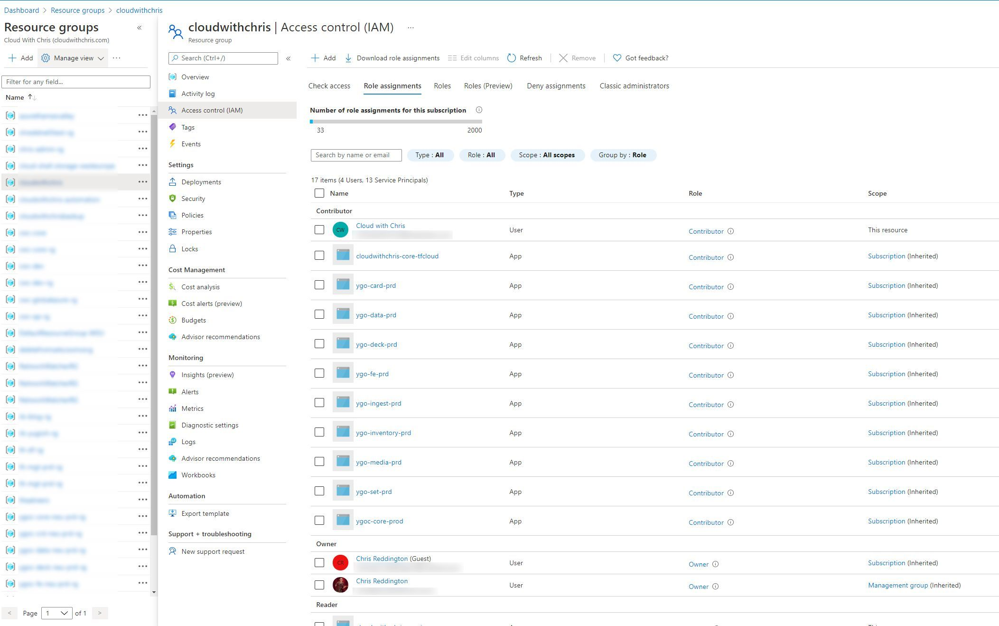

Principal of least privilege is a commonly used phrase within the Technology Industry. The idea is that we'll assign permissions of what the user needs to get the job done, rather than anything broader or more privileged. This helps reduce the blast radius in the event of a compromised account. This stretches to Azure resources at the management plane, but in some cases can also stretch to the data plane of those resources. We'll be exploring these further in this blog post.

The [Azure Docs](https://docs.microsoft.com/en-us/azure/role-based-access-control/overview) describes Azure Role-Based as -

*Access management for cloud resources is a critical function for any organization that is using the cloud. Azure role-based access control (Azure RBAC) helps you manage who has access to Azure resources, what they can do with those resources, and what areas they have access to.*

*Azure RBAC is an authorization system built on Azure Resource Manager that provides fine-grained access management of Azure resources.*

We can assign permissions at several levels of scopes, including management groups, subscriptions, resource groups and individual resources. The permissions are typically inherited from the lower levels of scope. For example, if you are a reader at a management group, then reader permissions would be assigned for all subscriptions, resource groups and resources in that hierarchy.

This is where roles are important. At a basic level, we have three roles that I would consider 'building blocks' -

* Owner (Provides the ability to manage resources relating to that scope - Create, Read, Update, Delete - AND assign permissions, and add/remove resource locks)
* Contributor (Provides the ability to manage resources relating to that scope - Create, Read, Update, Delete - But not assign permissions or add/remove resource locks)
* Reader (Provides the ability to read information relating to that scope)

There are several roles which are bound to a given type. For example, Virtual Machine Operator, Network Contributor, etc. So, you could feasibly assign several roles at several scopes, to ensure the principal of least privilege. This is why it is [typically recommended](https://docs.microsoft.com/en-us/azure/role-based-access-control/best-practices) to [assign RBAC permissions to Azure Active Directory Groups rather than individual users](https://docs.microsoft.com/en-us/azure/role-based-access-control/best-practices#assign-roles-to-groups-not-users), so that you can more easily scale your permissions management model.

Now, how does all of this apply to the data-plane? Given that the explanation from the Azure Docs said "Azure RBAC is an authorization system built on Azure Resource Manager that provides fine-grained access management of Azure resources."? Some of these resources are now allowing RBAC to be used beyond the management plane, and even control access to certain aspects of the data plane.

Let's take Azure Key Vault as an example. For the majority of it's existence, Azure Key Vault's permissions model has been focused on using [access policies](https://docs.microsoft.com/en-us/azure/key-vault/general/secure-your-key-vault#data-plane-and-access-policies). Access policies was an Azure Key Vault specific implementation (unlike RBAC which is an Azure Resource Manager based concept). Access Policies are assigned at the overall vault level rather than an individual secret/key/certificate. What does this mean? If you wanted to segregate your Development, QA, Test, Production (etc.) credentials, then you would need to separate these across vaults. Typically, the guidance would have been one Azure Key Vault per environment, per application (application being quite a broad term, e.g. Microservice, etc.).

[Azure RBAC for Azure Key Vault](https://azure.microsoft.com/en-gb/updates/azure-rolebased-access-control-rbac-for-azure-key-vault-data-plane-authorization-is-now-in-preview/) was announced in September 2020. This is [very well documented](https://docs.microsoft.com/en-gb/azure/key-vault/general/rbac-guide?tabs=azure-cli) if you'd like to explore this further than this brief paragraph. There are now several roles available in Azure RBAC (Key Vault Administrator, Key Vault Certificates Officer, Key Vault Crypto Officer, Key Vault Crypto Service Encryption User, Key Vault Crypto User, Key Vault Reader, Key Vault Secrets Officer and Key Vault Secrets User).

What's the difference? These roles now exist in Azure RBAC, so we could apply these permissions at the scopes we mentioned earlier (management group, subscription, resource group, a specific key vault resource), or even an individual object in the vault (certificate, key or secret). [This Azure doc](https://docs.microsoft.com/en-gb/azure/key-vault/general/rbac-guide?tabs=azure-cli#secret-scope-role-assignment) shows an example of assigning the permissions at an individual secret level.

Remember what we said about principal of least privilege earlier? Now we're able to start using the power of Azure role-based access control through Azure Resource Manager to apply to our Key Vault's data plane. Brilliant.

Let's consider another example, Azure Storage. Azure Storage had typically been accessed by either using the Azure Storage Account Key or Shared Access Signatures. Using the Storage Account Key had typically been considered a bad practice, as it gives entire access to the Storage Account, so is considered "giving the keys to the kingdom". Though again, this is an service implementation specific approach. While we can't directly compare this scenario with the one above, there are similarities.

[Azure RBAC for Azure Storage](https://docs.microsoft.com/en-us/azure/storage/common/storage-auth-aad-rbac-portal#azure-roles-for-blobs-and-queues) allows us to select from several roles; Storage Blob Data Owner, Storage Blob Data Contributor, Storage Blob Data Reader, Storage Blob Delegator, Storage Queue Data Contributor, Storage Queue Data Reader, Storage Queue Data Message Processor and Storage Queue Data Message Sender. The beauty of this approach  is that we're once again able to use the power of Azure role-based access control through Azure Resource Manager to apply to our Azure Storage Account's data plane. That could be set at a management group level, subscription, resource group, storage account, or even individual queues / blob containers within a storage account.

And for another example, let's move on to CosmosDB. [Role-based access control with Azure AD is now in preview](https://devblogs.microsoft.com/cosmosdb/role-based-access-control-preview/) for CosmosDB. If you wanted to connect your application to CosmosDB, then you would need to use a primary key which gave broad access to a CosmosDB account. With CosmosDB, there is a little more heavy lifting needed to leverage the Azure role-based access control integration with Azure Active Directory. You'll need to follow [the documentation](https://docs.microsoft.com/en-us/azure/cosmos-db/how-to-setup-rbac) and create your own custom role, rather than leveraging a built-in role. To be fair, it's quite clear and explanatory. Just be sure to regularly maintain and monitor your API Actions for your roles. If new endpoints get added, you'll need to manage and maintain your custom roles!

So, what's the point in this blog post? Mainly to raise awareness. These are just three examples, showcasing how the power of Azure RBAC is being brought to the data plane of Azure Services. Why not have a consistent permissions model for your management plane as well as your data plane?

When you start looking even further across Azure Services, there are additional examples where you can see this appearing. For example, there is a preview on using [Azure RBAC for Kubernetes Authorization](https://docs.microsoft.com/en-us/azure/aks/manage-azure-rbac) which again builds upon the same narrative we've been exploring through this document. Rather than using a separate management approach, you can use the standardised Azure RBAC model for access to your Kubernetes resources (Which, if you're already using AKS - is worth being aware that this is slightly different to using the AAD Authorization and Kubernetes RBAC. You'll get a feel for this as you take a look through the document). [Azure Purview](https://docs.microsoft.com/en-us/azure/purview/catalog-permissions) also leverages Azure RBAC for data-plane based permissions.

As an end user of Azure services, i'm excited about what's to come with this standardisation of RBAC and roles/permissions as an approach to managing data-plane access. When we start combining this with the concept of managed identities, this becomes a powerful model to reduce the need for credentials, and build on the power of the overall Azure Management platform.

So what are your thoughts after reading through this blog post. Will you be using Azure RBAC to manage data-plane access for any of the relevant services? Or are you already doing that? If so, how are you finding it? I'd love to hear more about your experience over on [Twitter, @reddobowen](https://twitter.com/reddobowen).

Thanks for checking out this blog post, and I hope that you've found it insightful. As always, feedback is appreciated. Until the next blog post, stay safe and healthy. Bye for now!
