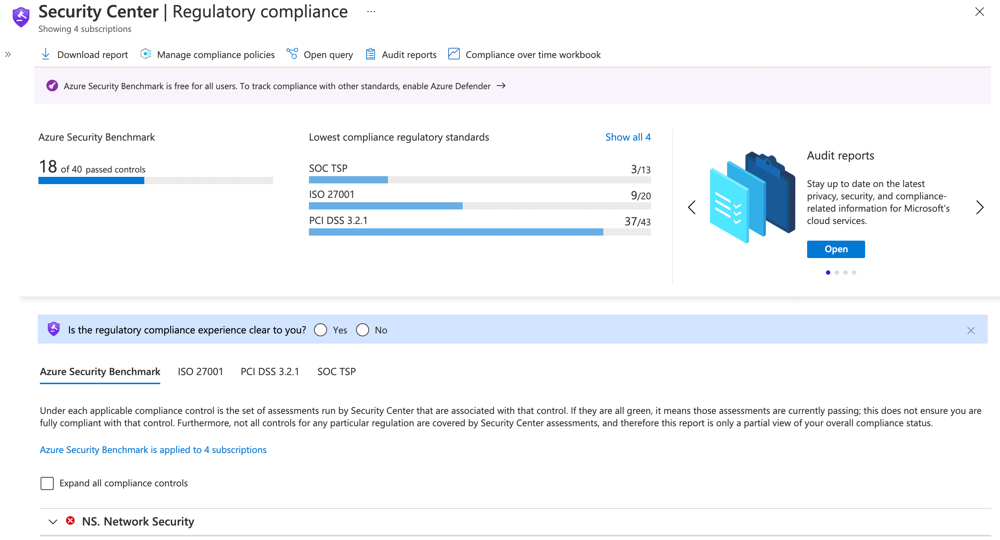
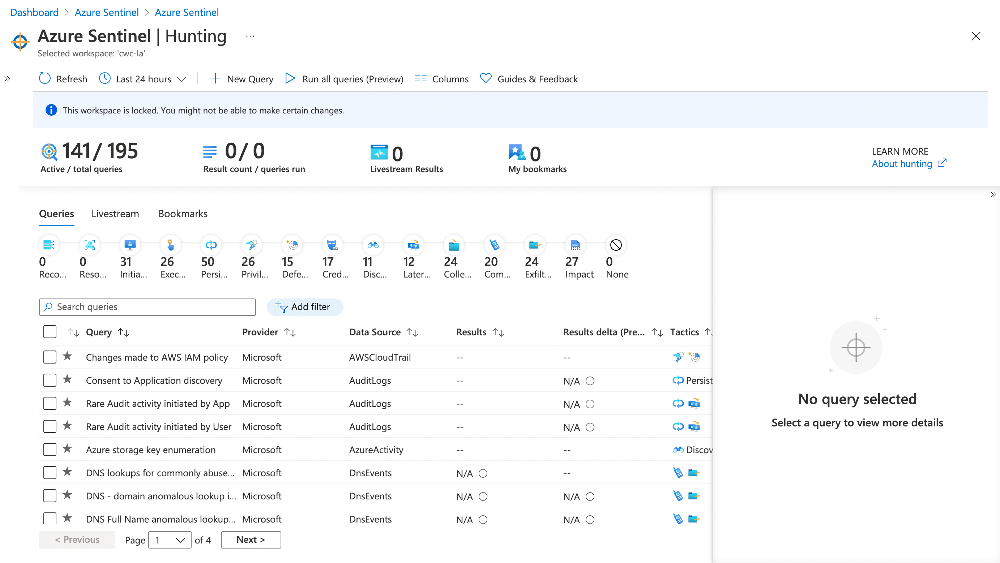

Whether you're brand new to Azure or have been using it for some time, you have likely either heard of - or come across - Azure Security Center. It's a service which can prove extremely valuable in baselining, measuring and improving your security posture. But, did you know there is additional functionality beyond the free tier? You may have previously known this as the standard tier, or now know this as Azure Defender, where you can opt in for those Azure Services that you particularly want to protect.

Let's first level-set. What is Azure Security Center? It's a service which helps you measure, maintain and improve your level of security through recommendations and alerts on your environment. This free tier allows you to access security policy, the continuous security scanning/assessment, as well as the recommendations that come from those two aspects.

While Azure Security Center is built-in to Azure, it doesn't mean you're limited to monitoring only your Azure workloads. Many PaaS services have built-in integrations with Azure Security Center. Hold that thought though, more on that later.

Now, there is a caveat here. Some functionality is unavailable until you opt-in for Azure Defender. You can turn on Azure Defender on a service-by-service basis in a subscription level. For example, Azure Virtual Machines, Azure Kubernetes Service, Azure DNS, etc.

Azure Defender builds on top of the free Azure Security Center tier by offering several features, including -

* Microsoft Defender for Endpoint (as part of Azure Defender for Servers)
* Vulnerability scanning for virtual machines and container registries
* Hybrid security
* Threat protection alerts
* Access and application controls (AAC)
* Container security features
* Breadth threat protection for resources connected to the Azure environment

")

What does that mean in practice? The free tier of Azure Security Center already gives you a lot of great value, but Azure Defender gives you so much more. For example, the threat protection alerts augment the data collected with machine learning to identify attacks and zero-day exploits. Azure Defender for container registries can be used to scan the images in your container registry and alert you for potential vulnerabilities.

Remember that I said you're not limited to just monitoring Azure workloads? There's a great Hybrid story to the Azure Defender functionality as well. And when I say Hybrid, I'm not just talking between Azure and your on-premises environment. You can enable Azure Virtual Machines to be automatically provisioned in Azure Security Center to easily understand the security posture of your Azure estate. But for those additional Virtual Machines that may be running on-premises or in other clouds, then you can install the Log Analytics agent to track the security posture across that aspect of your estate.

A good portion of managing your security posture and mitigating threats is knowing your own baseline, and how you're progressing. Where do you currently stand, and what are the risks? This is the intent behind Azure Security Center. Through use of Azure Security Policies and Azure Secure Score, you're able to evaluate how your resources are conforming to organizational security policies. You don't have to 'schedule' assessments, or ensure a baseline scan is completed. This all happens automatically in the background. You just need someone to review the recommendations, and take action. And of course, have Azure Defender enabled for the services where you'd like to leverage some of the advanced capabilities.

But, hold on Chris. I understand that there is a free tier of Azure Security Center. I also understand that Azure Defender can enhance some of those foundational capabilities. But, how is that opt-in model for Azure Defender charged? Great question. You can find the latest and greatest information on the [Azure Pricing Page](https://azure.microsoft.com/en-gb/pricing/details/azure-defender/), as this varies based upon which option you're choosing.

At time of writing, the Azure Security Center free tier includes a number of default recommendations/alerts, as well as the secure score capability so that you can baseline and monitor your overall security posture. You can then opt in to Azure Defender and choose to protect specific types of resources. For example, consider that you have deployed your applications onto Azure App Service. You can opt-in to protecting those App Service instances at a subscription level.

## How does Security Center work?

I could go ahead and explain this, but there's an [absolutely brilliant Azure Doc](https://docs.microsoft.com/en-us/azure/security-center/security-policy-concept) which already covers this. I'd encourage you to go ahead and take a look through. In a nutshell, if you're familiar with Azure Policies / Initiatives, then this will all make a lot of sense to you, as Azure Security Center policies build upon those concepts.

An initiative in the context of Azure Policy is a collection of Azure Policies that you're assigning to a given scope (Management Group, Subscription, Resource Group). Azure Security Center even has a number of regulatory compliance initiatives ready for you to assign to your subscriptions, so that you can quickly and easily understand how you conform to common compliance requirements. At time of writing, this includes SOC TSP, Azure Security Benchmark, ISO 27001 and PCI DSS 3.2.1.

The Secure Score in Azure Security Center is then calculated based off the outstanding recommendations that are present in the scope that you're viewing (e.g. subscription, set of subscriptions, etc.)

> **Note:** Something that I learned while reading [the Azure Docs](https://docs.microsoft.com/en-us/azure/security-center/secure-score-security-controls#which-recommendations-are-included-in-the-secure-score-calculations) and pulling together relevant references for this post, is that preview recommendations do not count towards your secure score.

## But wait, I've heard of Azure Sentinel. How does that compare?

Azure Sentinel and Azure Security Center are two entirely different services. However, they do share a security-focus and work brilliantly together. You'll likely want to consider leveraging both of them.

As we've established, Azure Security Center is all about managing your security posture. Azure Sentinel is a service to help you with SIEM (Security Information Event Management) and SOAR (Security Orchestration Automated Response). Azure Security Center is typically used as a proactive tool to determine your security posture, understand your baseline and pre-emptively take action to mitigate risk. Azure Sentinel helps you respond to live security incidents quickly, collecting data across [multiple service-to-service connectors](https://docs.microsoft.com/en-us/azure/sentinel/connect-data-sources) and [partner connectors](https://docs.microsoft.com/en-us/azure/sentinel/partner-data-connectors) and using artificial intelligence to help identify real threats apart from false positives.

It builds upon the concepts you'll be used to with Azure Monitor and Azure Log Analytics (e.g. [using Kusto Query Language to query through the data](https://docs.microsoft.com/en-us/learn/paths/sc-200-utilize-kql-for-azure-sentinel/), [using Azure Monitor workbooks to build interactive reports](https://docs.microsoft.com/en-us/azure/sentinel/top-workbooks) based on the captured data).

Not only does Azure Sentinel enable you to investigate live issues, but you can use it to proactively hunt for security threats. You can even use [automated workflows based on Azure Logic Apps](https://docs.microsoft.com/en-us/azure/sentinel/tutorial-respond-threats-playbook) to integrate with Azure Services and existing processes and may want to enhance.

## Summary

There we go, a brief summary of Azure Security Center and how Azure Sentinel could be used in addition. Azure Security Center can give you a ton of value, and help you understand your security posture based on a series of policies. You can then enhance that functionality by turning on Azure Defender for subsets of services. Alongside, you can use Azure Sentinel to help you identify and mitigate live security incidents quickly, adding another tool to the toolbox to help in these critical situations.

I hope that this write-up has been useful. I'd love to know how you're progressing along your own journey with security over on [Twitter, @reddobowen](https://twitter.com/reddobowen).

One final reminder, just because you've adopted Azure Security Center or Azure Sentinel doesn't make you secure. Security is an ongoing topic, and should be top of mind for everyone. You should be considering it at multiple levels (e.g. the Azure Management plane, Identities used to login to that, At your application level (APIs/Dependencies/etc.), DevOps processes (i.e. storing any secrets in source control), and at the Azure Infrastructure level). It's a broad topic, but Azure Security Center and Azure Sentinel are two tools which can help you manage and monitor some of those aspects along your journey.

Stay tuned for an episode coming out on Wednesday, where I'm joined by DeveloperSteve Coochin as we talk about how to find vulns before they find you!