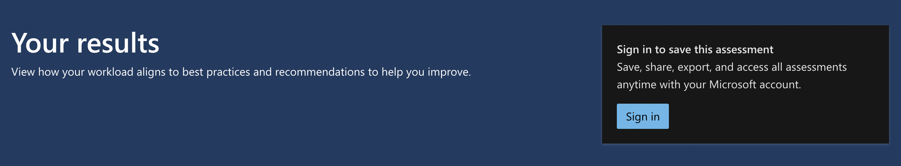
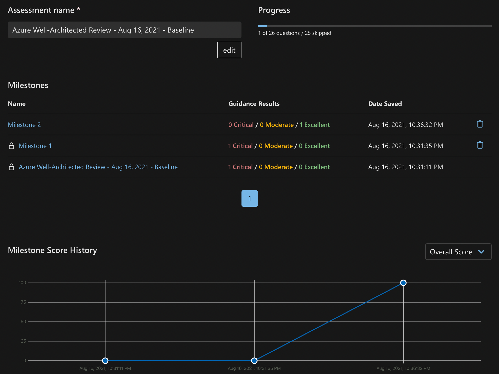

You'll have probably spotted by now that cloud architecture is a passion area of mine, and a regular topic that features on Cloud With Chris. We've talked a lot about Cloud Design Patterns and requirements-driven engineering in the past, as well as the various pillars of software quality. But one area that hasn't been explored too much is the Azure Well-Architected Framework. So in this blog post, we'll explore that, and identify how it can be used in your own projects.

## What is the Azure Well-Architected Framework?

So, what is the Azure Well-Architected Framework? Rather than re-explaining an existing definition, let's re-use the example from the [Azure Docs](https://docs.microsoft.com/en-us/azure/architecture/framework/):

> The Azure Well-Architected Framework is a set of guiding tenets that can be used to improve the quality of a workload. The framework consists of five pillars of architecture excellence: Cost Optimization, Operational Excellence, Performance Efficiency, Reliability, and Security. Incorporating these pillars helps produce a high quality, stable, and efficient cloud architectures.

So, The Azure Well-Architected Framework isn't some kind of Azure Service that you can spin up, or a built-in Azure service/tool. It's a framework that you can use to help you consider the core design requirements of your solution. Best part? It's absolutely free, so is an incredibly accessible way for you to design, build and operate confidently.

Azure Well-Architected effectively comes in two parts -

* [The framework aspect](https://docs.microsoft.com/en-us/azure/architecture/framework/) (i.e. the recommended practices that you'll want to consider following)
* [The review aspect](https://docs.microsoft.com/en-us/assessments/?id=azure-architecture-review&mode=pre-assessment) (i.e. the tool that helps you understand your current posture)

As you would hope, the framework and the review work hand-in-hand. All of the questions in the assessment relate back to tangible recommendations, patterns and practices that are available in the well-Architected Framework documentation.

As you may have suspected by now, the questions align to the pillars of the Azure Well-Architected framework. Those frameworks being -

* Cost Optimization (How can you achieve your non-functional requirements while keeping cost low?)
* Operation Excellence (Technical architecture is one aspect of your solution, but are you prepared to monitor and run the system when it goes live?)
* Performance Efficiency (Have you considered how your application scales as part of your design?)
* Reliability (How are you protecting against potential failures in the system?)
* Security (What happens if someone tries to attack your solution?)

This also means that the review itself is split into these different pillars. When you load up the Azure Well-Architected Review, you will be prompted to choose the pillars that you want to assess.

As you progress through the questions, you'll find that some of them may have supporting materials (such as videos) in line with the question. These questions are typically multiple choice, so you can select the answers which are most appropriate.

Once complete, you will have a list of recommendations based upon the questions that you have answered. You may also notice that it gives you a score for those pillars, as well as an overall score.

## How can you use the Azure Well-Architected Framework for your project?

Let's take a few steps back. Consider that -

* Azure Well-Architected a framework and assessment which is available online to anyone.
* Azure Well-Architected is free.

Not only that, but you can sign in when using the Azure Well-Architected Assessment! And do you know what that means? it means you can save your results! That means that this assessment doesn't need to be a one-time activity. It can be used an ongoing activity, starting from a baseline and re-evaluated to measure your progress. Ideally, this would be carried out at some point in your project lifecycle where you can make factor in tangible-changes as a result of the review.

The experience changes when you are logged with a user account. You'll notice that instead of creating a brand new assessment, you can create a milestone for an existing assessment (allowing you to see the continuation of any existing trends).

Taking things one step further, if you complete the assessment when you're signed in, then you can link your Azure Advisor recommendations to the assessment.

Once you have completed an additional milestone assessment, you will be able to see how your results are trending across those assessments.

Let's consider those points again.

* Azure Well-Architected a framework and an assessment that's available online to anyone.
* Azure Well-Architected is free.
* Azure Well-Architected assessments allows you to sign in and store previous assessments against your account, that way being able to trend your results over time.

So, how can you use the Azure Well-Architected Framework for your project? As it makes sense in the context of your project, but time it so that you can make a real impact. If you work in sprints, is it worth doing this as part of your planning/retrospective? Or perhaps, in some cadence of your sprints?

If you work in a traditional planning approach, could you complete a review in the distinct separate phases of your project? For example, Design, Test and the various phases of build?

The key is going to be completing the assessment at a point where you're prepared to take on the feedback and make changes as a result. If you're either unable or unwilling to make changes, what is the value in completing the assessment if you have no ability to take action?

Have you already used the Azure Well-Architected framework for your own project? How did you find it? Or, perhaps you're now considering it in a project? What pillars are you most looking forward to trying out? I'd love to continue the discussion over on [Twitter, @reddobowen](https://twitter.com/reddobowen).

Until the next time, thanks for reading and bye for now!