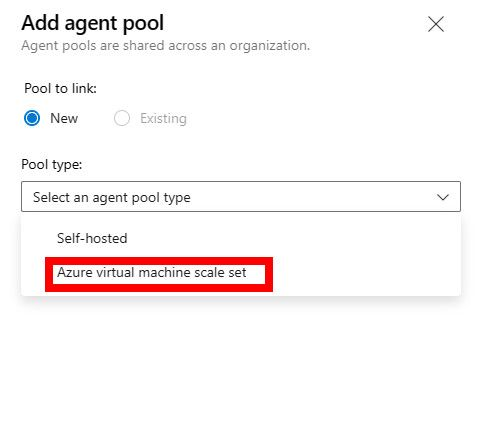

A little while ago, I  wrote a blog post on [Using the GitHub self-hosted runner and Azure Virtual Machines to login with a System Assigned Managed Identity](/blog/github-selfhosted-runner-on-azure), which seems to get a good amount of views week on week. Reflecting on some questions that have popped up this week (and regularly received over my time in the DevOps space), I thought that it makes sense to write a post on how to use Azure DevOps self-hosted agents to deploy to private resources. So, that's what we'll be covering in this post!

## Context

Let's set the scene. Perhaps you have been working on a proof of concept, and it's time to start shaping that into a production-like workload. Maybe you were deploying to a resource such as a Virtual Machine or App Service instance which was publicly accessible. But, now you have requirements to ensure that resource is only accessible from a private network. For the purposes of this blog post - Let's consider that the resource (or, deployment target) is hosted in Azure.

There is a common trend that I see. People will typically start off their Azure DevOps (specifically, Azure Pipelines) journey by using the [Microsoft-hosted agents](https://docs.microsoft.com/en-us/azure/devops/pipelines/agents/hosted?view=azure-devops&tabs=yaml). Microsoft-hosted agents are exactly as the name implies... Azure Devops Agents hosted by Microsoft.

Let's take a step back for a moment. What is the Azure DevOps agent?

When your Azure Pipelines are triggered, a piece of software has to acknowledge and execute that work (or job). That process is carried out by the Azure DevOps agent, which runs on some machine.

## Microsoft-hosted agents

The Microsoft-Hosted agents are machines that are hosted by Microsoft in a public pool, which is available for Azure DevOps customers to use. As this is a public pool, these machines have access to public resources (i.e. over the public internet), and do not have network access to your private environments.

The Microsoft-hosted agents take away the management overhead of managing agent infrastructure (and software dependencies) from you as a DevOps team. Instead, you can use the agent pool from Microsoft, using the latest and greatest agent images (again, all managed by Microsoft). This is the appeal of Microsoft-Hosted agents; they are easy to use, have low management requirements, have a wide variety of common dependencies already installed and can deploy to public endpoints.

If you have a need to deploy into a private environment, then you must use self-hosted agents (as you will need 'line of sight' to the target resources that you wish to deploy to). Self-hosted agents can also be beneficial when you need machine-level caching/configuration to persist between runs (as it doesn't with the Microsoft-hosted agents, but you can use caching for packages), or if you need to increase the specs of the machine that you're running on because of the usecase (e.g. GPUs for some kind fo machine learning activity).

> **Note:** For completeness - Machine-level caching doesn't make much sense as a concept with Microsoft-hosted agents as they are re-imaged after each run (more [details here](https://docs.microsoft.com/en-us/azure/devops/pipelines/agents/hosted?view=azure-devops&tabs=yaml#security)). There are alternate options though. If the Microsoft-Hosted agents suit your scenario, but you want to reduce build times by caching dependencies (i.e. artifact outputs), take a look into [pipeline caching](https://docs.microsoft.com/en-us/azure/devops/pipelines/release/caching?view=azure-devops).

Now that we understand the difference between the Microsoft-hosted agents (a pool of machines that are managed by Microsoft and can be used for several common scenarios) and self-hosted agents (Azure DevOps agent software running on machines that you manage, which also requires software dependencies to be installed - e.g. .NET Core, NodeJS, Azure CLI, etc.), let's get into the details of how to use self-hosted agents.

## Self-hosted agents

We have established that the Azure DevOps agent is the software that is able to listen for Azure Pipeline Jobs and execute them. You will also need to install any required software for your CI/CD pipelines to execute successfully.

For example, if you use the Azure CLI in your pipelines, then the Azure CLI needs to be installed on the machine so that the Azure DevOps agent can use it. If you are building a Java app, then you would need to install the Java SDK and any required build tools on the machine.

The agent software is available across MacOS, Linux, and Windows. There is also a Docker-based agent available for Linux and Windows. As you've probably guessed, this means there are many options available. You could install the agent on your local machine, or you could host it on Azure (whether that's in a Virtual Machine, Azure Container Instance, AKS Cluster or Virtual Machine Scale set.)

> **Tip:** If you are using Azure Virtual Machines, then you can use the [Azure Virtual Machine Extensions](https://docs.microsoft.com/en-us/azure/virtual-machines/extensions/overview) to install the agent on your Virtual Machine.
>
> 

Let's focus on the Azure Virtual Machine Scale Set option. While you could create your own Virtual Machine Scale Set, you would have to manage the number of instances in that set (i.e. scale out when more agents are needed, scale in when fewer are needed). Wouldn't it be great if Azure DevOps could scale out and in for you (e.g. if there are no jobs, have no VMs running to control unnecessary costs)?

This is where the Azure Virtual Machine Scale Set Agents capability of Azure DevOps can help.

## Azure Virtual Machine Scale Set agents

Azure Virtual Machine Scale Set agents is a feature within Azure DevOps. It allows you to use an existing Virtual Machine Scale Set to host your Azure DevOps agents, but then allows Azure DevOps to manage the scaling out and in of those agents. Therefore, you get the ability to deploy your agents in a private network and control the dependencies that are installed on the agents. However, you get to simplify the management by allowing Azure DevOps to provision and de-provision agents based upon some parameters that you set out.

Before enabling the functionality, you need to have a Virtual Machine Scale Set created. There are some nuances to how the Virtual Machine Scale Set must be created. Rather than repeating that all here, I'd encourage you to take a look through the [Azure DevOps Documentation](https://docs.microsoft.com/en-us/azure/devops/pipelines/agents/scale-set-agents?view=azure-devops#create-the-scale-set) for more details.

At that point, you can create a new Azure Virtual Machine Scale Set Agent pool from your Azure DevOps project. You can do this by navigating to an Azure DevOps Project, clicking **Project Settings** and then **Agent Pools** under the Pipelines section.

From here, you can select the **Add pool** option.

At this point, go ahead and select the Azure Virtual Machine Scale Set option. There are several configuration options to set -

* **Azure Subscription** - Which Azure Subscription your Virtual Machine Scale Set is in.
* **Virtual Machine Scale Set** - The Virtual Machine Scale Set you want to use.
* **Name** - The name of the agent pool (used for easy reference when selecting which pipeline to use in your Azure Pipelines)
* **Description** - Some supporting information on the agent pool. It supports markdown, so perhaps you could contain relevant information about the configuration of the scale set, or useful information for the end user.
* **Pool Options** - There are several options that you can set for the agent pool, including -
  * **Automatically tear down virtual machines after every use** - This will ensure that the Virtual Machines are re-imaged after each run.
  * **Maximum number of virtual machines in the scale set** - This is the maximum number of Virtual Machines that will be provisioned in the scale set (i.e. the **limit** of virtual machine instances in the scale set).
  * **Number of agents to keep on standby** - This is the minimum number of Virtual Machines that will be kept in the scale set, regardless of whether there are jobs or not. For example, if you set this value to 0, then no Virtual Machines will be provisioned ahead of time. This means, when a VM will only be created when a job comes in (which might impact the time it takes to execute a job). However, if you set this value to 1, then one Virtual Machine will be  be waiting for a new job.
  * **Delay in minutes before deleting excess idle agents** - This is the amount of time that will be waited before deleting Virtual Machines that are no longer being used for a job. Consider this like the 'time until a scale in' number.
  * **Grant access permissions to all pipelines** - Typically, you have to authorize the agent pool to access the pipelines that you want to use (as [shown here](https://docs.microsoft.com/en-us/azure/devops/pipelines/policies/permissions?view=azure-devops#why-do-i-see-the-message-that-i-need-to-authorize-a-resource-before-the-run-can-continue)). This option will grant access to all pipelines in your Azure DevOps project. If you are security conscious, then you may want to do this on a pipeline by pipeline basis by using the linked documentation.

Once you've configured the agent pool, you can click the **Save** button to save the configuration.

Now, you can navigate to one of your Azure Pipelines and use the agent pool you just created. Depending on the exact details of your Azure Pipeline, you may need to change aspects of your pipeline. For example, if your target was a Virtual Machines Public IP address, perhaps you need to use a Private IP address, or a DNS record which resolves that IP.

However, if you were previously deploying to a Public App Service Web App using the App Service Deployment Task, but you've then made that App Service private (e.g. using Private Endpoints) then you shouldn't need to change the configuration of your pipeline. The name of the App Service would not change, so as long as the Virtual Machine Scale Set has 'line of sight' to the Private Endpoint (i.e. The Scale Set Agents have some form of route to the Private Endpoint, e.g. peered virtual networks, the same virtual network, etc.), then you shouldn't need to change anything.

Do bare in mind one point. The Virtual Machine Scale Set **must** have the needed software dependencies installed on the machine (e.g. Node.js, npm, etc.). If you are using a self-hosted agent, then you will need to install the dependencies yourself. I have seen several solutions for this, including use of a custom VM Image or Infrastructure & Configuration as Code.

Some of the Azure DevOps tasks have an installer option that will install the dependencies for you. You could even consider using the command-line to install dependencies onto the Virtual Machine Scale Set as part of the CI/CD pipeline. While this works, this will increase the time it takes to deploy your pipeline. This might be fine for uncommon dependencies, but you may want to adopt a more effective strategy to reduce the deployment pipeline. Likewise, some dependencies may be very large, so you may want to consider some of those earlier examples.

> **Note:** The Azure DevOps team are unable to distribute the Microsoft-hosted images due to licensing considerations. However, there is more information available [in the docs](https://docs.microsoft.com/en-us/azure/devops/pipelines/agents/scale-set-agents?view=azure-devops#where-can-i-find-the-images-used-for-microsoft-hosted-agents) on the scripts that are used, so you can generate your own images with those dependencies.

## Summary

In this blog post, we've explored the concept of Microsoft-Hosted agents and Self-Hosted Agents. The self-hosted agent is available on Windows, MacOS, Linux and as a Docker container image (both for Windows and Linux). This gives us options to deploy our pipelines to a variety of different environments, including Azure Kubernetes Service, Azure Container Instances and Virtual Machines. However, in these scenarios - we have to manage the number of agents that are ready to serve our jobs. This is where the Azure Virtual Machine Scale Set Agent concept comes in; a Virtual Machine Scale Set where the number of instances is controlled by the parameters that you have set in Azure DevOps.

So, what are your thoughts? Have you had a chance to try out Azure Virtual Machine Scale Set Agents? Do you have any tricks or tips to manage the dependencies that you need to install on those instances? Drop a note in the comments below! Until the next time, thanks for reading - and bye for now!
