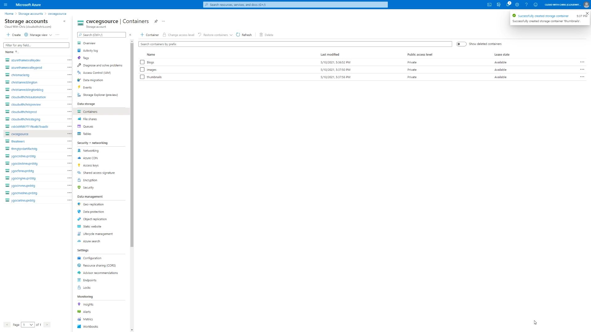
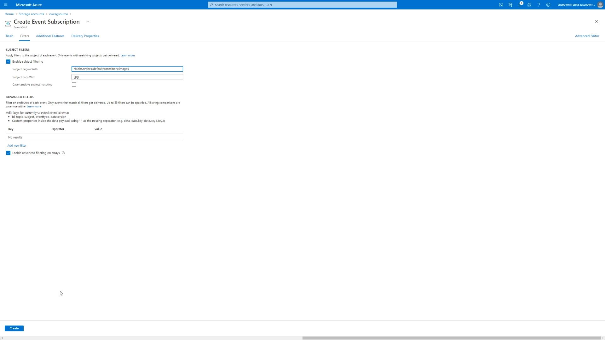
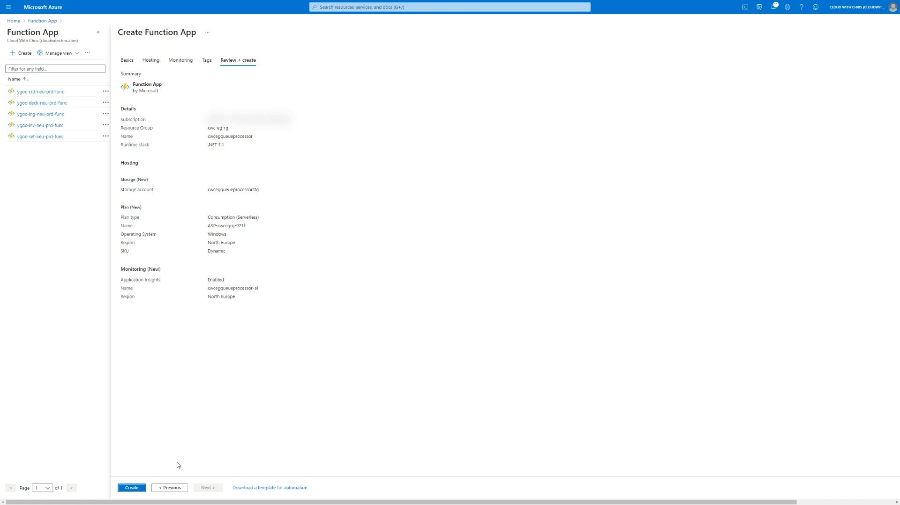
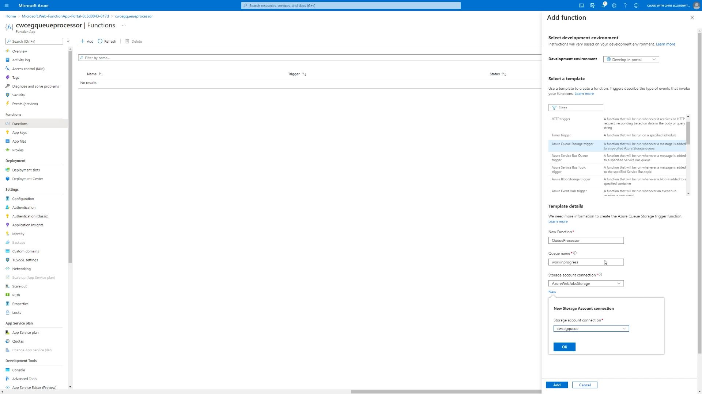
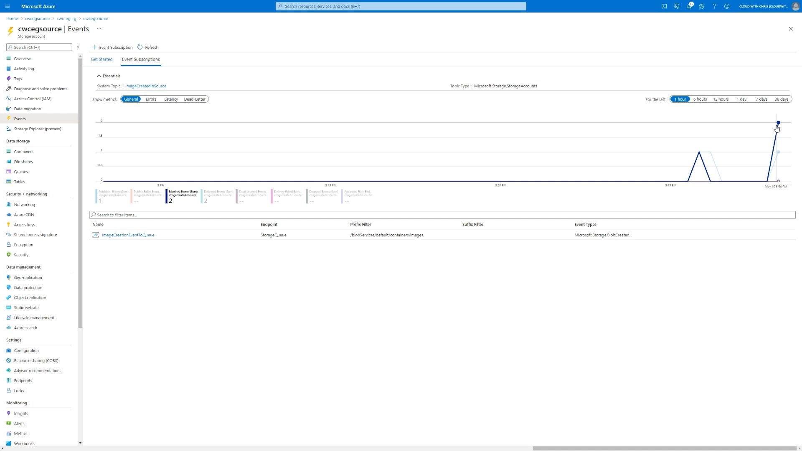
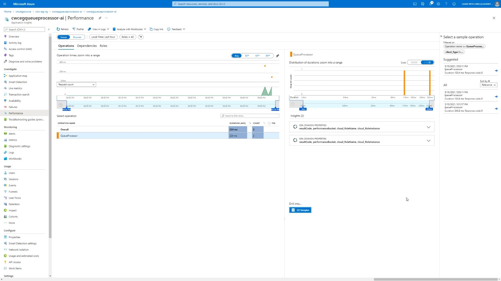
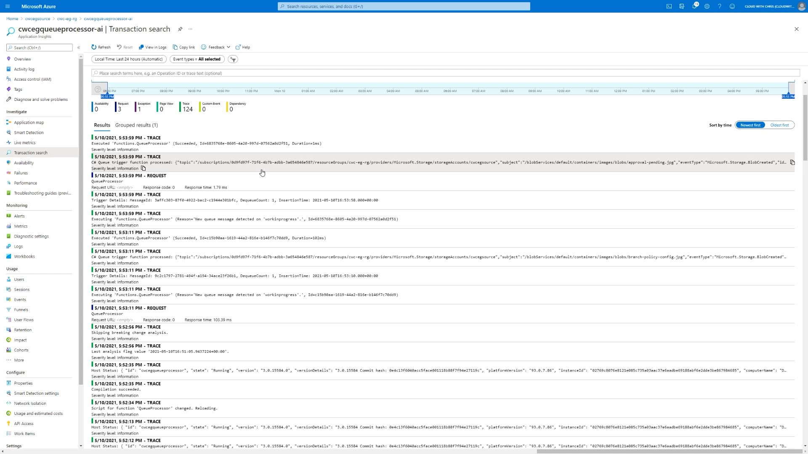

You may have heard of Event-Driven Architectures before, but haven't had the chance to get hands-on and build one as yet. That's exactly what we'll be working through in this blog post! Before we dive into any practical detail though, let's go ahead and recap some of the benefits of this architectural approach. The [Azure Architecture Center](https://docs.microsoft.com/en-us/azure/architecture/guide/architecture-styles/event-driven) covers these very well. But as a brief recap -

* Event-Driven Architectures are great for scenarios where you have a distributed architecture (multiple microservices/subsystems) that process the same set of events
* They can enable high volume real-time processing with minimum time lag. Typically they'll be leveraging messaging platforms (such as Service Bus Topics/Queues, Storage Queues and Event Grid), and you'll see patterns like Publish/Subscriber, Queue-based load levelling and Competing Consumers.
* As a result, the producers and consumers of these events (or messages, as they transition and evolve through the system) are decoupled. This means that this type of architecture can be easily expanded, adding new consumers to listen to specific message types.
* These systems can be highly scalable, but also cost-effective. Typically when you hear event-driven, you also hear serverless. This isn't **always** the case, but you can deploy event-driven workflows on a per-invocation/per-execution basis. This means you need to thoroughly understand your workload, and which would the most cost-efficient (i.e. paying for the underlying infrastructure which performs the processing, or paying on a per-event basis).

With that context out of the way, let's start building out our scenario! We're going to go ahead and build an event-driven workflow that ensures there is a 'guaranteed processing' on files that are uploaded to a storage account. This could be resizing of an image, analysis of an image (e.g. image recognition), text analytics of a file, or many other scenarios. We won't be focusing on the later processing aspect (as that would be domain specific, and you can implement as needed), but will be focusing on the 'plumbing' between those various Azure Services.

From the above, you should be able to identify that the source of our process is a blob being uploaded to a storage account. As a result, we'll need to create an Azure storage account. In the example below, you can see that I've included the term ``source`` in the name to make it easily identifiable that this is the source of our workflow. This is just my own naming convention for this example, but it's worth calling out naming conventions are vital in any architecture. Aside from the storage account name, region and redundancy options, the remaining options will stay as the defaults.

We mentioned in the original context that we have a requirement of 'guaranteed processing' on each file that is uploaded to the blob storage.

> **TIP:** It's worth being aware of the difference between events and messages. An event is a notification of a state change. Imagine this like a broadcast saying, "Hey, I just published this new file!". You don't typically have any expectations on whether anyone is listening (or what they'll do with that information). The event will contain lightweight information about what happened.
>
> Conversely, messages contain the entire payload of information. When a message is sent, typically the publisher expects the consumer to do something with that information. For example, analysing the contents of the message and saving the analysis to an end-location.

Let's first understand how Event Grid may be able to help here, and how it handles delivery to a destination (commonly referred to as an event-handler).

  > **TIP:** Whenever you're building event-driven workflows, you'll typically encounter messaging services along the way such as Service Bus Topics & Queues, Azure Storage Queues and Event Grid. It's important that you understand the capabilities of each messaging platform, and more importantly how they differ.
  >
  > For example:
  >
  > * If a consumer reads a message, does it get removed instantly (as the message is considered delivered successfully), or do you have a peek lock or peek lease approach, to ensure that messages are processed correctly before being removed?
  > * Are messages guaranteed to be delivered in order? This could be particularly important for certain domains, such as finance. Consider a stock trading platform, or a retail bank account. If you transfer money out before you have money transferred into the account, you could go into an overdrawn scenario. It's critical that messages are processed in the appropriate order.
  > * Are duplicate messages detected? Or is this something that your consumer may need to handle?
  >
  > There is a great [messaging comparison](https://docs.microsoft.com/en-us/azure/event-grid/compare-messaging-services) available in the Azure Docs to help you determine which messaging service may be appropriate in a given scenario. There is an additional doc which compares [Azure Storage Queues vs Azure Service Bus Queues](https://docs.microsoft.com/en-us/azure/service-bus-messaging/service-bus-azure-and-service-bus-queues-compared-contrasted).

Azure Event Grid provides 'at least once' delivery. But what determines a failed delivery? Thankfully, all of that is once again documented in the [Azure Event Grid Docs](https://docs.microsoft.com/en-us/azure/event-grid/delivery-and-retry#retry-schedule-and-duration). The full list of success and failure status codes is [defined here](https://docs.microsoft.com/en-us/azure/event-grid/delivery-and-retry#message-delivery-status). What happens if we sent events directly to an Azure Function (providing an initial 202 Accepted status, so Event Grid considers a successfully delivered), but then attempt to asynchronously process the event? What happens if there's a failure in that asynchronous processing? We potentially lose that event, and therefore can't guarantee the processing.

So instead, let's consider sending the message directly to a queue of some sorts. Depending on our requirements (as we explained in the tip above), we could choose either Azure Storage Queues or Azure Service Bus Queues. We have no requirements around guaranteed ordering or identifying duplicates, and it looks as though the remaining characteristics of Azure Storage Queues align to what we need. As a result, let's send the Event Grid events directly to an Azure Storage Queue.

But for that, we'll need a storage account to create those storage queues. While the first storage account is creating, we'll ahead and create a second storage account. The reason that we're not sharing a single storage account is so that we ensure that the source and the queue can each reach the IOPS limit of a storage account, without being impacted by the other component (i.e. one starving the other of IOPs).

While the second storage account (the one which will hold the storage queues) is being created, we'll go ahead and create a couple of storage containers in the source blob storage account. One container which will hold the original **source** images and another which would hold the **processed** images. In this example I've named it thumbnails, though we won't be generating any thumbnails in this example, this is just to help the example.

We'll navigate back to the second storage account (the one which will hold the storage queues), and create a new queue to hold the messages. I called mine ``workinprogress``.

At this point, we have everything that we need to begin creating the event-driven workflow. We'll navigate to our source storage account, and click on the events item on the left hand side of the screen.

We'll go ahead and select the **Event Subscription** creation option. This is where we can create a new Event Grid System Topic and Event Grid Subscription. First, let's run through some concepts or terms (though you can find a [fuller set of descriptions on the Azure Docs](https://docs.microsoft.com/en-us/azure/event-grid/concepts)) -

* A topic is a common term in messaging patterns. The topic is where the source (in this case, our storage account) sends the events. There a few types of topics -
  * System Topics which are built-in and provided by Azure Services, just like the Azure Storage example that we're showing here.
  * Custom Topics which are used by applications or third-party topics.
  * Partner Topics - If you want to enable consumers of your SaaS platform to react to events within your application.
* An Event Subscription is used to let event grid know which events you're interested in receiving. You'll specify an event handler (or destination) when you're creating the subscription.
* An Event handler is where the event is sent. In this example, our event-handler will be the Azure Storage Queue.

With that context, we can now proceed in creating our Event Grid System Topic and Event Grid Subscription. Find below the configuration that I entered, though you can of course name these appropriately as you see fit.

* Name: ImageCreationEventToQueue
* Event Schema: Event Grid Schema
* Topic Type: Storage Account (that is not changeable, as we're creating it from the Storage Account)
* Source Resource: cwcegsource (that is not changeable, as we're creating it from the Storage Account)
* System Topic Name: ImageCreatedInSource
* Filter to Event Types: BlobCreated
* Endpoint Type: Storage Queues
  * Notice that we have several event handler options, including Azure Functions, Web Hook, Storage Queues, Event Hubs, Hybrid Connections, Service Bus Queue and Service Bus Topics.
* Use system assigned identity: Enabled

We will also click on the ``Filters`` tab. This allows us to apply additional filters, so that only events matching the filter will get delivered.

* Enable subject filtering: Enabled
* Subject Begins With: /blobServices/default/containers/images

> **TIP:** The above filter ensures that event grid will only send the blob creation events for the images container. Events will not be delivered when images are uploaded to the thumbnails container that we also created.

There are additional tabs which focused around **Additional Features** to configure dead-lettering, retry policies and an expiration time for the event subscription. Note that [Event Grid doesn't turn on dead-lettering by default](https://docs.microsoft.com/en-us/azure/event-grid/delivery-and-retry#dead-letter-events), so you will need to configure this as needed. However, there are a set of [retry policies configured by default](https://docs.microsoft.com/en-us/azure/event-grid/delivery-and-retry#retry-schedule-and-duration).

There's an additional tab for **delivery properties** for specific event-handlers, including webhooks, Azure Service Bus Topics and Queues, Azure Event Hubs and Relay Hybrid Connections. Azure Storage Queues are not listed, though this may be a documentation issue as you can see from the above screenshot that it's listed. This would be where you configure TTL for your messages on the messaging service, or add Authorization Headers to an external HTTP call (e.g. webhook).

Before we create the event subscription. Notice that in the **Basic** tab we also have an option for **Use system assigned identity**, and we set that to enabled earlier? If you're not familiar with managed identities already, it's worth [reading up on them](https://docs.microsoft.com/en-us/azure/active-directory/managed-identities-azure-resources/overview). Effectively, this allows you to treat the Event Grid System Topic as an object which has Role Based Access Control (RBAC) permissions assigned. The benefit of managed identities in general is that we don't have to deal with credentials any more. That means they won't end up accidentally committed to a source code repository, and we don't have to deal with credential rotations, etc. This is all handled within the Azure Management plane and is a benefit thanks to Azure Resource Manager.

It may take a few moments for the resources to be created. Once created, we'll now need to assign that Event Grid System Topic access to send messages to the Storage Queue. You'll hopefully be aware from my recent blog post, that we now have Azure RBAC capabilities at the data-plane for Azure Storage. And that's what we'll be assigning to the Event Grid System Topic. We'll be assigning the Storage Queue Data Message Sender permission, so that the Event Grid System Topic can send messages to the queue in the storage account we setup. It will have no other permissions, so adheres well to the principal of least privilege model.

After some time, hit refresh and you will see that the permission was assigned successfully.

Now for the first test! Let's go ahead and navigate across to our source storage account, and upload a file to the **images** blob container. Once complete, navigate back across to the storage account containing the queue, and take a look at the queue. You should now see a message on the queue.

Now for the second test! Navigate back to the source storage account, and upload a file to the **thumbnails** blob container. Once complete, navigate back across to the storage account containing the queue, and take a look at the queue. You should still see that there is a single message on the queue.

Brilliant, so we now have events being generated and sent to the Azure Storage queue when a new file is uploaded to the container. Let's now create a consumer of that storage queue. We'll create an Azure Function to process these messages. If you're following along, I won't be deploying any 'real' code into this function. This is purely for end-to-end demonstration purposes, so feel free to select the Azure Function configuration that you're most comfortable with. Make sure that you have Application Insights enabled as part of the creation process.

> **TIP:** Azure Functions is an event-driven serverless service. It works based upon triggers, inputs and output bindings. When using Azure Functions, you need to make sure that you thoroughly understand these bindings and how they work. Some of you may be wondering why we didn't directly bind the Azure Function directly to Azure Blob storage events (which is indeed possible). Take a look at the [Azure Docs](https://docs.microsoft.com/en-us/azure/azure-functions/functions-bindings-storage-blob-trigger?tabs=csharp) to find out more details.
>
> Each of the bindings will have details that you'll want to understand how in a bit more depth. For example, the [Queue Storage Trigger](https://docs.microsoft.com/en-us/azure/azure-functions/functions-bindings-storage-queue-trigger?tabs=csharp) has some details around concurrency, the polling algorithm, poison messages and more that are useful to be aware of. Before using any of the bindings, I suggest that you read through the associated trigger documentation to appropriately understand any implementation details to be considered.

For the purposes of the blog post, I'm creating a function directly in the Azure Portal as a C Sharp Script. However, for a real implementation which is more production-focused, I would create a C Sharp Project and ensure the code is version controlled with an appropriate build and release process wrapped around it for the delivery.

Notice that we have several triggers available in Azure Functions? For example, Azure Event Grid, Azure queue Storage, Azure Service Bus Queue, Azure Service Bus Topic, Azure Blob Storage and more? You can once again see the event-driven nature which is fundamental to this service.

We'll select the Azure Queue Storage trigger. Make sure to correctly enter the Queue Name that you used earlier, and setup the connection to the appropriate storage account (the one that was holding the queue).

We can go ahead and create the Azure Function. I didn't make any changes to the Azure Function, aside from adding some comments of what I would intend for the Function to do (e.g. inspect the data in the message, use that data to determine which blob file to read, perform the required process, and store the output in the thumbnails container).

When we navigate to the queue, we'll see that the queue is now empty.

Now for the third test! Navigate back to the source storage account, and upload a file to the **images** blob container. Once complete, navigate back across to the storage account containing the queue, and take a look at the queue. You should see that there are no messages on the queue. That's because the Azure Function has already detected the new message and has reacted to it, executing the code in the function.

To sanity check this, we can navigate to our source Storage Account and browse to the events menu item. Under Event Subscriptions, we should see that the metric graphs displays that two events have been successfully delivered.

As another sanity check, we can open up Application Insights and inspect the operations that have taken place. This will show us the performance metrics / logs relating to the Azure Function specifically.

We can also use Application Insights to inspect the logs that have been outputted from the Azure Function. This could be particularly useful after we enhanced our function to do something a little more real-world, helping us identify if the process is working as expected.

And finally, for completeness - let's once again take a look at the overall resource group - so that you can see the resources that have been created.

You will find -
* The Source Storage Account, where we are uploading our blobs to kick off the process
* The Storage Account which holds the Azure Queues, which is the event-handler for our Event Grid System Topic.
* An Event Grid System Topic that also has a Managed Service Identity associated with it, with the Storage Queue Data Message Sender permission to the Storage Account containing the queue.
* An App Service Plan, Function App, Application Insights and Storage Account for the Azure Function which is acting as a consumer/receiver/processor of the messages which are pushed onto the Storage Queue.

And that is it, that is our event-driven architecture which is kick-started with Azure Event Grid! The aim of this post was to showcase how Azure Event Grid can help in these event-driven workflows, though did also feature another event-driven service - Azure Functions.

I hope that this gave you a bit of insight into some of the considerations needed when building an event-driven workflow, and introduced you to some new concepts. Have you got any ideas on what you could build with an event-driven workflow? Have you started building something? I'd love to hear all about it on [Twitter, @reddobowen](https://twitter.com/reddobowen).

Thank you once again for reading this blog post! Until the next one, bye for now!