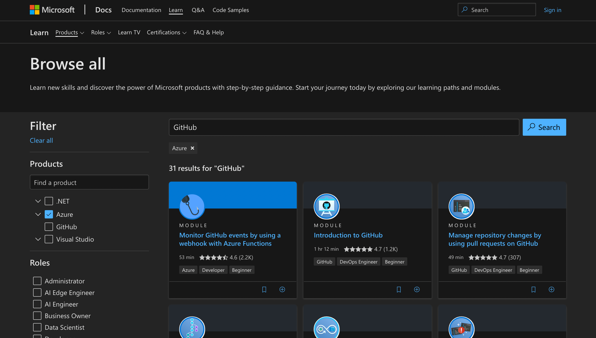

Often, I'm asked the question how do I get started with Azure? Are there any resources, tutorials, guides that you can recommend? I know about topic X, but how do I learn more? I've been working with (and continuously learning) Azure over the past 7 years or so. When I started, the main resources were Microsoft Docs and community sites. Both great resources, but there was a gap for a truly educational resource, rather than technical reference material. Enter [Microsoft Learn](https://docs.microsoft.com/en-us/learn/).

Microsoft Learn is a free online learning platform that was announced back in Ignite 2018. 2018 sounds like a long time ago, but feels like not long ago at all! As a result, I'm still finding that there are some folks who haven't used it, or are aware of it but have used it quite some time ago. As a fun fact, I wrote up some of the initial content for the architecture modules before it was launched at Ignite, so played a small part in helping with the initial release - which is a fun anecdote!

So what is Microsoft Learn? It is a platform focused around... clue is in the name - Learning! Initially launched with modular based content and learning paths, the platform has continued expanding over the recent years not just in content, but in terms of approaches that you can learn as well.

Microsoft Learn isn't *just* about Azure, but also has content relating to GitHub, Dynamics 365, Microsoft 365 and more. But those are all large subject matter areas. What if you're a developer? Or a security engineer? A solutions architect? Or a DevOps engineer? Microsoft Learn has you covered, as you can also view the content available based upon role.

Go ahead and navigate over to [Microsoft Learn](https://docs.microsoft.com/en-us/learn/) and explore the "Products" tab or the "Roles" tab, and you'll understand the point I'm making here! The content in these pages is split across two types -

* **Modules** - A series of related articles, videos and labs/exercises to help you increase your skills on a given topic. Modules are split up into *units*, allowing you to consume content in a bite-sized way - no matter how much time you have available!
* **Learning Paths** - A collection of modules, typically organised under some role-based or technology-based scenario.

The best bit? You may not appreciate this until you sign up or login, but Microsoft Learn is gamified! As you complete a unit, you gain XP. As you complete a module, you not only learn additional skills but also gain a badge. Continue along a learning path and you earn a trophy. If learning some new skills wasn't enough, then yes - you can absolutely challenge yourself to achieving new levels on Microsoft Learn if you work well by setting goals/challenges!

Now I mentioned a bit earlier that in some cases, you may consume content through labs or exercises. You don't necessarily need to have access to / use your own Azure Subscription for these exercises. In these scenarios, you typically use the "Microsoft Learn Sandbox" to complete these exercises, so that you can complete your learning without having to install a series of tools, and accrue cost on your Azure subscriptions.

So, we have a free online learning platform, that is gamified, with content broken down into units / modules / learning paths so that we can learn based upon the amount of time we have available? Yep, that's exactly right.

This content isn't just about people who are brand new to Azure. What if you're a specialist in a certain domain (e.g. a developer), but want to start exploring data science concepts? The content is absolutely relevant to you! Cloud in general is a very broad space, so there's absolutely an opportunity to skill up within your current domain, or learn something new - even if you're an experienced hand at Azure!

But take a moment to think about that thought, some of these learning paths and modules are likely more appropriate for certain personas or role types than others. It's no coincidence that the Microsoft Azure Certifications are also aligned as role-based certifications (e.g. The [Azure Administrator Associate](https://docs.microsoft.com/en-us/learn/certifications/azure-administrator/), [Azure Developer Associate](https://docs.microsoft.com/en-us/learn/certifications/azure-developer/), [Azure AI Engineer Associate](https://docs.microsoft.com/en-us/learn/certifications/azure-ai-engineer/)).

If you click on any of those example links, you'll notice that each one of those certification pages also provides a link back to the relevant learning paths for that syllabus. Taking that one step further, The [Microsoft Learn Team announced](https://techcommunity.microsoft.com/t5/microsoft-learn-blog/stay-current-with-in-demand-skills-through-free-certification/ba-p/1489678) that you will be able to take renewals for certain certifications online, rather than having to sit the exam once your certification expires. So not only can you use Microsoft Learn to prepare for your certification renewal, but in some cases - it's even the platform that you'll use to renew your certification!

Now one final thing. Not everyone learns in the same way. I myself am a visual person, and also like to be able to interact / get hands on where I can. That means I lean well to exercises, and video based content. There is also an area on Microsoft Learn called [Learn TV](https://docs.microsoft.com/en-us/learn/tv/) which has content scheduled across a number of series types. So if you're someone who prefers information to be presented visually / explained, then this may be a section for you! The content is scheduled, and you can check out the latest and greatest, as well as the featured content over on Learn TV.

There is such a huge amount of content on Microsoft Learn. I think it's an incredibly valuable platform, making learning easy and accessible. And remember, it's **free**. So why not go ahead and start your learning journey today over on [Microsoft Learn](https://docs.microsoft.com/en-us/learn/)?

What will you start learning first? I'd love to hear more over on [Twitter, @reddobowen](https://twitter.com/reddobowen). With that, thanks for taking the time to read this blog post! Until the next one, bye for now!

