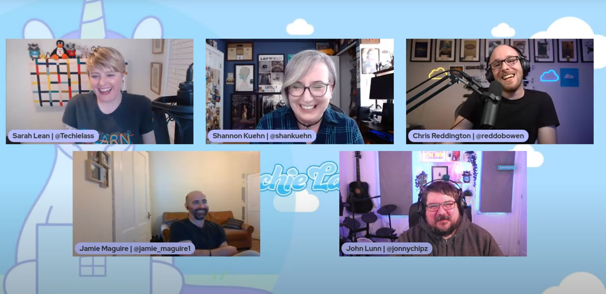

## Introduction

In case you missed it, [Shannon Kuehn](https://www.shankuehn.io/), [Jamie Maguire](https://jamiemaguire.net/), [John Lunn](https://jonnychipz.com/) and I joined [Sarah Lean](https://www.techielass.com) for a [panel livestream on her channel](https://www.youtube.com/watch?v=J5q_DZJRpYM) talking about our experiences getting started with blogging, and our experiences with blogging platforms. In this post, I want to focus on the first aspect - how you can get started with blogging, and some of the common themes / recommendations I've heard, not just from this session, but from other active community contributors.

## Just get started

I've had many failed attempts at blogging. Just look back at my blog posts on CloudWithChris, and you'll see how far they date back. You have to start somewhere. On that point, you won't be creating masterpieces from the very beginning. I compare this to some of the content that I've made in my podcasts / video content. My initial podcast content was very scripted, and planned ahead of time, whereas now I've learned the balance between being natural and enough up front planning to successfully execute my ideas into reality. That said, analysis paralysis can always take over.

* What if someone else has already written a blog post about it? You'll likely have a different story, or different angle to the previous article. Why not reference their work, and build upon it - telling your own story?
* What if I'm not the world's expert in that area? We're all learning, and we can all learn together. This is the idea behind community, is that we will all have our various interest areas. You'll likely be stronger in some areas and have room for development in others. Where can you help others grow and contribute back?
* What if my content isn't good enough? This is a hurdle that you'll need to work through. Everyone goes through it, and it's easy to get caught in the analysis paralysis of 'should I release this'. The answer is YES! As Jamie said on the Livestream, Just clich publish - learn to dance with the fear.
* Linking to the above point, the beauty of this is that with each blog post, or each vlog or podcast, you can take that as a learning experience. Some people hate listening or watching themselves back in the recording. I'm one of those people. But, I've had to get used to that - so that I can listen to my content and improve. I listen/watch back every single episode, so that I can aim to take at least one improvement point away and carry it forwards to keep building even more quality content.

## Set yourself up for success

You won't suddenly be the most upvoted article on Reddit, or having your content retweeted by thousands of users on Twitter. Growing your presence takes time, patience and perseverance. I have a goal this year of reaching 500 subscribers on my YouTube channel. It's getting there, but it feels like a slow process.

To work towards that growth, it's good to have a series of mini-goals to work towards, rather than one over-arching goal. I'd recommend that in any scenario. One of the tricks that I have to reduce my anxiety and protect my mental health is not think of the 'overall large goal' but break it down into smaller, more managable pieces. Try not to make the mole-hill a mountain.

Now on that point, it's important to also not bite off more than you can chew. Be realistic, and start at a level that makes sense. I presented at the Northern Azure User Group last week, where Scott Hanselman was the other presenter. He gave some great advice on this front, so I'll paraphase what he said. If you write one blog post a week, that's 50 posts throughout a year. If you do that over 20 years, that's 1,000 articles. That's a portfolio which shows huge amounts of value compared to lines on your CV. If you write 2 articles a week over 20 years, then that's 2,000.

So hopefully you get the idea here. You don't need to boil the ocean and start running too quickly. Find your rhythm, and the cadence that works well for you. For example, since the beginning of this year, I've been doing the following -

* Monday is the release of my Weelky Vlog
* Tuesday may be community commitments (e.g. Azure Thames Valley) or other presenting commitments
* Wednesday is blog day. The first Wednesday of each month is also Cloud Gaming Notes
* Thursday I'll aim to work on some Cloud Drop bite-sized content.
* Friday is a release of my "main" podcast series, or long-form video/audio content for that week, e.g. Architecting for the Cloud one Pattern at a time

I'm going to slightly adjust that cadence, and experiment with the below -

* Sunday is the release of my Weekly Vlog
* Monday is a blog day
* Tuesday may be community commitments. If not, I'll aim to work on some Cloud Drop bite-sized content.
* Wednesday is a blog day. The first Wednesday of each month is also Cloud Gaming Notes.
* Thursday I'll aim to work on some Cloud Drop bite-sized content.
* Friday is a release of my "main" podcast series, or long-form video/audio content for that week, e.g. Architecting for the Cloud one Pattern at a time

So as you can see, slight tweaks to the plan which has grown organically over time. The point is, is that you also need to be kind yourself. Don't burn yourself out and try to push too much out at once, and then not having anything to push out later on. Set yourself up with a cadence that is feasible and then make adjustments / experiment with that cadence over time.

Over time, you will find that you naturally build your following based upon building quality content. This takes time. Likewise, producing content takes time. We'll all be at different stages of our life, and how much time we'll be able to dedicate to some of these efforts (e.g. whether we have children / other family members to look after, other commitments, or hobbies that we want to prioritise). Don't compare yourself to others, and focus on your journey, and the stories that you want to tell through the content that you will create.

## Do it for your own reasons

I cannot stress this enough. We'll each have our own reasons for content creation. Whether that is contributing back into the community, showcasing a passion area or building your portfolio. Do it for your own reasons, and make sure that you're being true to yourself.

This shouldn't feel like a second job, but is something that motivates you and you're excited about. For me, there are a few reasons.

* I love helping people. You'll notice from the content that I produce, they are focused around areas that I am passionate about. DevOps, GitHub, Azure technologies related to Developers, Gaming, Mental Health. These are all based on my experiences and the stories that I want to tell.
* For me, this is also part of my career development. I don't necessarily have a grand master plan, but I know that I want to get more involved in community events / developer relations. I have a goal in my mind that I'd love to be able to Keynote a conference. Building up this experience of content creation, speaking at local meetup events and virtual conferences helps me work towards that goal.
* Sometimes, I've solved a problem and I know that i'll inevitably need to go ahead and solve it again in the future. If that's the case, why not write it into a blog post so that it's discoverable and not just hidden away in my own OneNote? If it's on my own blog site, then anyone also encountering the same problem can also factor

Your goals will be different to mine, and that's absolutely fine. But going back to something I said a little earlier, be true to the reasons that you started this journey. If you need to write it in a blog post, so that you can go ahead and refresh your memory so often - Do it! If you need to go ahead and write it in a sticky note on your screen, so that you get that occasional reminder, write it! Ultimately, this process should bring you joy and satisfaction, rather than feeling like an additional item on the to-do list or another chore. It can sometimes feel like that, so making sure you get the right balance and check in with those feelings, is key.

These are my own perspectives. I'd of course encourage you to take a look at [the panel livestream](https://www.youtube.com/watch?v=J5q_DZJRpYM) that I mentioned earlier on. Do you have additional tips, or perhaps some alternative thoughts? Please do share them, I'm also on this journey and would love to learn from your own insights! Let me know over on [Twitter @reddobowen](https://twitter.com/reddobowen).

I hope you've enjoyed this post. If you have, please go ahead and share it on with anyone else you know that may be considering their journey into blogging and content creation in general. Until next time, thanks for reading - and bye for now!