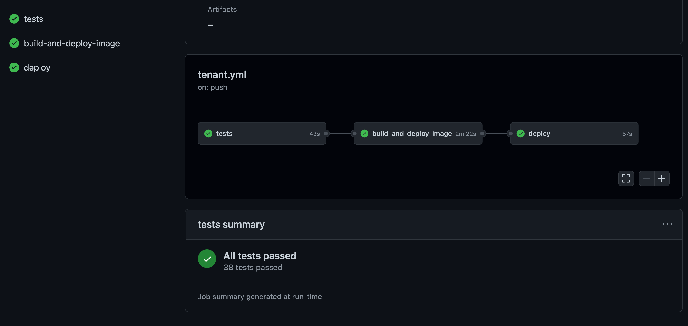

GitHub recently posted about a new GitHub Action that can be used to summarise your test results. The action is called `test-summary/action`, available at [github.com/test-summary/action](https://github.com/test-summary/action). There are several examples on how to use the action at [github.com/test-summary/examples](https://github.com/test-summary/examples). However, there were no examples on how to use this with Go. I [contributed a pull request](https://github.com/test-summary/examples/pull/1) which showed how to achieve this. In this post, I will show how to use the action with Go.

## Introducing the test-summary/action GitHub action

I recently spotted the [upcoming job summaries capability](https://github.blog/changelog/2022-05-09-github-actions-enhance-your-actions-with-job-summaries/) announced on the GitHub changelog. I've been eagerly waiting for this to come to fruition.

Fast forward a couple of weeks, and I spotted [another post from GitHub](https://www.linkedin.com/posts/github_github-test-summaryaction-show-a-helpful-activity-6931315954572292096-LYht) on LinkedIn. This post was about a new GitHub Action called `test-summary/action`, which appears to be made by Edward Thomson. It's a simple action that can be used to summarise your test results. It looks as though this action uses the job summary capability that I mentioned from the changelog.

I thought it would be a good idea to try it out with Go. After exploring the [examples repository](https://github.com/test-summary/examples) for the GitHub action, I found that an example didn't yet exist for Go. I decided to create one.

The ``test-summary/action`` action is currently able to build summarised based on JUnit XML or the TAP test output.

This immediately got me thinking, is it possible to use the action with Go?

## Options to output Go tests to alternate formats

Typically, Go tests are executed by using the ``go test`` command. As far as I'm aware, this command is typically coupled with additional bash commands to output to a file.

There is no capability to output in the JUnit XML or TAP test output format from the default testing package. This then started me on a trail of research. What are the options to convert the test output to a format that can be used with the action?

For the TAP test output - I stumbled upon [this GitHub repository](https://github.com/mndrix/tap-go), though it looks like the GitHub repository is archived / read only. Unfortunately, I couldn't find any alternate shims / examples to convert from the default test format into TAP.

However, the JUnit XML format proved to be a little more successful. I quickly found the [go-junit-report GitHub repository](https://github.com/jstemmer/go-junit-report), which is a simple library that can be used to convert the Go test output format into the JUnit XML output (making it usable with the action).

### Using the go-junit-report 

To use the go-junit-report library, you first need to install it. This is done by running the following command (which will be very familiar if you've installed any other Go tools).

```bash
go install github.com/jstemmer/go-junit-report@latest
```

Great, you now have the go-junit-report library installed. Next up, you'll need to pipe the output of your ``go test`` command into the ``go-junit-report`` library.

```bash
go test -v 2>&1 ./... | go-junit-report -set-exit-code > report.xml
```

Let's break that line down a little further. Let's first look at the ``go test -v 2>&1 ./...``.

First up, we're running the ``go test`` command. This will run all of the tests in the current directory. The ``-v`` flag will output the test output in a verbose format.

The 2>&1 is a redirection operator. This is used to redirect the standard error to the standard output. This is typically useful when you want to capture the output of a command and then redirect it to a file.

Finally, the ./... is a wildcard. This is used to indicate that you want to run all of the tests in the current directory.

Now let's look into the ``go-junit-report -set-exit-code > report.xml`` part.

Firstly, the ``go-junit-report`` library is used to convert the test output from the Go test output into the JUnit XML format.

The ``-set-exit-code`` flag is used to set the exit code to 1 if any tests failed. This is used to show that the job failed, and is particularly useful in the context of GitHub actions (i.e. this step in the job failed)

Finally, the ``> report.xml`` part is used to redirect the output of the ``go-junit-report`` library to the ``report.xml`` file.

At this point, you may be seeing the direction we're heading. We need to take the steps used above, and use those directly within a GitHub Action workflow.

## Using the go-junit-report library within a GitHub Action

I've been working on a private GitHub repository, where I've been building a multi-tenant SaaS application. I'm using Azure Container Apps, Dapr, KEDA and Go as my primary toolset. I've built the individual microservice using a Hexagonal Architecture, which lends itself well for testing.

I already wrote a test suite for each of the microservices. The tests were already being executed in a GitHub Action workflow, to determine whether the code was working as expected. 

Given I already had the testing framework set up, I thought that this could be an easy project to convert and test my logic.

Below, you can see the resulting GitHub Action workflow that I created -

```yaml
name: 'Publish Tenant Container Image'

on:
  push:
    branches:
      - main
    paths:
      - 'api/tenant/**'
  pull_request:
    branches:
      - main
    paths:
      - 'api/tenant/**'

env:
  AZURE_ACR_NAME: cwceventplatform
  AZURE_ACR_ENDPOINT: cwceventplatform.azurecr.io
  IMAGE_NAME: eventplatform/tenant

jobs:
  tests:
    runs-on: ubuntu-latest
    env:
      MICROSERVICE_LOCATION: api/redirect/
    steps:
      - name: 'Checkout GitHub Action'
        uses: actions/checkout@v3
        
      - name: Generate Mocks and Run Tests
        working-directory: ${{ env.MICROSERVICE_LOCATION }}
        run: |
          export GOPATH="$HOME/go/"
          export PATH=$PATH:$GOPATH/bin
          go install github.com/golang/mock/mockgen@v1.6.0
          go install github.com/jstemmer/go-junit-report@latest
          go generate ./...
          go test -v ./... | go-junit-report -set-exit-code > report.xml
        
      - name: Test Summary
        uses: test-summary/action@v1
        with:
          paths: |
            ${{ env.MICROSERVICE_LOCATION }}/report.xml
        if: always()

  build-and-deploy-image:
    if: github.event_name  == 'push' && github.ref == 'refs/heads/main'
    needs: 
      - tests
    permissions:
      id-token: write
      contents: read
    environment: production.build
    runs-on: ubuntu-latest
    env:
      MICROSERVICE_LOCATION: api/tenant/
    steps:
      # checkout the repo
      - name: 'Checkout GitHub Action'
        uses: actions/checkout@v3

      - name: 'Download swagger CLI'
        run: |
          sudo apt update
          sudo apt install -y apt-transport-https gnupg curl
          curl -1sLf 'https://dl.cloudsmith.io/public/go-swagger/go-swagger/gpg.2F8CB673971B5C9E.key' | sudo apt-key add -
          curl -1sLf 'https://dl.cloudsmith.io/public/go-swagger/go-swagger/config.deb.txt?distro=debian&codename=any-version' | sudo tee /etc/apt/sources.list.d/go-swagger-go-swagger.list
          sudo apt update 
          sudo apt install swagger

      - name: 'Generate Swagger JSON'
        working-directory: ${{ env.MICROSERVICE_LOCATION }}
        run: |
          swagger generate spec -o cmd/httpserver/swagger/swagger.json
        
      - name: 'Az CLI Login via OIDC'
        uses: azure/login@v1
        with:
          client-id: ${{ secrets.AZURE_CLIENT_ID }}
          tenant-id: ${{ secrets.AZURE_TENANT_ID }}
          subscription-id: ${{ secrets.AZURE_SUBSCRIPTION_ID }}
        
      - name: 'Build and Push Tenant Container Image'
        working-directory: ${{ env.MICROSERVICE_LOCATION }}
        run: |
          az acr login --name ${{ env.AZURE_ACR_NAME }}
          docker build . -t ${{ env.AZURE_ACR_ENDPOINT }}/${{ env.IMAGE_NAME }}:${{ github.sha }}
          docker push ${{ env.AZURE_ACR_ENDPOINT }}/${{ env.IMAGE_NAME }}:${{ github.sha }}
  deploy:
    needs: 
      - build-and-deploy-image
    permissions:
      id-token: write
      contents: read
    environment: production.deploy
    runs-on: ubuntu-latest
    env:
      CONTAINERAPP_NAME: ep-tenant
      CONTAINERAPP_RG: event-platform-rg
    steps:
      - name: 'Az CLI Login via OIDC'
        uses: azure/login@v1
        with:
          client-id: ${{ secrets.AZURE_CLIENT_ID }}
          tenant-id: ${{ secrets.AZURE_TENANT_ID }}
          subscription-id: ${{ secrets.AZURE_SUBSCRIPTION_ID }}
        
      - name: 'Deploy Tenant Container Image'
        run: |
          az extension add --name containerapp
          az containerapp update -n ${{ env.CONTAINERAPP_NAME }} -g ${{ env.CONTAINERAPP_RG }} --image ${{ env.AZURE_ACR_ENDPOINT }}/${{ env.IMAGE_NAME }}:${{ github.sha }}
```

In the above workflow, you will see that I have a tests job, which will run the tests. Let's focus in on that section.

```yaml
jobs:
  tests:
    runs-on: ubuntu-latest
    env:
      MICROSERVICE_LOCATION: api/redirect/
    steps:
      - name: 'Checkout GitHub Action'
        uses: actions/checkout@v3
        
      - name: Generate Mocks and Run Tests
        working-directory: ${{ env.MICROSERVICE_LOCATION }}
        run: |
          export GOPATH="$HOME/go/"
          export PATH=$PATH:$GOPATH/bin
          go install github.com/golang/mock/mockgen@v1.6.0
          go install github.com/jstemmer/go-junit-report@latest
          go generate ./...
          go test -v ./... | go-junit-report -set-exit-code > report.xml
        
      - name: Test Summary
        uses: test-summary/action@v1
        with:
          paths: |
            ${{ env.MICROSERVICE_LOCATION }}/report.xml
        if: always()
```

Overall, this job performs the following steps -

* Pull down a copy of the code from GitHub
* Generate the mock code using ``mockgen`` which will be used within the tests
* Run the tests, an convert the output to a JUnit report which will be used to generate a test report
* Generate a test summary, which will be displayed as a job summary in the GitHub UI

And, it really is as simple as that - as you can see from the screenshot below!



## Conclusion

It was fun to play around with the GitHub Actions workflow, and ultimately lead to a contribution back into the community. I'm continuing my own Go learning journey, and I hope that this will be a useful contribution and can be used to build a better experience for developers.

Are you building your Go code using GitHub Actions? Do you think this could work in your workflow? Why not give it a go, and drop a comment below to let me know how you get on?

And finally, it goes without saying - A big thank you once again to Edward Thomson for making this brilliant GitHub action.

Until the next one, thanks for reading and bye for now!