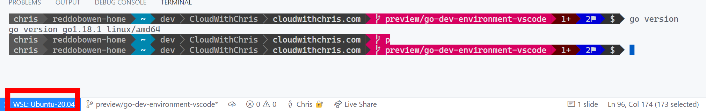

Over the past few weeks, I have been working on a new set of pet projects. I've wanted to learn Go for a while, so I thought this could be a great opportunity to get hands on and try it out. It's fair to say that my development environment was 'functional', but I wanted to revisit it to make sure that I could get the best out of it. In this blog post, I'm going to walkthrough the process of setting up Go on my machine, and then the experience of using Visual Studio Code and Windows Subsystem for Linux (WSL) with Ubuntu.

## A quick introduction to Go

Go (commonly referred to as goland) is a statically typed, compiled programming language. It is a great language for building web applications, but it's also great for building command-line applications. From a language design perspective, it is very familiar to working in C. However, there are a few additional language functions (particularly around memory safety and garbage collection).

Go was originally developed by Google in 2007, and is now maintained by the Go team. You'll be familiar with several of the projects that it powers, including Hugo, Docker, Terraform, Kubernetes and more. It's in the top 15 most popular languages from the [2021 Stack Overflow Developer Survey](https://insights.stackoverflow.com/survey/2021#technology-most-popular-technologies).

Go heavily relies on the concept of packages. A package is a collection of related code. For example, the `net/http` package contains code for working with HTTP requests and responses. More on that in another post though!

## Pre-requisites

I'm going to make some assumptions about your environment.

- You have [Windows Subsystem for Linux (WSL)](https://docs.microsoft.com/en-us/windows/wsl/install) installed
- You have a Linux Distribution installed. I personally use Ubuntu 20.04, but you can use any of the distributions that are available.
- You have [Visual Studio Code](https://code.visualstudio.com/) installed
- You have [Git](https://git-scm.com/downloads) installed

Got that configured? Great! Let's get started!

## Setting up Go on your machine

Like many other languages, Go is a compiled language. This means that you need to compile your code before you can run it. This is done by using the `go` command. If we've never used the `go` command before, it's possible that you don't have Go installed on our machine yet.

Fortunately, the Go developer documentation has a great [installation guide](https://go.dev/doc/install).

> **Note:** It is possible to install multiple versions of Go on your machine. This is useful if you want to use different versions of Go to build different projects (e.g. if there are specific language version dependencies).
>
> You can find the full list of available versions of Go for download [here](https://go.dev/dl/).

Even if you haven't used the `go` command before, it's possible that you have a version of Go installed on your machine. It may be preinstalled by your operating system, or you may have installed it manually. For example, I had a version of Go installed on my machine from the time that I used when running some customisations setting up the [powerline-go](https://github.com/justjanne/powerline-go) configuration for my [ohmyposh](https://ohmyposh.dev/) setup.

The installation process is fairly straightforward, and will of course be different for each operating system. I'll focus on Ubuntu 20.04 in my Windows Subsystem for Linux (WSL) setup.

```bash
# Download the latest version of go
wget https://go.dev/dl/go1.18.1.linux-amd64.tar.gz

# Extract the files to your local directory
tar -xzvf go1.18.1.linux-amd64.tar.gz

# If you are replacing an existing version of Go, you'll need to remove the existing version first
# Note that your location may be elsewhere, depending on any instructions you followed previously
# or previous decisions
#
# Also note that install multiple versions of Go by using the go install command, as documented
# in the Go documentation at https://go.dev/doc/manage-install
#
# sudo rm -rf /usr/local/go

# Now you can move the files to the correct location
sudo mv go /usr/local

# Add the path to your PATH variable. Note the last part about >> ~/.bashrc
# This is important to make sure that the filepath is loaded when you start a new shell.
# If you don't use this, you'll need to run 'export PATH=$PATH:/usr/local/go/bin' 
# every time you start a new shell.
echo 'export PATH=$PATH:/usr/local/go/bin' >> ~/.bashrc

# Verify that the installation was successful
go version
```

Congratulations! You now have Go installed on your machine. Next up, we'll set up your development environment using Visual Studio Code.

## Setting up Visual Studio Code

First, we'll need to open Visual Studio Code so that we can edit the files in our WSL environment. Open Visual Studio Code as you normally would on your Windows desktop environment. Make sure that you have installed the [Remote - WSL](https://marketplace.visualstudio.com/items?itemName=ms-vscode-remote.remote-wsl) extension. This will allow you to connect to your WSL environment from Visual Studio Code.

> **Tip:** There is an extension called [Remote Development](https://marketplace.visualstudio.com/items?itemName=ms-vscode-remote.vscode-remote-extensionpack) that allows you to open code from either WSL, Containers or a remote machine by using Secure Shell (SSH).  

Once you've installed the extension, you can navigate to your Windows Subsystem for Linux (WSL) environment and type ``code .``. This will open Visual Studio Code attached to your WSL environment, but you'll be interacting with it just like you're used to in your Windows environment.

> **Tip:** I use Visual Studio Code insiders, and not Visual Studio Code. To make this work in my environment, I made a slight tweak to my ``.bashrc`` file, by adding the following line.
>
> alias code='code-insiders'

Once Visual Studio Code loads up, take a look at the bottom left hand corner of the window. You should see an indicator that shows you are connected to your WSL environment.



## Setting up the Go Visual Studio Code Extension

Perfect! Now we can start editing our Go code. Well, almost. There's one additional trick that I'd recommend before we start creating.

Let's install the [Go extension for Visual Studio Code](https://marketplace.visualstudio.com/items?itemName=golang.go) which has been made by the Go Team at Google. I have to say, I'm very impressed with the extension. It's a great way to help you use additional tools to as part of your development workflow.

For example, it includes [Intellisense](https://github.com/golang/vscode-go/blob/master/docs/features.md#intellisense), [Code Navigation](https://github.com/golang/vscode-go/blob/master/docs/features.md#code-navigation), [Document Outline](https://github.com/golang/vscode-go/blob/master/docs/features.md#document-outline) of your file, [Syntax Highlighting](https://github.com/golang/vscode-go/blob/master/docs/features.md#syntax-highlighting) and more.

There are some additional features such as [Finding references](https://github.com/golang/vscode-go/blob/master/docs/features.md#find-references), [Finding interface implementations](https://github.com/golang/vscode-go/blob/master/docs/features.md#find-interface-implementations) and more, but these require the Go language server to be installed (gopls).

Overall, there are plenty of quality of life features in the extension that make it a seamless development experience (e.g. automatically my imports, and more).

I'll write up a separate blog post on how I've used Visual Studio Code to debug my Go projects that rely on dapr (additional dependencies running along side). I'm a big fan of Visual Studio Code, and the fact it can be so simple - yet so powerful.

## It's time to Go

Go on now, Go... Yes, go on now. :) We all love a good pun here.

Let's start by creating a new Go project. Simply create a new folder in your WSL environment, and open it up in your Visual Studio Code editor.

Create a file named ``main.go`` in the new folder.

```go
package main

import "fmt"

func main() {
  // Initialise and set a string s
  // to 'Hello World'
  s := "Hello World"

  // Write out the string to the console
  // Return the string for our later step.
  fmt.Println(messageOutput(s))
}

func messageOutput(s string) string {
  return s
}
```

As with any new language, it is right of passage to create a Hello World program. There are a few observations to call out about the structure of this program.

1. The package name is ``main``. The ``main`` package tells the Go compiler that this code should be packaged as an executable, and is not a shared library. In general, packages are the primary way to organize code in Go as shared libraries.
2. We import the ``fmt`` package. This is the package that is used to print text to the console. This is part of the standard library. It's possible to impact packages elsewhere. For example, in the project I'm working on, I'm referencing several packages that are of the format ``github.com/user/repo``. More on those in another blog post though!
3. The function name is ``main``. This is the entry point of our executable. In this function, I initialise a string. I then pass that string as a parameter of the ``messageOutput`` function, and then output the result.
4. There is a separate ``messageOutput`` function defined. This is a function that takes a string as an argument, and returns that string.

Navigate to the file in your terminal, and run ``go run main.go``. This will run the program, and you should see an output of ``Hello World!``.

> **Experiment:** Try and use the command ``go run .``. This would run the program that is associated with a Go module. But you should see an error!
> ``bash go: go.mod file not found in current directory or any parent directory; see 'go help modules'``
>
> More on modules a little bit later. For now though, let's continue!

Let's create a second file to execute a test. We'll validate that we have received the appropriate Hello World input.

```go
package main

import "testing"

func TestOutput(t *testing.T) {
  expected := "Hello World!"
  if actual := messageOutput("Hello World!"); actual != expected {
    t.Errorf("The main function provided an actual of %q but %q was expected.", actual, expected)
  }
}
```

Testing is another package available from the Go standard library. It's a simple way to validate that your code is working as expected. You'll notice that ther e

Now, we can run our test using ``go test main.go``. This will run the test, and you should see an output of ``PASS``, and OK against the file (assuming you matched the inputs correctly!)

## Let's GO further with modules

But, you'll notice we're executing our ``go run`` and ``go test`` commands against specific files. What if we had a bunch of files in our project? Think about a project where have many interfaces, implementations, models, etc. This approach could become unmanagable incredibly quickly.

This is where **Go Modules** come in handy. Consider a module as a collection of packages package that are organized into a directory structure. It will have a specific version, and contain several dependencies.

```bash
# This initialises a module called github.com/chrisreddington/go-helloworld
#
# It does not mean that you are pushing this to the repository, but rather that 
# you are creating a module with that identifier.
# Why follow this pattern? Well, it's a good way to organize your code, and means
# that you can easily share code between projects once you eventually create a
# repository and push your code there.
#
go mod init github.com/chrisreddington/go-helloworld
#
# Running go mod tidy will ensure that the module is in a consistent state,
# i.e. bringing in the latest versions of dependencies as required by your
# imports across the files.
go mod tidy
```

Now, you can use ``go run .`` to execute the module. This will execute the main.go file in the module, and you should see an output of ``Hello World!``. Likewise, we can run ``go test .`` to execute the tests.

Imagine that you have tests across the entire project, and you want to run them all (e.g. tests for your various service implementations, data access layer implementations, etc.). You can do this with ``go test ./...``. This will run all the tests in the project.

## Time's pushing on... Let's git out of here

I'm feeling particularly creative with my section titles today. I hope you appreciate them, as much as the fun I had giggling while making them!

We've created our project. Now it's time to store the contents in version control. I'll be using Git for this. If you're not already aware, Git is a version control system that allows you to track changes to your code. It could be its own entire blog post, so we'll leave that for another time.

In the directory where you stored your Go files, let's initialise a new Git repository on our local machine. We can achieve this by running the ``git init`` command.

We'll then want to add our files to the staging location in our repository. This is done by running the ``git add .`` command.

> **Tip:** We can add individual files to the staging area by running ``git add file.go``. The ``.`` in the above example represents the current directory, so will add all files and folders which are untracked (i.e. have been modified and not yet source controlled).

Next up, we'll commit our changes to the local Git repository. This is done by running the command ``git commit -m "Your message here"`` command. Of course, replace the message with something more meaningful. It's better to be as descriptive as possible, and have separate commits for separate changes.

Finally, you'll need to push your changes to a remote repository. I typically use GitHub for this, but you can use any other Git repository hosting provider that you prefer (e.g. GitLab, BitBucket, etc.).

You will first need to add a remote origin to your repository. This is done by running the command ``git remote add origin {yourlocation}`` command. Replace ``{yourlocation}`` with the location of your remote repository. Then, you'll want to push your changes to the remote repository. This is done by running the command ``git push origin master`` command.

> **Tip:** Often, when you create a new repository on these hosting providers - They will provide you with a snippet on what is needed to push existing code to the newly created remote repository.

## And we're done

That's it for this blog post! Let's recap what we've learned:

* We installed Go in the Windows Subsystem for Linux (WSL) environment on our local machine.
* We set up Visual Studio Code to connect to WSL.
* We then installed Visual Studio Code's Go extension to help with our Go development.
* We created a new Go project, and added a main.go file. Hello world!
* We added a test file, and validated that our main.go file was working as expected. Is it really hello world?
* We then initialised our Git repository, committed our changes and pushed them to the remote repository.

I'll be adding more blog posts as I continue to learn and expand my knowledge of Go. For now, I wanted to cover off some of the fundamentals so that you can begin experimenting with Go.

Have you already started learning Go? What do you think? Drop a message in the comments below! I hope you have enjoyed the content!  If you have any questions resulting from this post, please let me know in the comments. Until the next one, bye for now!