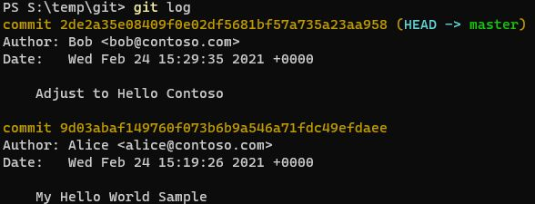

For a while now, I've been using GPG Keys to sign my Git Commits to prove that my commits on GitHub are genuine and from me. Over the last few weeks, I've been inspired by a couple of colleagues (Kudos to Adrian and Julie if you're reading this) to dig out my YubiKey and use these for my key signing activities. While there are several blog posts/samples (e.g. [here](https://disjoint.ca/til/2017/10/05/a-guide-to-setting-up--managing-gpg-keys-on-a-yubikey-4/), [here](https://www.hanselman.com/blog/how-to-setup-signed-git-commits-with-a-yubikey-neo-and-gpg-and-keybase-on-windows) and [here](https://gist.github.com/chrisroos/1205934)) on the topic already, I encountered a number of roadblocks along the way.

The intent of this blog post is to be the first of a series, where we'll explore what GPG is, why it may be valuable to you and how you can get going using them. We'll then take this forwards an additional step, and show how you can use YubiKeys as a second factor of verification and the benefits of this approach. By no means am I the world's expert in cryptography, and some of these topics, but I wanted to document my own understanding for posterity, as I'll inevitably need to repeat/review the process in the future. I hope that this may be useful to you.

So first off, what is GPG? It's sometimes also known as GnuPG, or the GNU Privacy Guard (And in case you're wondering, the GNU project is a free software project that was established in the 1980s, initially aiming to make all parts of an Operating System free. From my research, there is a difference between the GNU Project and the GNU Licenses, but we won't cover that in this series (that was my own curiosity!).

According to the GnuPG site, they explain GPG as the following -

_"GnuPG is a complete and free implementation of the OpenPGP standard as defined by RFC4880 (also known as PGP). GnuPG allows you to encrypt and sign your data and communications; it features a versatile key management system, along with access modules for all kinds of public key directories. GnuPG, also known as GPG, is a command-line tool with features for easy integration with other applications. A wealth of frontend applications and libraries are available. GnuPG also provides support for S/MIME and Secure Shell (ssh)."_

Now we're getting into the world of security and cryptography. Think of the scenarios where you want to send a message to a user, but the receiver wants to ensure that the message is genuinely from you. Or perhaps, as the sender, you only want the receiver to be able to see it, and not get intercepted by any eavesdroppers (Alice, Bob, Eve anyone?). GPG aims to help you solve this problem.

So why is this important in the context of the Git scenario? At this point, I am assuming that you at least know the fundamentals of Git. As a quick primer/refresher, Git is a distributed version control system. Each commit has some metadata associate with it, including a name as well as an email address. That metadata is not linked back to some authoritative source, or verified in any way. For this scenario, let's assume that we have {Alice, Bob, Eve} @ contoso.com, who were introduced earlier in the article. In Git, it's very easy to spoof another user. It's even possible to rewrite history (though I don't recommend you trying this in any live environments if you don't know what you're doing!).

Now, with that context. Let's consider an example of how easy it is to impersonate those other users or potentially rewrite the history.

Firstly, let's go ahead and create a brand new directory. Navigate to it and initialise a Git repository using ``git init``.

Next, navigate into that newly initialised Git repository and set the following **local** configurations -
```bash
git config --local user.email "alice@contoso.com"
git config --local user.name "Alice"
```

**Note: If you already have git configured on your system, then it's especially important to pay attention to the --local flag, so that you don't override any global settings. These changes will only exist within the context of this repository.**

Next, "Alice" creates a file called myfile.php with the below contents:

```php
<?php

echo "Hello World"; 

?>
```
Now if we run git status, we can see that the file is untracked.


This means that the version control is aware that the file exists, but hasn't been formally recognised/versioned within Git. We need to go ahead and first add the file to the staging environment, and then commit the file to the version control.

```bash
git add myfile.php
git commit -m "My Hello World Sample"
```


Now we can see that a change has been made by Alice! Or at least, it appears to be made by Alice. Do you recall us logging in, authenticating or verifying who we are at any point? For now, let's assume that it's a genuine commit by Alice. Let's change our context and become Bob.

```bash
git config --local user.email "bob@contoso.com"
git config --local user.name "Bob"
```

Bob wants to enhance the sample by making it relevant to the company. He changes the sample to echo "Hello Contoso" instead. After making the change, he enters Git status to confirm the file has changes, before staging his changes or making the commit.


Now, Bob runs the following commands -

```bash
git add myfile.php
git commit -m "Adjust to Hello Contoso"
```

Now, "Alice" or "Bob" can go ahead and use git pull to ensure they have the latest version of the repository (or any other user with appropriate access). If they use the ``git log`` command, they will see that there are changes made by two users. Alice, and Bob. Again, it **appears** as though the changes have been made by two users. Again, bear in mind that we haven't had to prove that we are either Alice, or Bob.



Now one final scenario, remember Eve? Well, Eve has become interested in the project and wants to give credit for the great work back to Alice, and remove Bob from the picture.

Now as a side note, you should be super careful whenever performing any functions that are rewriting history of Git commits. If you have already integrated the original code into a repository which other users have access to (e.g. Azure DevOps, GitHub, etc.), then rewriting history may not even be accepted by the remote repository, and if it does may cause a **lot** of pain. Unless you thoroughly understand the consequences of what you're doing, I do not recommend you do this in any kind of live environment. There are plenty of guides/articles on this out there, and goes beyond the scope of this article.

Now, with the health warning out of the way - Let's continue... Eve goes ahead and runs the following script. The script uses the ``git-filter-branch`` command to replace any commits with OLD_EMAIL with NEW_EMAIL, as well as replacing the name. Any commit that matches the if statement in the script will be changed.

```bash
git filter-branch --env-filter '
OLD_EMAIL="bob@contoso.com"
NEW_NAME="Alice"
NEW_EMAIL="alice@contoso.com"

if [ "$GIT_COMMITTER_EMAIL" = "$OLD_EMAIL" ]
then
    export GIT_COMMITTER_NAME="$NEW_NAME"
    export GIT_COMMITTER_EMAIL="$NEW_EMAIL"
fi
if [ "$GIT_AUTHOR_EMAIL" = "$OLD_EMAIL" ]
then
    export GIT_AUTHOR_NAME="$NEW_NAME"
    export GIT_AUTHOR_EMAIL="$NEW_EMAIL"
fi
' --tag-name-filter cat -- --branches --tags
```


See the problem? We have no guarantee on the authenticity of those commits. Are any of those people Alice, Bob or Eve? Are all of the commits potentially fake? Without having some kind of signed commit, we have no certainty. And this is where the value of GPG keys lie in this particular scenario. Being able to showcase that the changes committed have been signed by someone with a key that matches user metadata (e.g. email address).

There's also another potential scenario. If you plan to contribute into Open Source, then some projects may require a Developer Certificate of Origin (DCO)., i.e. some kind of verification that you have made these changes (as well as an agreement that you have the right to commit that code, not stealing / re-using it from elsewhere). Again, GPG signing can be vital in this scenario to prove your authenticity.

GPG keys are based on some common security principals - e.g. Asymmetric key pairs- so that you can get a public key which can be shared with other users, but a private key where you can sign/encrypt, to prove that it is indeed you. I believe GPG handles additional scenarios, but this is the main one we'll focus on. As with any cryptography discussions, making sure that you safely manage your keys (so that no one gains unauthorised access, but that you also have backups in case of any loss of keys) is vital. There are patterns which we'll explore in a later blog post, so that you don't put all of your eggs in one basket, and can have various sub keys for individual purposes (think of this as principal of least privilege, rather than having one super key that has access to lots of different actions/services).

So, let's take stock. We so far know that -
- GnuPG / GPG / GNU Privacy Guard is there to allow you to encrypt/sign your data or communications
- When making changes to a Git Repository, you associate metadata (Name and email address) with each commit. This is unverified metadata, and is unsigned by default.
- We may want to verify that the commits are genuine, for example - if committing to an open source project, or working in some kind of compliant industry.
- GPG could help us in this scenario, as we could sign our commits with these GPG Keys. We would need to share the public portion of our signing key with other users (we'll explore in a later blog post how this is achieved on GitHub), so that they can verify it is us who signed the commits. If we sent encrypted information, then instead of a public/private key pair for signing, we would need a public/private key pair for encryption. But again, we'll explore the types of actions in another blog post

Now as I mentioned, this is going to be a series of blog posts. I don't want to put too much into one post and overwhelm people too quickly! So, this is the initial context around the problem and why you may want to consider looking into this. I hope that this has been useful! In the next post in this series, we'll explore how to go ahead and generate GPG Keys for signing your commits (in this instance, without using a YubiKey).