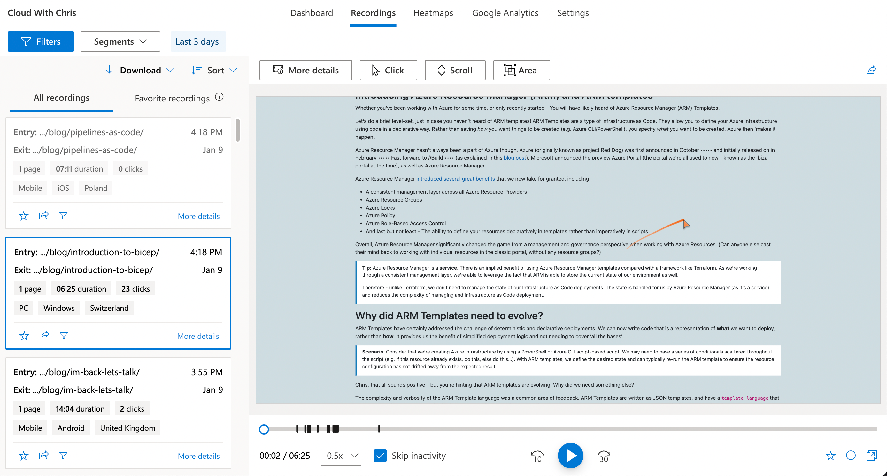
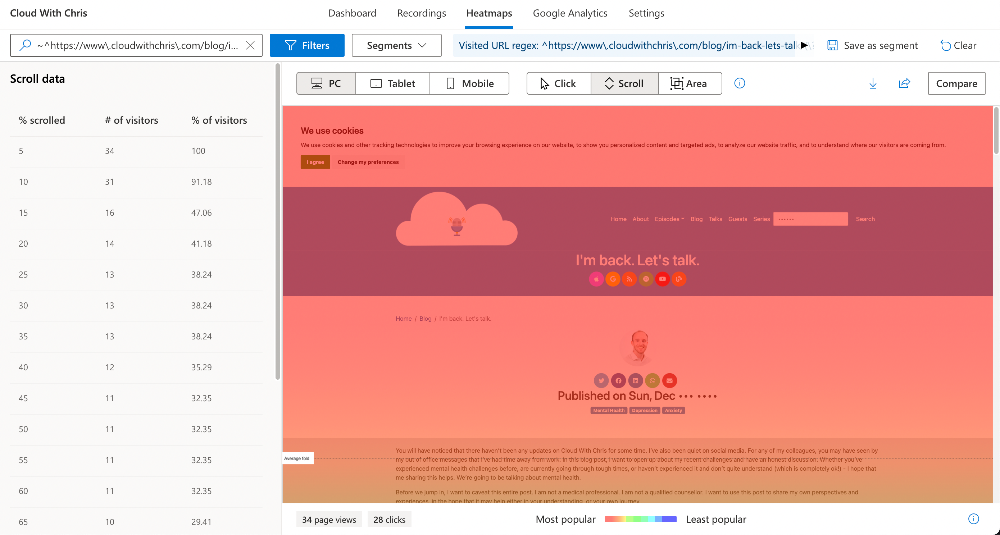
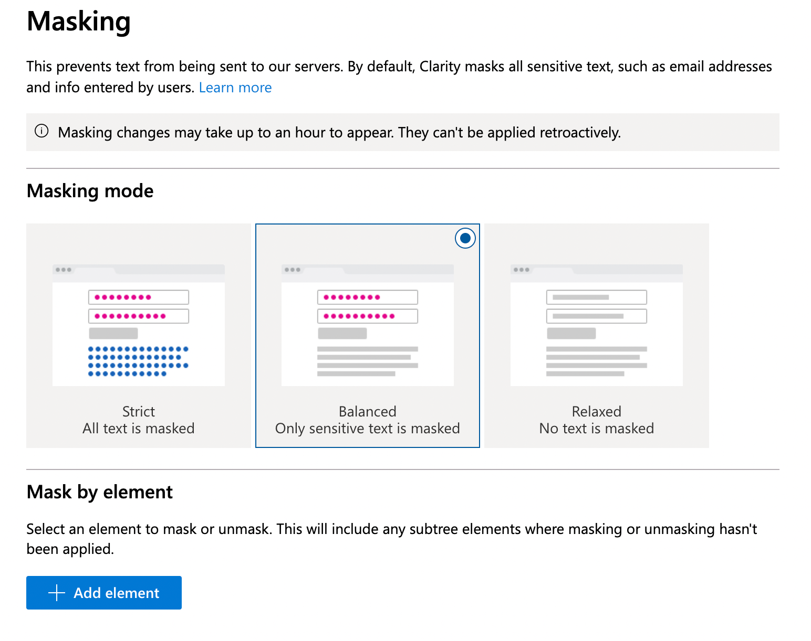

I love learning. Especially when it's about brand new things that I wasn't aware of! For this post, I need to give a big shout out to my friend and colleague [Sam Rowe](https://twitter.com/Sam_Rowe) for the tip. It wasn't a product/service that I was aware of, but felt like something that could be useful for me on Cloud With Chris. In this post, I'll dig into what it is and how it may be able to help you.

## What is Microsoft Clarity?

Microsoft Clarity is a tool that allows you to understand how people use your site.

At this point, you're probably shouting - "Okay, Chris - how is this different to Google Analytics or Application Insights? They gives me all of the insight that I need!". Sure, they give you statistics around user engagement, but do they allow you to **see** how users interact with it?

That's right, imagine that you could **see** how your users interact with your site. Do you lose them at a certain point down the page? Do they frustratingly click in a certain area? Do they scroll 50% of the way on most of your pages, but 90% on your latest post? This is exactly the level of insight which Microsoft Clarity can bring.

We can break down the functionality into a few key areas -

* **Insights** - Just like in Google Analytics, we can get some insightful metrics on our user engagement. You'll notice some new metrics such as dead clicks, quickbacks and rage clicks.
  * *Dead clicks* - Discover when users click but nothing happens
  * *Quickbacks* - Examine moments users move to a new page but immediately return to the previous one
  * *Rage clicks* - Find out where users rapidly click again and again
  * Filter recordings based on sessions where JavaScript errors had been encountered. This allows you to see what the user was doing, before any issues were seen! (Again, getting that balance between stats and understanding of user behaviour).
  * Filter data based on many different filters (e.g. user location, browser session, etc.). You can then utilise this for ongoing tracking by saving this as a segment.

* **Session Recordings** - Statistics are great, but wouldn't it be better if you could see how users are interacting with your site? That's exactly what session recordings enable you to do!
  * The recordings are anonymized, and all data captured is GDPR compliant (more on that later, as there are some considerations that you must make!). You can watch those recordings back in different speeds (just like a YouTube recording).
  * This allows you to understand any points of frustration. Does the user keep clicking on a certain area of your page, so they're expecting a response? Could that be a bug that you had missed?
  * Once again, filter data based on many different filters (e.g. user location, browser session, etc.).

* **Heatmaps** - Session Recordings are great to understand engagement on a case-by-case basis. Heatmaps allow you to understand an aggregated view of user engagement based on Clicks, Area and Scroll depth per page. These are visual charts layered over a render of your site, exactly what you think of when you think of the term 'heatmap'.
  * Where do your users frequently click?
  * What percentage of your users scroll down to a certain part of your site?
  * Even, down to specific HTML elements. You can filter these heatmaps based upon the captured segment information, compare those across user segments and then share that with other members of your team

* **Google Analytics Integration** - If you were in the camp "I'm already using Google Analytics", well, that's great news - Microsoft Clarity integrates with Google Analytics. Let's understand this a bit further -
  * *Google Analytics Segments* - Suppose that you have set up your own [Google Analytics Segments](https://support.google.com/analytics/answer/3123951?hl=en#zippy=%2Cin-this-article), e.g. users from a given city, or in a certain demographic. These segments are automatically imported into Microsoft Clarity, so that you can filter down on them in the generated heatmaps and session recordings.
  * *Enhance Google Analytics* - We mentioned that session recordings are a built-in feature of Microsoft Clarity. If you use Google Analytics as your daily insights driver, then that's no problem - You can view session recordings directly within Google Analytics.
  * *Or, bring Google Analytics to Microsoft Clarity* - Likewise, there is a dashboard in Microsoft Clarity for you to analyse, visualize and explore your Google Analytics metrics.

And the best bit? All of this is **free**. Best to check the [official pricing page](https://clarity.microsoft.com/pricing) in case this ever changes in the future, but it's certainly true at time of writing!

## How does it work?

It's not a video stream! Clarity captures the HTML DOM elements that the user sees, and then records the actions that they take. This way, they are able to build up an animated view of how the user interacted with the page. According to the FAQ, All user sessions are captured but they may not all be available. Those recordings should be available anywhere from 30 minutes up to 2 hours after.

> This is based upon the official Microsoft Clarity page and Documentation. I'd encourage you to check out the latest on the [Microsoft Clarity Documentation](https://docs.microsoft.com/en-us/clarity/faq#session-recordings), just in case any of it changes!

## How does this relate to user privacy, GDPR, etc.?

Privacy is on all of our minds, both as a consumer and as a technology implementer. This is only a growing concern as technology continues to evolve and move forward. Given the nature of this type of technology, there are a few areas for you to consider before implementing.

From the Microsoft Documentation - *"Microsoft Clarity is [GDPR Compliant](https://docs.microsoft.com/en-us/clarity/faq#is-clarity-gdpr-compliant-) as a data controller."* The docs note that it also processes data in compliance with the California Consumer Privacy Act (CCPA). The service relies upon cookies to function - a very important point for us to note.

To comply with GDPR, you must first receive user consent for any cookies used, provide accurate information on the purpose of those cookies and be able to provide access to your site, even if the user declines to allow certain cookies (e.g. tracking cookies, or cookies that enhance the site in some way). There is a wealth of information about [cookies and GDPR](https://gdpr.eu/cookies/) from the European Union (EU).

In addition, the [Microsoft Clarity Terms of Use](https://clarity.microsoft.com/terms) explain that it's your responsibility to obtain consent from individuals in the EU (i.e. if you don't, then you are breaking the terms of the agreement to use the service).

> Lawful Basis of Processing. To the extent that You are required by Data Protection Laws to have a lawful basis of Processing Personal Data, such as consent or legitimate interests, Your Processing of Personal Data will be consistent with that lawful basis. If Your lawful basis of Processing is consent, You will obtain consent consistent with applicable Data Protection Law and the scope of the consent you obtain will enable Microsoft to use the Personal Data it collects for the purposes described in this Section. For example, for individuals in the European Union, you must obtain consent for your use of cookies or other local storage, retain records of consent, and provide individuals with a clear means to revoke consent.

What does that mean? If you want to use Microsoft Clarity on your own site, then you must have some form of opt-in process for cookies prior to you using the service.

Fortunately, I already had that in place for Cloud With Chris. I used the [Cookie Consent Generator on PrivacyPolicies.com](https://www.privacypolicies.com/cookie-consent/). This site is a third party and has no association with Microsoft or Microsoft Clarity. It was actually a handy tool that I discovered some time ago when I added Google Analytics to Cloud With Chris.

It allows you to select your compliance preference (ePrivacy Directive or GDPR & ePrivacy Directive), Customize the end user consent experience and add your JavaScript scripts by type (Strictly Necessary, Functionality, Tracking & Performance, Targeting & Advertising). Then, it's as simple as copying the generated code to your site.

> I went one step further, and took a copy of the ``cookie-consent.js`` which the generated script depends on, and stored it in my site's assets. Why? Because I wanted to limit the number of external calls on my site. This would aid with page load times and help make my site's Content Security Policies (CSP) more manageable. On that note, if you haven't heard of Content Security Policies, I'd encourage you to check [another of my blog posts](/blog/optimise-site-security-headers-com/), where I talk through ways to optimize the security posture by using securityheaders.com.

But wait a second. Isn't there a problem here? Some sites will capture personal data. This could include usernames, email addresses, passwords, addresses, social security numbers, credit card details, and more! Fortunately, that's not the case on Cloud With Chris. But, what if you have those requirements?

The [Clarity FAQs](https://docs.microsoft.com/en-us/clarity/faq) call out certain scenarios where it should not be used -

> Clarity should not be used on sites that contain Sensitive Data including user health care, financial services or government-related information.

Right. So what if you fit into an allowed usecase, but want to ensure private data is not being captured? The service has a concept of [masking content](https://docs.microsoft.com/en-us/clarity/clarity-masking) built-in.

You can choose from several masking modes (Strict, Balanced and Relaxed) to control what text is sent to the Microsoft Clarity servers. You can also use CSS selectors, or attributes in an HTML element to control whether text should be masked or unmasked. Full details are once again available on the [Microsoft Clarity Documentation](https://docs.microsoft.com/en-us/clarity/clarity-masking).

One final point, we referred to a Content Security Policy earlier. If you haven't adopted Content Security Policies (i.e. controlling what external images, scripts, etc. are allowed to be displayed on your site), then Microsoft Clarity should work fairly painlessly. If you have adopted Content Security Policies, then you'll need to [add additional domains](https://docs.microsoft.com/en-us/clarity/clarity-csp) to the appropriate CSP.

> I stumbled upon [csplite.com](https://csplite.com/csp/svc146/) while setting Clarity up on Cloud With Chris. This is another third party site, but looks like it could be a useful reference if you need to adopt several dependencies, but want to use Content Security Policies.

## Wrap-up

I'm impressed at the insight and level of depth that this service provides. And, it's free! What more could you want?

I suppose it does come at a cost. That is, making sure that you have the right provisions in place to adhere to the relevant data protection laws of the users that you're serving. From a GDPR perspective, I already had that in place to enable Google Analytics on the site.

At a later date, I'll create an additional post to talk through any insights that I've learned with this additional service and any new decisions that it drives as part of my content creation.

Thanks for reading, I hope that you've found this one useful! As always, please do drop a comment down below with your own experiences. Are you using a similar tool? Could this be valuable to you? Get involved in the discussion either here, or over on [Twitter @reddobowen](https://twitter.com/reddobowen). Until the next time, bye for now!