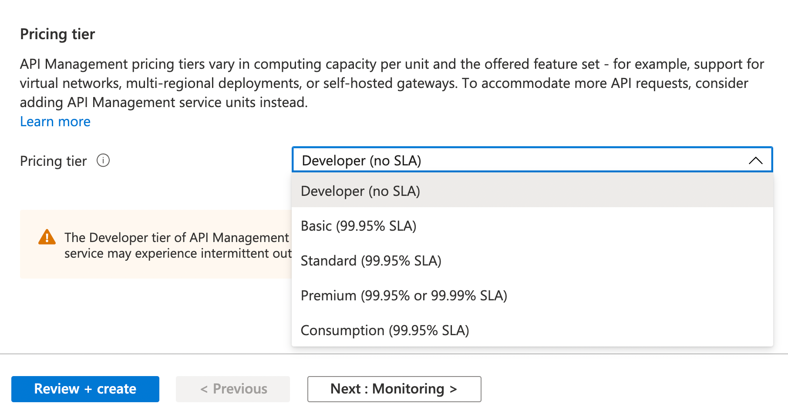
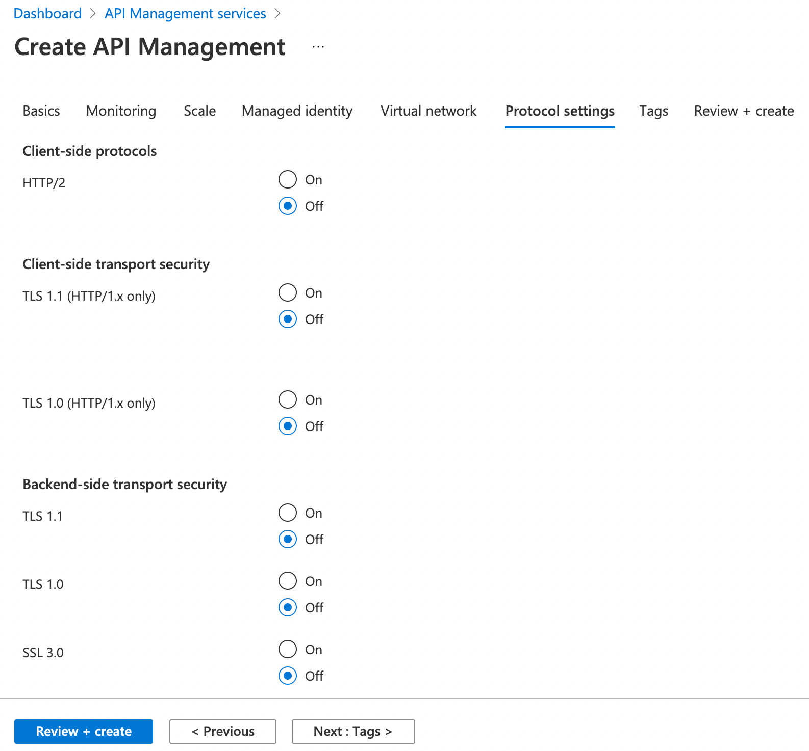
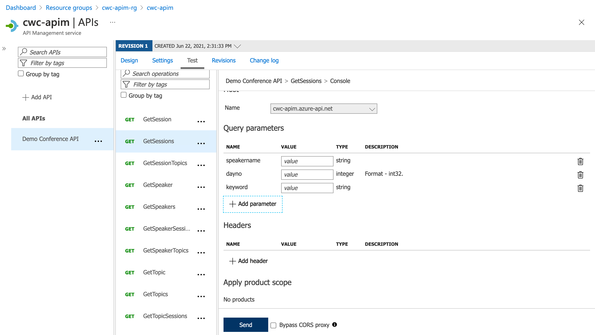

We now live in a world where multiple systems connect or integrate with each other. This is not new, and has been a technology trend for some time. But - in a world of distributed compute (on the increase, thanks to cloud), and the rise of microservices, we find that we have more and more services that we need to integrate with each other. Integration is typically handled through a couple of routes, including Enterprise Messaging (such as message brokers - which we won't cover in this blog post), as well as APIs (Application Programming Interface). There are many areas that we should consider when building our APIs, and that's what we'll give some thought to in this post.

## The Basics of APIs

To call an API, we typically make a request to a specific endpoint. There are many standards or types of APIs, including Open APIs, RESTFUL, SOAP and more. For simplicity, we'll base this discussion on REST APIs. A nice feature of RESTFUL APIs is that they're typically self-documenting, making it clear we're interacting with a collection of resources or an individual resource. To make this tangible, below is an example of different API endpoints (These are for illustration purposes, these endpoints don't really exist!)

| Endpoint                                            | HTTP Verb | Summary                                                                                                                                                                                                                                     |
|-----------------------------------------------------|-----------|---------------------------------------------------------------------------------------------------------------------------------------------------------------------------------------------------------------------------------------------|
| [https://www.cloudwithchris.com/episodes](https://www.cloudwithchris.com/episodes)             | GET       | Gets a collection of episodes                                                                                                                                                                                                               |
| [https://www.cloudwithchris.com/episodes/1](https://www.cloudwithchris.com/episodes/1)           | GET       | Gets the details of the Episode Object with ID 1                                                                                                                                                                                            |
| [https://www.cloudwithchris.com/episodes/](https://www.cloudwithchris.com/episodes/)            | POST      | Creates a new Episode Object in the Episodes collection. ID will be generated by the system, typically provided in the HTTP response. (Typically a body of information, e.g. JSON representation of the object is sent in the HTTP Request) |
| [https://www.cloudwithchris.com/episodes/1](https://www.cloudwithchris.com/episodes/1)           | PUT       | Checks if an Episode with ID 1 exists. If it does, then update it - otherwise - create a new resource with that ID. (Typically a body of information, e.g. JSON representation of the object is sent in the HTTP Request)                   |
| [https://www.cloudwithchris.com/episodes/1](https://www.cloudwithchris.com/episodes/1)           | PATCH     | Updates the Episode with ID 1                                                                                                                                                                                                               |
| [https://www.cloudwithchris.com/episodes/1](https://www.cloudwithchris.com/episodes/1)           | DELETE    | Deletes the Episode with ID 1                                                                                                                                                                                                               |
| [https://www.cloudwithchris.com/episodes/1/platforms](https://www.cloudwithchris.com/episodes/1/platforms) | GET       | Gets a collection of platforms where episode 1 is available                                                                                                                                                                                 |
| [https://www.cloudwithchris.com/episodes/1/platforms](https://www.cloudwithchris.com/episodes/1/platforms) | POST      | Adds a new item(s) to the platforms collection for Episode 1 (Typically a body of information, e.g. JSON representation of the object is sent in the HTTP Request)                                                                          |

> **Tip:** In case you're new to HTTP Request Methods - The GET, POST, PUT, PATCH and DELETE (among others) are well defined method that indicate the desired action when you make an HTTP request to a URL. Look at the list above, and you'll notice that there are a few URLs that are identical.
>
> The HTTP Request Method helps inform the API the intent of the request (i.e. are we creating/updating data, retrieving data, or deleting data). This then helps the backend API determine how to handle the request, and what action to take.
>
> You can find more information at the [Mozilla Developer Network docs](https://developer.mozilla.org/en-US/docs/Web/HTTP/Methods).

## Why even care about APIs?

Firstly, why should we even care about APIs? Let's think about this as a consumer, and as a publisher of a set of APIs. Consider a scenario like a shipping company as the API publisher. The shipping company's primary business is shipping goods from one location, to another. Other organisations like retailers, manufacturers and other industries may rely upon a shipping company to transport their goods to their own end-customers.

Think about the experience for the retailers and manufacturers. Manually creating a shipping request for each individual order placed is not going to scale, which rules out any form of User Interface driven approach. This is where an API could truly add value. The retailers and manufacturers could call the shipping company's shipping-request creation APIs as part of their own order completion process.

### From a publisher's perspective

The APIs are going to be valuable (similar to an asset) to the publisher and their business. That means they'll want to protect the API in a few different ways -

* Should the API be monetized (e.g. external organizations pay some kind of subscription fee to access the service)
* Should the API be protected (e.g. Callers of the API need to be authorized before making calls)

### From a consumer's perspective

The consumer may depend on the publisher's APIs for their own business processes. As the publisher is providing a service, it's fair to expect that they'll be maintaining them without making any breaking changes.

* Any updates to the API should not break the consumer's application. If there are breaking API changes, then these should be versioned.
* Published APIs should be clear to understand, well-defined and well-documented. Typically, the expectation would be that an API publisher has some API portal with documentation available on how to use the API
* The APIs should be available in formats that are needed for their own system. Ideally, these can be transformed on the publisher's side without any overhead required from the consumer.

## Mapping the Architectural Concepts to the Implementation

You'll likely see that we're piecing a few requirements together here -

* Use a facade to decouple the client from the backend. That means that backends can be mocked, so that there isn't a hard dependency on a specific implementation. Likewise, the backend implementation may be able to change as long as the expected 'contract' remains the same.
  * If it doesn't, then we can use API versioning to tackle this. More on that later!
* The ability to verify the caller's authenticity
* To have a Facade in place that enables versioning of APIs, while providing a consistent endpoint for consumers to call.
* To deliver a developer portal to document the APIs available so that consumers can easily adopt the platform.

This is typically where a Facade can be introduced into the picture. In this instance, the Azure API Management resource could act as our Facade, as the broker between the consuming client and the backend APIs that are being served up. This design approach helps us introduce several architectural patterns into our design -

* [Facade Pattern](https://pages.apigee.com/rs/apigee/images/api-facade-pattern-ebook-2012-06.pdf) - Apigee have published an ebook on the API Facade Pattern. They comment that Facades can be useful when backend systems are too complex to expose directly to application developers. Complexity is one aspect, but there may be other concerns (e.g. pinning to a specific version of an API).
* [Gatekeeper Pattern](https://docs.microsoft.com/en-us/azure/architecture/patterns/gatekeeper) - Protect applications and services by using a dedicated host instance that acts as a broker between clients and the application or service, validates and sanitizes requests, and passes requests and data between them. This can provide an additional layer of security, and limit the attack surface of the system.
* [Gateway Aggregation Pattern](https://docs.microsoft.com/en-us/azure/architecture/patterns/gateway-aggregation) - Use a gateway to aggregate multiple individual requests into a single request. This pattern is useful when a client must make multiple calls to different backend systems to perform an operation.
* [Gateway Offloading Pattern](https://docs.microsoft.com/en-us/azure/architecture/patterns/gateway-offloading) - Offload shared or specialized service functionality to a gateway proxy. This pattern can simplify application development by moving shared service functionality, such as the use of SSL certificates, from other parts of the application into the gateway.
* [Gateway Routing pattern](https://docs.microsoft.com/en-us/azure/architecture/patterns/gateway-routing) - Route requests to multiple services using a single endpoint.

## Creating an Azure API Management resource

With that, let's begin looking at deploying Azure API Management. For now, we'll focus on deploying the Azure API Management resource. In future posts, we'll look into setting up API Management policies to protect a set of APIs.

Navigate to the Azure Portal and search for API Management Services. Click create, so that you can begin the creation experience for an API Management resource.

To start, you'll need to provide some basic information about your API Management instance. Several of these are as expected -

* **Subscription** to deploy your API Management instance into
* **Resource Group** to deploy your API Management instance into
* **Region** to deploy your API Management instance into
* **Resource name** of your API Management resource. This will also form part of the domain of your API management instance, e.g. ``{{resourcename}}.azure-api.net``.
* **Organization Name** which is used in the developer portal (if using an appropriate SKU) and sender of notification emails.
* **Administrator email** where any notifications from API Management will be sent.

Finally, you will also be prompted to choose a pricing tier for your API Management instance. There are five tiers; Consumption, Developer, Basic, Standard and Premium.

There are some tangible differences between the tiers, which are [very well documented in the Azure Docs](https://docs.microsoft.com/en-us/azure/api-management/api-management-features). These include Virtual Network integration and developer portal integration to name but a couple.

> **Tip:** Your requirements will truly influence which SKU fits your needs best. Make sure to review the different tiers and feature comparison, so that you can choose appropriately. For the purposes of this blog post, we'll stick with the consumption tier.

Next up, you'll be asked to confirm whether the API Management instance should be linked with Application Insights. This allows you to enable logging of the API calls that pass through your API Management Gateway.

> **Tip:** Once the logger has been associated with your API Management instance, this can be enabled on an API by API basis.

The next tab in the creation experience is scale. Scaling is possible in the Basic, Standard and Premium tiers, but is unavailable in the Developer tier.

Scaling is handled automatically in the consumption tier.

> **Tip:** Think of it in a similar way to hosting an Azure Function. You could deploy an Azure Function into an App Service where you set the scalability limits, and are charged based upon instances used/deployed.
>
> Alternatively, you could deploy it into a Consumption plan which scales automatically, and you are charged based upon usage.

Next up is the managed identity tab. Like many Azure Resources, it's possible to associate a System-assigned managed identity with an API Management instance.

Why would you want to do that?

* You may want to [obtain certificates for TLS/SSL from an Azure Key Vault](https://docs.microsoft.com/en-us/azure/api-management/api-management-howto-use-managed-service-identity#use-ssl-tls-certificate-from-azure-key-vault)
* You may want to [authenticate to a backend resource by using an API Management system-assigned identity](https://docs.microsoft.com/en-us/azure/api-management/api-management-authentication-policies#ManagedIdentity)
* You may want to [connect to Azure Resources behind firewalls using an API Management system-assigned identity](https://docs.microsoft.com/en-us/azure/api-management/api-management-howto-use-managed-service-identity#apim-as-trusted-service)

> **Note:** We won't really be using the system-assigned managed identity in this blog post. However, we may use it in future posts relating to this series.

Virtual Network is the next configuration item. This is not supported in the Basic, Standard or Consumption tiers.

This is supported in the Developer and Production SKUs. If you configure this option, then the API Management instance is deployed directly into the Azure Virtual Network (as opposed to a multi-tenant deployment using private endpoints, for example).

The final API Management configuration option is to do with Protocol settings. This relates to the Client-side protocols, transport security and backend-side transport security.

As with the majority of Azure Resources, you can go ahead and associate Azure Resource Tags. Once you've reviewed the resource configuration and are comfortable, go ahead and create.

> **Note:** As we're creating an API Management resource under the consumption tier, it should only take a few minutes to create. The other tiers (Developer, Basic, Standard and Premium) all take a longer period of time to spin up the underlying infrastructure.

## Azure API Management Concepts

Before we start exploring API Management, let's make sure we understand a few core concepts -

API Management is made up a few components, including -

* An **API Gateway** which takes API calls and routes them to the appropriate backends. It may check against a series of policies along the way (e.g. transformation from one data format to another, checking authorization, enforcing rate limits/quotas, caches responses) and can logs the calls being made.
* The **Azure Portal** is commonly used as the admin interface for your API Management instance. You'll typically add/import API definitions for your API Gateway, associate these with products, manage access (e.g. by linking APIs to products, or managing user access to the developer portal),
* The **Developer Portal** is the web portal/documentation area for consumers of your APIs. This is not only used for static documentation, but can also be used as a console to interact with your APIs for testing purposes.

We've started introducing a few concepts such as APIs, Products and more. Let's explore those a little more thoroughly -

* An **API** represents a set of operations available to developers. It's comprised of a backend service(s), and **operations** that map to operations or methods in the backend service.
* A **Product** is how an API is exposed to the API consumers. A product is associated with one or many APIs. Products can either be *open* or *protected*. The protected products must be subscribed to. These can be approved by administrator, or be auto approved.
* **Groups** are used to manage visibility of products to consumers. There are 3 basic groups, **Administrators**, **Developers** and **Guests** (clearly documented [here](https://docs.microsoft.com/en-us/azure/api-management/api-management-key-concepts#--groups)). Custom groups can also be added, as well as associating identity providers, e.g. AAD for access as well.
* **Policies** are the *magic* behind API Management (in my opinion, anyway!). Policies allow you to define expected behaviour at an API Level, Operation Level or Product Level. Example policies include JWT authorization, transforming data format from XML to JSON, restricting calls based upon rate limiting and many many more. Policies could be a blog post in their own right, and we'll likely explore several policies over the course of several blog posts. As such, we'll not explore them much further in this one.

With that context, let's continue on.

## Making the API Management instance our own

At this point, we have an Azure API Management instance that we can now go ahead and configure to suit our needs. You may have some existing APIs that you want to add or import.

Navigate to your API Management instance, and select the **APIs** option on the left hand menu. You'll notice that the middle column has an **All APIs** section, and below that has No APIs listed.

In the main section of the blade, you'll see that we can create a new API definition, or import based upon certain specifications or existing Azure resources.

I'll be importing an Open API Specification into API Management. However, if you want to choose another option - please do so!

If you're following along, then I chose to use the Demo Conference API which is made available by the API Management team.

It's available at ``https://conferenceapi.azurewebsites.net?format=json``.

Once complete, you should notice that your API list now has an API available. If you imported an existing API, then you may now have several API operations that appear for you.

> **Tip:** Feel free to explore the user interface at this point. It's worthwhile becoming familiar with the different levels that you can operate at (e.g. All APIs, All Operations, Specific Operations), as you can associate policies and change the backend details at each of these levels.

Select one of your API operations. On the top menu, you'll notice that there is a tab called **test**. Click on that. You'll see that you can now go ahead and interact with that API.

You can go ahead and click the test button, specifying any required query parameters, request headers, or request body.

> **Tip:** This is a quick and easy way to test your APIs, including the policies that are applied to your API operations. For example, if JWT Authorization is specified for an API operation, then an Authorization header would be expected, otherwise you would see a failure from API management.

## Gaining value from the Facade - High Cohesion, Low Coupling - Revisions and Versions

Earlier on in the blog post, I mentioned that non-brittle APIs (i.e. no breaking changes) is an important aspect for consumers. That means, we need to consider how we version our APIs.

As an API publisher - If we change the API definition, do we risk breaking the integration experience for our consumers? This is where the value of the facade can come in. Having a broker in between the client and the backend system, which can translate requests, allow us to specify versions of an API, so that we can evolve it over time.

With that thought, we'll talk about revisions and versions within API Management. Let's start off with revisions.

Rather than trying to reinvent the wheel, I thought the Azure API Management docs summarised this perfectly.

> Revisions allow you to make changes to your APIs in a controlled and safe way. When you want to make changes, create a new revision. You can then edit and test API without disturbing your API consumers. When you're ready, you then make your revision current. At the same time, you can optionally post an entry to the change log, to keep your API consumers up to date with what has changed. The change log is published to your developer portal.

The important aspect to understand is that revisions are typically used when there are non-breaking changes. If you must make a breaking change to the API, then you may want to look at creating a new API version (more on that later).

Click on one of your APIs and then select revisions. You should see that there is one revision listed.

Let's go ahead and click **Add revision**.

At this point, you should notice that you can change between different revisions of your API. Remember that only one of these revisions are considered as **production**. You can reach the revisions by specifying them in the request URL, typically with a syntax such as ``;rev=2`` after the API Management instance domain name.

Go ahead and make a non-breaking change to your API. I added a new POST operation called Test. It doesn't actually do anything, but equally - it doesn't break the existing API implementation, so could be considered a revision.

Let's switch back to the previous revision. You'll notice from the screenshot below that the Test Operation that we created is no longer showing. This means that the Test Operation is not yet available in our production API.

This works well when you are making non-breaking changes. But of course, there may be occasions where you need to make a breaking change to an API. How do you achieve that? That's where versions come into the picture!

Once again, the [Azure Docs explain these very well](https://docs.microsoft.com/en-us/azure/api-management/api-management-revisions#versions-and-revisions) -

> Versions and revisions are distinct features. Each version can have multiple revisions, just like a non-versioned API. You can use revisions without using versions, or the other way around. Typically versions are used to separate API versions with breaking changes, while revisions can be used for minor and non-breaking changes to an API.

This gives you the flexibility to split up the implementation of your different API versions. However, the consumer doesn't see that. The consumer continues interacting with the API Management as a facade, and will simply specify which version of the API they wish to interact with. They should have no idea (or even care!) if they're talking to the same backend or an entirely separate backend.

Let's first navigate to an API in our API Management instance. Click on the ellipsis and select Add version.

We have several options when creating a new API version. We can allow the consumer to specify which API version they're intending to use by either -

* Passing the API version in the Request URI
* Passing the API version as a Request Header
* Passing the API version using a query string in the URL

> **Tip:** Note that the UI hints that you must associate your API with a product for it to be published and showing as available to your consumers in the developer portal.
>
> Do remember that the developer portal is not an available option in the Consumption mode.

## Creating Products in API Management

At this point, we have a couple of API versions created. However, we need to make sure that these are visible to our API consumers.

First, head over to the **Products** section of your API Management instance and create a number of products. In the below screenshot, you can see that I have created -

* A **Bronze Plan** product which is **published**
* A **Silver Plan** product which is **unpublished**
* A **Gold Plan** product which is **published**

This was purely for demonstration purposes, but please go ahead with something that's a little more representative for your scenario.

Click on one of the Products. You'll notice in the blade that opens, there is an **APIs** menu item. This is how we can go ahead and associate multiple APIs, or indeed - versions of an API - to a given product. This is what then 'lights up' the functionality to a given set of consumers.

## Wrap-up and Closing Thoughts

This blog post is a little longer than initially planned. However, we've managed to cover -

* An introduction to APIs, including fundamentals of RESTful APIs
* A brief look into the challenges of APIs from the publisher and consumer's perspective
* Mapping the Cloud Design Patterns to the above challenges and tying this to API Management
* A quick tour of the core concepts of API Management
* A brief walkthrough of the Azure API Management creation experience, and setting up a basic API

We'll be continuing this series on in future posts. I'd like to explore different policies that could be used to achieve specific objectives. I may be granular and have a separate post per policy, which gives us the opportunity to go into some depth in each post.

But, that's it for this post. Thank you for reading, and reaching this far - it's greatly appreciated! Have you already been using a tool like Azure API Management, Apigee or similar, and have some additional thoughts? Or, perhaps brand new to these ideas - and now curious about trying them out? Let me know over on [Twitter, @reddobowen](https://twitter.com/reddobowen).

Until the next post, thank you for reading - Bye for now!