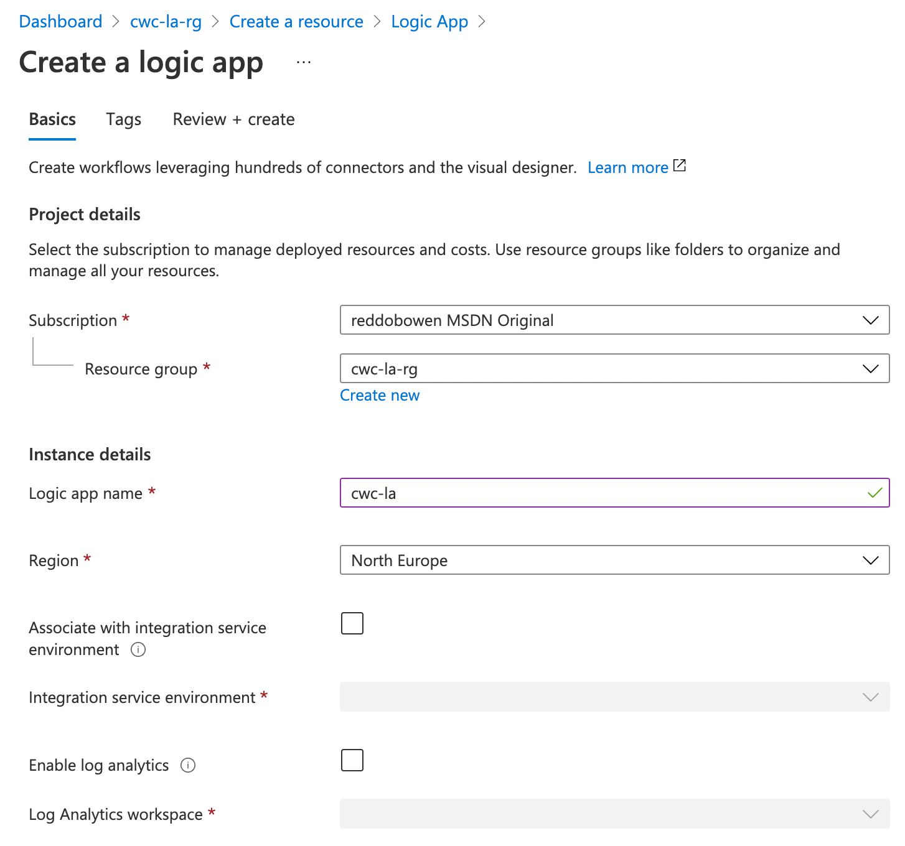

Many years ago, I [wrote a blog post](/blog/integration-platform-as-a-service-logic-apps) which introduced Logic Apps at a very high level when they were initially released. Ahead of a blog post that I want to write on Logic Apps v2, I thought that it may be worth writing a more thorough recap of Logic Apps as a platform.

Logic Apps is a Platform as a Service (PaaS) offering, which allows you to easily build visual workflow integrations. Whether that's plumbing several microservices together, entirely different solutions within an enterprise, or some of the repetitive backend administrative tasks for a podcast or blog site, Logic Apps may be worth exploring.

  > Logic Apps v1 can be offered [in a consumption mode](https://docs.microsoft.com/en-us/azure/logic-apps/logic-apps-pricing). This means that you will get charged based upon the number of invocations/executions that are used within the Logic App. There are other hosting options available, including the Integration Service Environment which would be charged differently. Full details are available in the link provided.

Logic Apps runs / instances start with a trigger. Something has to ensure that a workflow run begins. For example, that could be manually by sending an HTTP Request to a given endpoint, scheduling the workflow to run on a given cadence, triggering based upon an event (e.g. a new item has appeared on an RSS feed).

Once the workflow is triggered, it will then begin running a series of actions. These actions are based on [hundreds of connectors](https://docs.microsoft.com/en-us/azure/connectors/apis-list) that are available for you to consume. The Logic App is not just limited to running these actions in a sequential order. You're able to also add conditions, as well as parallel branches and loops to design complex workflows.

So how do you go ahead and make one of these Logic App workflows? You can create a new Logic App in the Azure Portal.



From there, you'll have the option to use the visual designer to create your workflow. You can create these using code (ARM Templates) if you wish, but I think the Visual Designer makes the authoring experience simple.


You can start from a blank logic app, or existing templates. You'll then be able to configure your workflow based upon your needs using those connectors and actions mentioned earlier.


Now that we understand how we can get started, let's go ahead and explore how I use this for my Cloud with Chris automation behind the scenes. Ultimately, consider this next workflow as the 'receiver' for a series of inputs.

From a sender perspective, I have several Power Automate workflows that consume from sources such as my Cloud with Chris blog RSS feed, Cloud with Chris podcast episodes RSS feed sand new YouTube video releases. After the content has been approved through power automate (with a comment, which ultimately becomes the text that is shared on social media), I post messages in a JSON format to a private Microsoft Teams channel. In a real world / enterprise scenario, I would expect to see a messaging system like Azure Service Bus with Publish/Subscriber, Azure Storage Queues or similar. However, this was more of an 'art of the possible', and plumbing/connecting multiple sources together.

With that context, let's explore the workflow. Firstly, the trigger for the workflow is [a new Microsoft Teams message being posted](https://docs.microsoft.com/en-us/connectors/teams/#triggers) in my 'Reddit' Channel. Once that workflow is triggered, we [initialise a couple of variables](https://docs.microsoft.com/en-us/azure/logic-apps/logic-apps-create-variables-store-values#initialize-variable). A ``content`` variable is initialised as empty and a ``contenttemp`` variable, which is initialised as the content of the message with a bit of manipulation (i.e. removing the name of the person that sent the message).


The next part, then continues the initialisation of variables which continues the cleanup of the incoming message, and then places that information into the ``content`` variable. The next step is to use the [Content Conversion Connector](https://docs.microsoft.com/en-us/connectors/conversionservice/)'s Remove HTML action to remove HTML from the content variable. We then feed the output of that action into the next action; the Parse JSON action.

One thing worth being aware of on the Parse JSON action is that you need to provide a schema of the expected JSON. Below is an example of the schema that I use.

```json
{
    "properties": {
        "Body": {
            "type": "string"
        },
        "Link": {
            "type": "string"
        },
        "Title": {
            "type": "string"
        }
    },
    "type": "object"
}
```

There is an option available in the [Parse JSON action](https://docs.microsoft.com/en-us/azure/logic-apps/logic-apps-perform-data-operations#parse-json-action) to provide a sample payload, so that the schema can be generated on your behalf. You can see this in the screenshot provided below.


Next up, I take the outputs from the previous JSON step and use the [Twitter Connector to post a Tweet](https://docs.microsoft.com/en-us/connectors/twitter/#post-a-tweet) with the approval message as well as the URL to the content.

To make sure that the content is well-marketed, I also post to the relevant subreddits for the content. To do that, I need to make a call to the [Reddit API directly](https://www.reddit.com/dev/api/). That requires a few different pieces of information based on the authentication model that I'm using to the Reddit API - a ``Client ID``, ``Client Secret`` and ``Account Password``.

  > There are several approaches to authenticate to the Reddit API. You will need to assess which authentication method is best for your scenario. As this is a personal integration workflow / personal application, I have opted for this simple approach. If you are building applications for end-users, then you may need to use a different authentication mechanism.
  
You'll notice that all of these are stored in Azure Key Vault. I'm using the [Azure Key Vault connector's Get Secret Action](https://docs.microsoft.com/en-us/connectors/keyvault/#get-secret) with a [Managed Service Identity](https://docs.microsoft.com/en-us/azure/logic-apps/create-managed-service-identity) and the new [Azure Key Vault RBAC capabilities](https://docs.microsoft.com/en-gb/azure/key-vault/general/rbac-guide?tabs=azure-cli#using-azure-rbac-secret-key-and-certificate-permissions-with-key-vault) that [I recently blogged about](/blog/azure-rbac-dataplane) as well.


The next step is to use the ``Client ID``, ``Client Secret`` and ``Account Password`` from the Key Vault actions calling the Reddit API to retrieve an access token by [using the HTTP action](https://docs.microsoft.com/en-us/azure/connectors/connectors-native-http#add-an-http-action).

  > For the specifics of how the Reddit API works, you'll once again need to consult Reddit's documentation. I had previously reviewed some documentation that suggested the API would need to be interacted with using the ``application/x-www-form-urlencoded`` content type. However, you'll need to explore this further to determine the right approach for the APIs you need to work with.

We then once again use the [Parse JSON action](https://docs.microsoft.com/en-us/azure/logic-apps/logic-apps-perform-data-operations#parse-json-action) to determine the output from the HTTP response so that we can use the token as part of the future Reddit API calls. As a reminder, you need to provide the schema in the Parse JSON action. Here is an example of the schema for this action -

```json
{
    "properties": {
        "access_token": {
            "type": "string"
        },
        "expires_in": {
            "type": "integer"
        },
        "scope": {
            "type": "string"
        },
        "token_type": {
            "type": "string"
        }
    },
    "type": "object"
}
```


Next up, we use a Logic App Conditional Step to determine whether we need to post to Reddit or not. If the title contains Vlog, or the approval comment contains #Vlog then it should be posted to [Reddit's /r/vlog subreddit](https://www.reddit.com/r/vlog). To call the Submit API, I pass in the Access Token as a bearer token and pass in the relevant information from the earlier Logic App outputs as a url-encoded string.


Finally, I use another Logic App Conditional Step to determine whether there is a post to [Reddit's /r/Azure subreddit](https://www.reddit.com/r/azure) if the title contains Azure, or the approval comment contains #Azure then it should be posted to. Once again I call the Submit API, by passing in the Access Token as a bearer token and the relevant information from the earlier Logic App outputs as a url-encoded string.


And that is my workflow! As you may have been able to tell from some of my work in GitHub Actions, CI/CD and this Logic App - I'm a big fan of automation and automating repetitive tasks. I found that I have quite an involved process when releasing new content, and wanted to market the content on Twitter, Reddit and additional platforms. Doing this manually took a lot of time. Quite often it would result in me missing things / making mistakes. I'll be planning to build upon this further, and make adjustments. Moving forwards, this could be a good opportunity to use the [publish / subscriber pattern](https://docs.microsoft.com/en-us/azure/architecture/patterns/publisher-subscriber) to more easily add additional platforms for marketing.

I hope that this blog post has been useful, and given you some ideas about how you can automate your own workflows. What are you thoughts? Have you found some inspiration to automate and integrate some of your workflow to make you more productive? I'd love to hear, please let me know on [Twitter, @reddobowen](https://twitter.com/reddobowen).

So, until the next blog post - Thank you for reading and bye for now!