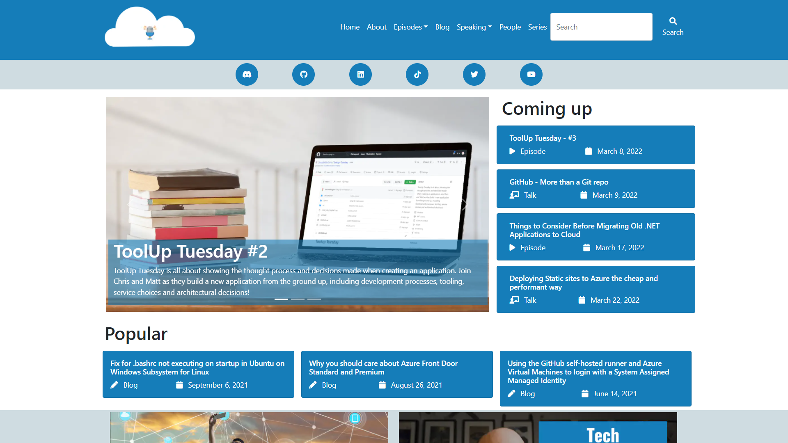
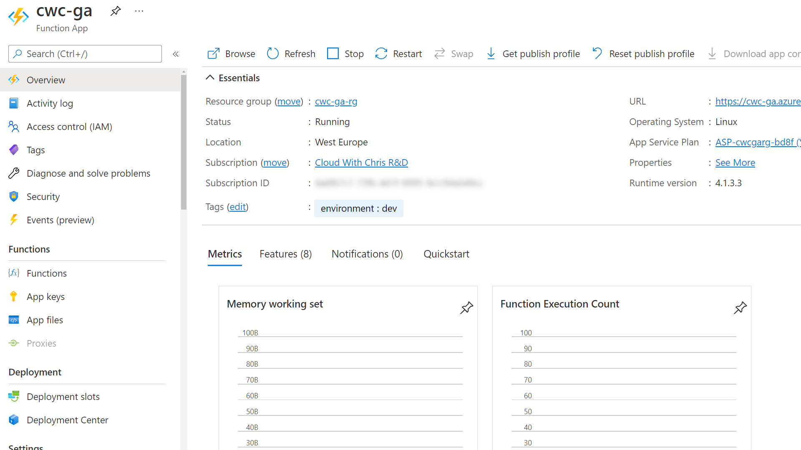
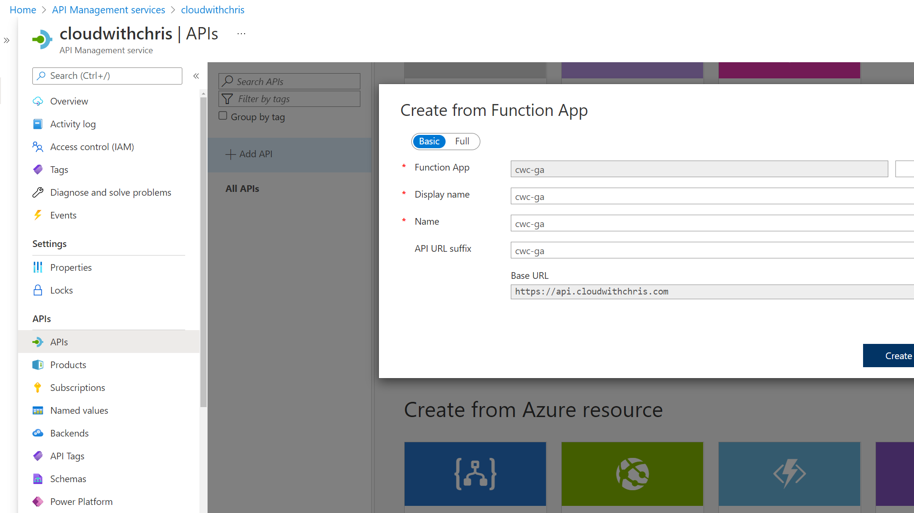
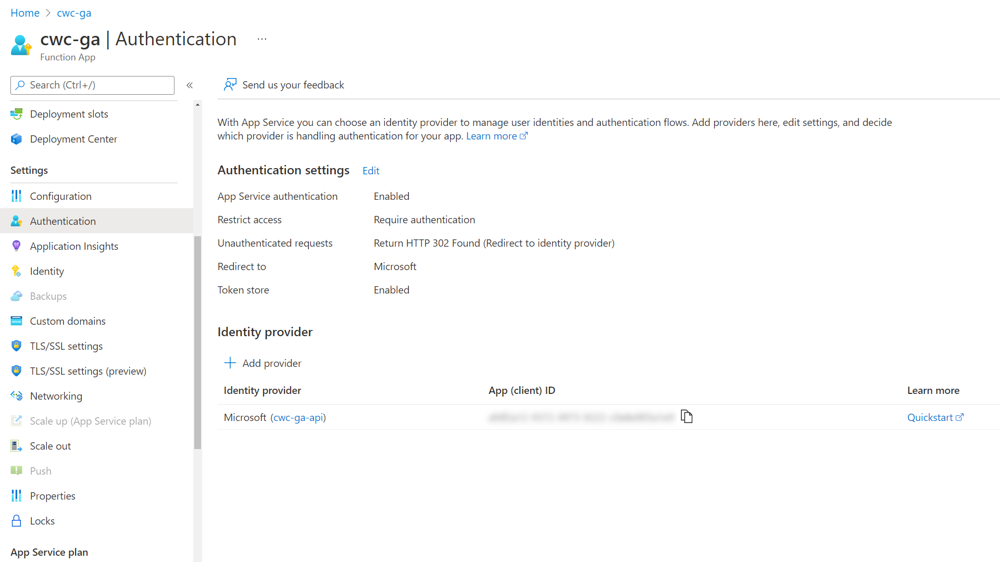
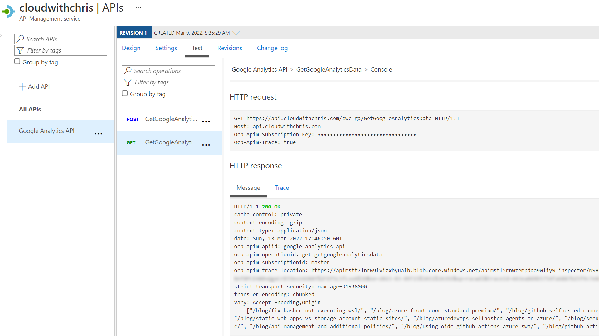
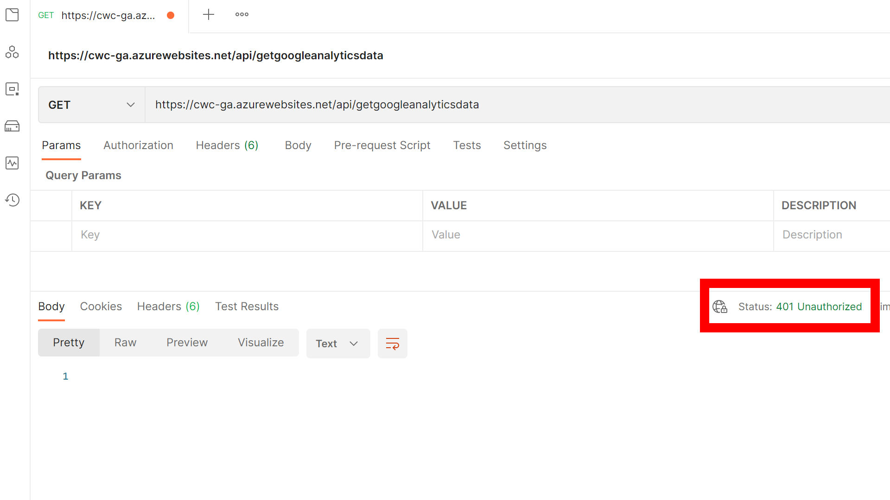
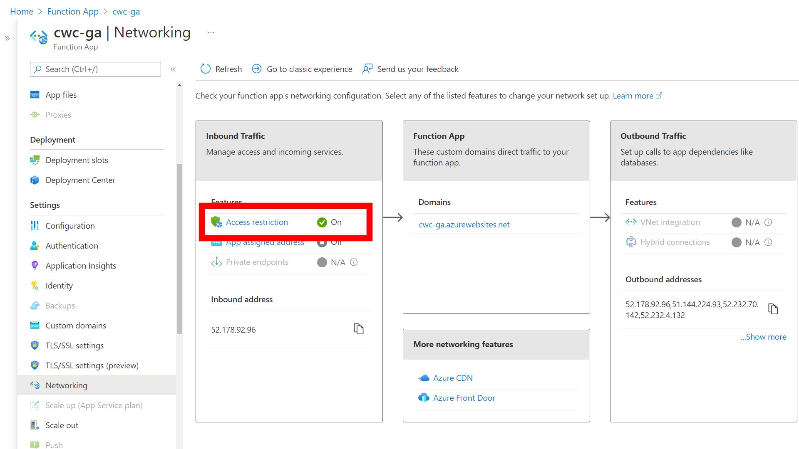
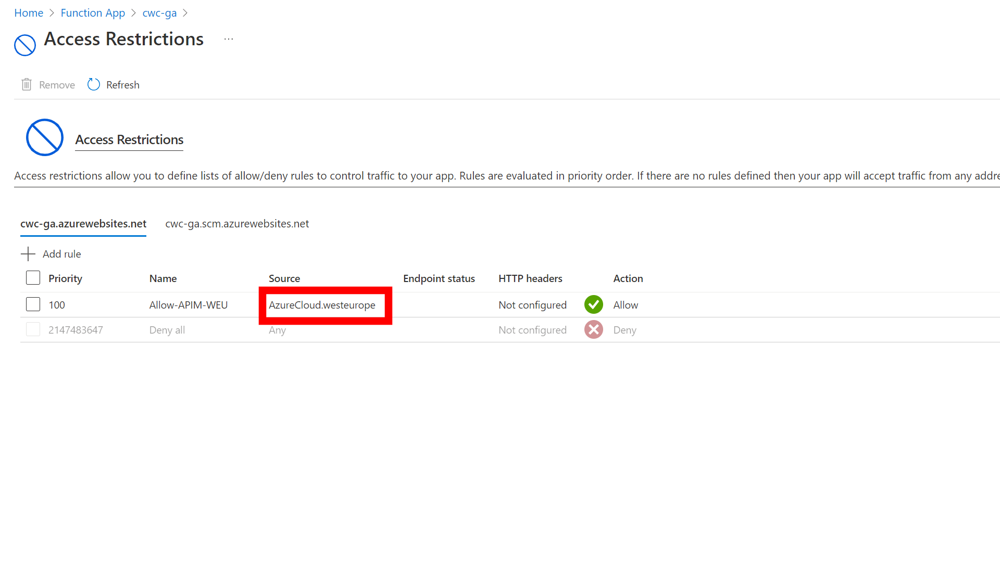
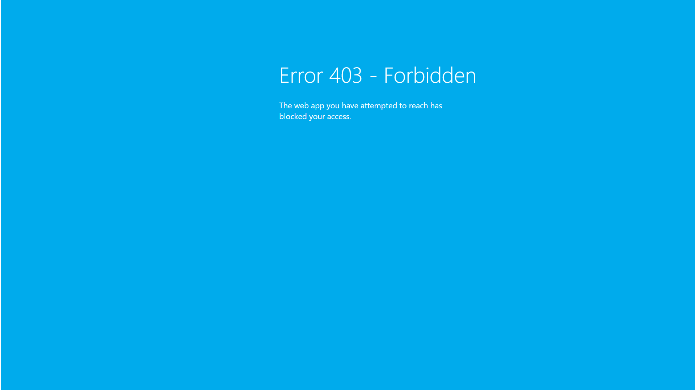

---
# Default hugo properties
title: "Using GitHub Actions, Azure Functions, Azure API Management and Google Analytics to display top posts on a Hugo Static Site"                   # Name of the blog
description: "In this post, I show how I use GitHub Actions to call an Azure Function (through Azure API Management) that interacts with Google Analytics as part of the process to build my Hugo Static Site. The end result is that top posts are pulled into the Static Site Generation build process, rather than calling the Google Analytics API through JavaScript at runtime."             # Used for SEO optimisation
PublishDate: "2022-03-13T19:00:00Z"
Date: "2022-03-13T19:00:00Z"

# Site-wide [required properties]
image: "img/cloudwithchrislogo.png"                   # Displayed when referenced in listing pages
images:                     # An array of images used in Social Sharing
- img/cloudwithchrislogo.png
tags:                       # Used for SEO optimisation and browsing across the site.
- Hugo
- Static Content
- GitHub
- GitHub Actions
- Azure
- Azure Functions
- Google Analytics
- SEO
- Python
- Azure API Management
- APIs
- DevOps
- Automation

# Site-wide [optional properties]
externalLink: ""            # Full URL to override listing links to an external page

# Content-specific properties
authors:
-  "chrisreddington"                       # An array of authors of the post (filenames in person).

banner: "images/banner.png"
---
In this post, I show how I use GitHub Actions to call an Azure Function (through Azure API Management) which interacts with Google Analytics as part of the process to build my Hugo Static Site. The end result is that top posts are pulled into the Static Site Generation build process, rather than calling the Google Analytics API through JavaScript at runtime.



You may be thinking - "That's a lot of technologies in one sentence. What's the point?". That's a great question, let's take a step back and look at the problem that I was trying to solve.

## What's the problem?

I have been wanting to make the initial view as actionable as possible once the pageload is completed. As a user, you should be able to see featured posts, upcoming content and the content which is most popular. The first two are fairly trivial, but the third is a bit more tricky.

Why is that? Let's walk through each scenario.

* I built a featured posts capability into my Hugo theme by using a ``featured`` property in the YAML front matter of each piece of content. Posts that should be featured in the landing page's carousel must have the ``featured`` property set with a numeric value. The numeric value defines the order in which the post should appear in the carousel.
* The upcoming content is is determined by an ``upcoming`` flag in the YAML front matter of each post.  This value is set to ``true`` if the post should be displayed in the upcoming content section, and ``false`` (or unset) if it is in the past.
  * As a side note, you may be wondering why I don't simply use the Date and PublishDate properties to determine if a post is in the past or not. This is so that I can control the release of content to external sources (such as Apple Podcasts, Google Podcasts, Spotify, etc.). Those external providers arae watching the episodes RSS feed to determine the content to be displayed. That means, as soon as the site is build with pages in the past, that content will be 'released' to external sources. In reality, I may not have uploaded the required media files as yet, hence the need for the manual control. This could be considered similar to a feature flag.
* And now the trickiest part. The posts which are most popular are determined by the number of views of each post. There isn't a built-in capability for this in Hugo. In web development, it's common to rely upon some form of external monitoring to determine user engagement with your content. For example, I use Google Analytics and Microsoft Clarity to understand the behaviour of my visitors, and ultimately which content is most popular. This then helps me prioritize the content that I'll create in the future, and also continue to promote the content that I have already made.

Right, so we have established that the first two are trivial, but the third is a bit more tricky. We have also established that we can rely upon some form of external monitoring to determine the popularity of a post.

Surely it's just as simple as calling an API via JavaScript at runtime, and using that to display the posts which are most popular?

Yes and no. There are drawbacks to the JavaScript at runtime approach -

* The [Google Analytics API has a limit](https://developers.google.com/analytics/devguides/reporting/core/v4/limits-quotas#general_quota_limits) of 50,000 requests per day. If you're calling the API more than 50,000 times per day, you'll be throttled.
  * This isn't a problem for me at the moment, as I'm not reaching that level of scale. Hopefully it will be a (good) problem for me in the future though!
* Calling an external API is not an instant operation. It can take up to a few seconds to return the results. There are ways to handle this, for example using a cache or loading icons. However, given that this is the first content that a user sees, it's important that the content is available as quickly as possible.
* Hugo templates cannot be used directly within JavaScript (or at least, that I am aware!). This means that you wouldn't have the ability to reference pages in the site, and there associated properties. Instead, you' have to maintain a list of pages, the required content and then use JavaScript to parse that (e.g. an external JSON file), and then generate the appropriate UI components in a JavaScript template.

## Creating a Top Posts API with the Google Analytics Reporting API and a Python-based Azure Function

These challenges are not insurmountable, but there is an alternative approach. A big thank you and shout out to Janne of [Pakstech.com](https://pakstech.com/blog/hugo-popular-content/), who has written an excellent blog post and acted as the inspiration for this post.

Being the lazy developer that I am, I started to think about the easiest route possible to build something similar to Janne's post. There were a couple of aspects from that implementation that I wanted to change -

* I didn't want to trigger a call to the Google Analytics API as part of the build process. Instead, I wanted to implement it as it's own independent API, so it has its own lifecycle.
* I didn't want to commit the updated JSON file to the Git repository. Instead, I wanted to bring the needed data in at build/deployment time, so that it can be used within the Hugo build process.

Those requirements led me to an initial iteration of the concept in this blog post. I re-used Janne's example code snippets (thank you again for the excellent blog post), but re-factored them into a [Python-based Azure Function](https://docs.microsoft.com/en-us/azure/azure-functions/functions-reference-python). If you're looking for the 'finished produt, you can find the latest copy of the code [can be found on GitHub](https://github.com/CloudWithChris/AzureFunctionGoogleAnalyticsAPI). 

Let's explore the key points to note -

1. I don't have a particularly strong Python background, so this was a great learning exercise for me. After generating a new Python Azure Function through Visual Studio Code, I populated the ``requirements.txt`` file. It took me a little while to realise that the name of the package and the names used in the import statements are slightly different:

  ```txt
  # DO NOT include azure-functions-worker in this file
  # The Python Worker is managed by Azure Functions platform
  # Manually managing azure-functions-worker may cause unexpected issues

  azure-functions
  google-api-python-client
  google-auth
  ```

2. Next up, refactoring the code to be used in an Azure Function with a HTTP trigger. This was once again relatively painless. The main consideration in this stage was to remap Janne's implementation (which wrote the results to a JSON file), to output the results in an HTTP response. I also tweaked the parameters of the get_report function to search over 28 days rather than 7 days. My data isn't particularly changeable, and I'd rather see the viewing average over a longer period of time for more consistent results.

```python
import logging
import azure.functions as func
import os

import googleapiclient.discovery
import json
import re
from google.oauth2 import service_account

VIEW_ID = "CHANGEME"
MAX_PAGES = 10
SCOPES = ["https://www.googleapis.com/auth/analytics.readonly"]
BLOG_REGEX = re.compile(r"^\/blog\/[\w\-]*\/$")
SCRIPT_DIR = os.path.dirname(__file__)
SERVICE_ACCOUNT_FILE = "service_account.json"
JSON_FILE = os.path.join(SCRIPT_DIR, SERVICE_ACCOUNT_FILE)

credentials = service_account.Credentials.from_service_account_file(
    JSON_FILE, scopes=SCOPES
)

analytics = googleapiclient.discovery.build(
    serviceName="analyticsreporting", version="v4", credentials=credentials,
)

def get_report():
    body = {
        "reportRequests": [
            {
                "viewId": VIEW_ID,
                "dateRanges": [{"startDate": "28daysAgo", "endDate": "today"}],
                "metrics": [{"expression": "ga:users"}],
                "dimensions": [{"name": "ga:pagePath"}],
                "orderBys": [{"fieldName": "ga:users", "sortOrder": "DESCENDING"}],
            }
        ]
    }
    return analytics.reports().batchGet(body=body).execute()


def get_popular_pages(response):
    popular_pages = []
    reports = response.get("reports", [])
    if reports:
        report = reports[0]
        for row in report.get("data", {}).get("rows", []):
            popular_pages.append(row["dimensions"][0])
    filtered = [page for page in popular_pages if BLOG_REGEX.match(page)]
    if len(filtered) > MAX_PAGES:
        filtered = filtered[:MAX_PAGES]
    return filtered

def main(req: func.HttpRequest) -> func.HttpResponse:
    
    logging.info('Python HTTP trigger function processed a request.')

    response = get_report()
    pages = get_popular_pages(response)
    
    return func.HttpResponse(json.dumps(pages), mimetype="application/json")


if __name__ == "__main__":
    main()
```

3. There is also a slight tweak in how I reference the service_account.json file (aka, the credentials to the Google Analytics API).

> **Note:** If you plan to replicate this implementation, make sure to add ``service_account.json`` to your ``.gitignore`` file. This is **not** something that you want committed to your Git repository, as it contains the credentials for your service account. I've spent some time looking into alternative approaches that do not use the file. From my initial research - it looks like the google.oauth2.service_account module only has authentication options based on files. I'm new to this SDK and particular module, so if I'm wrong - please do correct me! I plan to do a more thorough review on this later, as I'd like to explore using something like Open ID Connect (in a similar way to how I [authenticate my GitHub Actions to Azure](/blog/using-oidc-github-actions-azure-swa/)) to authenticate.

We need to reconsider how the original implementation handled the file path of the ``service_account.json`` file. The context in which the script is executed will be different due to the Azure Functions runtime, so we need to make sure to pass in the appropriate path to the JSON file. Another thank you - this time to Anthony Chu - for [answering this question](https://docs.microsoft.com/en-us/answers/questions/516509/azure-function-not-able-to-read-my-json-file-from.html) which helped solve this one. 

I'll draw your attention to this particular segment of the script -

```python
SCRIPT_DIR = os.path.dirname(__file__)
SERVICE_ACCOUNT_FILE = "service_account.json"
JSON_FILE = os.path.join(SCRIPT_DIR, SERVICE_ACCOUNT_FILE)

credentials = service_account.Credentials.from_service_account_file(
    JSON_FILE, scopes=SCOPES
)
```

This snippet looks for the ``service_account.json`` file in the same directory as the ``__init.py__`` (The code for the HTTP Trigger Azure Function that we are creating).

> **Note:** The ``__file__`` variable referenced in the script is a special variable that has meaning in Python. Effectively, it is the pathname of the file from which the module was loaded. You can find out about this and other special varaibles [on the Python docs](https://docs.python.org/3/reference/datamodel.html).

The rest of the script remains the same as Janne's original implementation. I'd encourage you to read that blog post to understand any additional tweaks that you may need/want to make.

## Bringing Azure API Management into the picture

At this point, you should be able to deploy your Azure Function to Azure. For the purposes of my example, I used the [Visual Studio Code Azure Functions extension](https://marketplace.visualstudio.com/items?itemName=ms-azuretools.vscode-azurefunctions) to deploy to a function in Azure with Python. 



I plan to add a GitHub action that uses a GitHub repository secret to achieve the same result (until I can use something like an OIDC flow as noted earlier). I'll leave that as a separate exercise for you to work on if you are interested.

I still wasn't happy though. I had the nagging reminder of the limit on API Calls to Google Analytics. What if someone had come along (either enthusiastically or maliciously), and called the API over 50,000 times in a day? If I needed to build the site once again, it would fail as the JSON file would not be available when the site is built (more on the build process later though).

If you have followed my [Architecting for the cloud, one pattern at a time](/series/architecting-for-the-cloud-one-pattern-at-a-time/) series, then you'll have heard [Peter Piper](/person/peterpiper/) and I talk about the [concept of a Façade](/episode/backends-for-frontends-and-strangler/). It felt like I needed this Façade layer to protect the backend Azure Function (and the calls that it makes to the Google Analytics API) using a [Gatekeeper Design Pattern](/episode/gatekeeper-and-valet-key/).

This is where Azure API Management comes in. Now, as this is all for personal/community work - I aim to keep the costs of any supporting infrastructure as low as possible. That made my configuration choice easy; I opted for the [consumption SKU of Azure API Management](https://docs.microsoft.com/en-us/azure/api-management/api-management-features).

> **Note:** While creating the API Management resource, I enabled the System-assigned managed identity feature. It is also possible to enable this once the resource has been deployed.

I then [imported my Azure Function into API Management](https://docs.microsoft.com/en-us/azure/api-management/import-function-app-as-api) so that I could begin applying additional security policies on the Façade.



Once complete, I then begun thinking about how to protect the backend API from any external calls. I figured there were a couple of options here -

* Identity-based protection (i.e. making sure that the caller has some form of JSON Web Token) to verify that they should be able to perform the desired action.
* Network-based protection (i.e. making sure that the call is coming from a trusted environment), such as the API Management resource.

First, I configured the [built-in authentication and authorization capabilities of the Azure Function (Easy Auth)](https://docs.microsoft.com/en-us/azure/app-service/overview-authentication-authorization).



With that complete, I tried to call the Azure Function directly. Instead of seeing the JSON as a result with an HTTP 200 Status Code, I received an error. This is because we haven't associated the appropriate credentials (e.g. Bearer token in the Authorization header) to the request.

After that, I updated the inbound policy of all operations under my Google Analytics API object.

. It has the authentication-managed-identity policy configured against a Client ID that represents the Client ID of the backend application (in this case, an App Registration for the backend Azure Function)")

I added the ``authentication-managed-identity`` policy. This sends a JSON Web Token (based upon the API Management resource's System-assigned managed identity) to the backend Azure Function (i.e. add an Authorization header and bearer token when sending a request to the Azure Function).

```xml
<authentication-managed-identity resource="ClientIDOfServicePrincipalForBackendApp" />
```

Once added, you should be able to use the ``Test`` capability of API Management (or call the URL of your API in Azure API Management) to obtain a successful call from your backend Azure Function. This is because API Management has the ``authentication-managed-identity`` policy configured, and has sent a valid JWT to the backend Azure Function.



When you make the same call directly to the Azure Function without any Bearer token, you should either see an Unauthorized Error or an HTTP redirect to login (dependent upon your configuration).



Arguably, the identity protection is 'enough' for my requirements. However, given that I'm on a consumption-based plan, I also want to restrict the endpoints that can call the backend function to protect against DDOS attacks. I'm personally considering this as a cost control measure, more than a direct security measure in my scenario.



On the Azure Function App, I navigated to the Networking blade and configured **Access Restriction** in the Inbound Traffic section. I set a rule on the ``azurewebsites.net`` tab (rather than ``scm.azurewebsites.net`` which is used for the kudu management portal) to restrict traffic to the app itself.



> **Note:** I used Service Tags to restrict the allowed traffic into the Azure Function. I configured the AzureCloud.westeurope service tag which allows traffic from all Azure resources in West Europe - not just my subscription.
>
> There is a tag for ApiManagement.WestEurope, but that will unfortunately not work. This is because the tag is only used in outbound scenarios, [as documented here](https://docs.microsoft.com/en-us/azure/virtual-network/service-tags-overview#available-service-tags).
>
> As the API Management Consumption SKU cannot be injected or deployed into a virtual network (VNet), this is as granular as possible for the time being.

After applying the above rule and trying to call the root of the Azure Function, you should see an **Error 403 - Forbidden** message - ``The web app you have attempted to reach has blocked your access.``



I mentioned earlier in this post that I wanted to restrict traffic to flow only from the API Management instance. I also wanted to protect against scenarios like Distributed Denial of Service (DDOS). This serves a couple of purposes, such as protecting the backend Azure Function (from a cost-control perspective) and ensuring that the maximum number of calls to the Google Analytics API remains below the limit (50,000 requests/day as highlighted towards the beginning of this post).

To add a final layer of protection, I also [added rate limiting](https://docs.microsoft.com/en-us/azure/api-management/api-management-access-restriction-policies#LimitCallRate) to the inbound policy of my Google Analytics API in the API Management instance.

. It has the authentication-managed-identity policy configured against a Client ID that represents the Client ID of the backend application, as well as a rate-limit policy configured to allow 5 calls across 90 seconds.")

This is achieved by using the ``rate-limit`` policy, as demonstrated in the below snippet:

```xml
<rate-limit calls="5" renewal-period="90" remaining-calls-variable-name="remainingCallsPerSubscription" />
```

With all of that now in place, we have a callable API and therefore re-usable for several scenarios. Not only can it be used in the build process of [cloudwithchris.com](https://www.cloudwithchris.com), but unlocks additional opportunities. For example, I'm creating a new Hugo theme based around a CV template which you can find on my personal site [christianreddington.co.uk](https://www.christianreddington.co.uk). I'm already displaying the latest blog posts there, but would like to display the top posts there as well.

## Calling the API in our GitHub Action to use the JSON data in Hugo's build process

Now to bring all of this together. I already had an extensive GitHub Action Workflow to build [cloudwithchris.com](https://www.cloudwithchris.com). It contains steps to lint the markdown files, optimize static assets by compressing images and minifying the hugo build contents for deployment to Azure Static Web Apps.

I'm displaying the top posts in a slightly different way to Janne's implementation. This means the logic I'm using in my Hugo partial may look a little different. The data is only being used on the homepage of [cloudwithchris.com](https://www.cloudwithchris.com), so I don't need to filter out based upon the current page's context. 

In case you were unaware, Hugo has a [built-in concept of a Data Template](https://gohugo.io/templates/data-templates/). It means that I don't need to convert the original JSON output from the API into a markdown file, but can instead reference data from the ``data`` subdirectory of our site, by using the ``$.Site.Data.<filename>`` syntax.

I use the following snippet to display the most popular 3 posts on the homepage:

```go
{{ $popular := $.Site.Data.popular | first 3 }}
{{ range where $.Site.RegularPages "RelPermalink" "in" $popular }}
  ...  Your UI to display top pages here ...
{{ end }}
```

Now arguably, I could commit the JSON output from the Google Analytics API to the Git repository. However,  my personal opinion is that it'd feel like noise in my Git history. I may change my mind in the future, but for now, my build process simply downloads the file to the local agent's working directory ahead of the hugo build step being executed.

```yaml
- name: 'Pull popular posts from Google Analytics'
  run: |
    mkdir -p data
    curl --header "Ocp-Apim-Subscription-Key: ${{ secrets.CWC_API_KEY}}" -o data/popular.json https://api.cloudwithchris.com/cwc-ga/GetGoogleAnalyticsData
```

It's critical to ensure that the popular.json file (or however you named your data file) is in place ahead of the site being built. If it's not in place, then the build will fail.

The end-to-end YAML file for the GitHub Action Workflow resembles the below. You can find the latest on the [cloudwithchris.com GitHub repository](https://github.com/CloudWithChris/cloudwithchris.com/blob/main/.github/workflows/site-deployment.yaml).

```yaml
name: Azure Static Web Apps CI/CD

# This GitHub Action workflow triggers in two scenarios - 
# 1. When a push is made to the main branch
# 2. When a pull request is either opened, synchronized, reopened,
#    or closed, and the target is the main branch. If the change
#    is just to the podcast_audio file, then it is ignored.

on:
  push:
    branches:
      - main
    paths-ignore:
      - 'podcast_audio/**'
  pull_request:
    types: [opened, synchronize, reopened, closed]
    branches:
      - main
    paths-ignore:
      - 'podcast_audio/**'
  schedule:
    - cron: '0 0 * * 0'

# The workflow has several phases. Phases 1, 2 and 3 run on a push, or if the pull request activity
# type is not 'closed'.
#
# 1.  A validation phase, which is split into two separate jobs that run in parallel.
# 1.1 A set of steps that compress images
# 1.2 A set of steps that lint the markdown contents of the website
#
# 2.  Build the Static Website by using the Hugo CLI.
#
# 3.  Deploy the website to Azure Static Web Apps
# 3.1 If the workflow was triggered by a pull request (not a closed activity), then publish the static assets
#     to the static web app. This is associated with the GitHub Actions staging.azure environment.
# 3.2 If the workflow was triggered by a push to main, then publish the static assets to the static
#     web app. This is associated with the GitHub Actions production.azure environment, so requires manual approval.
#
# 4   If the workflow was triggered by a Pull Request close event, then close the staging sites which are open.

# Environment variables used for consistency across the workflow.
env:
  HUGO_VERSION: '0.94.0'
  SWA_NAME: 'cwc-static'
  AZURE_CLI_VERSION: '2.34.1'

jobs:
  # A set of steps used to compress the images, making sure that images are compressed ahead of publishing to the site.
  # This is done to make sure that the browsing experience remains speedy.
  compressor:
    if: github.event_name == 'pull_request' && github.event.action != 'closed'
    name: Compress Images
    runs-on: ubuntu-latest
    steps:
      - name: Checkout Repo
        uses: actions/checkout@v2
      - name: Compress Images
        id: calibre
        uses: calibreapp/image-actions@main
        with:
          githubToken: ${{ secrets.GITHUB_TOKEN }}
  # A set of steps used to lint the markdown files used to generate the content.
  # This is done to make sure there are consistent standards being adopted when writing the material.
  # These standards are configured in the /.github/linters folder of the repository.
  lint:
    if: github.event_name == 'push' || (github.event.pull_request.head.repo.full_name == github.repository && github.event.action != 'closed')
    name: Lint Code Base
    runs-on: ubuntu-latest
    steps:
      - name: Checkout Code
        uses: actions/checkout@v2
      - name: Lint Code Base
        uses: github/super-linter/slim@v4
        env:
          VALIDATE_ALL_CODEBASE: false
          FILTER_REGEX_INCLUDE: .*content/.*
          DEFAULT_BRANCH: main
          GITHUB_TOKEN: ${{ secrets.GITHUB_TOKEN }}
          VALIDATE_JSCPD: false
  # A set of steps used to render the website from the markdown, theme and assets into the HTML, CSS, JS and images that are delivered to a user.
  build:
    runs-on: ubuntu-latest
    steps:            
    - uses: actions/checkout@v2
      with:
        submodules: 'true'
    - name: 'Install Node Dependencies'
      run: npm ci    
    - name: 'Setup Hugo on Runner'
      uses: peaceiris/actions-hugo@v2
      with:
        hugo-version: ${{ env.HUGO_VERSION }}
        extended: true
    - name: 'Pull popular posts from Google Analytics'
      run: |
        mkdir -p data
        curl --header "Ocp-Apim-Subscription-Key: ${{ secrets.CWC_API_KEY}}" -o data/popular.json https://api.cloudwithchris.com/cwc-ga/GetGoogleAnalyticsData
    - name: 'Build and Minify Hugo Contents'
      run: hugo --minify --baseURL 'https://www.cloudwithchris.com'
      if: github.ref == 'refs/heads/main' || github.event_name == 'schedule'
    - name: 'Build and Minify Hugo Contents'
      run: hugo --minify 
      if: github.ref != 'refs/heads/main'
    - name: 'Upload Generated Static Content as Website Artifact'
      uses: actions/upload-artifact@v1
      with:
        name: website
        path: ${{ github.workspace }}/public
  deploy_preview:  
    if: (github.event.pull_request.head.repo.full_name == github.repository && github.event.action != 'closed')
    runs-on: ubuntu-latest
    needs: [compressor, lint, build]
    name: Deploy (Preview)
    environment:
      name: staging.azure
    permissions:
          id-token: write
          contents: read
    steps:
      - name: 'Download Website Artifact'
        uses: actions/download-artifact@v1
        with:
          name: website
      - name: 'Az CLI Login via OIDC'
        uses: azure/login@v1
        with:
          client-id: ${{ secrets.AZURE_CLIENT_ID }}
          tenant-id: ${{ secrets.AZURE_TENANT_ID }}
          subscription-id: ${{ secrets.AZURE_SUBSCRIPTION_ID }}
      - name: "Add a mask to the SWA Token"
        uses: azure/CLI@v1
        with:
          azcliversion: ${{ env.AZURE_CLI_VERSION }}
          inlineScript: |
            echo "::add-mask::$(az staticwebapp secrets list -n ${{ env.SWA_NAME }} | jq -r '.properties.apiKey')"
      - name: "Get SWA Token"
        uses: azure/CLI@v1
        with:
          azcliversion: ${{ env.AZURE_CLI_VERSION }}
          inlineScript: |
            echo "SWA_TOKEN=$(az staticwebapp secrets list -n ${{ env.SWA_NAME }} | jq -r '.properties.apiKey')" >> $GITHUB_ENV
      - name: Build And Deploy
        id: builddeploy
        uses: Azure/static-web-apps-deploy@v1
        with:
          azure_static_web_apps_api_token: ${{ env.SWA_TOKEN }}
          repo_token: ${{ secrets.GITHUB_TOKEN }}
          action: 'upload'
          app_location: 'website'
          skip_app_build: true
  deploy_prod:  
    if: github.event_name == 'push' || github.event_name == 'schedule'
    runs-on: ubuntu-latest
    needs: [lint, build]
    name: Deploy (Prod)
    environment:
      name: production.azure
      url: https://www.cloudwithchris.com  
    permissions:
          id-token: write
          contents: read
    steps:
      - name: 'Download Website Artifact'
        uses: actions/download-artifact@v1
        with:
          name: website
      - name: 'Az CLI Login via OIDC'
        uses: azure/login@v1
        with:
          client-id: ${{ secrets.AZURE_CLIENT_ID }}
          tenant-id: ${{ secrets.AZURE_TENANT_ID }}
          subscription-id: ${{ secrets.AZURE_SUBSCRIPTION_ID }}
      - name: "Get SWA Token"
        uses: azure/CLI@v1
        with:
          azcliversion: ${{ env.AZURE_CLI_VERSION }}
          inlineScript: |
            echo "::add-mask::$(az staticwebapp secrets list -n ${{ env.SWA_NAME }} | jq -r '.properties.apiKey')"
      - name: "Get SWA Token"
        uses: azure/CLI@v1
        with:
          azcliversion: ${{ env.AZURE_CLI_VERSION }}
          inlineScript: |
            echo "SWA_TOKEN=$(az staticwebapp secrets list -n ${{ env.SWA_NAME }} | jq -r '.properties.apiKey')" >> $GITHUB_ENV
      - name: Build And Deploy
        id: builddeploy
        uses: Azure/static-web-apps-deploy@v1
        with:
          azure_static_web_apps_api_token: ${{ env.SWA_TOKEN }}
          repo_token: ${{ secrets.GITHUB_TOKEN }}
          action: 'upload'
          app_location: 'website'
          skip_app_build: true
  # A set of steps used to close old staging sites that are no longer needed, as the PR has now been merged.
  close_pull_request_job:
    if: github.event.pull_request.head.repo.full_name == github.repository && github.event.action == 'closed'
    runs-on: ubuntu-latest
    name: Close Pull Request Job
    steps:
      - name: Close Pull Request
        id: closepullrequest
        uses: Azure/static-web-apps-deploy@v1
        with:
          azure_static_web_apps_api_token: ${{ secrets.STATIC_WEB_APP_TOKEN }}
          action: 'close'
```

## Conclusion

That is how I have used GitHub Actions, Azure Functions, Azure API Management and Google Analytics to display the top blog posts on my Hugo Static Site. This approach means that there are no 'dynamic' API calls happening when a user loads a page, which should make page load times quick, consistent, and reduce external dependencies at 'runtime'. Likewise, I can rest easy knowing that my backend Google Analytics request limit has been protected (as well as my consumption-based API Management and Azure Function resources).

This also gives me scope to expand the APIs that I use for [cloudwithchris.com](https://www.cloudwithchris.com) over time, setting up a platform for future endeavours.

So, what do you think? Are you building static websites and adopting a similar pattern (bringing dynamic data into your build process ahead of time)? Or, are you handling API calls through JavaScript and dynamically populating the contents of your page? I'd love to hear more, so let's continue the discussion in the comments below!