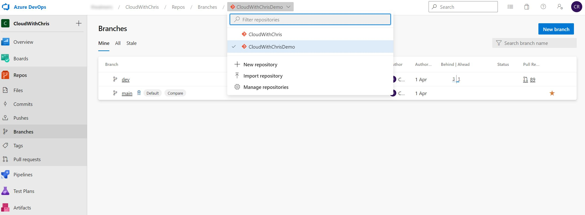
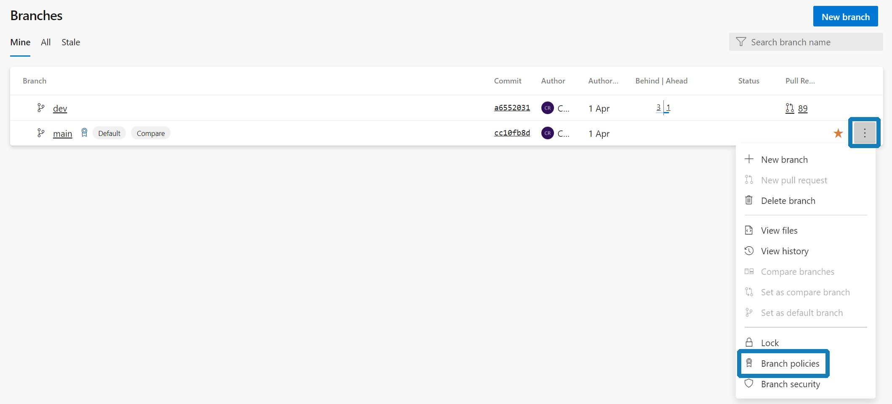
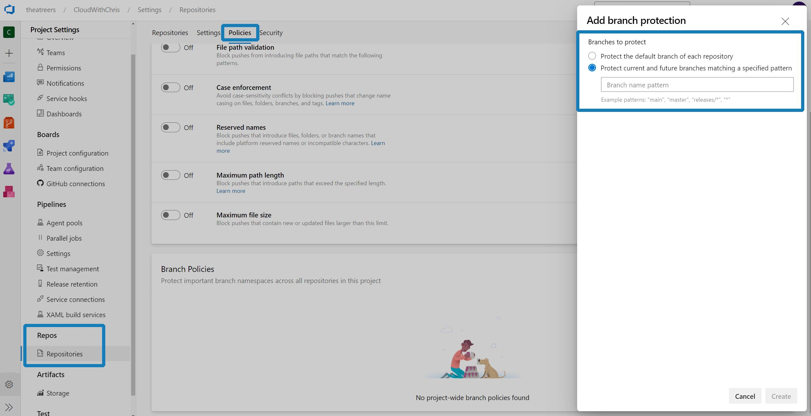

## What are Branch Policies?

This post is similar to another I recently wrote on [using Branch Protection Rules in GitHub](/blog/use-github-branch-protection-rules). Instead of focusing on GitHub, we'll be looking at how you can use Branch Policies in Azure DevOps (specifically, Azure Repos). If you're using Azure Repos, but not using Branch Policies - I'd encourage you to start using them! I hope this post helps you learn how!

In the world of DevOps, there is a term known as Shift Left. This term effectively means 'find and prevent issues early'. There are several studies that have shown that the most effective way to prevent issues is to find them early in the software delivery lifecycle. This is because the more issues you find early, the more likely it is that they will be identifiable, and therefore fixed.

Let me play devil's advocate for a moment. What happens if you have no barriers to push your code into the main line of development? If there are no quality checks, then you could be pushing code to your production codebase that isn't up to scratch. If you have no automated tests, or code review process, then you don't have the ability to identify and fix issues early. This means you're going to have to wait until the end of the software delivery cycle to find the first issue, which is a waste of time and money. Wouldn't it be better if you could find the first issue as soon as possible?

This is where Branch Policies come in. Branch Policies are used to enforce workflows for one or more branches in your Git repository hosted on Azure Repos. These rules are enforced by the service and can be configured by anyone who has permissions as per the repository security configuration.

> **Tip:** To control who which users or groups can Edit Branch Policies, in addition to other repository-level actions, navigate to your Azure DevOps **Project Settings**. Under the Project Settings, you will see a section for **Repos**, and an item called **Repositories**. You can specify permissions across all repositories within the project, or a specific repository. This can be achieved by specifying Azure DevOps Groups or individual users, and then selecting the appropriate permissions for them. You can find an example in the screenshot below.
>
> 

In essence, before you commit to a certain branch (or a set of branches), you need to fulfil a set of conditions. If you don't, then you won't be able to commit to that branch. These conditions include:

* You need to have a minimum number of reviewers that have approved your change, before code can be merged.
* You need to have work items associated with your change, before code can be merged. This allows for traceability, so you know what changes are associated with each change to the codebase.
* All active comments (i.e. discussions, rather than code comments) must be resolved before a Pull Request can be merged.
* Restricting changes to be merged in a specific way (This could be its own entire blog post, so we'll gloss over this one for the purposes of this post.)
* Trigger a build automatically when a Pull Request is triggered. This enables you to run builds, automatic tests, and other automated processes to automatically verify whether some changes may have broken the codebase.
* Ensure a successful status check from External Services (Perhaps some external code scanner that you have a dependency upon?) before a Pull Request can be merged.
* Automatically include code reviewers on a Pull Request if certain areas of code have changed. This is a nice alternative for the CODEOWNERS concept if you are familiar with it from GitHub.

> **Tip:** Branch policies can be configured from the Branches page under Azure Repos. You can action these by hitting the ellipses (three dots) on the branch that you would like to protect. In the screenshot below, you can see that the main branch has been protected as it has a small icon (which looks a little like a medal), next to the branch name.
>
> 

So, in summary - you need to have a set of conditions that you can fulfil before you can commit to a branch. If you don't, then you won't be able to commit to that branch.

## Setting up Branch Policies

1. In Azure DevOps, Navigate to the branches section of Azure Repos in your Azure DevOps project.

2. Make sure that you have the appropriate repository selected at the very top of the page. (You can house several Git repositories within the same Azure DevOps project, so it's important to ensure you're working in the appropriate context!)

3. Hover over the appropriate branch, and select the ellipsis (three dots) on the right hand side. Select the Branch Policies option.

4. You will see a list of settings, some of which will have subsettings within them This is the list of branch policies that you can configure for the branch that you wish to protect. There is no save button on this form, as the options are saved automatically.

5. Configure the rules as appropriate for your branch. I typically configure some variation of the following: ``Require a minimum number of reviewers``, ``Check for linked work items``, ``Check for comment resolution`` and ``Build validation``.

> **Tip:** There is some great detail in the [Azure Docs](https://docs.microsoft.com/en-us/azure/devops/repos/git/branch-policies?view=azure-devops) about each of the Branch policies that you can configure. Rather than re-writing the same detail here, I encourage you to dive in and take a look over there!

6. Navigate back to the branches page under Azure Repos. If you did not previously have a Branch Policy configured, you should now notice a small icon (which looks a little like a medal) next to the branch name.

As an example, I made some changes to my master branch protection policy. I now have the ``Require a minimum number of reviewers`` set to 1, and ``allow requestors to approve their own changes`` enabled. Consider this a warning - this configuration means that I can review my own PRs and approve them, somewhat defeating the point of a Pull Request workflow. However, given it's just myself that works on the project - It makes some sense here. I have set ``Check for linked work items`` to on, and ``Check for comment resolution`` to on as well.

> **Tip:** You aren't limited to applying branch policies to individual repositories. You can navigate to the Project Settings, and navigate to the Repositories option underneath the Repos section. Click on the policies tab, and you will see a section for Branch Policies. Here, it says that you can "Protect important branch namespaces across all repositories in this project"
>
> 

Now, we'll want to check whether our Branch Policies are working! After navigating to my readme.md, and wanting to make a dummy change - You will notice that I am prevented from committing the change to the main branch.

Instead, we can use the same User Interface to commit the change in a new branch and raise a Pull Request. Pull Requests can also be raised under the Azure Repos section, by clicking on the Pull Requests item.

After creating a Pull Request with the default settings, you can see that I have been taken to the Pull Request page to review the changes. Based on the settings that I had configured, even if I approve the Pull Request, I will not be able to merge the changes. This is because I have not linked a work item to the changes, and therefore have not met the conditions to merge.

At this stage, I have now proceeded to link a work item with the Pull Request. You can see that the Pull Request now just requires 1 reviewer to approve.

Finally, after approving the Pull Request, I can now merge the changes.

## Summary

There we go! Throughout this blog post, we have begun our journey of shifting left. We are no longer allowing any code to be directly committed to our production codebase. Instead, we are enforcing a set of rules so that a consistent workflow is maintained. That workflow may include peer reviews, build validation, ensuring work items are linked and more! This is only one part of the journey in shifting left. Azure Pipelines are incredibly powerful, and could be used to automate your builds, tests and more when using build validation. Why not create an Azure Pipelines that is triggered when a Pull Request is created or updated? I hope that you can see how this wider story may continue. But, of course - that's for another day!

Are Branch Policies something that you are already using? Perhaps in Azure DevOps, GitHub, or with another tool? I'd love to hear how you're using them, and some of the practices that you may have picked up along the way. Drop me a message over on [Twitter, @reddobowen](https://twitter.com/reddobowen). In the meantime, I hope this has been useful! Thanks for reading, and bye for now.
